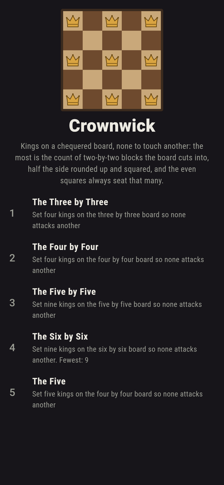
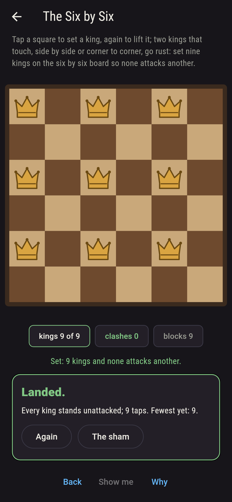
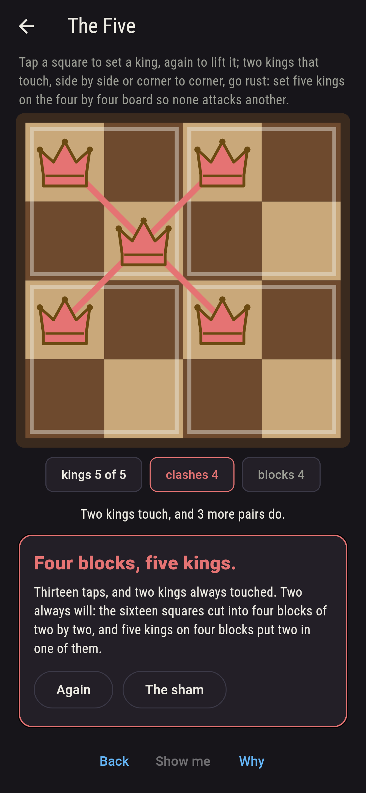
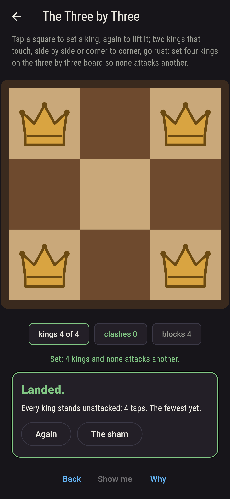
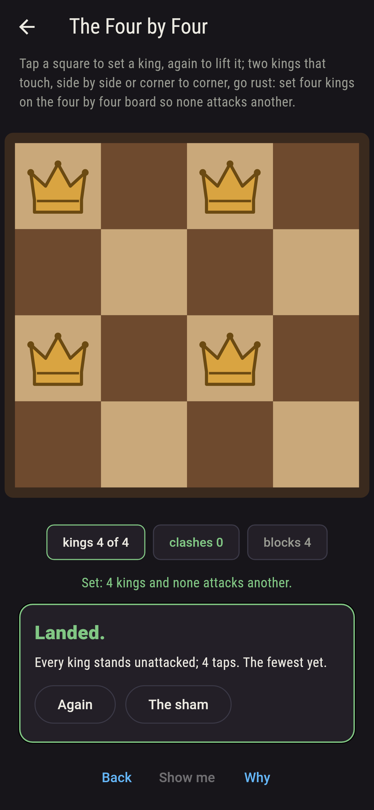
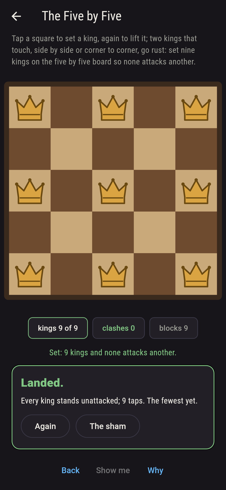
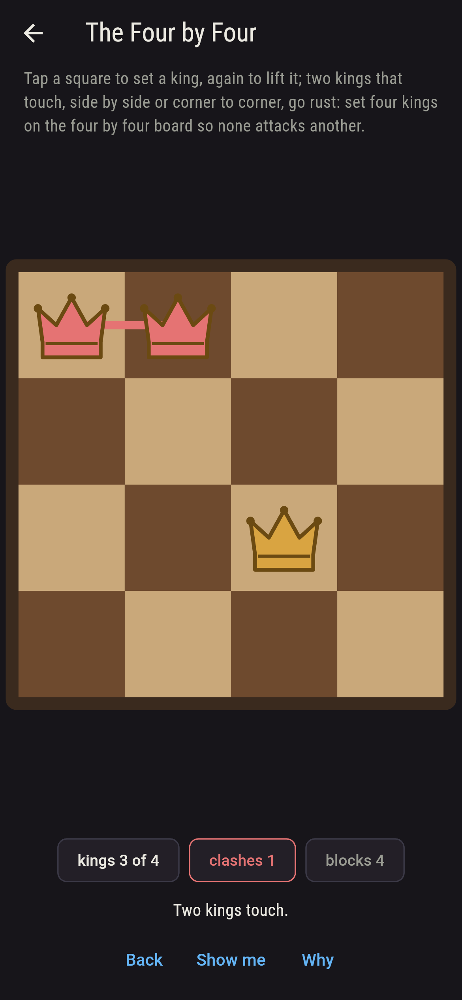
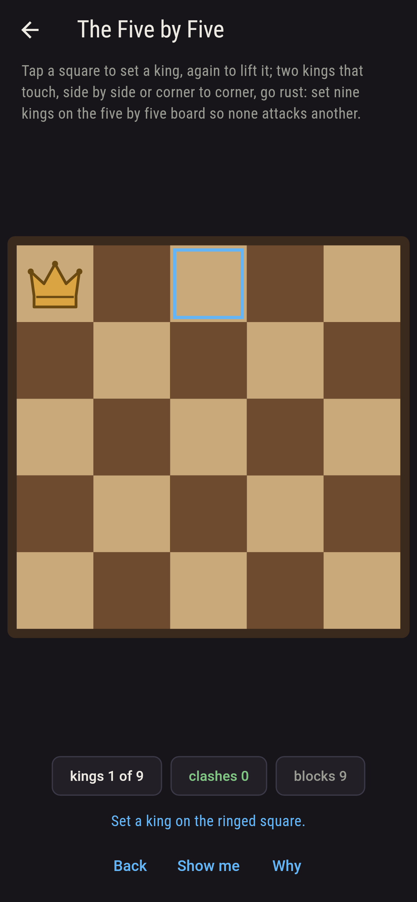
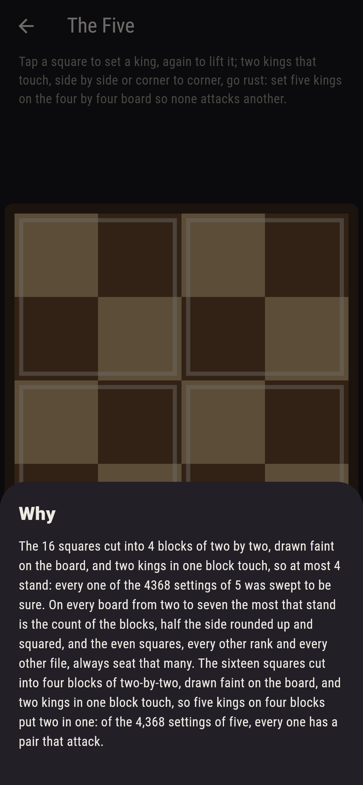

# Crownwick


Kings on a chequered board, as many as will stand with none touching
another, side by side or corner to corner. Tap a square to set one,
again to lift it, and two that touch are joined in rust. The most is
half the side rounded up, squared, and the reason is the blocks: cut
the board into two-by-two blocks from a corner, and any two squares
of a block touch, so each block holds one king at most; the even
squares, every other rank and every other file, put one king in
every block with none touching, so that many always stand. Every
setting is swept on the small boards and walked square by square on
all, and on every board from two to seven the walk, the blocks and
the even squares agree; on an odd side the even squares are the only
setting that seats the most.

## The boards

1. **The Three by Three** - set four kings on the three by three board so none attacks another
2. **The Four by Four** - set four kings on the four by four board so none attacks another
3. **The Five by Five** - set nine kings on the five by five board so none attacks another
4. **The Six by Six** - set nine kings on the six by six board so none attacks another
5. **The Five** - set five kings on the four by four board so none attacks another

The three by three seats four one way of 126, the corners; the four
by four four 79 ways of 1,820; the five by five nine one way alone
of 2,042,975, the even squares; the six by six nine 3,600 ways of
94,143,280, sixty squared. The Five is labeled hopeless on its
tile, the blocks are drawn faint on its board, and the why counts
them.

## Two voices

The game never asserts what it has not computed, and it computes
everything at least twice:

* **The sweep** holds up every setting of the kings on the three by
  three, the four by four and the five by five, 2,049,289 of them
  one by one, and on every board walks the squares in turn, setting
  a king or not and dropping any setting where two touch or too few
  squares are left; every count on the sham is that walk's, and
  where both ran they agree.
* **The blocks** need no sweep: the board cut into two-by-two blocks
  from a corner, no square in two of them and any two squares of a
  block touching, so each holds one king at most and the count of
  blocks is the most that stand; on every board from two to seven
  that is half the side rounded up and squared, exactly what the
  walk finds, one more never standing, and the even squares seat
  that many with no clash.

`tool/check_settings.dart` runs the lot and refuses the bake on any
disagreement.

## The checker's ledger

What `dart run tool/check_settings.dart` printed for the build this
README shipped with, word for word:

```
every setting of the kings swept whole on the three by three, the four by four and the five by five, 2,049,289 settings held up one by one, and every board walked square by square with the attacking settings dropped, the sweep and the walk agreeing wherever both ran; on every board from two to seven the squares cut into blocks of two by two, 43 blocks on the six boards, no square in two, any two squares of a block touching, and the most kings that stand is the count of the blocks, half the side rounded up and squared, one more never standing, while the even squares seat exactly that many, and on an odd side they are the only setting that does; the three by three seats four 1 way of 126, the four by four four 79 ways of 1,820, the five by five nine 1 way of 2,042,975, the six by six nine 3,600 ways of 94,143,280, and five on the four by four never

 1 The Three by Three set four kings on the three by three board so none attacks another: 1 of the 126 settings lands it
 2 The Four by Four   set four kings on the four by four board so none attacks another: 79 of the 1,820 settings land it
 3 The Five by Five   set nine kings on the five by five board so none attacks another: 1 of the 2,042,975 settings lands it
 4 The Six by Six     set nine kings on the six by six board so none attacks another: 3,600 of the 94,143,280 settings land it
 5 The Five           set five kings on the four by four board so none attacks another: none of the 4,368, and the blocks said so first
```

## Screenshots

| The sham | The six by six seated | The five admitted |
| --- | --- | --- |
|  |  |  |

| The three by three | The four by four | The five by five | Mid-setting | Show me | The why |
| --- | --- | --- | --- | --- | --- |
|  |  |  |  |  |  |

Screenshots are drawn by `test/showcase_test.dart` at real phone
sizes with the app's own painter, then copied into `docs/` as they
came out; every king in them was set by taps, so nothing pictured is
a board the game could not reach. The logo and every launcher icon
come out of `test/mark_test.dart` the same way: the mark is the five
by five seated, nine kings on the even squares.

## Building

```
flutter test          # 43 tests, the sweep among them
dart run tool/check_settings.dart
flutter build apk     # or: flutter build ios
```
