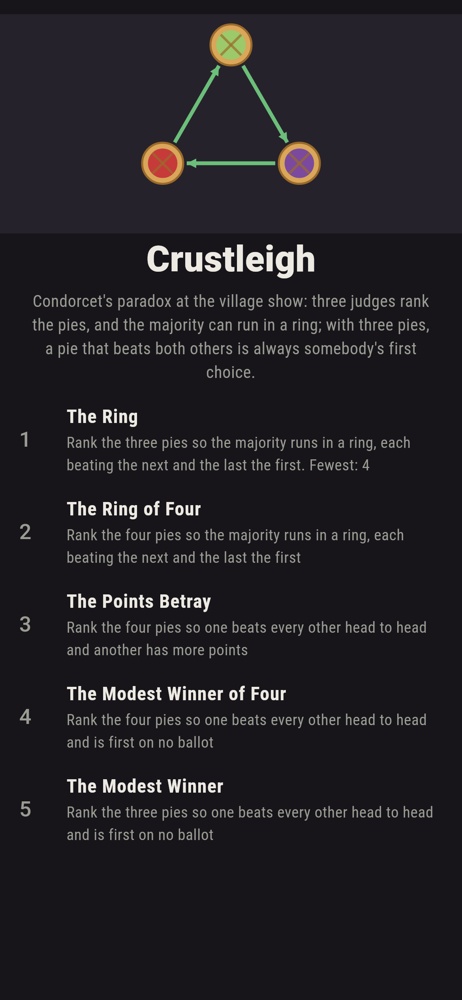
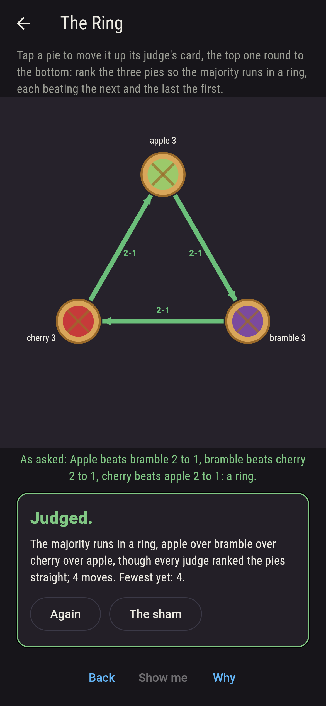
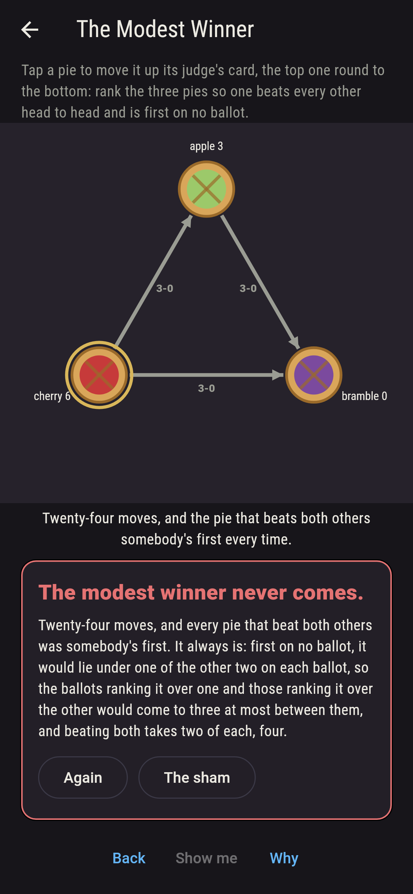
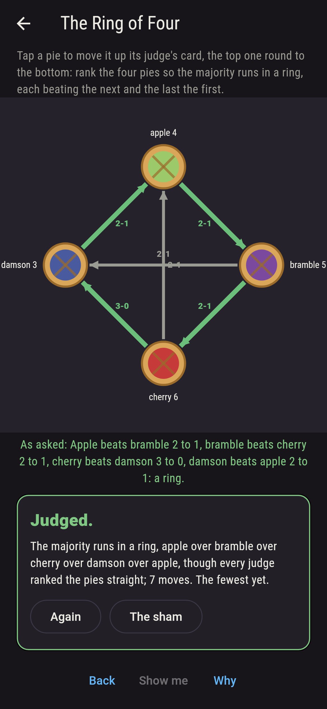
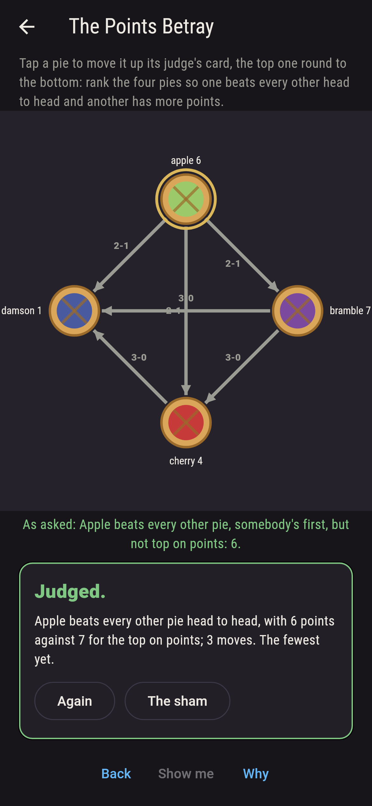
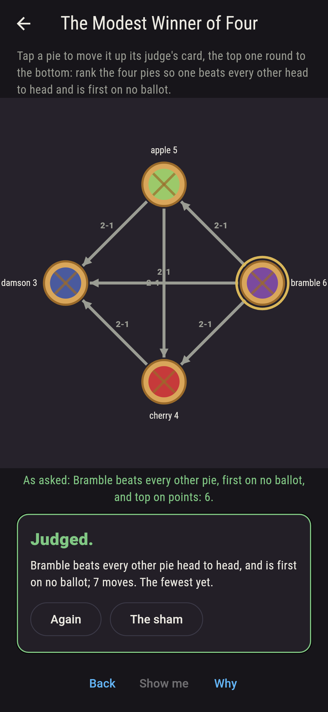
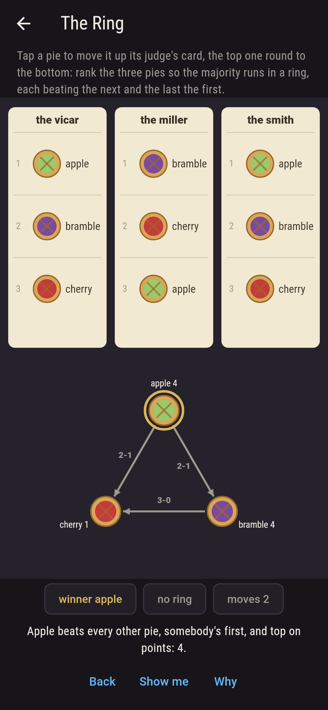
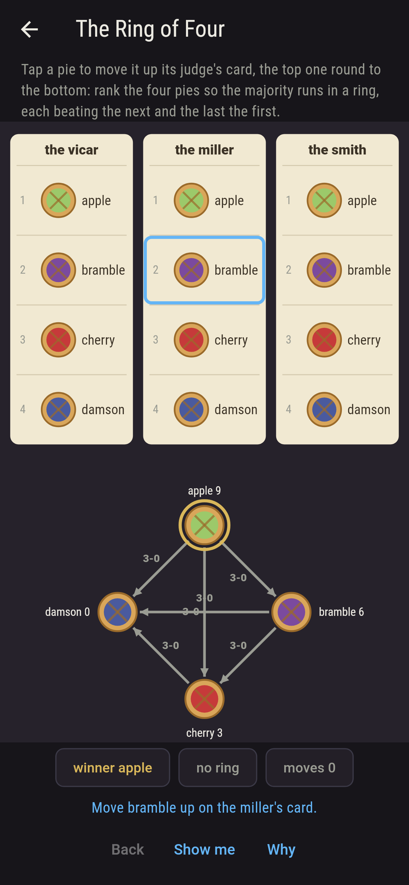
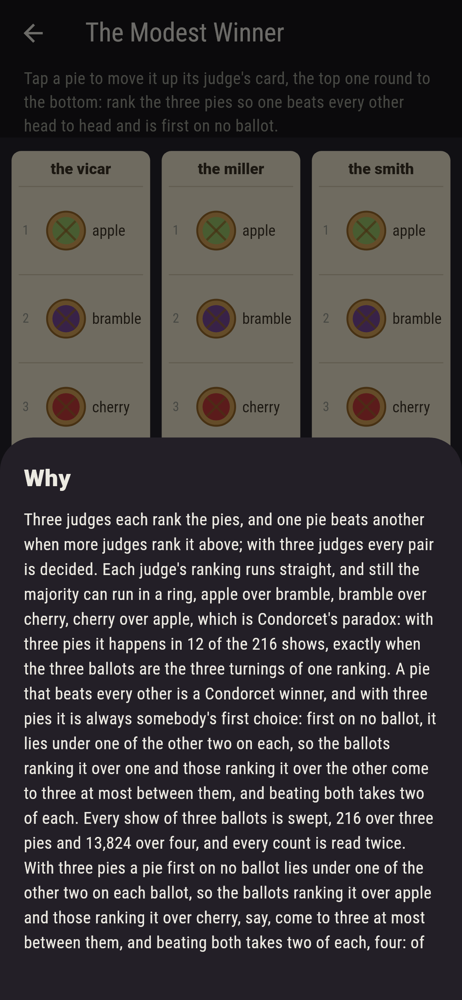

# Crustleigh


Condorcet's paradox at the village show. Three judges each rank
the pies, first to last, and one pie beats another when more
judges rank it above; with three judges every pair is decided.
Tap a pie to move it up its judge's card, the top one round to
the bottom, and the arrows below run winner to loser with the
count on each. Every judge's ranking runs straight, and still the
majority can run in a ring, apple over bramble, bramble over
cherry, cherry over apple: with three pies it happens in twelve
of the 216 shows, exactly when the three ballots are the three
turnings of one ranking. A pie that beats every other is a
Condorcet winner, and with three pies it is always somebody's
first choice: first on no ballot, it would lie under one of the
other two on each, so the ballots ranking it over one and those
ranking it over the other come to three at most between them, and
beating both takes two of each. With four pies the modest winner
comes, and so does a pie that beats every other head to head yet
loses on points. Every show of three ballots is swept, and every
count is read twice.

## The shows

1. **The Ring** - rank the three pies so the majority runs in a ring, each beating the next and the last the first
2. **The Ring of Four** - rank the four pies so the majority runs in a ring, each beating the next and the last the first
3. **The Points Betray** - rank the four pies so one beats every other head to head and another has more points
4. **The Modest Winner of Four** - rank the four pies so one beats every other head to head and is first on no ballot
5. **The Modest Winner** - rank the three pies so one beats every other head to head and is first on no ballot

Twelve of the 216 shows of three pies run in a ring, and every
other show, 204, has a pie that beats both others; with four pies
720 of the 13,824 shows run the majority round all four, never
with a pie beating every other, 1,536 shows have no such pie, 288
have one that another pie outscores, a point for every pie ranked
below, and 192 have one that is first on no ballot, the first of
them bramble second on all three cards. The Modest Winner is
labeled hopeless on its tile, and the lemma above is the why.

## Two voices

The game never asserts what it has not computed, and it computes
everything at least twice:

* **The sweep** takes every show, three ballots over the rankings
  of the pies, 216 over three and 13,824 over four, and reads off
  the majorities, the ring, the winner, the firsts and the points;
  every number on the sham is that sweep's. Then it counts again
  by the bag of ballots, each bag dealt to the judges six, three
  or one ways, and the two counts agree on every ask.
* **The turnings and the lemma** search nothing: with three pies
  the ring is held to be exactly the shows whose ballots are the
  three turnings of one ranking, both ways round, on all 216; and
  the lemma's sum, a pie first on no ballot ranked over the other
  two at most three times between them, is checked on every such
  pie of every show, so the modest winner never comes, as the
  sweep also finds.

`tool/check_shows.dart` runs the lot and refuses the bake on any
disagreement.

## The checker's ledger

What `dart run tool/check_shows.dart` printed for the build this
README shipped with, word for word:

```
every show of three ballots over three pies swept, 216 shows, and over four pies, 13,824, each count read twice, ballot by ballot and by the bag of ballots dealt to the judges six, three or one ways: with three pies the majority runs in a ring in 12 shows, exactly the shows whose ballots are the three turnings of one ranking, and every other show, 204, has a pie that beats both others, which is somebody's first choice in all 204 and never has fewer points than another; a pie first on no ballot is ranked over the other two at most three times between them on every show, so the modest winner never comes; with four pies the ring runs round all four in 720 shows, never with a pie beating every other, 1,536 shows have no such pie, 2,352 have some three pies in a ring, 288 have a pie beating every other while another has more points, and 192 have a pie beating every other that is first on no ballot, the first of them bramble second on all three ballots

 1 The Ring                  rank the three pies so the majority runs in a ring, each beating the next and the last the first: 12 of the 216 shows land it
 2 The Ring of Four          rank the four pies so the majority runs in a ring, each beating the next and the last the first: 720 of the 13,824 shows land it
 3 The Points Betray         rank the four pies so one beats every other head to head and another has more points: 288 of the 13,824 shows land it
 4 The Modest Winner of Four rank the four pies so one beats every other head to head and is first on no ballot: 192 of the 13,824 shows land it
 5 The Modest Winner         rank the three pies so one beats every other head to head and is first on no ballot: none of the 216, and the lemma said so first
```

## Screenshots

| The sham | The ring | The modest winner admitted |
| --- | --- | --- |
|  |  |  |

| The ring of four | The points betray | The modest winner of four | Mid-judging | Show me | The why |
| --- | --- | --- | --- | --- | --- |
|  |  |  |  |  |  |

Screenshots are drawn by `test/showcase_test.dart` at real phone
sizes with the app's own painter, then copied into `docs/` as they
came out; every ballot in them was set by taps, so nothing
pictured is a show the game could not reach. The logo and every
launcher icon come out of `test/mark_test.dart` the same way: the
mark is the ring of three, the majority running round.

## Building

```
flutter test          # 48 tests, the sweep among them
dart run tool/check_shows.dart
flutter build apk     # or: flutter build ios
```
