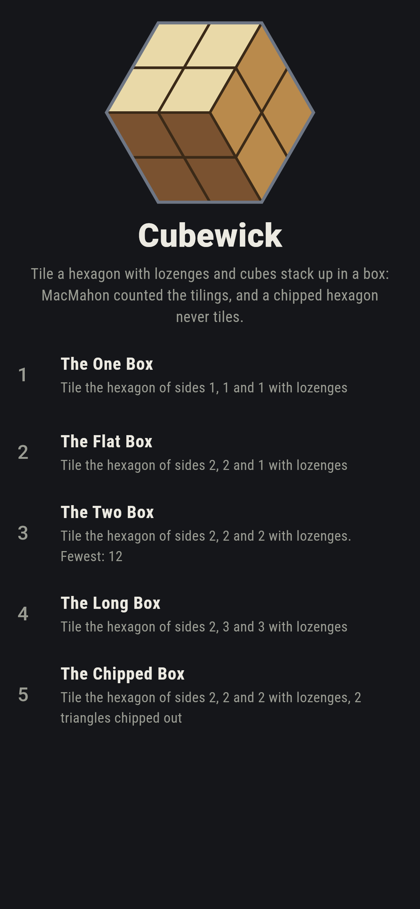
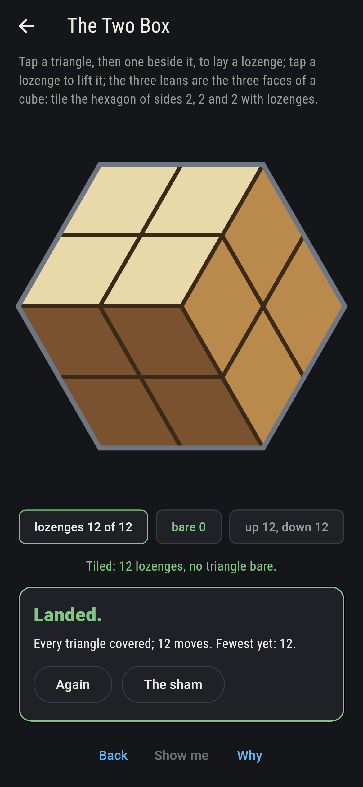
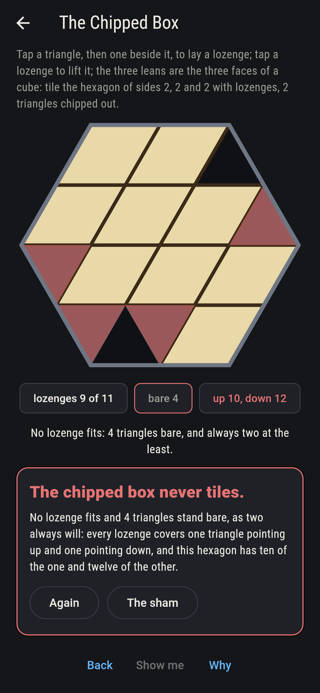
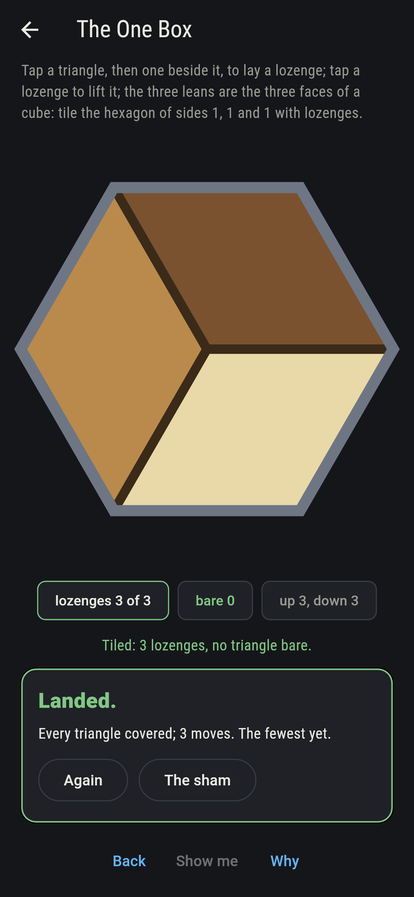
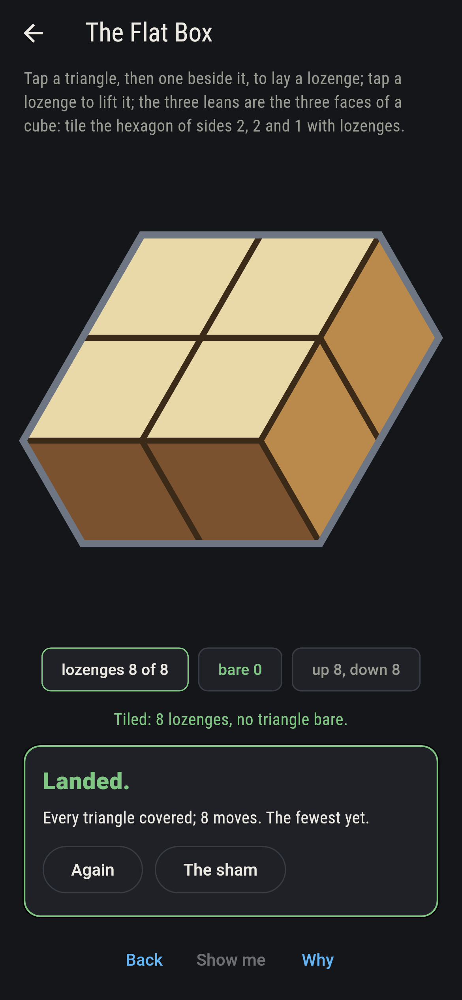
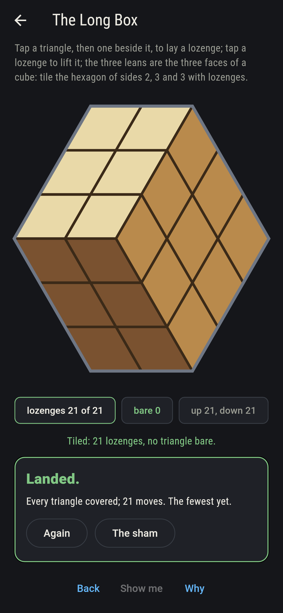
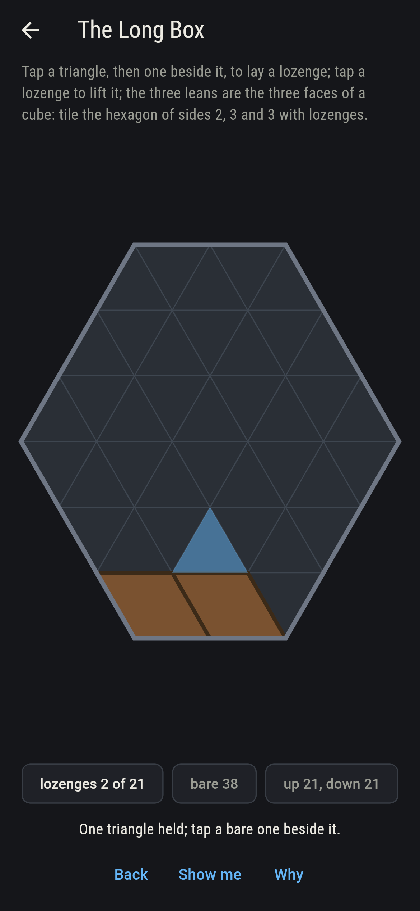
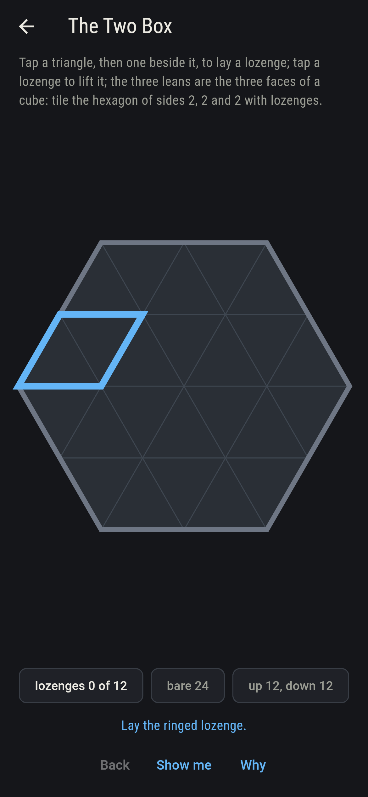
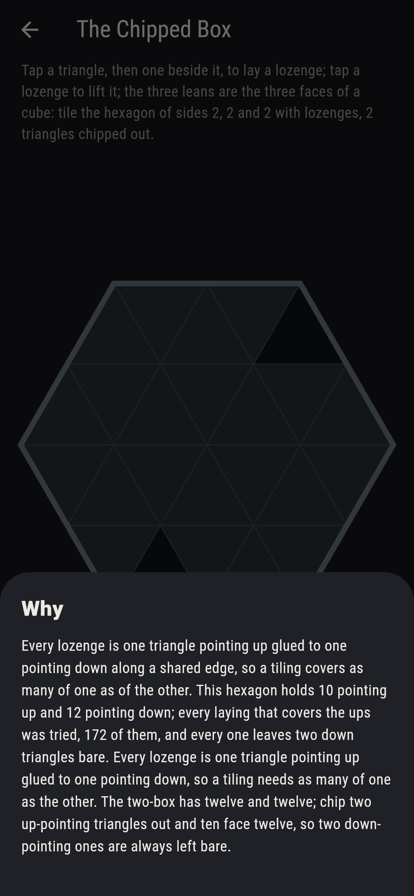

# Cubewick


A hexagon on the triangular grid, its sides a, b and c, and
lozenges to tile it with: each lozenge is a triangle pointing up
glued to a triangle pointing down along a shared edge, and it
leans one of three ways. Shade the three leans light, mid and
dark and every tiling turns into cubes stacked in an a by b by c
box, seen from a corner. MacMahon counted the stacks in 1912, and
the tilings with them: the product over the box of (i + j + k - 1)
over (i + j + k - 2), which is 2, 6, 20, 175, 980 for the boxes
here and 232,848 for the four-box. Every tiling is swept, every
stack of cubes is walked, and the product is worked out, and the
three agree on every box. Chip two up-pointing triangles out of a
hexagon and it never tiles: a lozenge covers one of each.

## The hexagons

1. **The One Box** - tile the hexagon of sides 1, 1 and 1 with lozenges
2. **The Flat Box** - tile the hexagon of sides 2, 2 and 1 with lozenges
3. **The Two Box** - tile the hexagon of sides 2, 2 and 2 with lozenges
4. **The Long Box** - tile the hexagon of sides 2, 3 and 3 with lozenges
5. **The Chipped Box** - tile the hexagon of sides 2, 2 and 2 with lozenges, 2 triangles chipped out

The one-box tiles two ways, the flat box six, the two-box twenty,
the long box 175, and each count is the count of stacks of cubes
in the box the hexagon draws. The Chipped Box is labeled hopeless
on its tile: ten triangles point up and twelve point down, and
every laying that covers the ten leaves two of the twelve bare.

## Two voices

The game never asserts what it has not computed, and it computes
everything at least twice:

* **The sweep** lays every tiling, each up triangle glued in turn
  to a free down triangle across one of its three edges, on every
  hexagon of sides up to three and on the four-box; and it tries
  every laying of the chipped box that covers the ups, 172 of
  them, and finds two down triangles bare in each.
* **MacMahon's product** gives the count with no sweep, and a
  third walk counts the stacks of cubes in the box, heights on the
  floor never rising away from the back corner, and it agrees with
  both on every box: 2, 6, 20, 175, 980, and 232,848 for the
  four-box.

`tool/check_tilings.dart` runs the lot and refuses the bake on any
disagreement.

## The checker's ledger

What `dart run tool/check_tilings.dart` printed for the build this
README shipped with, word for word:

```
every tiling of every hexagon of sides up to three swept, 10 hexagons, and the four-box besides, and every count is MacMahon's product exactly and the count of stacks of cubes in the box, walked separately: 2 for the one-box, 6 for the flat box, 20, 175, 980, and 232,848 for the four-box; and the chipped box, ten triangles up and twelve down, leaves two down triangles bare in every one of its 172 layings

 1 The One Box     tile the hexagon of sides 1, 1 and 1 with lozenges: 2 tilings, and 2 stacks of cubes in the box
 2 The Flat Box    tile the hexagon of sides 2, 2 and 1 with lozenges: 6 tilings, and 6 stacks of cubes in the box
 3 The Two Box     tile the hexagon of sides 2, 2 and 2 with lozenges: 20 tilings, and 20 stacks of cubes in the box
 4 The Long Box    tile the hexagon of sides 2, 3 and 3 with lozenges: 175 tilings, and 175 stacks of cubes in the box
 5 The Chipped Box tile the hexagon of sides 2, 2 and 2 with lozenges, 2 triangles chipped out: none, and the triangles said so first, ten up and twelve down
```

## Screenshots

| The sham | The two box tiled | The chipped box admitted |
| --- | --- | --- |
|  |  |  |

| The one box | The flat box | The long box | Mid-tiling | Show me | The why |
| --- | --- | --- | --- | --- | --- |
|  |  |  |  |  |  |

Screenshots are drawn by `test/showcase_test.dart` at real phone
sizes with the app's own painter, then copied into `docs/` as they
came out; every lozenge in them was laid by taps, so nothing
pictured is a tiling the game could not reach. The logo and every
launcher icon come out of `test/mark_test.dart` the same way: the
mark is the two-box tiled, cubes stacked in it.

## Building

```
flutter test          # 42 tests, the sweep among them
dart run tool/check_tilings.dart
flutter build apk     # or: flutter build ios
```
