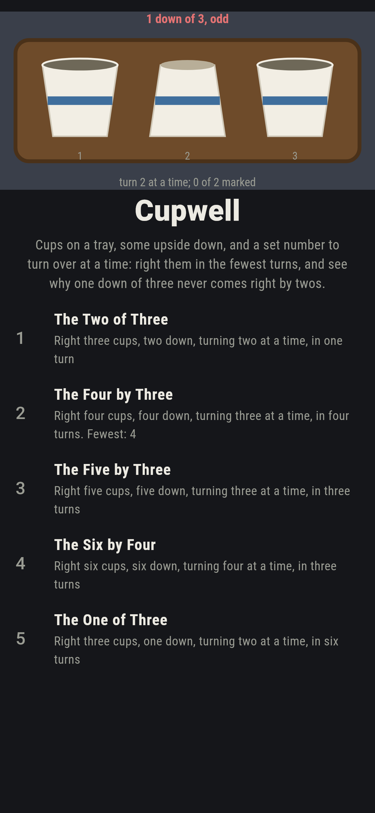
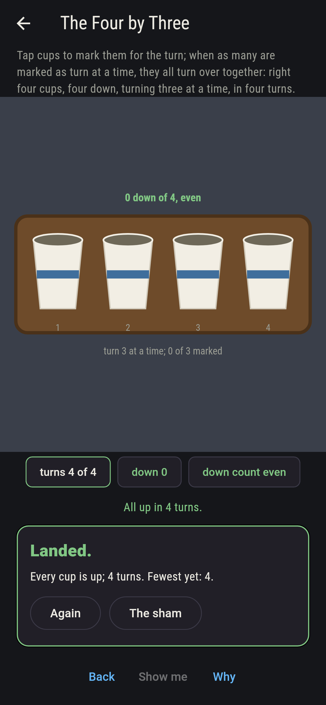
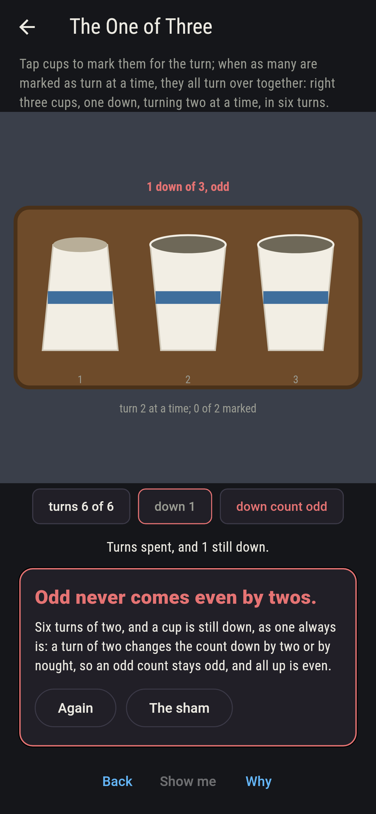
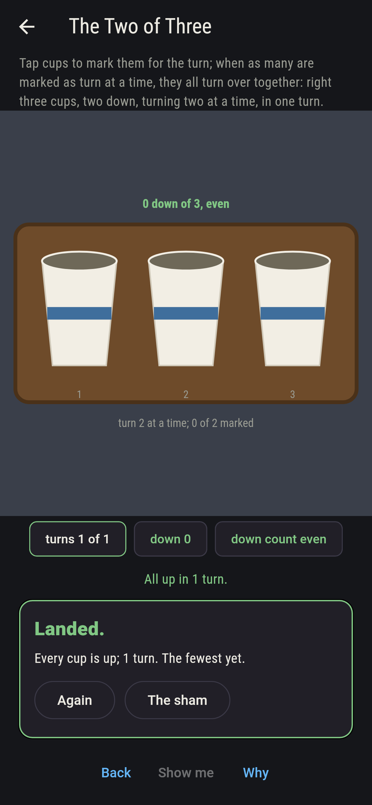
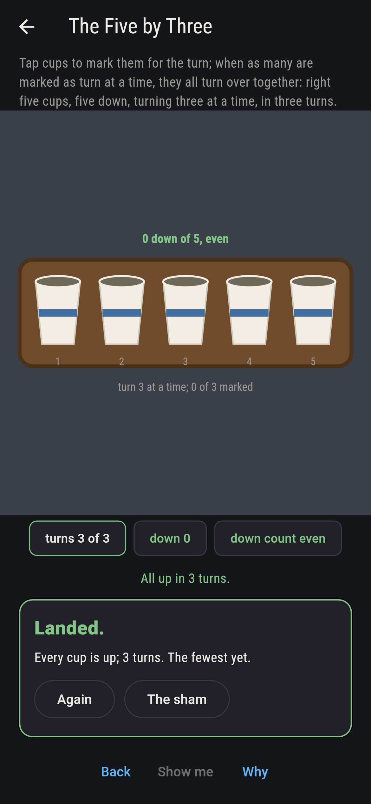
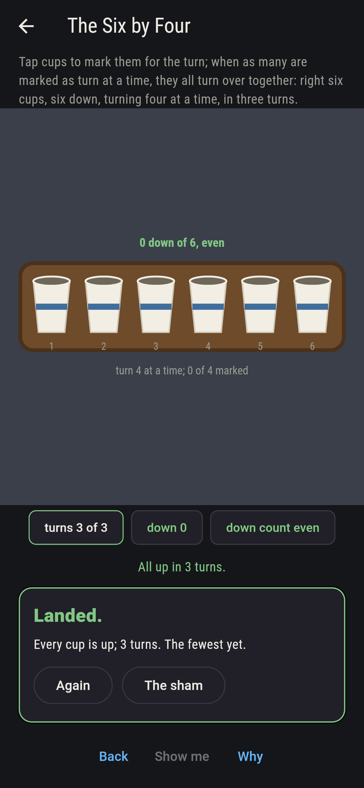
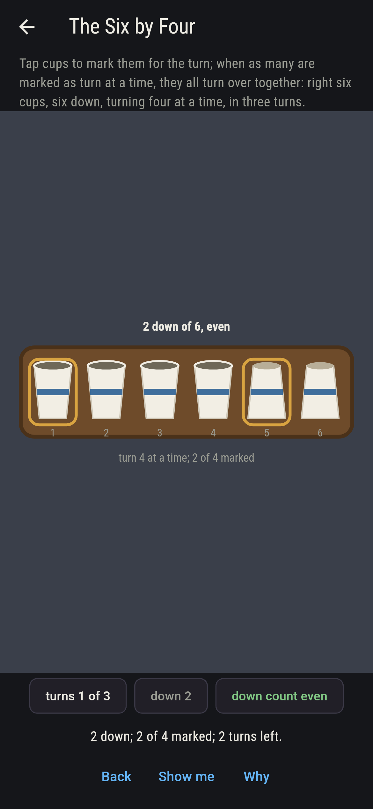
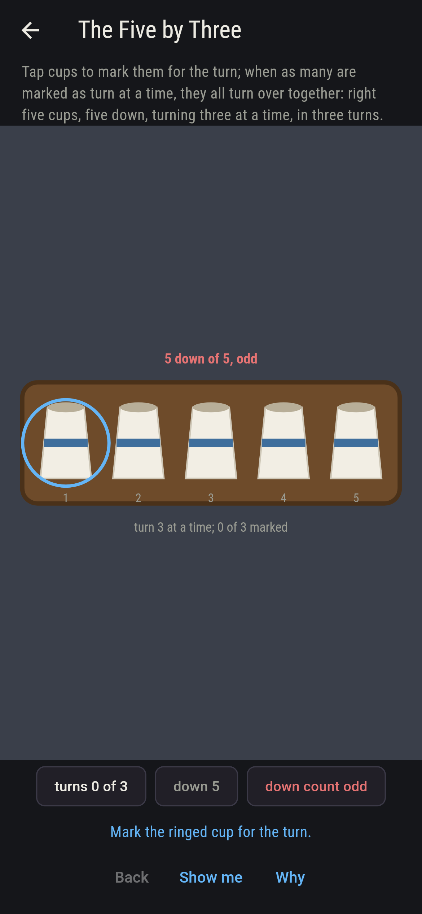
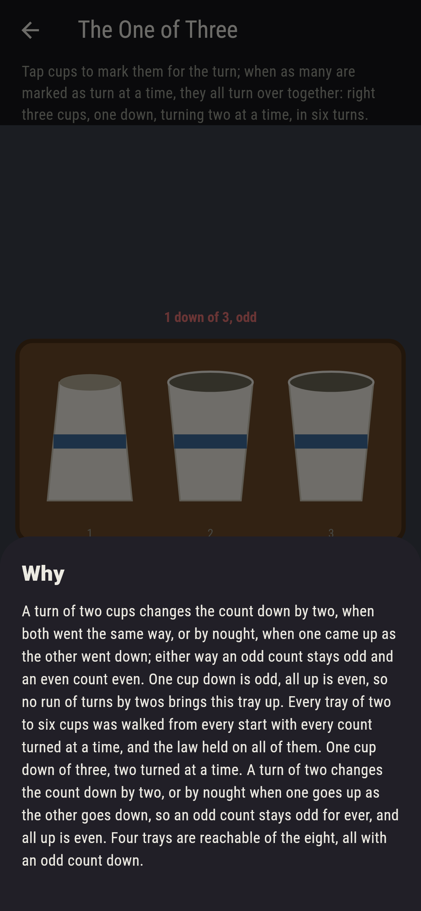

# Cupwell


Cups on a tray, some of them upside down, and a rule: every turn
you turn over exactly so many at once, two, or three, or four.
Right the tray, every cup up, in the fewest turns. The count of
cups down is what to watch. A turn of an even number of cups
changes that count by an even number, so if it starts odd it
stays odd for ever, and all up is even: one cup down among three,
turned two at a time, never comes right, and neither does any tray
with an odd count down and an even count turned. Turn an odd
number at a time, short of the whole tray, and every tray is in
reach. Every tray of two to six cups is walked from every start
with every count turned, and every sequence of turns for every
tray here is swept.

## The trays

1. **The Two of Three** - right three cups, two down, turning two at a time, in one turn
2. **The Four by Three** - right four cups, four down, turning three at a time, in four turns
3. **The Five by Three** - right five cups, five down, turning three at a time, in three turns
4. **The Six by Four** - right six cups, six down, turning four at a time, in three turns
5. **The One of Three** - right three cups, one down, turning two at a time, in six turns

Two down of three right in one turn of two; four down turned three
at a time take four turns, 24 sequences of the 256; five down by
threes take three, 60 of 1,000; six down by fours take three, 120
of 3,375. The One of Three is labeled hopeless on its tile, and
the why is a sentence about odd and even.

## Two voices

The game never asserts what it has not computed, and it computes
everything at least twice:

* **The sweep** tries every sequence of the turns allowed on each
  tray and counts those ending all up; and it walks every tray of
  two to six cups from every start with every count turned at a
  time, nearest first, to find the fewest turns and the trays in
  reach.
* **The parity law** is held to that walk: short of turning the
  whole tray, an even count turned never changes whether the count
  down is odd or even and puts all up out of reach exactly when the
  count down is odd; an odd count turned reaches every tray; and
  turning the whole tray reaches only the tray and its opposite.
  The fewest turns of every level is what the walk finds.

`tool/check_flips.dart` runs the lot and refuses the bake on any
disagreement.

## The checker's ledger

What `dart run tool/check_flips.dart` printed for the build this
README shipped with, word for word:

```
every sequence of turns swept for every tray, and every tray of two to six cups walked from every start with every count turned at a time, 640 starts: short of turning the whole tray, an even count turned never changes whether the count down is odd or even and puts all up out of reach exactly when the count down is odd, 108 starts, while an odd count turned reaches every tray, and turning the whole tray reaches only the tray and its opposite; two of three right in one turn of three, four by threes in four turns 24 ways of 256, five by threes in three turns 60 ways of 1,000, six by fours in three turns 120 ways of 3,375, and one of three by twos never, four trays of the eight in reach and all up not among them

 1 The Two of Three   right three cups, two down, turning two at a time, in one turn: 1 of the 3 sequences lands it
 2 The Four by Three  right four cups, four down, turning three at a time, in four turns: 24 of the 256 sequences land it
 3 The Five by Three  right five cups, five down, turning three at a time, in three turns: 60 of the 1,000 sequences land it
 4 The Six by Four    right six cups, six down, turning four at a time, in three turns: 120 of the 3,375 sequences land it
 5 The One of Three   right three cups, one down, turning two at a time, in six turns: none of the 729, and odd against even said so first
```

## Screenshots

| The sham | The four by three righted | The one of three admitted |
| --- | --- | --- |
|  |  |  |

| The two of three | The five by three | The six by four | Mid-turn | Show me | The why |
| --- | --- | --- | --- | --- | --- |
|  |  |  |  |  |  |

Screenshots are drawn by `test/showcase_test.dart` at real phone
sizes with the app's own painter, then copied into `docs/` as they
came out; every cup in them was turned by taps, so nothing pictured
is a tray the game could not reach. The logo and every launcher
icon come out of `test/mark_test.dart` the same way: the mark is
three cups on the tray, one down between two up.

## Building

```
flutter test          # 44 tests, the walk among them
dart run tool/check_flips.dart
flutter build apk     # or: flutter build ios
```
