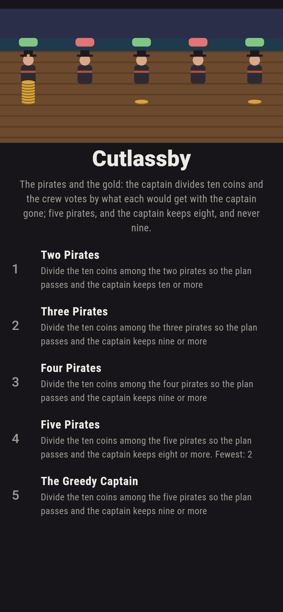
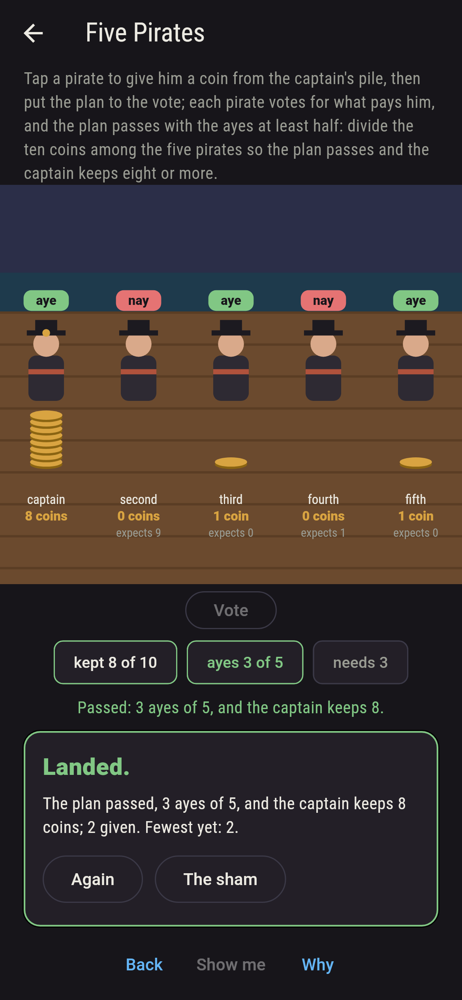
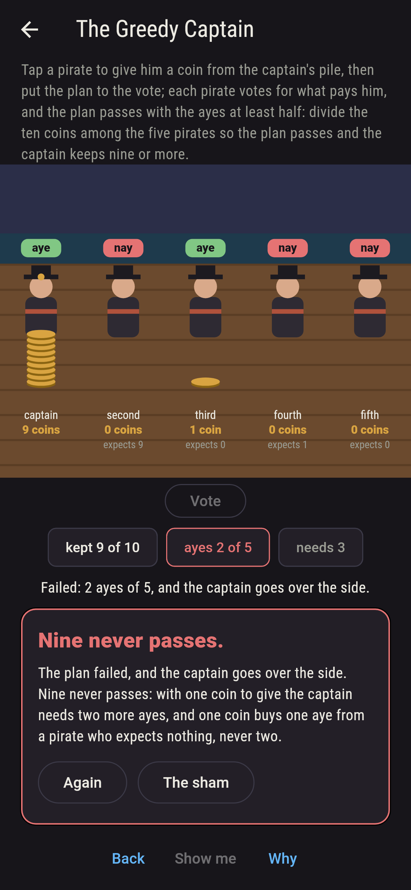
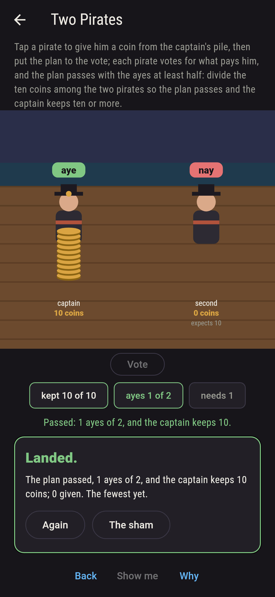
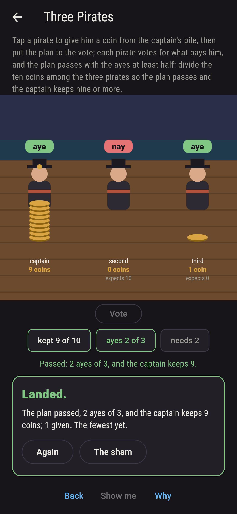
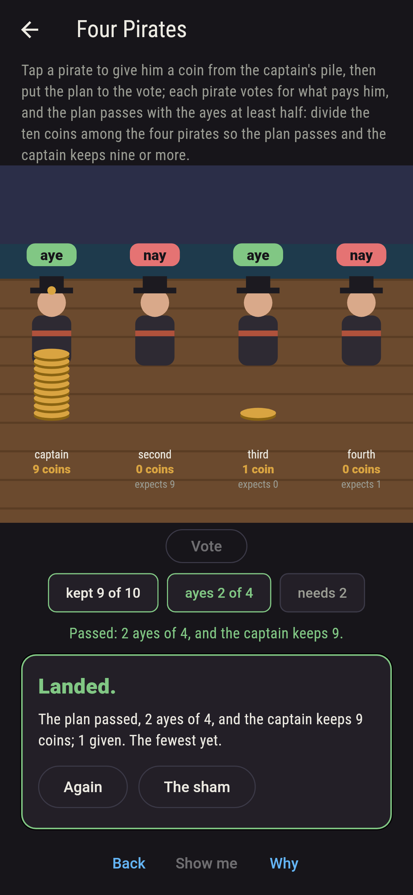
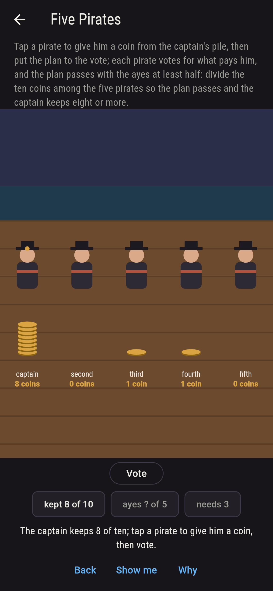
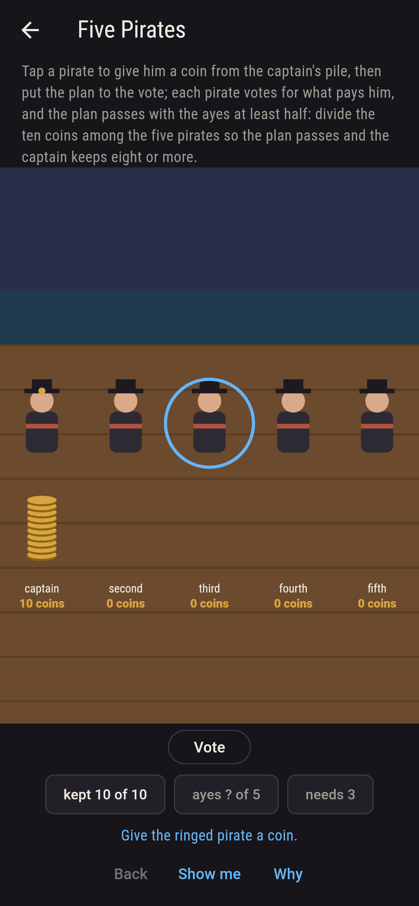
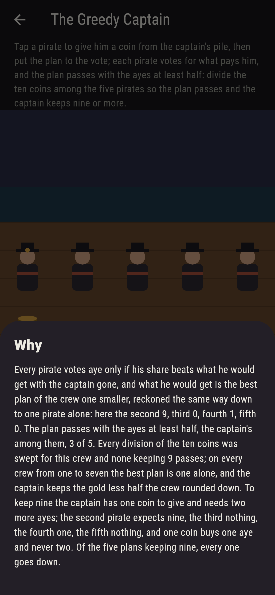

# Cutlassby


The pirates and the gold. Ten coins to divide, the captain proposes,
every pirate votes, and the plan passes with the ayes at least half,
the captain's own among them; if it fails the captain goes over the
side and the next pirate is captain. Every pirate votes for what
pays him: aye only if his share beats what he would get with the
captain gone, and what he would get is the best plan of the crew one
smaller, reckoned the same way down to one pirate alone. Tap a
pirate to give him a coin, then put the plan to the vote. Two
pirates and the captain keeps all ten; three, nine; four, nine;
five, eight, the old answer, eight, nought, one, nought, one, and
never nine. Every division of the coins is swept for every crew,
the votes reckoned from the crew one smaller, and the best plan is
one alone every time.

## The crews

1. **Two Pirates** - divide the ten coins among the two pirates so the plan passes and the captain keeps ten or more
2. **Three Pirates** - divide the ten coins among the three pirates so the plan passes and the captain keeps nine or more
3. **Four Pirates** - divide the ten coins among the four pirates so the plan passes and the captain keeps nine or more
4. **Five Pirates** - divide the ten coins among the five pirates so the plan passes and the captain keeps eight or more
5. **The Greedy Captain** - divide the ten coins among the five pirates so the plan passes and the captain keeps nine or more

Two aboard and the captain's own aye is half; three need two ayes
and the third pirate, who expects nothing, is bought for one coin;
four need two and the third is bought again; five need three and
the third and the fifth are bought for a coin each. The Greedy
Captain is labeled hopeless on its tile, and the why reckons the
crew backwards.

## Two voices

The game never asserts what it has not computed, and it computes
everything at least twice:

* **The sweep** divides the ten coins every way among the crew,
  captain first, and puts each division to the vote, every pirate
  voting by his share against what he expects; it counts the plans
  that pass keeping the captain so much, and finds the best plan of
  each crew, which is one alone every time. Every count on the sham
  is that sweep's.
* **The reckoning** is the crew one smaller: what a pirate expects
  with the captain gone is his share in the best plan of the crew
  without the captain, found the same way, down to one pirate alone
  who keeps all ten; and the best plans that come out are held to
  the shape the reckoning promises, the captain keeping the gold
  less half the crew rounded down and every coin he gives buying an
  aye from a pirate who expects nothing, on every crew from one to
  seven.

`tool/check_plans.dart` runs the lot and refuses the bake on any
disagreement.

## The checker's ledger

What `dart run tool/check_plans.dart` printed for the build this
README shipped with, word for word:

```
every division of the ten coins swept for crews of one to seven, 12,376 plans, the votes reckoned from the best plan of the crew one smaller: the best plan is one alone every time, and the captain keeps 10, 10, 9, 9, 8, 8, 7 for crews of one to seven, the gold less half the crew rounded down, every coin he gives buying an aye from a pirate who expects nothing with the captain gone; two pirates keep the captain ten, three nine, four nine, five eight, and nine among five never passes

 1 Two Pirates        divide the ten coins among the two pirates so the plan passes and the captain keeps ten or more: 1 of the 1 plan keeping so much passes
 2 Three Pirates      divide the ten coins among the three pirates so the plan passes and the captain keeps nine or more: 1 of the 3 plans keeping so much passes
 3 Four Pirates       divide the ten coins among the four pirates so the plan passes and the captain keeps nine or more: 1 of the 4 plans keeping so much passes
 4 Five Pirates       divide the ten coins among the five pirates so the plan passes and the captain keeps eight or more: 1 of the 15 plans keeping so much passes
 5 The Greedy Captain divide the ten coins among the five pirates so the plan passes and the captain keeps nine or more: none of the 5, and the reckoning said so first
```

## Screenshots

| The sham | Five pirates paid | The greedy captain overboard |
| --- | --- | --- |
|  |  |  |

| Two pirates | Three pirates | Four pirates | Mid-paying | Show me | The why |
| --- | --- | --- | --- | --- | --- |
|  |  |  |  |  |  |

Screenshots are drawn by `test/showcase_test.dart` at real phone
sizes with the app's own painter, then copied into `docs/` as they
came out; every coin in them was given by taps, so nothing pictured
is a deck the game could not reach. The logo and every launcher
icon come out of `test/mark_test.dart` the same way: the mark is
five pirates paid eight, nought, one, nought, one, and the ayes in.

## Building

```
flutter test          # 46 tests, the sweep among them
dart run tool/check_plans.dart
flutter build apk     # or: flutter build ios
```
