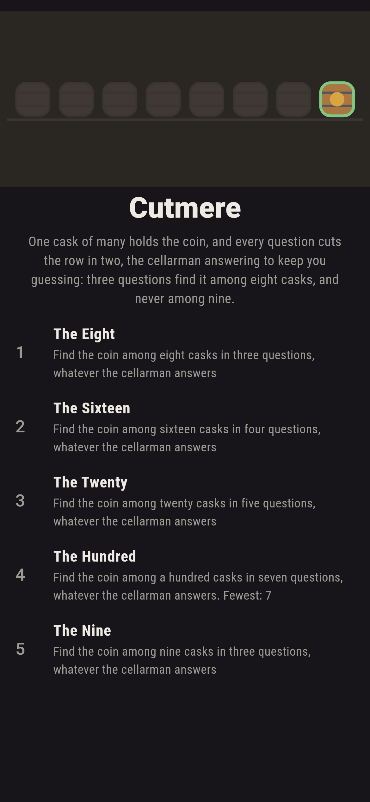
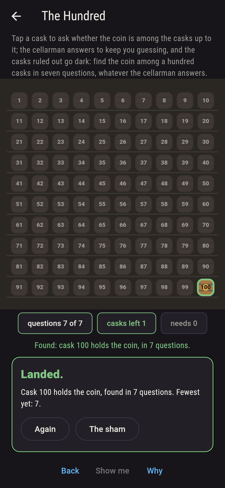
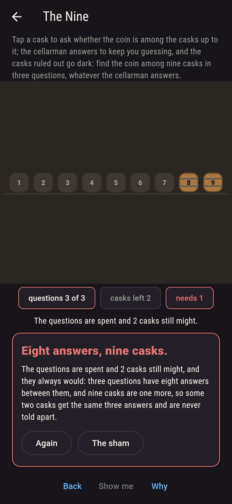
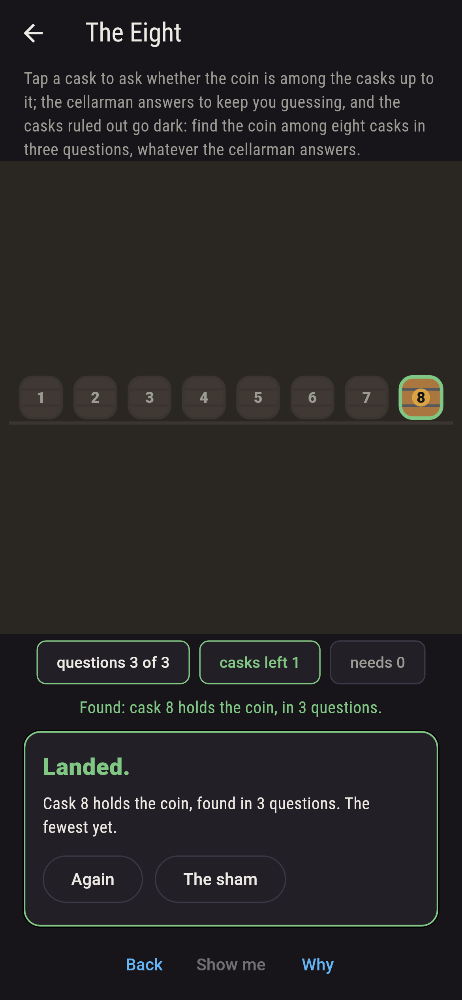
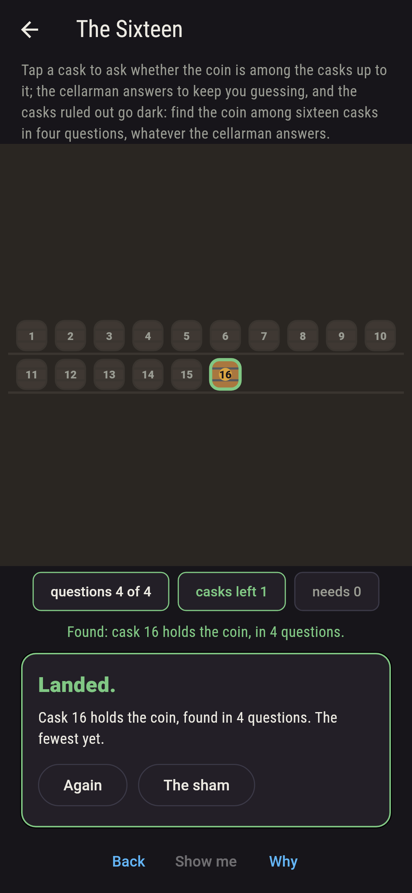
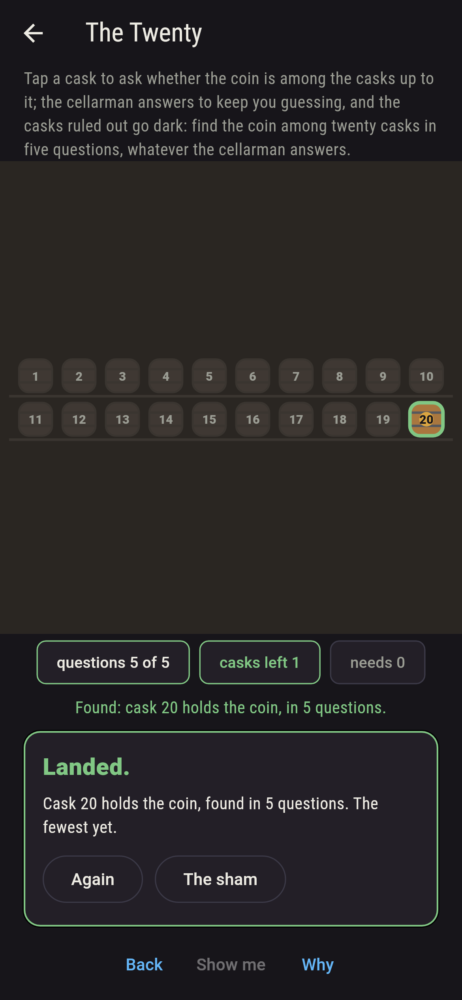
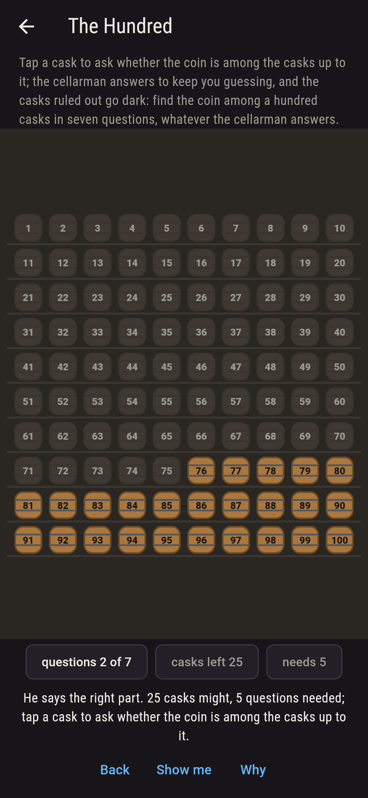
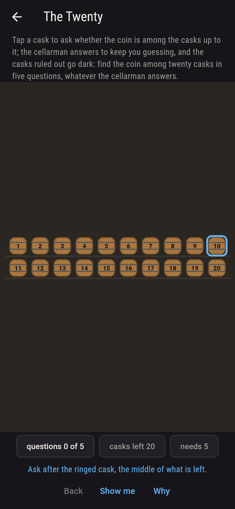
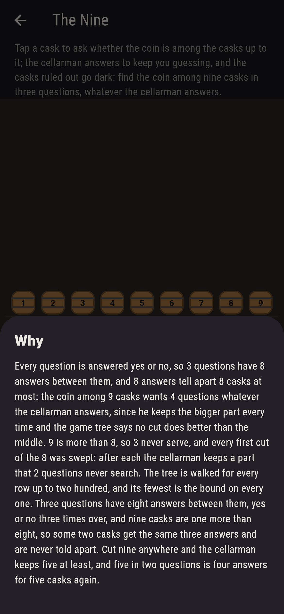

# Cutmere


One cask of the row holds the coin, and every question cuts the row
in two: tap a cask to ask whether the coin is among the casks up to
it, and the cellarman answers, but he answers to keep you guessing,
naming the bigger part every time, so what you learn is only that
the coin is somewhere in it. Three questions find the coin among
eight casks, cutting the middle every time, four among sixteen,
seven among a hundred, and three never among nine: three questions
have eight answers between them, yes or no three times over, and
nine casks are one more than eight, so some two casks get the same
three answers and are never told apart. The game walks the whole
game tree for every row up to two hundred casks and finds the
fewest questions to be exactly that bound, the least k with 2 to
the k at least the casks, on every one.

## The cellars

1. **The Eight** - find the coin among eight casks in three questions, whatever the cellarman answers
2. **The Sixteen** - find the coin among sixteen casks in four questions, whatever the cellarman answers
3. **The Twenty** - find the coin among twenty casks in five questions, whatever the cellarman answers
4. **The Hundred** - find the coin among a hundred casks in seven questions, whatever the cellarman answers
5. **The Nine** - find the coin among nine casks in three questions, whatever the cellarman answers

The eight and the sixteen serve only the middle cut first, one of
seven and one of fifteen; the twenty serves thirteen first cuts of
nineteen, any that leaves sixteen or fewer either side; the hundred
twenty-nine of ninety-nine, any that leaves sixty-four or fewer.
The Nine is labeled hopeless on its tile, and the why counts the
answers.

## Two voices

The game never asserts what it has not computed, and it computes
everything at least twice:

* **The tree** is walked whole: the fewest questions for a row is
  nought for one cask and, for more, one more than the best cut's
  worst part, the cellarman keeping the bigger part; and every first
  cut of every cellar on the sham is swept, kept when the questions
  left still search the part he keeps. Every count on the sham is
  that walk's.
* **The answers** need no tree: k questions answered yes or no have
  2 to the k answers between them, and 2 to the k answers tell apart
  2 to the k casks at most, so the fewest questions for a row is at
  least the least k with 2 to the k at least the casks; the tree
  finds exactly that on every row from one to two hundred, the
  middle cut a best first cut on every one, and 1, 2, 4, 8, 16, 32,
  64 and 128 casks want 0, 1, 2, 3, 4, 5, 6 and 7 questions while
  one more cask wants one more.

`tool/check_cuts.dart` runs the lot and refuses the bake on any
disagreement.

## The checker's ledger

What `dart run tool/check_cuts.dart` printed for the build this
README shipped with, word for word:

```
the game tree walked for every row from one to two hundred casks, the cellarman keeping the bigger part at every cut, 200 rows: the fewest questions that serve is the least k with 2 to the k at least the casks, the bound, on every row, since k questions have 2 to the k answers; the middle cut is a best first cut every time; 1, 2, 4, 8, 16, 32, 64 and 128 casks want 0, 1, 2, 3, 4, 5, 6 and 7 questions and one more cask wants one more; and every first cut swept for the cellars on the sham, eight in three by 1 cut of 7, sixteen in four by 1 of 15, twenty in five by 13 of 19, a hundred in seven by 29 of 99, and nine in three by none of 8

 1 The Eight    find the coin among eight casks in three questions, whatever the cellarman answers: 1 first cut of the 7 serves
 2 The Sixteen  find the coin among sixteen casks in four questions, whatever the cellarman answers: 1 first cut of the 15 serves
 3 The Twenty   find the coin among twenty casks in five questions, whatever the cellarman answers: 13 first cuts of the 19 serve
 4 The Hundred  find the coin among a hundred casks in seven questions, whatever the cellarman answers: 29 first cuts of the 99 serve
 5 The Nine     find the coin among nine casks in three questions, whatever the cellarman answers: none of the 8, and the answers said so first
```

## Screenshots

| The sham | The hundred searched | The nine admitted |
| --- | --- | --- |
|  |  |  |

| The eight | The sixteen | The twenty | Mid-search | Show me | The why |
| --- | --- | --- | --- | --- | --- |
|  |  |  |  |  |  |

Screenshots are drawn by `test/showcase_test.dart` at real phone
sizes with the app's own painter, then copied into `docs/` as they
came out; every question in them was asked by a tap, so nothing
pictured is a cellar the game could not reach. The logo and every
launcher icon come out of `test/mark_test.dart` the same way: the
mark is the eight casks, the coin found in three.

## Building

```
flutter test          # 43 tests, the tree among them
dart run tool/check_cuts.dart
flutter build apk     # or: flutter build ios
```
