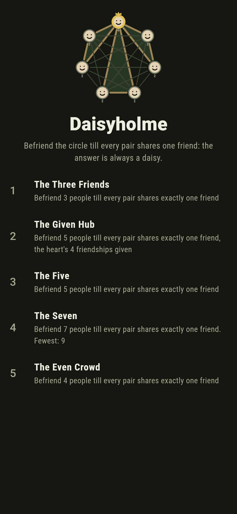
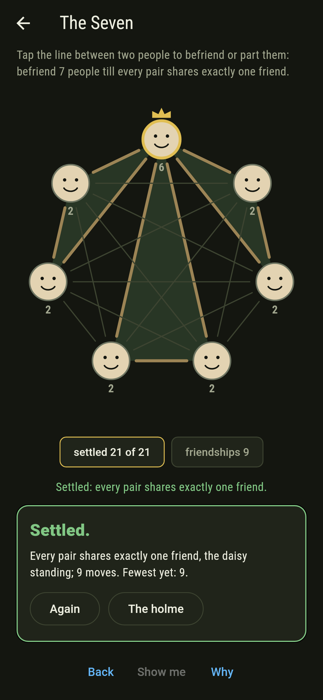
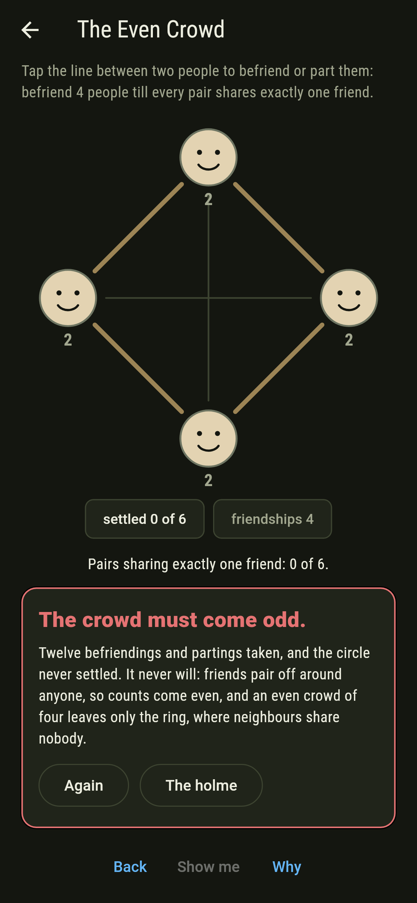
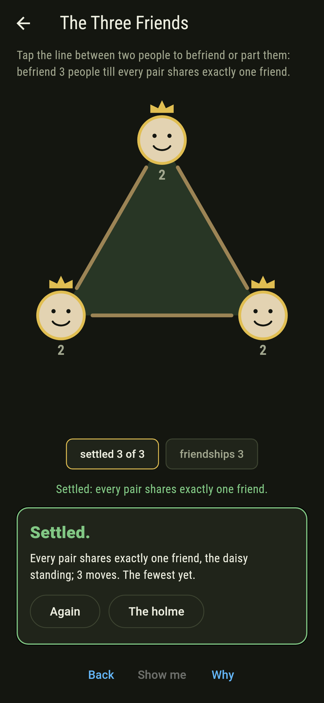
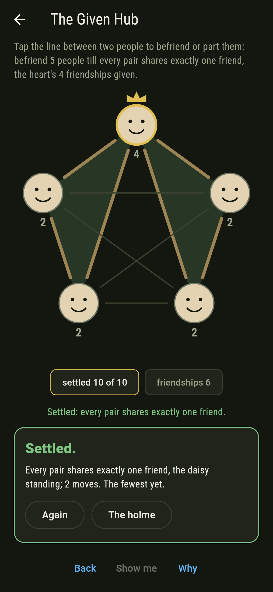
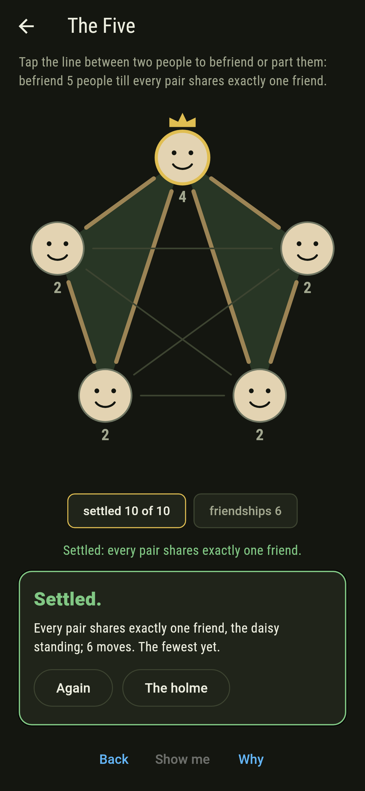
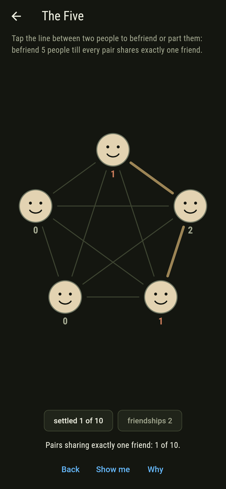
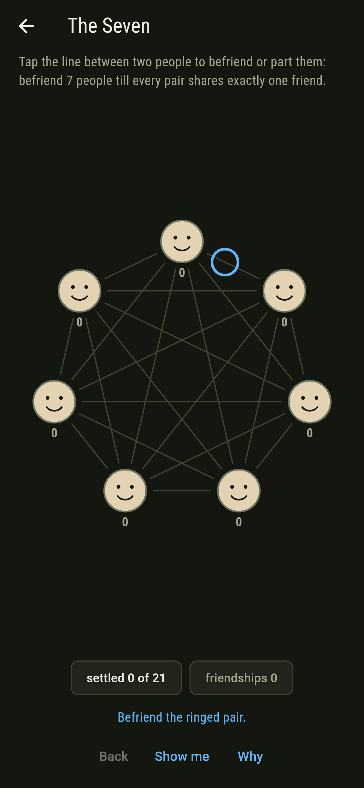
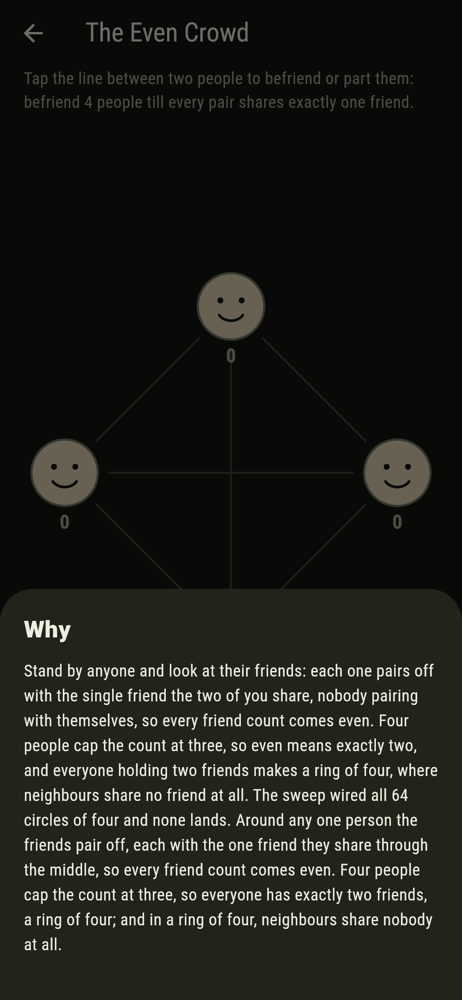

# Daisyholme


People round a green, befriending in pairs, and one asking for
every circle: every pair of people, friends or not, must share
exactly one common friend. Erdos, Renyi and Sos's friendship
theorem says every answer is a daisy, triangles sharing one
heart, so somebody ends up friends with everyone; and the
pairing lemma says the crowd must come odd, since anyone's
friends pair off around them.

## The circles

1. **The Three Friends** - befriend 3 people till every pair shares exactly one friend
2. **The Given Hub** - the heart's 4 friendships given, finish the five
3. **The Five** - befriend 5 people till every pair shares exactly one friend
4. **The Seven** - befriend 7 people till every pair shares exactly one friend
5. **The Even Crowd** - befriend 4 people till every pair shares exactly one friend

The triangle is the daisy of a single petal, every corner at
its heart. The Given Hub leaves only the pairing of four into
two petals, which goes three ways. The Five lands fifteen ways
and The Seven a hundred and five, hearts times pairings both
times, and The Even Crowd is labeled hopeless on its tile: the
pairing lemma bars every even crowd, and the why walks it.

## Two voices

The game never asserts what it has not computed, and it computes
everything at least twice:

* **The census** counts every pair's common friends one by
  one, and the screen keeps the tally of settled pairs as the
  wires go up.
* **The daisy count** multiplies hearts by pairings with no
  searching in it: 1, 15 and 105, with none for four. The
  sweep wires every circle there is, 2,097,152 of them for
  seven people, and the two counts agree; the pairing lemma is
  executed on every landing besides, each person's friends
  pairing off whole.

`tool/check_daisies.dart` runs the lot and refuses the bake on
any disagreement.

## The checker's ledger

What `dart run tool/check_daisies.dart` printed for the build
this README shipped with, word for word:

```
every wiring of every circle swept, 8 and 64 and 1,024 and 2,097,152: the landings match hearts times pairings exactly, 1 and 15 and 105 with none at all for four, every landing keeps a heart befriended to everyone, and round every person of every landing the friends pair off, which is why the crowd must come odd

 1 The Three Friends  befriend 3 people till every pair shares exactly one friend: 1 wiring of the sweep lands it
 2 The Given Hub      befriend 5 people till every pair shares exactly one friend, the heart's 4 friendships given: 3 wirings of the sweep land it
 3 The Five           befriend 5 people till every pair shares exactly one friend: 15 wirings of the sweep land it
 4 The Seven          befriend 7 people till every pair shares exactly one friend: 105 wirings of the sweep land it
 5 The Even Crowd     befriend 4 people till every pair shares exactly one friend: none of the 64, and the pairing lemma said so first
```

## Screenshots

| The holme | The seven | The even crowd admitted |
| --- | --- | --- |
|  |  |  |

| The three friends | The given hub | The five | Mid-wire | Show me | The why |
| --- | --- | --- | --- | --- | --- |
|  |  |  |  |  |  |

Screenshots are drawn by `test/showcase_test.dart` at real phone
sizes with the app's own painter, then copied into `docs/` as
they came out; every friendship in them was tapped, so nothing
pictured is a circle the game could not reach. The logo and
every launcher icon come out of `test/mark_test.dart` the same
way: the mark is the daisy of seven, three petals round a
crowned heart.

## Building

```
flutter test          # 46 tests, the sweep among them
dart run tool/check_daisies.dart
flutter build apk     # or: flutter build ios
```
