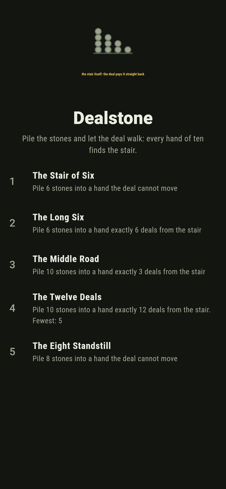
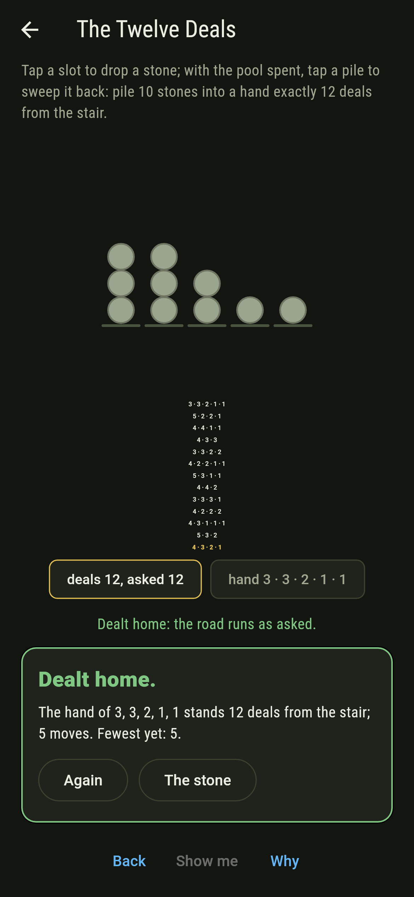
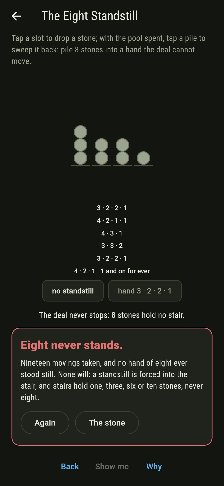
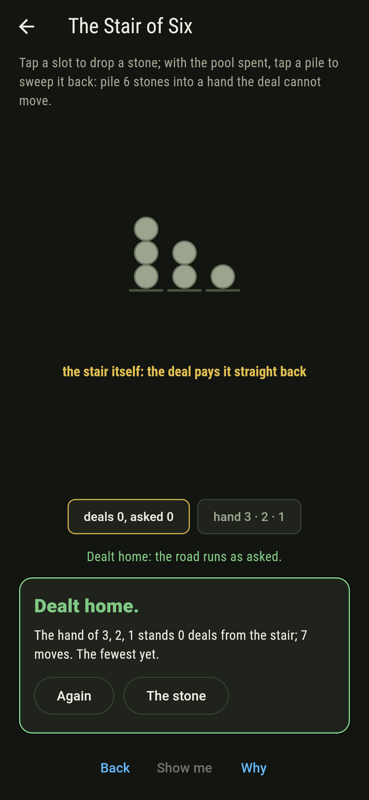
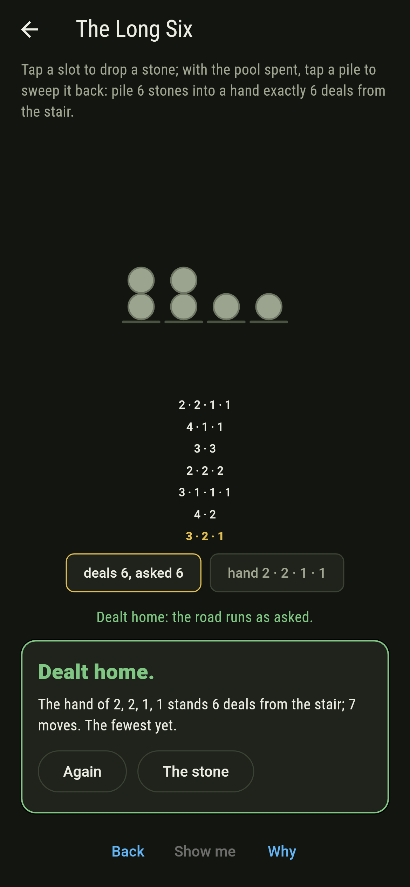
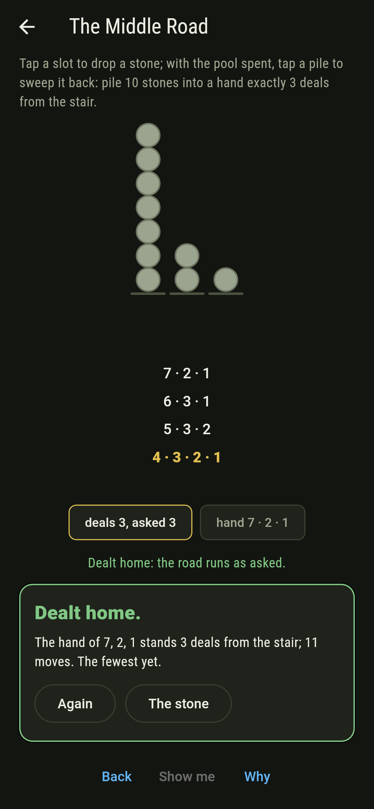
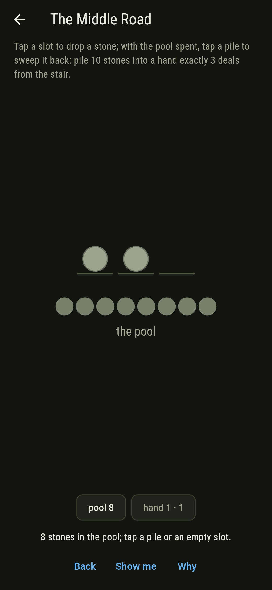
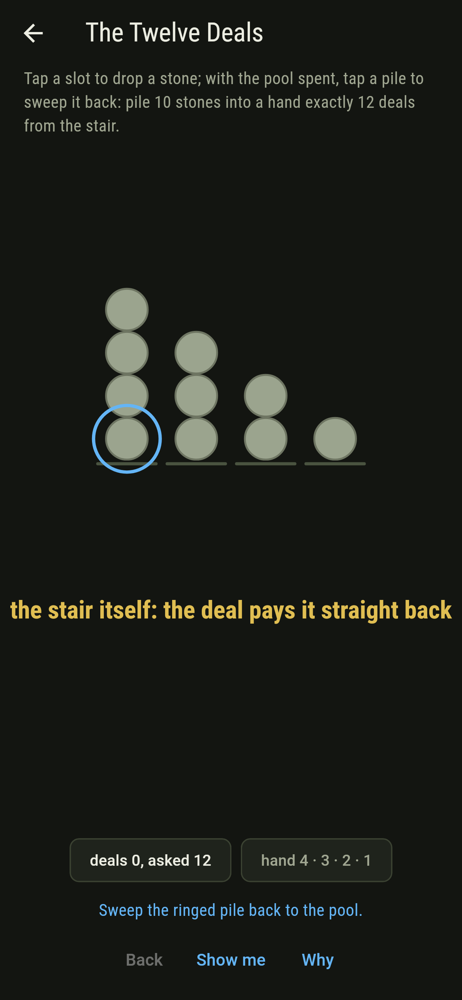
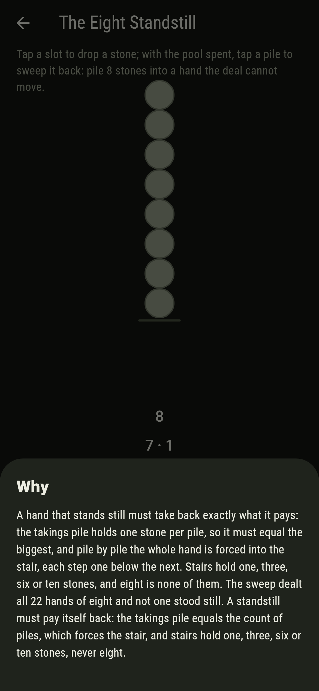

# Dealstone


Stones in piles and one move only: take a stone from every pile
and stack the takings as a new pile. Brandt's theorem on
Bulgarian solitaire says a hand whose count is triangular
always walks to the staircase and stays, and only staircases
ever stand still, so a count between triangulars deals on for
ever.

## The handfuls

1. **The Stair of Six** - pile 6 stones into a hand the deal cannot move
2. **The Long Six** - pile 6 stones exactly 6 deals from the stair
3. **The Middle Road** - pile 10 stones exactly 3 deals from the stair
4. **The Twelve Deals** - pile 10 stones exactly 12 deals from the stair
5. **The Eight Standstill** - pile 8 stones into a hand the deal cannot move

One hand alone stands still at six, the stair itself. The
longest road of six belongs to two-two-one-one alone, and the
three longest hands of ten all keep their biggest pile at
three, twelve deals each. The Eight Standstill is labeled
hopeless on its tile: a standstill is forced into the stair,
and stairs hold one, three, six or ten stones, never eight.

## Two voices

The game never asserts what it has not computed, and it computes
everything at least twice:

* **The deal itself** walks the road hand over hand, and the
  screen draws every step of it beneath the piles, the stair
  arriving in gold and the stairless hands cycling on for
  ever, the loop shown returning to its start.
* **The sweep** deals every hand there is, the 11 of six, the
  22 of eight and the 42 of ten, holds the standstill law on
  each, and counts the roads where the labels say.

`tool/check_deals.dart` runs the lot and refuses the bake on
any disagreement.

## The checker's ledger

What `dart run tool/check_deals.dart` printed for the build
this README shipped with, word for word:

```
every hand dealt, the 11 of six, the 22 of eight and the 42 of ten: triangular counts always walk to their stair, the stair alone stands still, no hand of eight ever does, the longest road of ten runs twelve deals and all three hands that walk it keep their biggest pile at three

 1 The Stair of Six   pile 6 stones into a hand the deal cannot move: 1 hand of the sweep lands it
 2 The Long Six       pile 6 stones into a hand exactly 6 deals from the stair: 1 hand of the sweep lands it
 3 The Middle Road    pile 10 stones into a hand exactly 3 deals from the stair: 5 hands of the sweep land it
 4 The Twelve Deals   pile 10 stones into a hand exactly 12 deals from the stair: 3 hands of the sweep land it
 5 The Eight Standstill pile 8 stones into a hand the deal cannot move: none of the 22, and the stair count said so first
```

## Screenshots

| The stone | The twelve deals | The eight standstill admitted |
| --- | --- | --- |
|  |  |  |

| The stair of six | The long six | The middle road | Mid-pile | Show me | The why |
| --- | --- | --- | --- | --- | --- |
|  |  |  |  |  |  |

Screenshots are drawn by `test/showcase_test.dart` at real phone
sizes with the app's own painter, then copied into `docs/` as
they came out; every stone in them was tapped, so nothing
pictured is a hand the game could not reach. The logo and every
launcher icon come out of `test/mark_test.dart` the same way:
the mark is the stair of ten standing whole.

## Building

```
flutter test          # 45 tests, the sweep among them
dart run tool/check_deals.dart
flutter build apk     # or: flutter build ios
```
