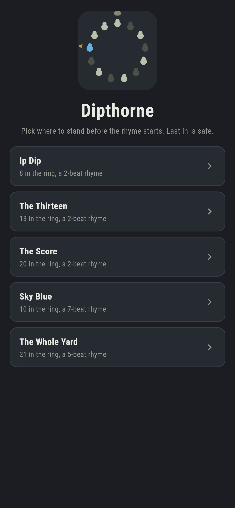
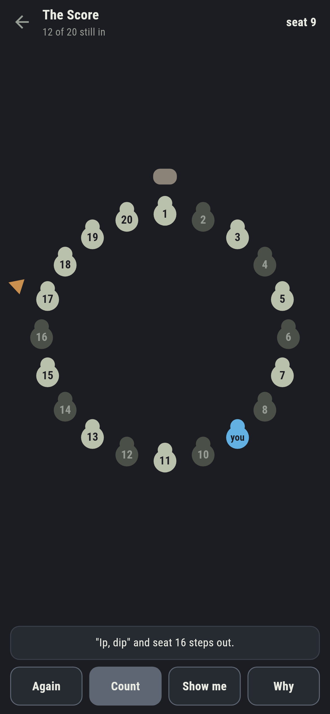
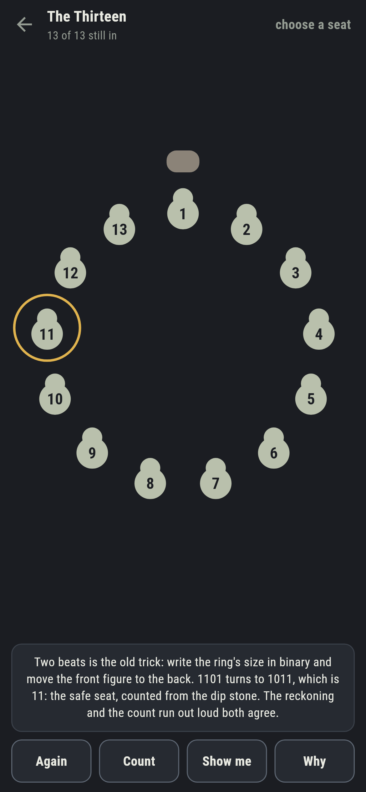
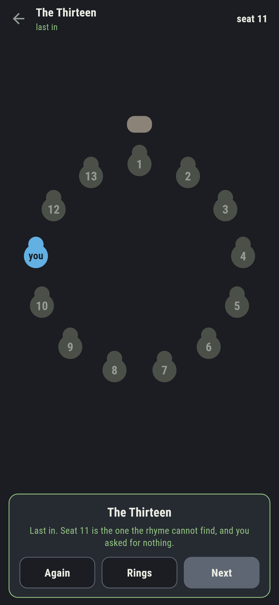
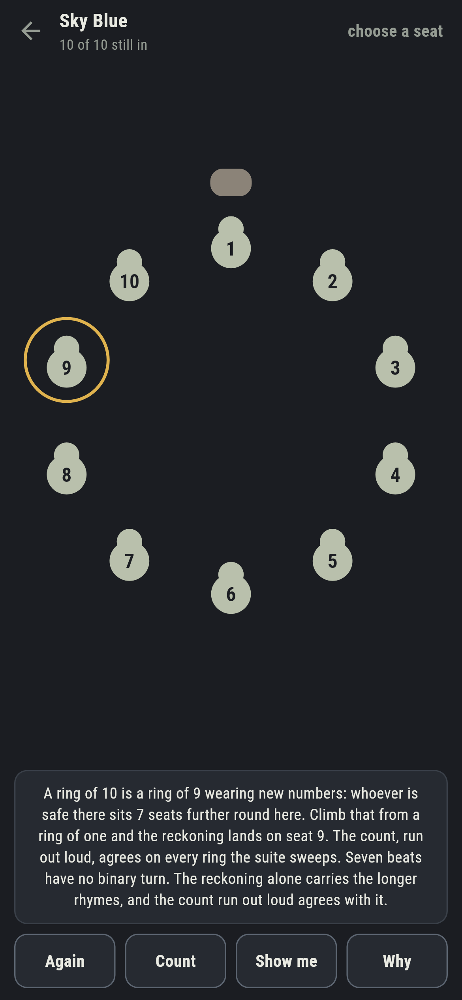
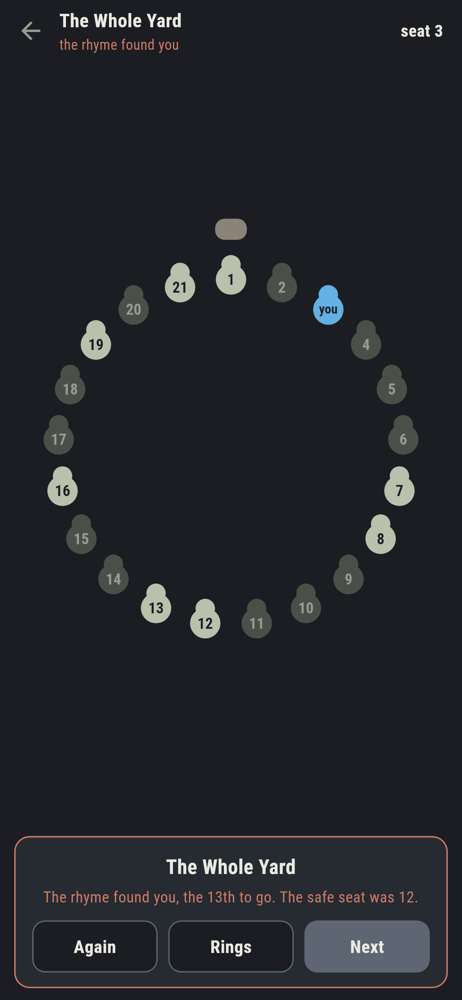

# Dipthorne

A counting-out game for phones, in Flutter, for Android and iOS.

Dipping, the way every schoolyard settles who is It: a ring of children, a
rhyme chanted round it from the dip stone, one child to a beat, and whoever
each chant lands on steps out. You pick where to stand before the rhyme
starts. Last in is safe.

| | | | |
|---|---|---|---|
|  |  |  |  |

## The safe seat is arithmetic

The count is merciless and fair, so the safe seat is decided before the
first word is chanted, and the game works it out two ways that share
nothing. The count itself stands the ring up and runs it, child by child.
The reckoning never sees a ring: a ring of n is a ring of n minus one
wearing new numbers, so the safe seat climbs by the rhyme's beats and
wraps, all the way up from a ring of one. The ledger, from `make dips`:

```
$ make dips
count and reckoning agree on 1440 rings; the binary turn agrees on 500 two-beat rings

 1 Ip Dip           8 in the ring  2 beats  safe seat 1  written down 1
 2 The Thirteen    13 in the ring  2 beats  safe seat 11  written down 11
 3 The Score       20 in the ring  2 beats  safe seat 9  written down 9
 4 Sky Blue        10 in the ring  7 beats  safe seat 9  written down 9
 5 The Whole Yard  21 in the ring  5 beats  safe seat 12  written down 12
```

## The old trick, for two-beat rhymes

For a two-beat rhyme there is a third voice, the famous one: write the
ring's size in binary and move the front figure to the back. Thirteen is
1101, the turn makes 1011, and that is eleven: the safe seat. **Why** does
the turn in front of you and marks the seat on the ring, and the suite
checks the trick against the other two answers on every ring up to five
hundred.

Ip Dip is the boundary case that teaches it: eight is a power of two, the
turn changes nothing, and the dip stone seat itself is the safe one. The
powers of two are exactly the rings where that happens, and a test sweeps
them to say so.


## Longer rhymes have no trick

Seven beats, five beats: no binary turn will save you, and **Why** says so
honestly. The reckoning alone carries the longer rhymes, climbed ring by
ring in front of you, and the count run out loud agrees with it on every
ring the suite sweeps: every size to a hundred and twenty, every rhyme to
twelve beats.



## The count runs one chant at a time

Stand somewhere, then count. Each tap chants the rhyme once and one child
steps out, the dipper's finger walking the ring, so you watch the count
come for you or pass you by. Stand wrong and the card tells you which
chant found you and where safety always was.



## Building

```
make deps    # fetch packages
make check   # analyze + every test
make dips    # prove the reckoning against the count, walk the rings
make shots   # render the screenshots and redraw the icons
make apk     # Android release build
make ios     # iOS release build (unsigned)
```

The logo and every app icon are drawn by the game's own painter in
`test/mark_test.dart`. There is no image in this repository that was not
produced by code in it.

## How it is put together

```
lib/ring/ring.dart      a ring: children, the rhyme, the safe seat
lib/ring/fewest.dart    the count, the reckoning, and the binary turn
lib/ring/rings.dart     the five rings that ship
lib/ring/play.dart      a dip in play: chants, outs, where you stand
lib/ui/                 the painter, the screens, the mark
tool/check_rings.dart   the ledger above
```

The tests hold the count against the reckoning on 1,440 rings, the binary
turn against both on 500, the power-of-two boundary against a sweep, every
shipped safe seat against all three, the chant in play against the count
alone, and the pictures against the real widget tree. If any of that
drifts, `make check` goes red before anything leaves the machine.
