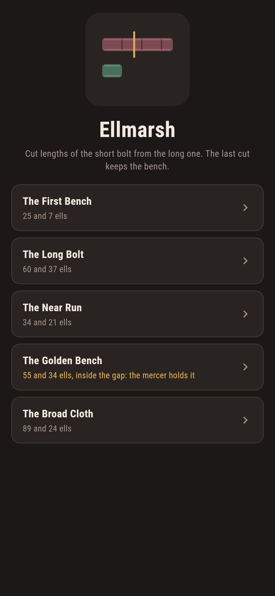
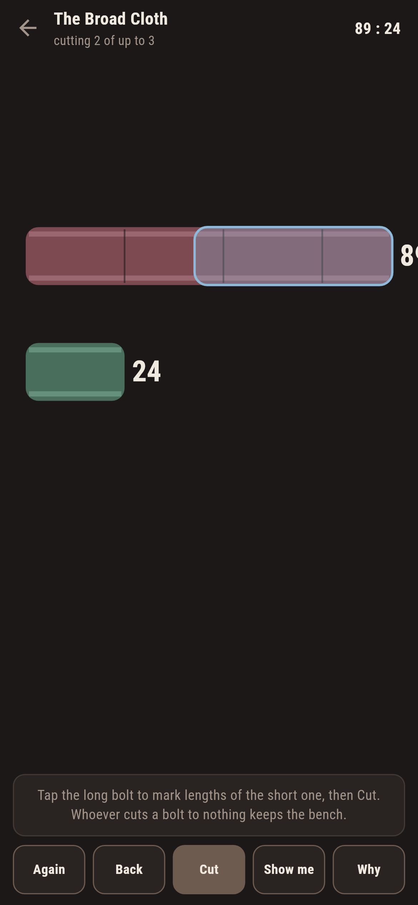
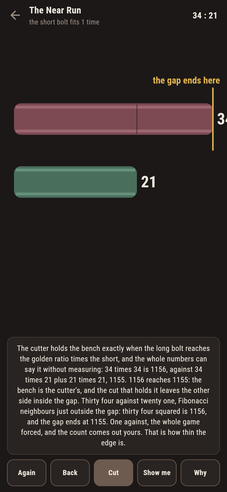
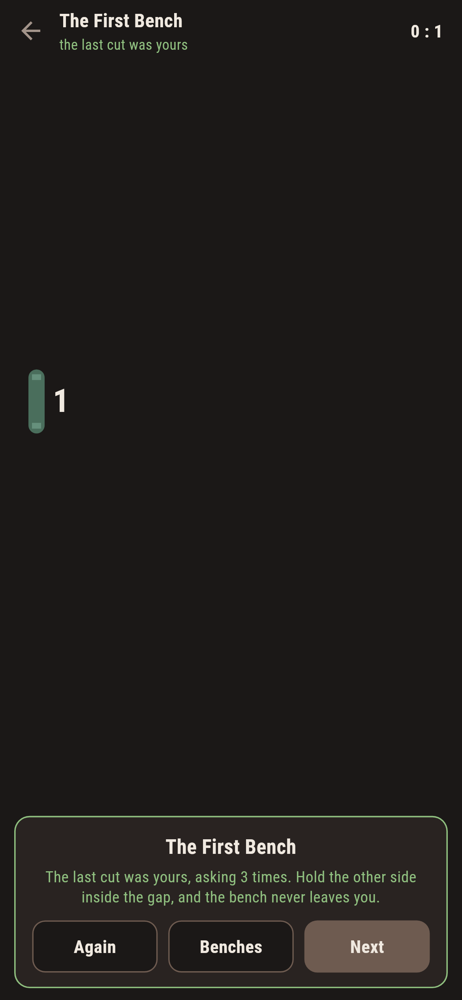
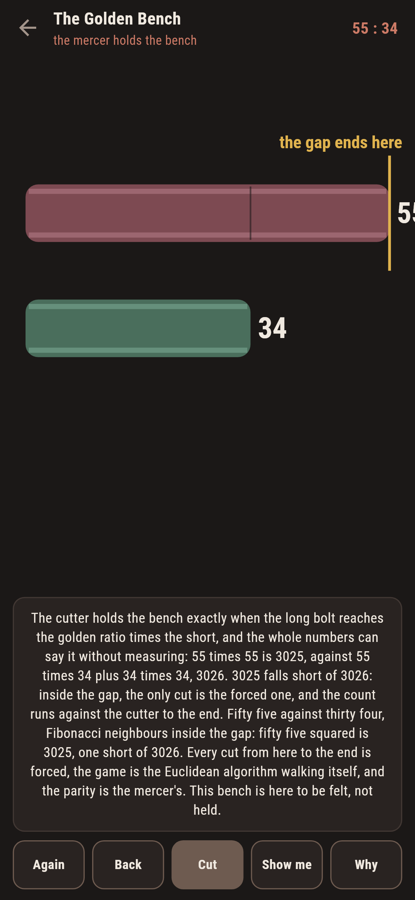
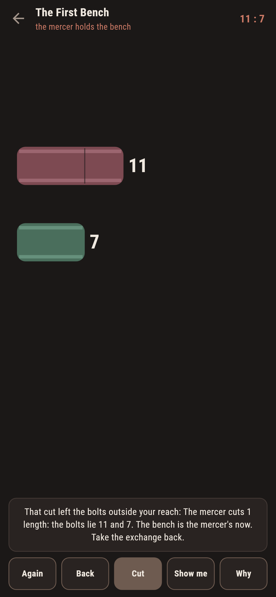

# Ellmarsh

A cloth-cutting duel for phones, in Flutter, for Android and iOS.

Two bolts of cloth on the mercer's bench. A cut takes any whole number of
short-bolt lengths off the long bolt, at least one; then the mercer cuts,
and so on, the bolts trading places as they shrink. Whoever cuts a bolt
to nothing keeps the bench. This is Euclid's game, the Euclidean
algorithm with a will of its own, and the golden ratio says who holds it.

| | | | |
|---|---|---|---|
|  |  |  |  |

## The golden gap

The cutter holds the bench exactly when the long bolt reaches the golden
ratio times the short one, or the short divides it outright. No measuring
is needed: long squared against long-times-short plus short squared, in
whole numbers, decides it, because the golden ratio is exactly the number
whose square is itself plus one. **Why** does that arithmetic for the
bolts in front of you and drops a golden tick on the bench where the gap
ends, so you can see whether the long bolt reaches past it.

```
$ make benches
the golden gap and the search agree on all 11325 pairs to a hundred and fifty ells

 1 The First Bench  25 and  7 ells  quotient 3  the opener holds it
 2 The Long Bolt    60 and 37 ells  quotient 1  the opener holds it
 3 The Near Run     34 and 21 ells  quotient 1  the opener holds it
 4 The Golden Bench 55 and 34 ells  quotient 1  the mercer holds it
 5 The Broad Cloth  89 and 24 ells  quotient 3  the opener holds it
```

The search knows cuts and nothing else; the gap knows one inequality;
they agree on all 11,325 pairs. The suite also proves the shape of the
thing: wherever the short bolt fits twice or more there is a choice, and
choice is always winning, so the game is forced exactly inside the gap,
where it walks the Euclidean algorithm by itself.

## Fibonacci at the edge

Consecutive Fibonacci pairs are the closest whole numbers come to the
golden ratio, and they alternate across the edge. Thirty four against
twenty one: 1156 versus 1155, one ell of margin, yours. Fifty five
against thirty four: 3025 versus 3026, one short, the mercer's. The Near
Run and the Golden Bench ship as that pair of pairs, the same forced
walk with opposite verdicts, and the Golden Bench is labelled in the
house tradition of maps nobody can win.



## The mercer does not forgive

Cut wrong once and the bench changes hands: the game says so the moment
the answer lands, with Back returning the exchange whole. Show me marks
the one cut that holds the bench, and says what it leaves: the other
side inside the gap, where every move is forced.



## Building

```
make deps     # fetch packages
make check    # analyze + every test
make benches  # the gap against the search, then the ledger
make shots    # render the screenshots and redraw the icons
make apk      # Android release build
make ios      # iOS release build (unsigned)
```

The logo and every app icon are drawn by the game's own painter in
`test/mark_test.dart`. There is no image in this repository that was not
produced by code in it.

## How it is put together

```
lib/cloth/rules.dart     the search, the gap, and the winning cut
lib/cloth/bench.dart     a bench: the two bolts and the verdict
lib/cloth/benches.dart   the five benches that ship
lib/cloth/play.dart      a duel: cuts, the mercer's answers
lib/ui/                  the painter, the screens, the mark
tool/check_benches.dart  the ledger above
```

The tests hold the gap against the search on every pair to a hundred and
fifty, prove choice is winning wherever it exists, walk the Fibonacci
edge, verify the winning cut hands over a lost pair everywhere, and hold
the pictures against the real widget tree. If any of that drifts,
`make check` goes red before anything leaves the machine.
