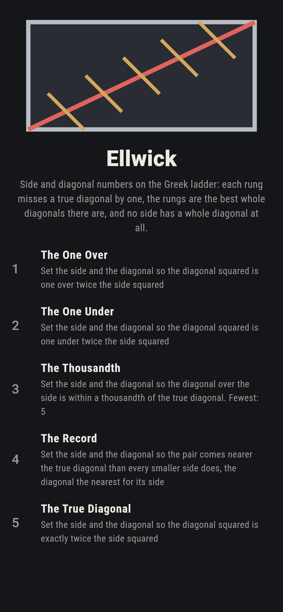
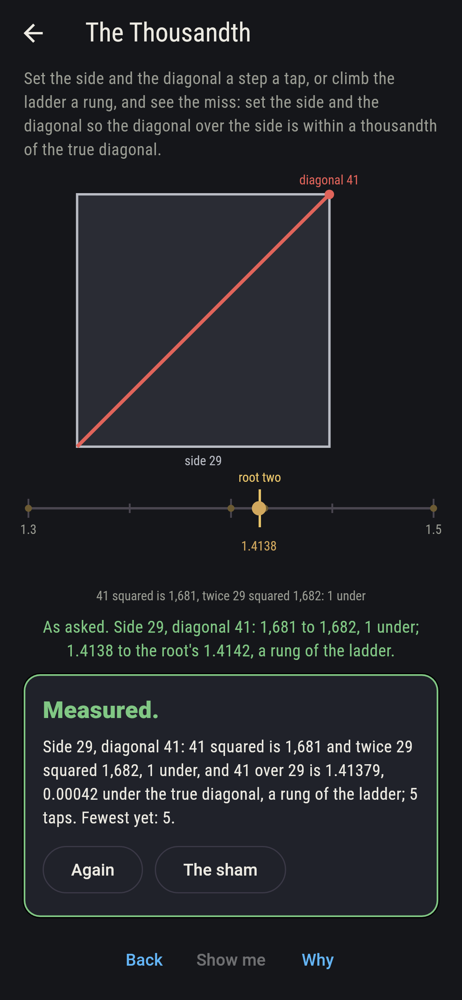
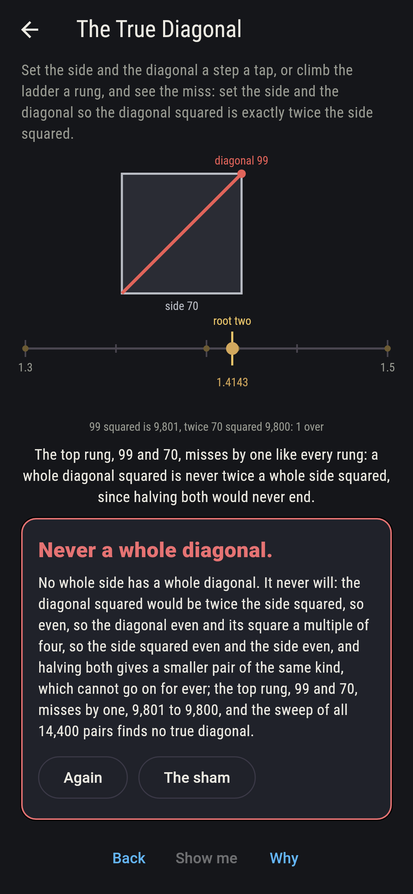
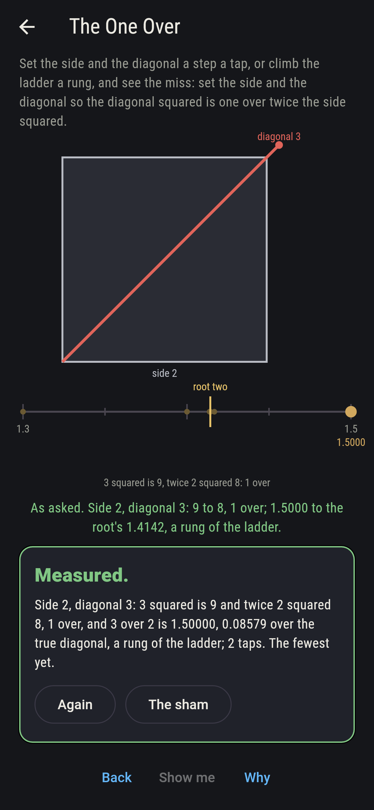
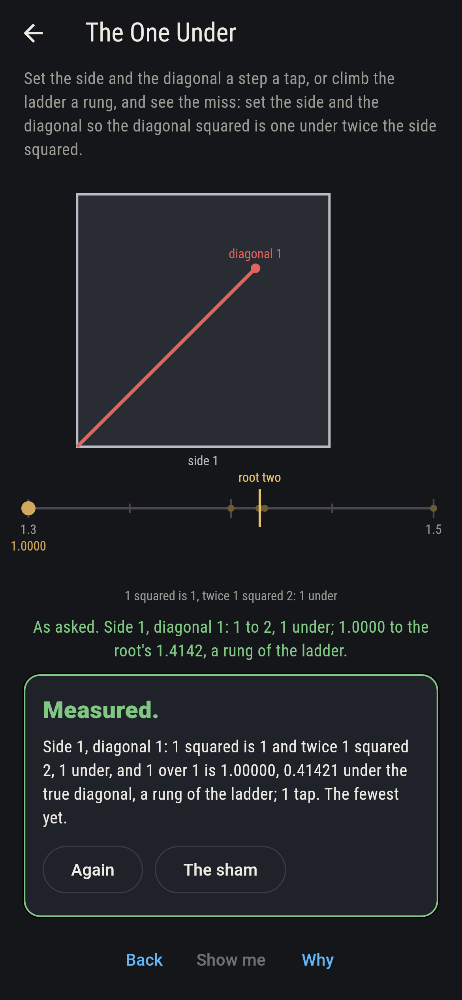
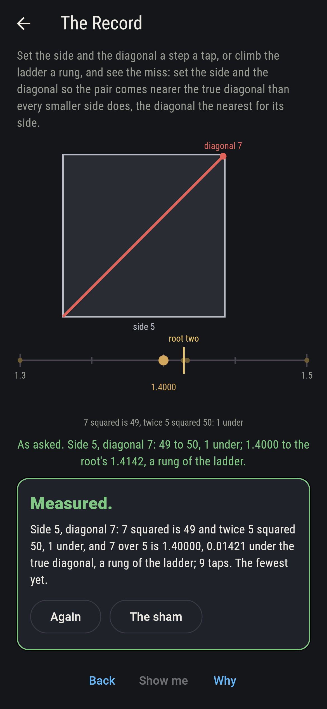
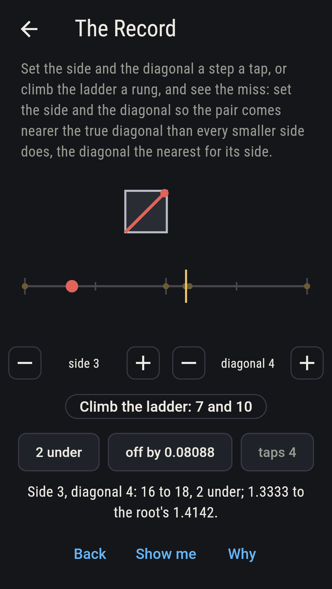
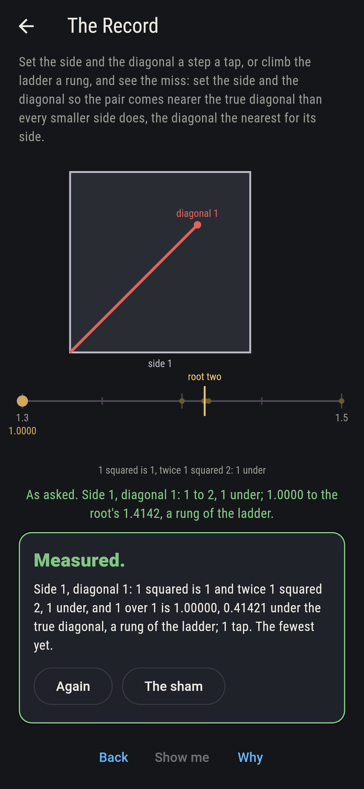
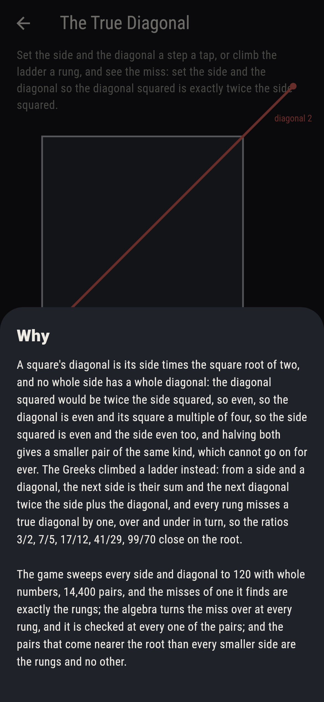

# Ellwick


Side and diagonal numbers on the Greek ladder. A square's diagonal is
its side times the square root of two, and no whole side has a whole
diagonal: the diagonal squared would be twice the side squared, so
even, so the diagonal even and its square a multiple of four, so the
side squared even and the side even too, and halving both gives a
smaller pair of the same kind, which cannot go on for ever. The
Greeks climbed a ladder instead: from a side and a diagonal, the next
side is their sum and the next diagonal twice the side plus the
diagonal, and every rung misses a true diagonal by one, over and
under in turn, so 3/2, 7/5, 17/12, 41/29, 99/70 close on the root.
Set the side and the diagonal a step a tap, or climb the ladder a
rung, and see the miss. Every side and diagonal to 120 is swept with
whole numbers, 14,400 pairs, and the misses of one are exactly the
rungs, the algebra turns the miss over at every pair, and the rungs
are the best whole diagonals there are.

## The asks

1. **The One Over** - set the side and the diagonal so the diagonal squared is one over twice the side squared
2. **The One Under** - set the side and the diagonal so the diagonal squared is one under twice the side squared
3. **The Thousandth** - set the side and the diagonal so the diagonal over the side is within a thousandth of the true diagonal
4. **The Record** - set the side and the diagonal so the pair comes nearer the true diagonal than every smaller side does, the diagonal the nearest for its side
5. **The True Diagonal** - set the side and the diagonal so the diagonal squared is exactly twice the side squared

One over comes at (2, 3), (12, 17) and (70, 99), 9,801 to 9,800, and
one under at (1, 1), (5, 7) and (29, 41), 1,681 to 1,682, three
pairs each of the 14,400 and no other, the even and the odd rungs;
seven pairs come within a thousandth of the true diagonal, (29, 41)
first at 0.00042 over and (70, 99) nearest at 0.00007, while 17 over
12 misses by 0.00245; and the pairs that come nearer the root than
every smaller side does are the six rungs and no other, so the
ladder is the best whole diagonals there are, rung by rung, all the
way to 120. The True Diagonal is labeled hopeless on its tile: the
halving never ends, and the sham admits it the moment the player
climbs to the top rung, 70 and 99, one over.

## Two voices

The game never asserts what it has not computed, and it computes
everything at least twice:

* **The sweep** tries every side and diagonal to 120 with whole
  numbers, 14,400 pairs, and reads the miss of each, the diagonal
  squared less twice the side squared; every count on the sham is
  the sweep's, and it finds the misses of one, the pairs within a
  thousandth and the records by trying them all.
* **The ladder** climbs from (1, 1) by the Greek rule with no sweep,
  and its rungs are exactly the sweep's misses of one and exactly its
  records; the algebra that turns the miss over, twice the side plus
  the diagonal squared less twice the square of side plus diagonal
  being twice the side squared less the diagonal squared, is checked
  at every one of the 14,400 pairs.

`tool/check_rungs.dart` runs the lot and refuses the bake on any
disagreement.

## The checker's ledger

What `dart run tool/check_rungs.dart` printed for the build this
README shipped with, word for word:

```
every side and diagonal to 120 swept with whole numbers, 14,400 pairs: the diagonal squared misses twice the side squared by one over at (2, 3), (12, 17) and (70, 99), 9,801 to 9,800, by one under at (1, 1), (5, 7) and (29, 41), 1,681 to 1,682, and by nought never; the ladder from (1, 1), side plus diagonal and twice the side plus the diagonal, climbs through exactly those six pairs and no other, its miss turning over at every rung, and the algebra turns it over at every one of the 14,400 pairs; the pairs that come nearer the true diagonal than every smaller side does, the diagonal the nearest for its side, are the six rungs and no other; and seven pairs come within a thousandth of the true diagonal, (29, 41) first at 0.00042 over and (70, 99) nearest at 0.00007, while 17 over 12 misses by 0.00245

 1 The One Over       set the side and the diagonal so the diagonal squared is one over twice the side squared: 3 of the 14,400 pairs land it
 2 The One Under      set the side and the diagonal so the diagonal squared is one under twice the side squared: 3 of the 14,400 pairs land it
 3 The Thousandth     set the side and the diagonal so the diagonal over the side is within a thousandth of the true diagonal: 7 of the 14,400 pairs land it
 4 The Record         set the side and the diagonal so the pair comes nearer the true diagonal than every smaller side does, the diagonal the nearest for its side: 6 of the 14,400 pairs land it
 5 The True Diagonal  set the side and the diagonal so the diagonal squared is exactly twice the side squared: none of the 14,400, and the halving said so first
```

## Screenshots

| The sham | The thousandth | The true diagonal admitted |
| --- | --- | --- |
|  |  |  |

| The one over | The one under | The record | Midway, on the small phone | Show me | The why |
| --- | --- | --- | --- | --- | --- |
|  |  |  |  |  |  |

Screenshots are drawn by `test/showcase_test.dart` at real phone
sizes with the app's own painter, then copied into `docs/` as they
came out; every pair in them was set by taps and climbs, so nothing
pictured is a setting the game could not reach. The logo and every
launcher icon come out of `test/mark_test.dart` the same way: the
mark is the square, its diagonal, and the ladder up it.

## Building

```
flutter test          # 45 tests, the sweep among them
dart run tool/check_rungs.dart
flutter build apk     # or: flutter build ios
```
