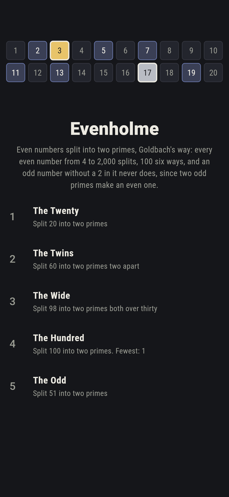
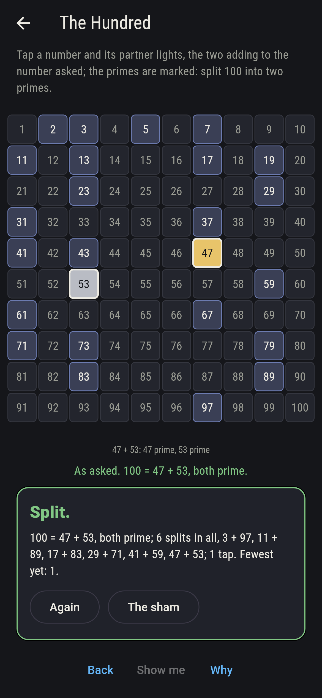
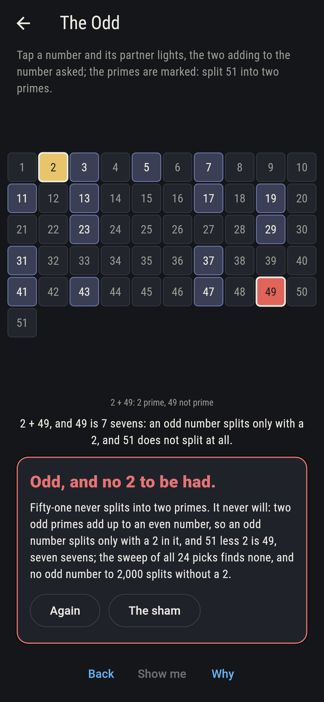
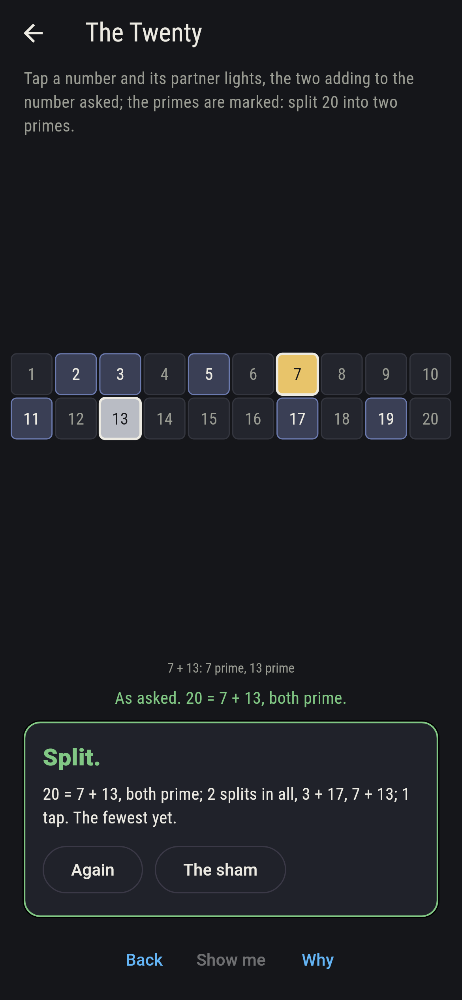
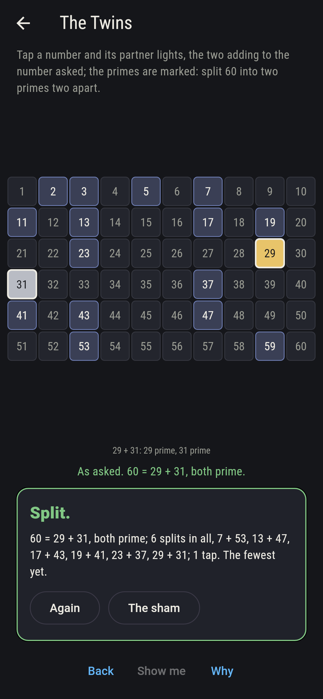
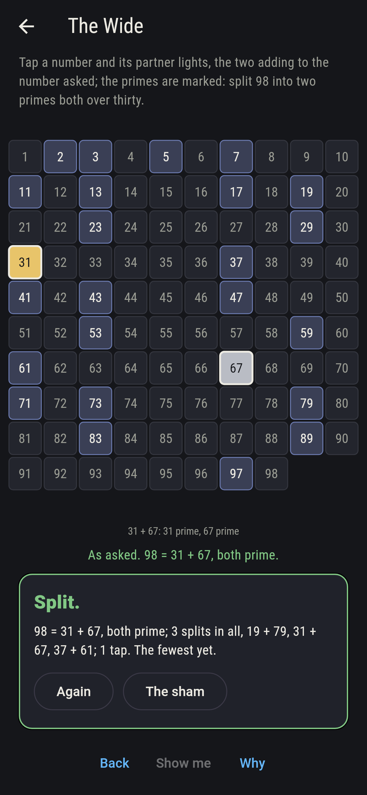
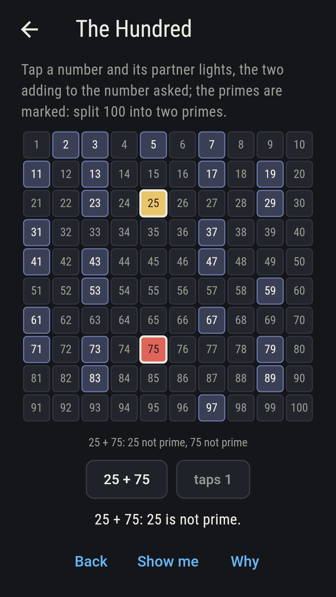
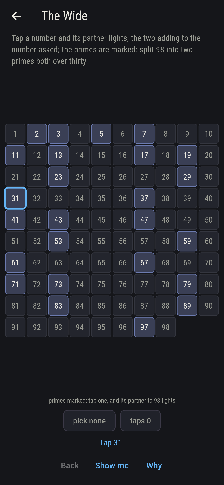
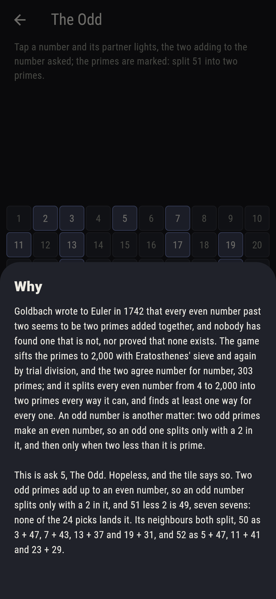

# Evenholme


Even numbers split into two primes. Goldbach wrote to Euler in 1742
that every even number past two seems to be two primes added
together, and nobody has found one that is not, nor proved that
none exists. Tap a number on the slate and its partner lights, the
two adding to the number asked, with the primes marked; find a pair
that are both prime. The game sifts the primes to 2,000 with
Eratosthenes' sieve and again by trial division, and the two agree
number for number, 303 primes; and it splits every even number from
4 to 2,000 into two primes every way it can, and finds at least one
way for every one, 4, 6, 8 and 12 one way alone and 1,890 the most
with 91. An odd number is another matter: two odd primes make an
even number, so an odd one splits only with a 2 in it, and then only
when two less than it is prime.

## The asks

1. **The Twenty** - split 20 into two primes
2. **The Twins** - split 60 into two primes two apart
3. **The Wide** - split 98 into two primes both over thirty
4. **The Hundred** - split 100 into two primes
5. **The Odd** - split 51 into two primes

Twenty splits as 3 + 17 and 7 + 13, two of the nine picks from 2 to
10; sixty splits six ways and 29 + 31 are twins; ninety-eight splits
three ways, two of them with both primes over thirty; and a hundred
splits six ways, from 3 + 97 to 47 + 53. Above 100 no even number
splits fewer than three ways, and 128 is the first with just three.
The Odd is labeled hopeless on its tile: 51 less 2 is 49, seven
sevens, and no odd number to 2,000 splits without a 2; the sham
admits it the moment 2 is picked.

## Two voices

The game never asserts what it has not computed, and it computes
everything at least twice:

* **The sieve** strikes out the multiples of every prime to 2,000 and
  keeps what stands, 303 primes; and **trial division** tries every
  divisor of every number to 2,000 with no sieve, and the two agree
  number for number.
* **The sweep** splits every even number from 4 to 2,000 into two
  primes every way it can, checks each split adds up and both parts
  are prime by trial, and finds every even number split; every count
  on the sham is that sweep's, pick by pick, and every odd number to
  2,000 is checked to split, when it does, only with a 2.

`tool/check_splits.dart` runs the lot and refuses the bake on any
disagreement.

## The checker's ledger

What `dart run tool/check_splits.dart` printed for the build this
README shipped with, word for word:

```
the primes to 2,000 sifted with Eratosthenes' sieve and again by trial division, 303 of them and the two agreeing number for number; every even number from 4 to 2,000 split into two primes every way it can, and every one splits, 4, 6, 8 and 12 one way alone, no even number above 100 fewer than three ways, 128 the first with just three, and 1,890 the most with 91; twenty splits as 3 + 17 and 7 + 13, sixty six ways with 29 + 31 the twins, ninety-eight three ways with 31 + 67 and 37 + 61 both over thirty, and a hundred six ways from 3 + 97 to 47 + 53; and no odd number to 2,000 splits without a 2, so 51, being 2 and 49, seven sevens, splits not at all, though 50 splits four ways and 52 three

 1 The Twenty   split 20 into two primes: 2 of the 9 picks land it
 2 The Twins    split 60 into two primes two apart: 1 of the 29 picks lands it
 3 The Wide     split 98 into two primes both over thirty: 2 of the 48 picks land it
 4 The Hundred  split 100 into two primes: 6 of the 49 picks land it
 5 The Odd      split 51 into two primes: none of the 24, and the odd sum said so first
```

## Screenshots

| The sham | The hundred | The odd admitted |
| --- | --- | --- |
|  |  |  |

| The twenty | The twins | The wide | Midway, on the small phone | Show me | The why |
| --- | --- | --- | --- | --- | --- |
|  |  |  |  |  |  |

Screenshots are drawn by `test/showcase_test.dart` at real phone
sizes with the app's own painter, then copied into `docs/` as they
came out; every pick in them was made by a tap, so nothing pictured
is a split the game could not reach. The logo and every launcher icon
come out of `test/mark_test.dart` the same way: the mark is twenty on
the slate, split as 3 + 17.

## Building

```
flutter test          # 45 tests, the sieve among them
dart run tool/check_splits.dart
flutter build apk     # or: flutter build ios
```
