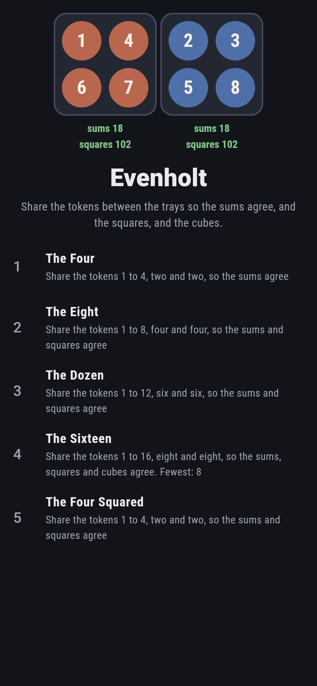
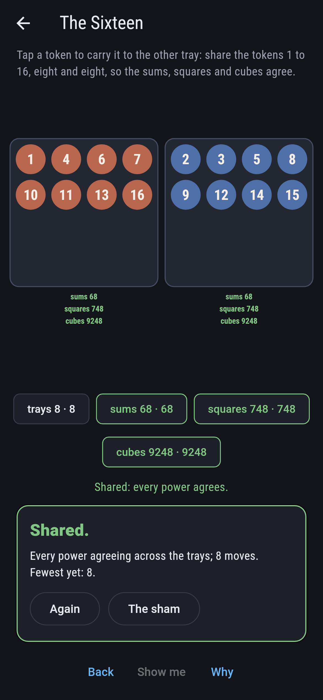
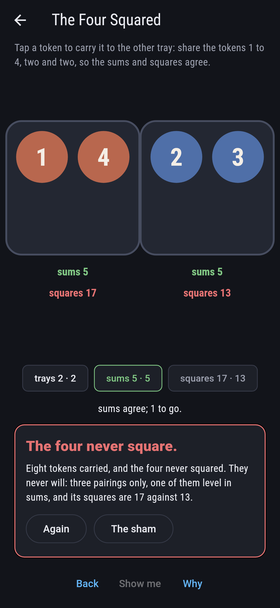
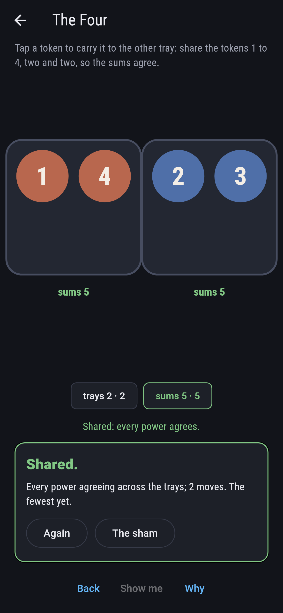
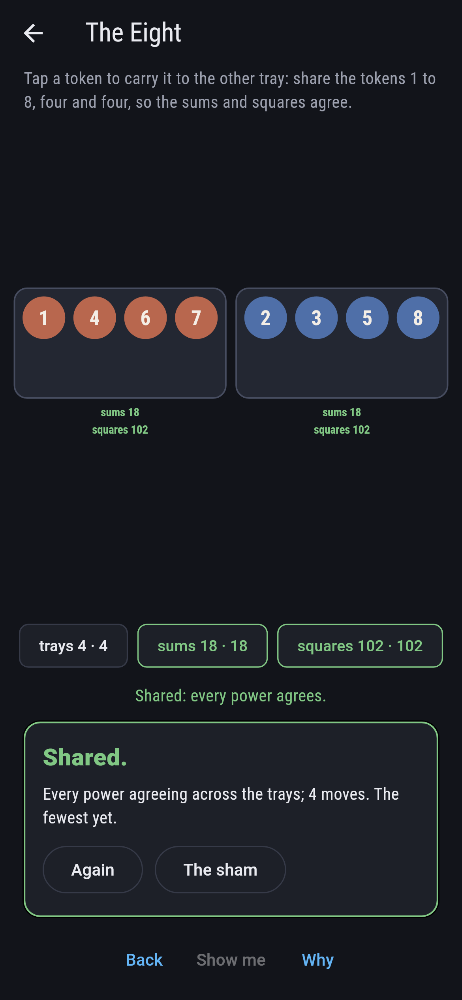
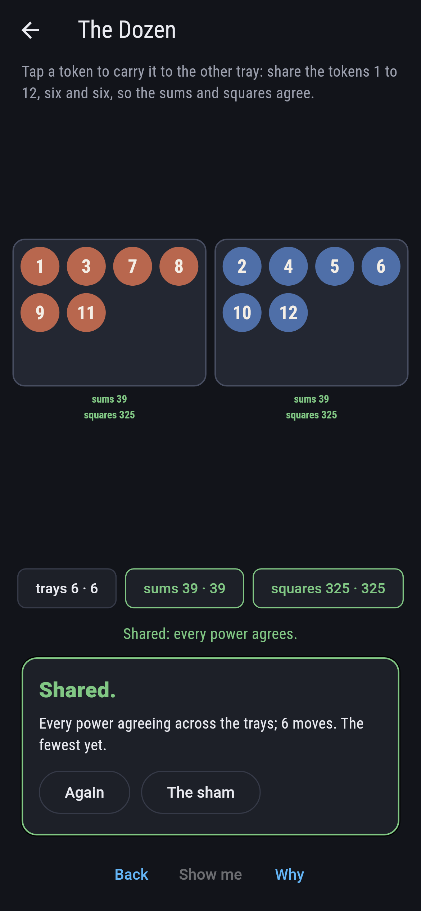
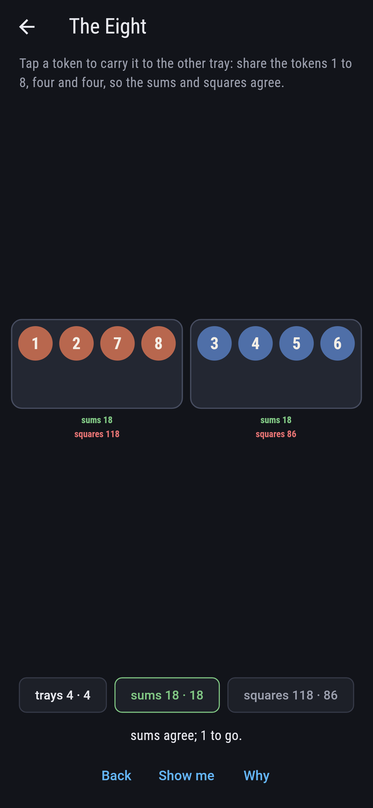
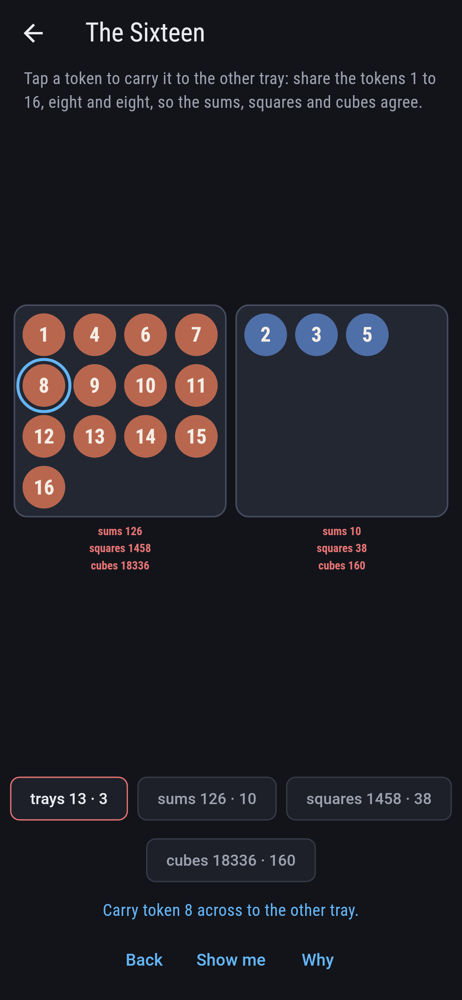
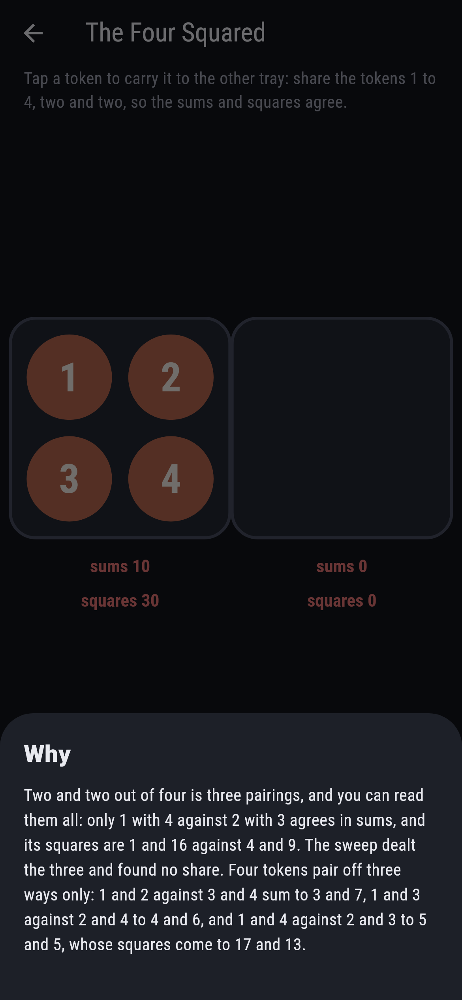

# Evenholt


Tokens numbered 1 to n and two trays: carry them across, half
and half, so that the two trays agree in sums, then in squares,
then in cubes, as far as the deal asks. Prouhet showed in 1851
that a doubling pattern shares 2^k tokens so that every power up
to k - 1 agrees, and the sweep here finds that pattern is the
only share of eight that squares and the only share of sixteen
that cubes. A dozen squares one way with no doubling behind it,
and four tokens never square: three pairings, read out in full.

## The deals

1. **The Four** - share the tokens 1 to 4, two and two, so the sums agree
2. **The Eight** - share the tokens 1 to 8, four and four, so the sums and squares agree
3. **The Dozen** - share the tokens 1 to 12, six and six, so the sums and squares agree
4. **The Sixteen** - share the tokens 1 to 16, eight and eight, so the sums, squares and cubes agree
5. **The Four Squared** - share the tokens 1 to 4, two and two, so the sums and squares agree

Four shares of eight agree in sums and one in squares too: 1, 4,
6, 7 against 2, 3, 5, 8. Twenty-nine shares of the dozen agree in
sums and one in squares. Of the 6,435 shares of sixteen, 263 agree
in sums, 7 in squares too, and one in cubes as well, and it is
Prouhet's: token 1 with every token whose number less one has an
even count of ones written in twos. The Four Squared is labeled
hopeless on its tile, and the why reads its three pairings.

## Two voices

The game never asserts what it has not computed, and it computes
everything at least twice:

* **The sweep** deals every half-and-half share with token 1 on
  the left, 3 of four, 35 of eight, 462 of the dozen and 6,435 of
  sixteen, and adds up every power each side; every deal's count
  is the sweep's.
* **Prouhet's pattern** is dealt with no searching, by the count
  of ones in each number less one written in twos, and it is the
  sweep's one share at four, eight and sixteen. His polynomial,
  the product of (1 - x^(2^i)) over the doublings, has the
  pattern's sides for coefficients, and it divides by (1 - x)
  exactly once per doubling: twice for four, three times for
  eight, four times for sixteen, one more than the powers that
  agree, and one power more never agrees.

`tool/check_shares.dart` runs the lot and refuses the bake on any
disagreement.

## The checker's ledger

What `dart run tool/check_shares.dart` printed for the build this
README shipped with, word for word:

```
every half-and-half share of four, eight, twelve and sixteen tokens dealt and its powers added up: sums agree 1, 4, 29 and 263 ways, squares too 0, 1, 1 and 7 ways, cubes as well 0, 0, 0 and 1, and the one share of eight that squares and the one of sixteen that cubes are both Prouhet's doubling pattern, whose polynomial divides by one less x exactly three and four times, while four tokens pair off three ways and 1 with 4 against 2 with 3 alone agrees in sums, 5 and 5, and parts in squares, 17 and 13

 1 The Four         share the tokens 1 to 4, two and two, so the sums agree: 1 share of the sweep lands it
 2 The Eight        share the tokens 1 to 8, four and four, so the sums and squares agree: 1 share of the sweep lands it
 3 The Dozen        share the tokens 1 to 12, six and six, so the sums and squares agree: 1 share of the sweep lands it
 4 The Sixteen      share the tokens 1 to 16, eight and eight, so the sums, squares and cubes agree: 1 share of the sweep lands it
 5 The Four Squared share the tokens 1 to 4, two and two, so the sums and squares agree: none of the three pairings, and the squares 17 and 13 said so first
```

## Screenshots

| The sham | The sixteen shared | The four squared admitted |
| --- | --- | --- |
|  |  |  |

| The four | The eight | The dozen | Mid-deal | Show me | The why |
| --- | --- | --- | --- | --- | --- |
|  |  |  |  |  |  |

Screenshots are drawn by `test/showcase_test.dart` at real phone
sizes with the app's own painter, then copied into `docs/` as they
came out; every token in them was carried by a tap, so nothing
pictured is a share the game could not reach. The logo and every
launcher icon come out of `test/mark_test.dart` the same way: the
mark is the eight shared by Prouhet's pattern.

## Building

```
flutter test          # 46 tests, the sweep among them
dart run tool/check_shares.dart
flutter build apk     # or: flutter build ios
```
