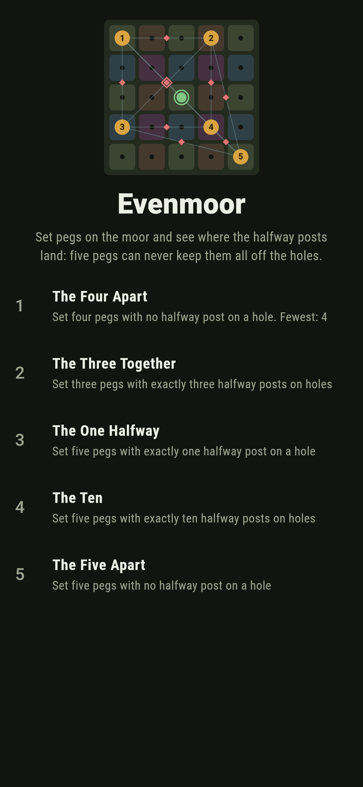
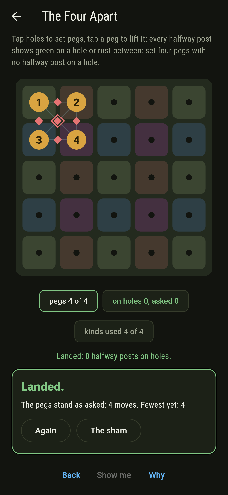
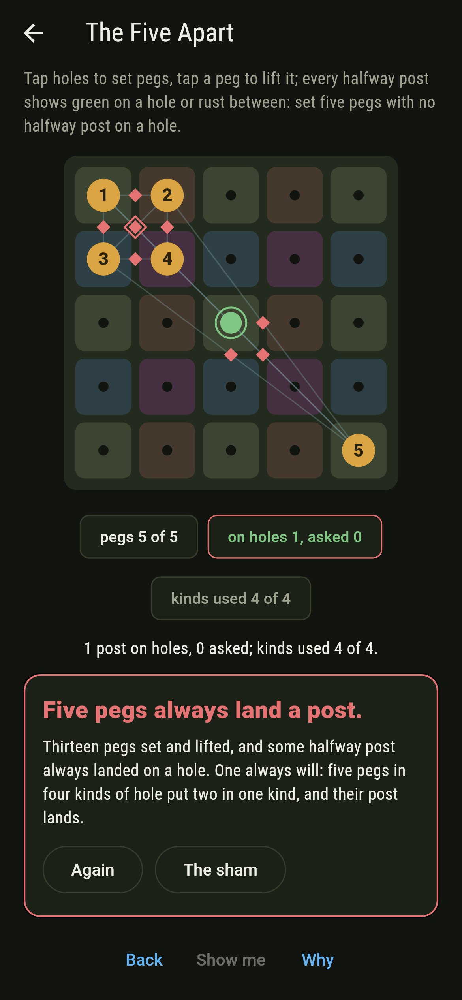
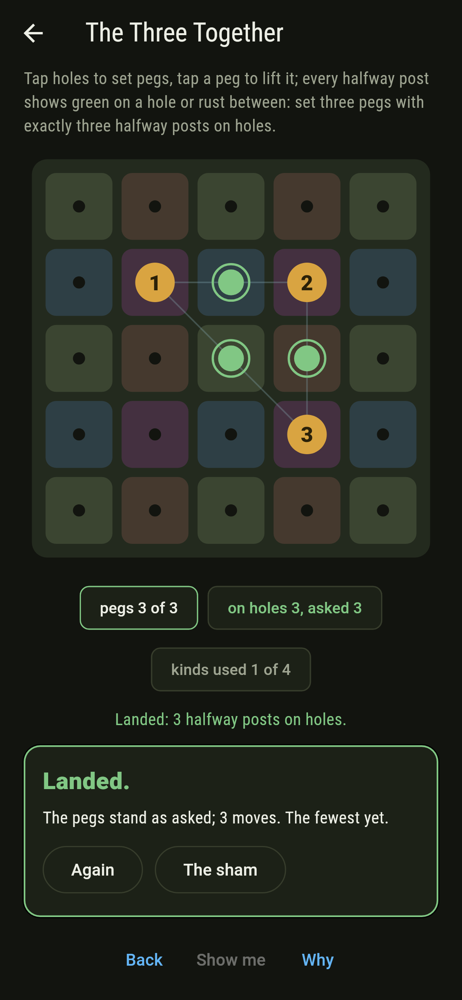
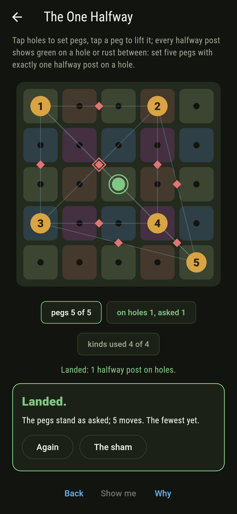
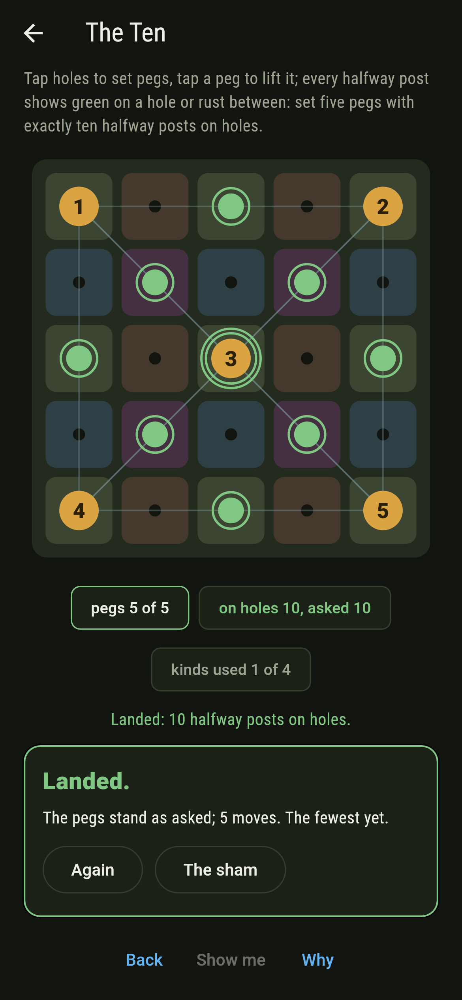
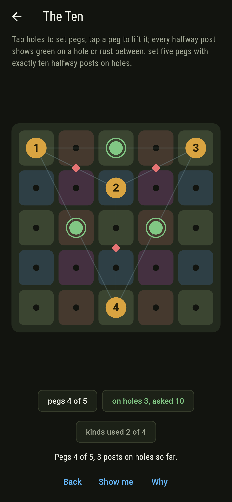
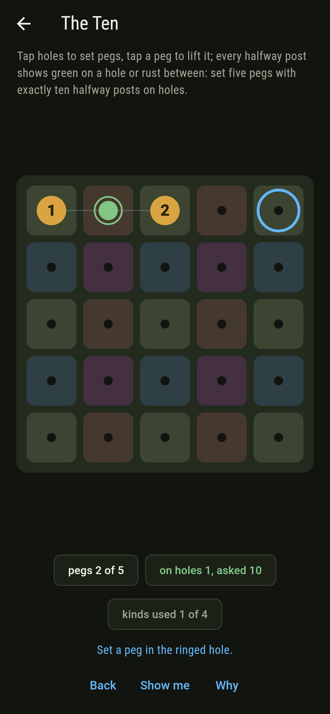
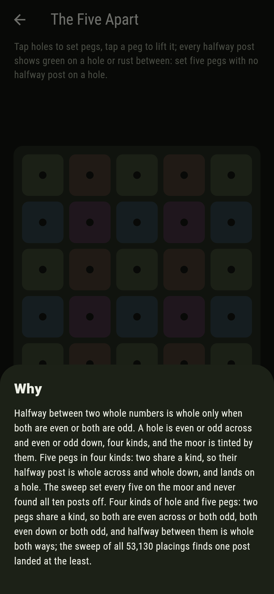

# Evenmoor


Twenty-five holes in a five-by-five moor, and pegs to set in them.
Between every two pegs a halfway post goes up, and it either lands
on a hole or falls between holes. Halfway between two whole
numbers is whole only when both are even or both odd, so a hole is
one of four kinds, even or odd across and even or odd down, and
two pegs of a kind always land their post. Four pegs can take the
four kinds one apiece and keep every post off; five pegs cannot,
which is the pigeonhole in its plainest clothes. The sweep here
sets every three, four and five of the twenty-five, 2,300 and
12,650 and 53,130 placings, and reads every post two ways.

## The peggings

1. **The Four Apart** - set four pegs with no halfway post on a hole
2. **The Three Together** - set three pegs with exactly three halfway posts on holes
3. **The One Halfway** - set five pegs with exactly one halfway post on a hole
4. **The Ten** - set five pegs with exactly ten halfway posts on holes
5. **The Five Apart** - set five pegs with no halfway post on a hole

Four pegs keep every post off 1,296 ways of 12,650, one peg to
each kind: nine even-even holes, six and six of the mixed kinds,
four odd-odd, and 9 times 6 times 6 times 4 is 1,296. Three pegs
land all three posts 128 ways, all three of one kind. Five pegs
land exactly one post 13,608 ways and all ten 138 ways, five of
one kind, which the odd-odd four cannot supply. The Five Apart is
labeled hopeless on its tile, and the why counts the kinds.

## Two voices

The game never asserts what it has not computed, and it computes
everything at least twice:

* **The census** reads every pair of pegs on every placing: both
  sums even, and the post is on a hole. It counts the posts landed
  and sorts every placing by that count.
* **The kinds** read no pair at all: each peg is sorted into its
  kind of hole, and pegs of a kind pair off two by two, so the
  posts landed are the sum over the kinds of n(n - 1)/2. The two
  readings agree on every one of the 68,080 placings, and the
  spread of posts over the placings is pinned to the number.

`tool/check_halfways.dart` runs the lot and refuses the bake on
any disagreement.

## The checker's ledger

What `dart run tool/check_halfways.dart` printed for the build this
README shipped with, word for word:

```
every placing of three, four and five pegs on the moor swept, 2,300 and 12,650 and 53,130 of them, and every halfway post read two ways, by whether it lands on a hole and by the kinds of its two pegs, the two agreeing on every placing: four pegs keep every post off 1,296 ways, one to a kind, three pegs land all three 128 ways, five pegs land one post 13,608 ways and all ten 138 ways, and never none, since four kinds cannot hold five pegs one apiece

 1 The Four Apart      set four pegs with no halfway post on a hole: 1,296 placings of the 12,650 land it
 2 The Three Together  set three pegs with exactly three halfway posts on holes: 128 placings of the 2,300 land it
 3 The One Halfway     set five pegs with exactly one halfway post on a hole: 13,608 placings of the 53,130 land it
 4 The Ten             set five pegs with exactly ten halfway posts on holes: 138 placings of the 53,130 land it
 5 The Five Apart      set five pegs with no halfway post on a hole: none of the 53,130, and the four kinds said so first
```

## Screenshots

| The sham | The four apart landed | The five apart admitted |
| --- | --- | --- |
|  |  |  |

| The three together | The one halfway | The ten | Mid-pegging | Show me | The why |
| --- | --- | --- | --- | --- | --- |
|  |  |  |  |  |  |

Screenshots are drawn by `test/showcase_test.dart` at real phone
sizes with the app's own painter, then copied into `docs/` as they
came out; every peg in them was set by a tap, so nothing pictured
is a moor the game could not reach. The logo and every launcher
icon come out of `test/mark_test.dart` the same way: the mark is
five pegs, one to each kind and a fifth forced to share, its post
landed green in the middle of the moor.

## Building

```
flutter test          # 49 tests, the sweep among them
dart run tool/check_halfways.dart
flutter build apk     # or: flutter build ios
```
