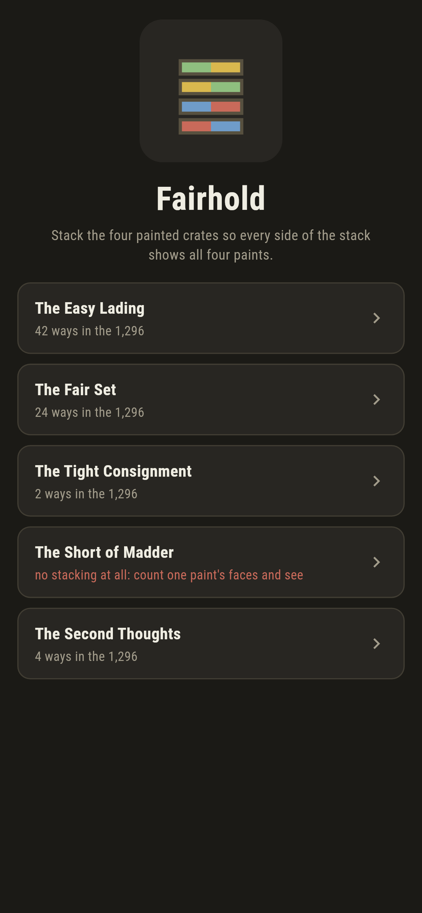
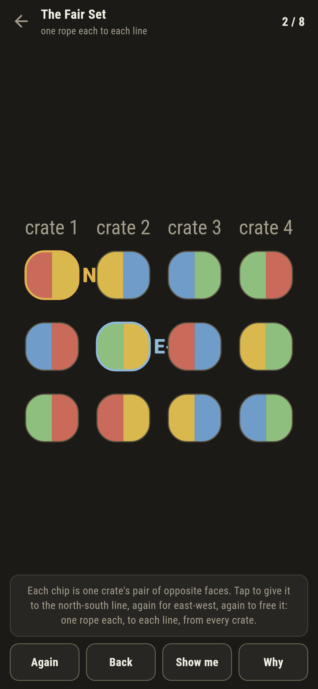
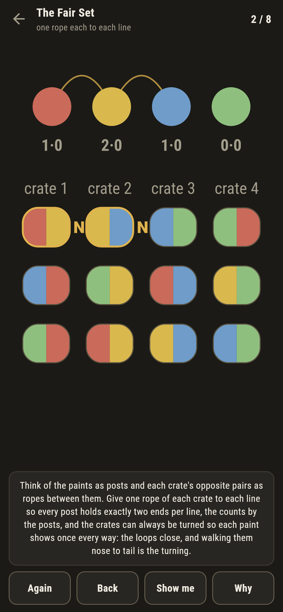
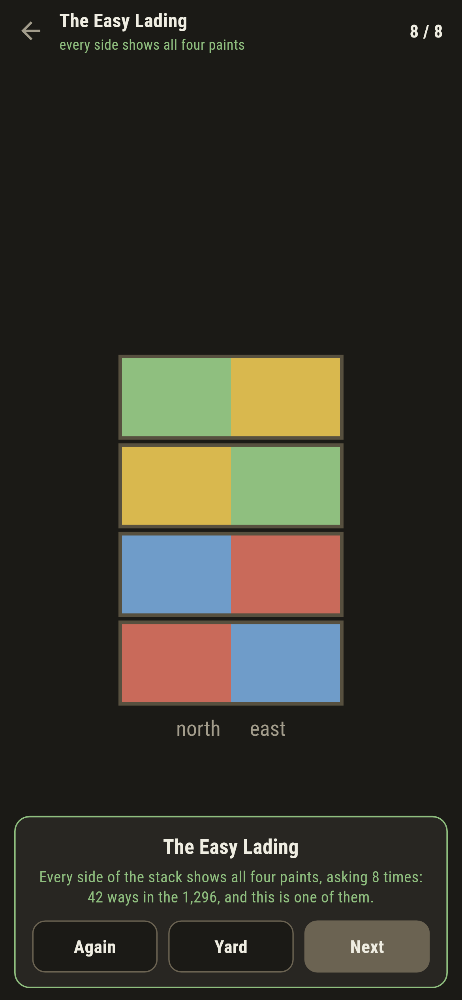
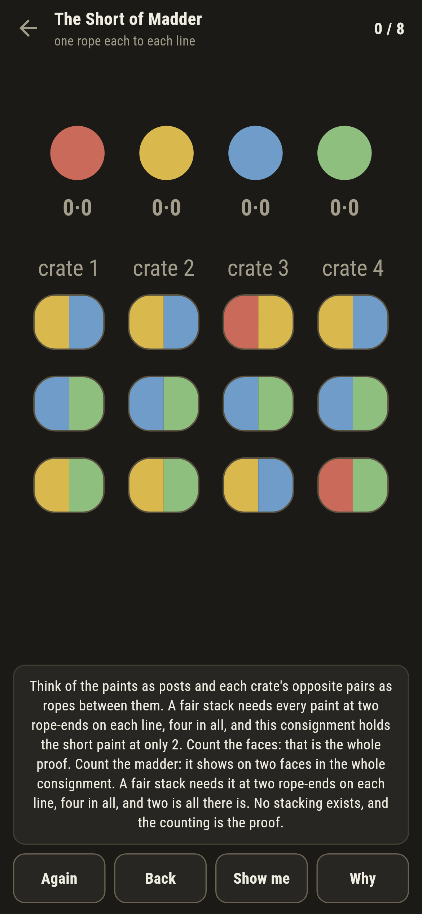

# Fairhold

A crate-stacking puzzle for phones, in Flutter, for Android and iOS.

Four crates, each painted on six faces in four paints, to be stacked one
on another so that each long side of the stack shows all four paints.
This is the old Instant Insanity, and the way through it is not to turn
crates in your head but to let a little graph do the thinking.

| | | | |
|---|---|---|---|
|  |  |  |  |

## Posts and ropes

Think of the paints as four posts and each crate's three opposite-face
pairs as three ropes between them. A crate in the stack offers one pair
to the north-south line and a different pair to east-west, the top and
bottom sitting idle. Give one rope of each crate to each line so that
every post holds exactly two rope-ends per line, and the crates can
always be turned so each paint shows once every way: the ropes close
into loops, and walking each loop nose to tail is the turning.

None of that is folklore here. The suite sweeps every fair line of four
ropes there is and checks the turning never fails; the counts by the
posts are live in the game; and **Why** strings the chosen ropes
between the posts in front of you.

```
$ make holds
 1 The Easy Lading        42 ways  ends [6, 6, 6, 6]  written down 42
 2 The Fair Set           24 ways  ends [6, 6, 6, 6]  written down 24
 3 The Tight Consignment  2 ways  ends [6, 5, 7, 6]  written down 2
 4 The Short of Madder    no stacking at all  ends [2, 7, 8, 7]  written down 0
 5 The Second Thoughts    4 ways  ends [7, 6, 7, 4]  written down 4
```

## The counting floor

The Short of Madder cannot be stacked, and the proof is on the crates:
madder shows on two faces in the whole consignment, and a fair stack
needs it at four rope-ends. Count the faces, and you are done. It ships
labelled in the house tradition of maps nobody can win.

The Tight Consignment has two stackings in the 1,296, and they are each
other with the lines swapped: really one, found or not found, and the
suite checks the swap.



## The stack stands

When both lines come fair, the game turns the crates for you, walking
the loops, and stands the stack on screen with its north and east faces
showing: all four paints each way, as promised.


## Building

```
make deps    # fetch packages
make check   # analyze + every test
make holds   # count every consignment's stackings
make shots   # render the screenshots and redraw the icons
make apk     # Android release build
make ios     # iOS release build (unsigned)
```

The logo and every app icon are drawn by the game's own painter in
`test/mark_test.dart`. There is no image in this repository that was not
produced by code in it.

## How it is put together

```
lib/hold/rules.dart          fair lines, the search, and the turning
lib/hold/consignment.dart    a consignment: four crates of three pairs
lib/hold/consignments.dart   the five consignments that ship
lib/hold/play.dart           a stacking being chosen: chips, lines, the
                             live answer
lib/ui/                      the painter, the screens, the mark
tool/check_consignments.dart the ledger above
```

The tests sweep every fair line for the turning, count every shipped
consignment, pin the counting floor and the swapped pair, stack every
stackable consignment by following the game's own pointer, and hold the
pictures against the real widget tree. If any of that drifts,
`make check` goes red before anything leaves the machine.
