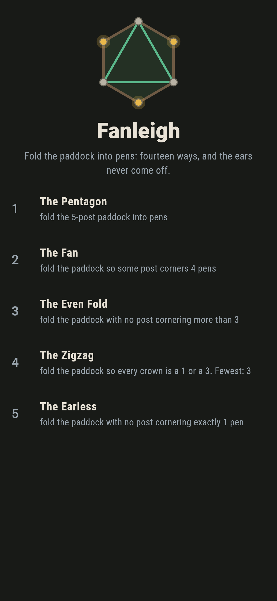
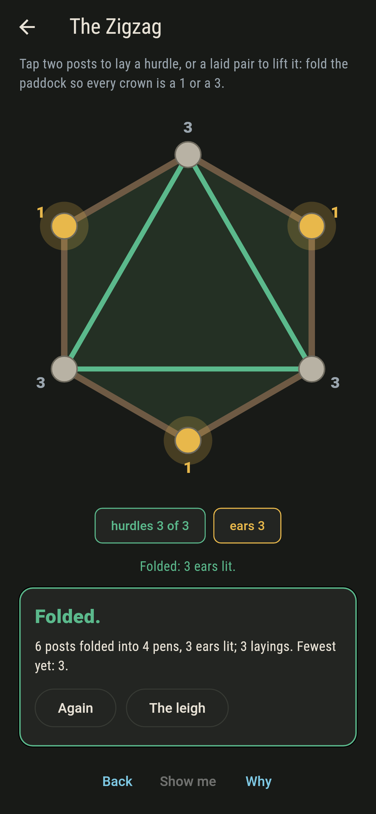
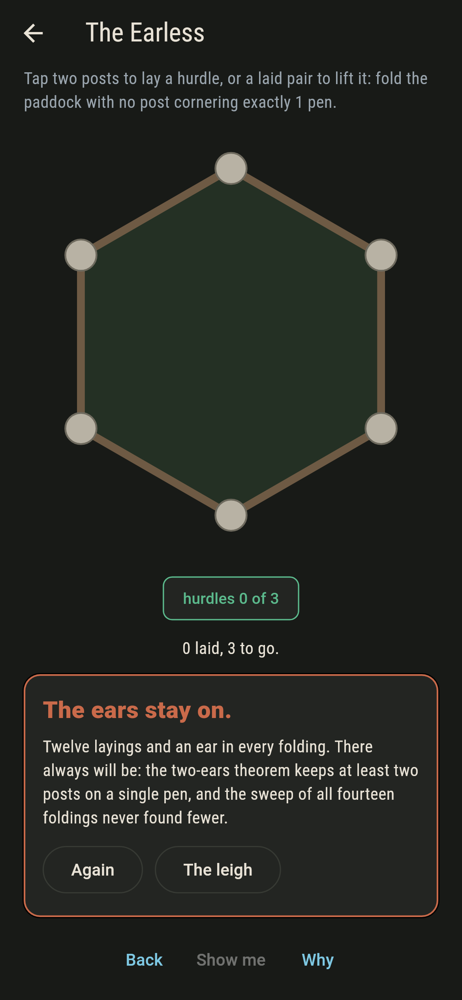
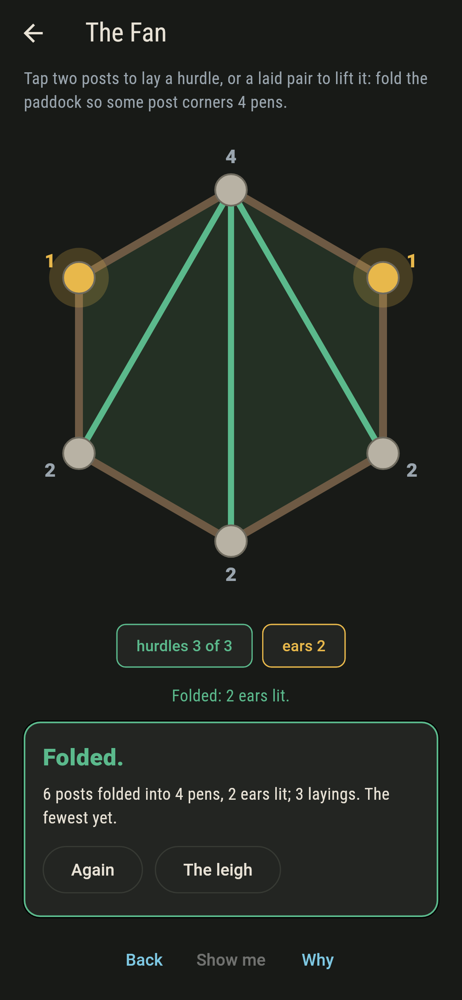
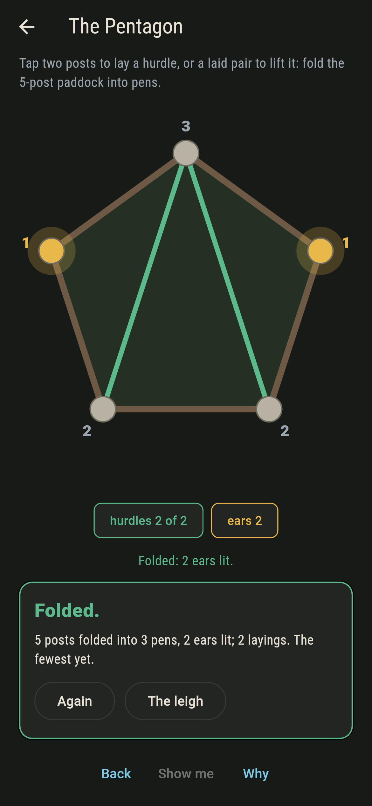
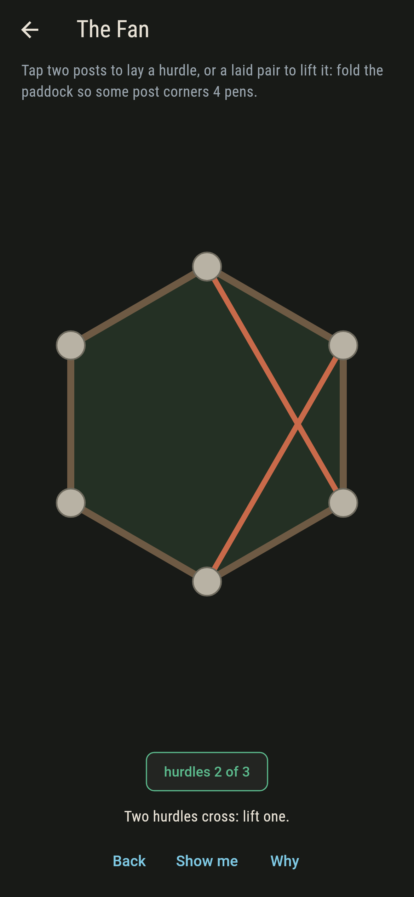
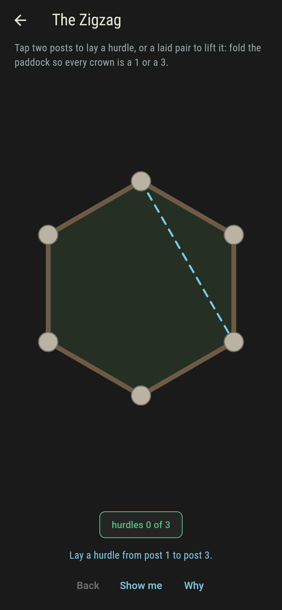
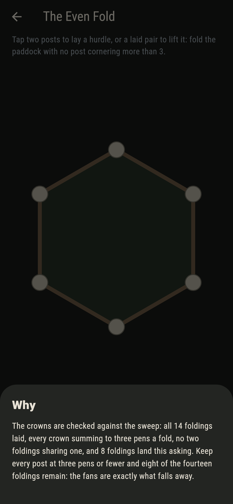

# Fanleigh


A paddock of posts, rim rails between neighbours, and hurdles
laid post to post across the grass. A full fencing folds the
paddock into three-post pens; each post's crown is the number of
pens it corners, and a post cornering exactly one is an ear, lit
gold. The pentagon folds five ways and the hexagon fourteen,
Catalan's own counts, and every folding keeps at least two ears:
that is the two-ears theorem, and one fold here asks it to fail.

## The folds

1. **The Pentagon** - fold the 5-post paddock into pens
2. **The Fan** - fold the paddock so some post corners 4 pens
3. **The Even Fold** - fold the paddock with no post cornering more than 3
4. **The Zigzag** - fold the paddock so every crown is a 1 or a 3
5. **The Earless** - fold the paddock with no post cornering exactly 1 pen

The fourteen foldings of the hexagon carry fourteen different
crowns, no two alike, all summing to twelve. The fans and the
even folds split them six and eight. The Zigzag's two foldings
are also the only ones with three ears. The Earless asks for
none, and the sweep found what the theorem promised: nothing.

## Two voices

The game never asserts what it has not computed, and it computes
everything at least twice:

* **The pen census** reads the pens and crowns off any full
  fencing, triple by triple.
* **The sweep** lays every fencing of both paddocks, checks
  every crown sums to three pens a fold, finds no two foldings
  sharing a crown, and never finds fewer than two ears.

`tool/check_folds.dart` runs the lot, Catalan's counts included,
and refuses the bake on any disagreement.

## The checker's ledger

What `dart run tool/check_folds.dart` printed for the build this
README shipped with, word for word:

```
every fencing of both paddocks laid: five foldings of the pentagon and fourteen of the hexagon, Catalan's own, every crown summing to three pens a fold, no two foldings sharing a crown, and never fewer than two ears anywhere

 1 The Pentagon     fold the 5-post paddock into pens: 5 foldings of the sweep land it
 2 The Fan          fold the paddock so some post corners 4 pens: 6 foldings of the sweep land it
 3 The Even Fold    fold the paddock with no post cornering more than 3: 8 foldings of the sweep land it
 4 The Zigzag       fold the paddock so every crown is a 1 or a 3: 2 foldings of the sweep land it
 5 The Earless      fold the paddock with no post cornering exactly 1 pen: none of the fourteen, by the two-ears theorem
```

## Screenshots

| The leigh | The zigzag folded | The earless admitted |
| --- | --- | --- |
|  |  |  |

| The fan | The pentagon | A crossing called out | Show me | The why |
| --- | --- | --- | --- | --- |
|  |  |  |  |  |

Screenshots are drawn by `test/showcase_test.dart` at real phone
sizes with the app's own painter, then copied into `docs/` as
they came out; every hurdle in them was laid by taps, so nothing
pictured is a paddock the game could not reach. The logo and
every launcher icon come out of `test/mark_test.dart` the same
way: the mark is a zigzag folding.

## Building

```
flutter test          # 50 tests, the sweep among them
dart run tool/check_folds.dart
flutter build apk     # or: flutter build ios
```
