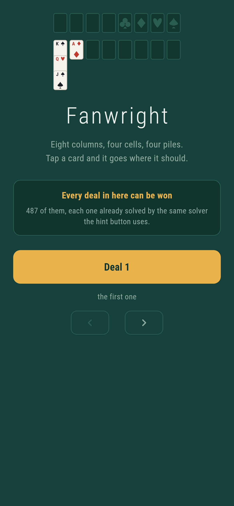
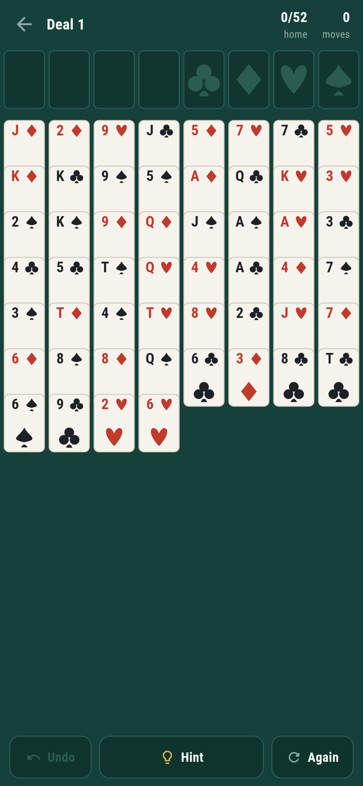
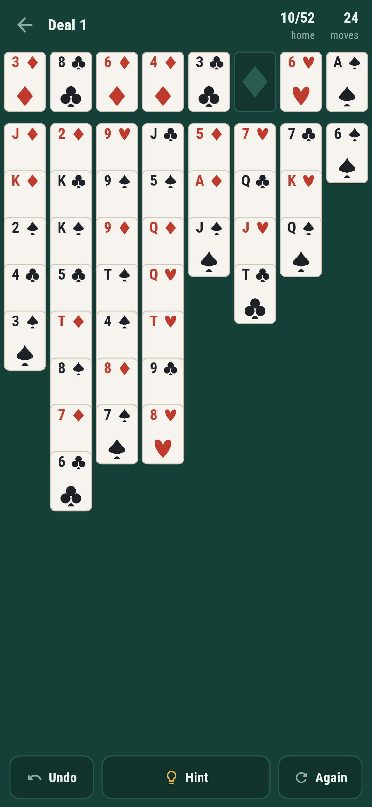
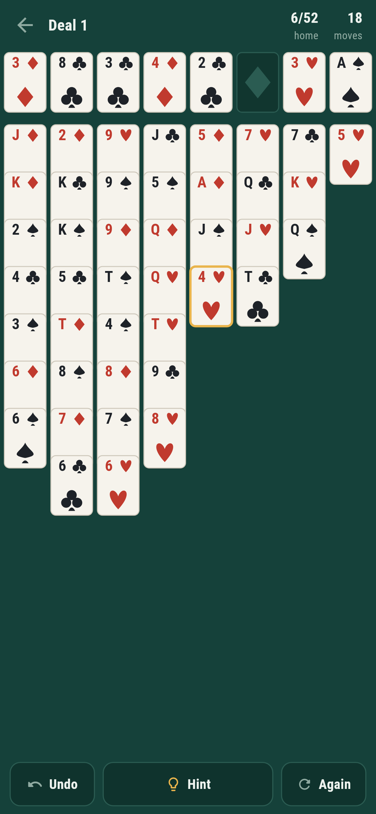

# Fanwright

A patience game for phones, in Flutter, for Android and iOS.

Eight columns, four cells to park a card in, four piles to build up by suit
from the ace. Every card is face up from the start, so there is nothing hidden
and nothing to be lucky about, only a position to work out.

Tap a card and it goes where it should go. Tap part way up a column and the
run from there goes together.

| | | | |
|---|---|---|---|
|  |  |  |  |

## Every deal in here can be won

There are 487 deals in the book, not most of them, and each was played to a
finish by the solver in `lib/game/solver.dart` before it went in the list. See
`tool/build_book.dart`, which is what wrote `lib/game/deals.dart`. It searches
the first five hundred deals, keeps the ones it wins inside a hundred thousand
positions, and drops the rest: some of those are winnable by a longer search
and one or two are not winnable at all, and from where the player sits there is
no difference between a deal nobody can win and a deal the hint button cannot
help with.

**And the hint button is that solver.** It does not suggest a move because the
move looks reasonable. It hands back the next move on a line that finishes the
game, or it tells you there is no way on from where you are, which is a thing
almost no patience game will tell you and the most useful thing it could say.

## Things worth knowing

**The deals are the old numbered ones.** The shuffle is the linear congruential
one this game has been numbered by since the early nineties, written out rather
than replaced with something modern for a single reason: the deals it produces
are the deals everybody else's numbers refer to, which gives something outside
this repository to check the whole thing against.

That check is deal **11982**. Of the first thirty two thousand deals it is the
only one that cannot be won, which everybody who has ever written one of these
knows. The solver exhausts it in about sixty thousand positions and reports no
win. Not "gave up", but searched the space out. One bit, and it checks the
shuffle, the numbering, the rules and the search all at once, because getting
any of them wrong gives a different deal, and a different deal can be won.

Getting there took one correction. The shuffle picks cards and puts them on the
*end* of the deck, so the deal reads from the end backwards; reading it
forwards gives a perfectly good deal that is nobody else's deal of that number.

**Best first, not depth first.** The first solver was depth first with the
moves in a sensible order, and it won five deals in forty while spending two
hundred thousand positions on each of the rest. A depth first search picks a
direction and follows it to the end of the world, and here the end of the world
is a long way away. Best first keeps every position it has reached in a queue
ordered by how finished it looks and always carries on from the most finished
one, so a bad guess costs one position rather than a hundred thousand. Measured
over two hundred deals: median 436 positions, 39 milliseconds.

Two things do most of the rest. Positions are recognised by a fingerprint that
ignores which cell a card sits in and which order two identical columns are
written in, because those are the same position wearing different hats. And
every position is tidied first: anything that can go home without ever being
wanted back goes up before anything else is considered.

**Cards go home on their own, but only when it is safe.** A card goes up when
nothing of the other colour still needs to sit on it. Sending everything up the
moment it can is how a position that was winnable stops being winnable: a five
that has gone home is a five no black four can rest on.

**A hint keeps its line.** Asking twice does not search twice, and the second
hint agrees with the first. A fresh search can come back with a different line
every time, so following one hint and then the next can walk in a circle. And
tapping the card a hint pointed at plays *that* move, not the game's own guess
about where the card should go.

**The pips are drawn, not written.** The first version wrote them as text and
every card in every screenshot came out with a hollow rectangle on it, because
whether a font has ♠♥♦♣ is not something to find out on somebody's phone. Four
shapes made of lines and arcs are always there and sharp at any size. Nothing
in this app is an image file. The cards, the logo and the launcher icon are
all drawn.

## Running it

```
make deps      # flutter pub get
make test      # everything
make analyze
make shots     # render the screens into build/showcase, redraw the logo
make book      # rebuild the list of verified deals (four minutes)
make apk       # release APK
make ios       # release iOS build, unsigned
```

## Tests

`flutter test` runs the rules (what sits on what, how many cards can move at
once and the empty-column special case everybody forgets, what may be sent home
on its own) and then the solver against those rules: every line it finds is
replayed move by move through the rules and has to end in a finished game.
Deal 11982 has a test of its own. A spread of the book is re-verified on every
run; the whole book is `make book`.

Then the game through the screen, on three phone sizes: tapping an ace home,
tapping a run, tapping a card with nowhere to go, undo, the hint rounding a
card and where it goes, the hint saying there is no way on, and one test that
plays a whole deal to the end by pressing Hint and tapping whatever it points
at.

Screenshots come from `test/showcase_test.dart`, the real widget tree at real
phone dimensions. The half played positions are a real deal taken part way down
the solver's own line, so they are positions a player could be in rather than
hands somebody arranged.

Pictures of the game on an actual phone need an actual phone. No emulator is
published for this machine's architecture and there is no CI here to borrow
one from, so `integration_test/screenshot_test.dart` is driven by hand on a
machine that has one. `.github/scripts/` holds the two scripts that do it.
