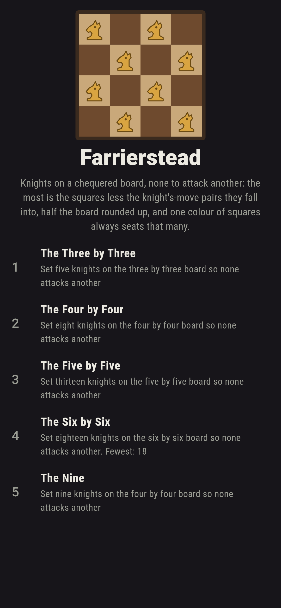
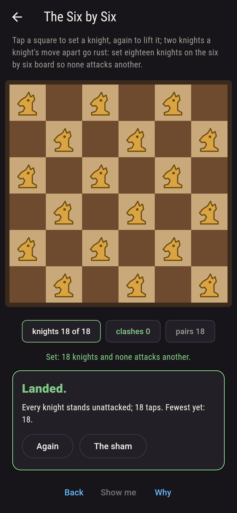
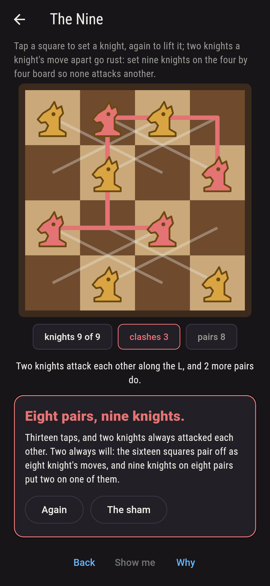
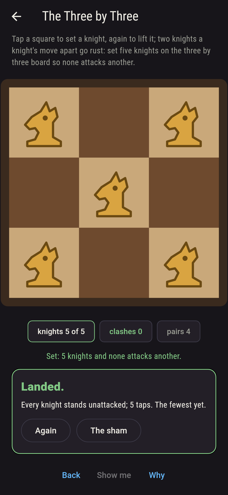
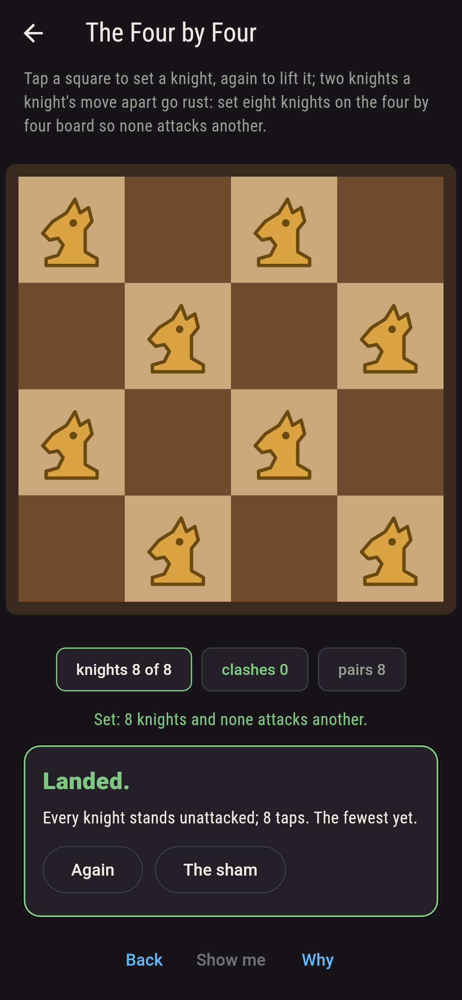
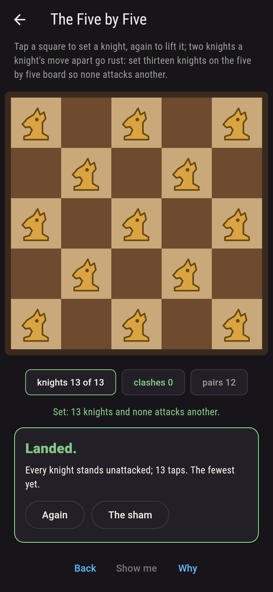
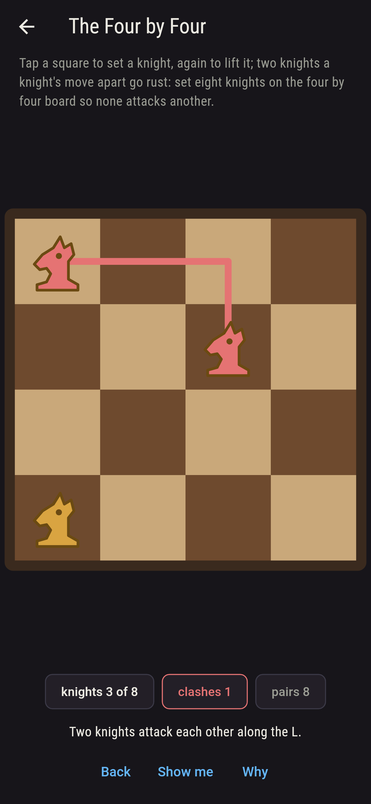
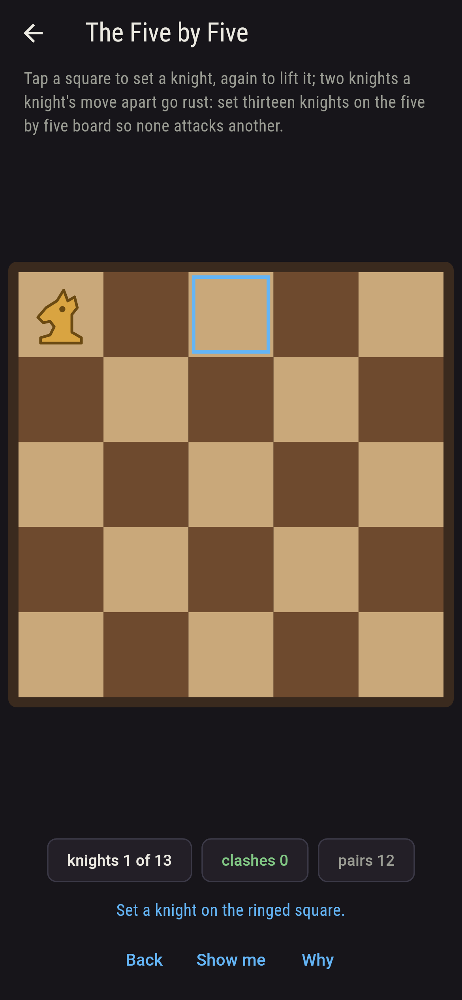
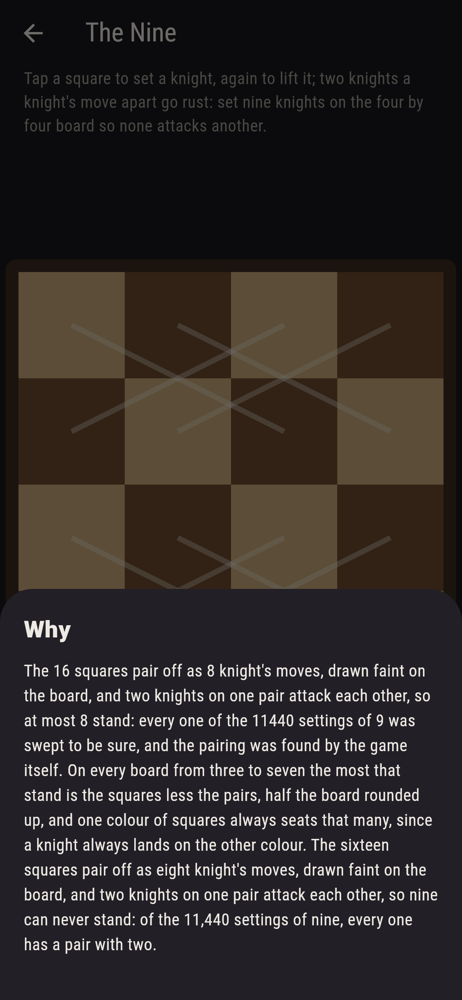

# Farrierstead


Knights on a chequered board, as many as will stand with none a
knight's move from another. Tap a square to set one, again to lift
it, and two that attack are joined by their rust L. The most is
half the board rounded up, and the reason is a pairing: the squares
pair off as knight's moves, sixteen squares into eight pairs on the
four by four, and two knights on one pair attack, so at most one
stands on each. The game finds that pairing itself, on every board
from three to seven, and finds one colour of squares seating exactly
that many, since a knight always lands on the other colour; every
setting is swept on the small boards and walked square by square on
all, and the sweep, the pairing and the colour agree.

## The boards

1. **The Three by Three** - set five knights on the three by three board so none attacks another
2. **The Four by Four** - set eight knights on the four by four board so none attacks another
3. **The Five by Five** - set thirteen knights on the five by five board so none attacks another
4. **The Six by Six** - set eighteen knights on the six by six board so none attacks another
5. **The Nine** - set nine knights on the four by four board so none attacks another

The three by three seats five two ways of 126, the middle square
always taken since nothing reaches it and the ring of eight round
it seating four either way round; the four by four eight six ways
of 12,870; the five by five thirteen one way alone of 5,200,300,
the squares of the corners' colour; the six by six eighteen two
ways of 9,075,135,300, the light squares or the dark. The Nine is
labeled hopeless on its tile, the pairing is drawn faint on its
board, and the why counts it.

## Two voices

The game never asserts what it has not computed, and it computes
everything at least twice:

* **The sweep** holds up every setting of the knights on the three
  by three, the four by four and the five by five, 5,224,736 of
  them one by one, and on every board walks the squares in turn,
  setting a knight or not and dropping any setting where two attack
  or too few squares are left; every count on the sham is that
  walk's, and where both ran they agree.
* **The pairing** needs no sweep: the squares are paired off as
  knight's moves, the pairing grown a path at a time, and each pair
  holds one knight at most, so the most that stand is the squares
  less the pairs; on every board from three to seven that is half
  the board rounded up, exactly what the walk finds, one more never
  standing, and the squares of one colour seat that many with no
  clash, a knight always changing colour.

`tool/check_settings.dart` runs the lot and refuses the bake on any
disagreement.

## The checker's ledger

What `dart run tool/check_settings.dart` printed for the build this
README shipped with, word for word:

```
every setting of the knights swept whole on the three by three, the four by four and the five by five, 5,224,736 settings held up one by one, and every board walked square by square with the attacking settings dropped, the sweep and the walk agreeing wherever both ran; on every board from three to seven the squares pair off as knight's moves, 66 pairs found on the five boards, and the most knights that stand is the squares less the pairs, half the board rounded up, one more never standing, while the squares of one colour seat exactly that many, since a knight always changes colour; the two by two seats all four; the three by three seats five 2 ways of 126, the four by four eight 6 ways of 12,870, the five by five thirteen 1 way of 5,200,300, the six by six eighteen 2 ways of 9,075,135,300, and nine on the four by four never

 1 The Three by Three set five knights on the three by three board so none attacks another: 2 of the 126 settings land it
 2 The Four by Four   set eight knights on the four by four board so none attacks another: 6 of the 12,870 settings land it
 3 The Five by Five   set thirteen knights on the five by five board so none attacks another: 1 of the 5,200,300 settings lands it
 4 The Six by Six     set eighteen knights on the six by six board so none attacks another: 2 of the 9,075,135,300 settings land it
 5 The Nine           set nine knights on the four by four board so none attacks another: none of the 11,440, and the pairing said so first
```

## Screenshots

| The sham | The six by six seated | The nine admitted |
| --- | --- | --- |
|  |  |  |

| The three by three | The four by four | The five by five | Mid-setting | Show me | The why |
| --- | --- | --- | --- | --- | --- |
|  |  |  |  |  |  |

Screenshots are drawn by `test/showcase_test.dart` at real phone
sizes with the app's own painter, then copied into `docs/` as they
came out; every knight in them was set by taps, so nothing pictured
is a board the game could not reach. The logo and every launcher
icon come out of `test/mark_test.dart` the same way: the mark is the
four by four seated, eight knights on the corners' colour.

## Building

```
flutter test          # 43 tests, the sweep among them
dart run tool/check_settings.dart
flutter build apk     # or: flutter build ios
```
