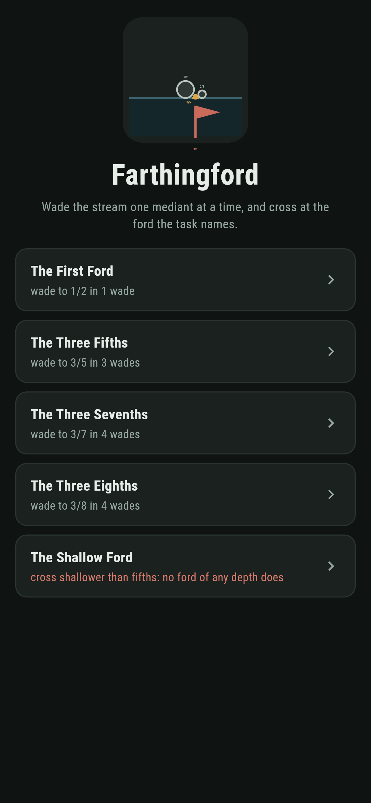
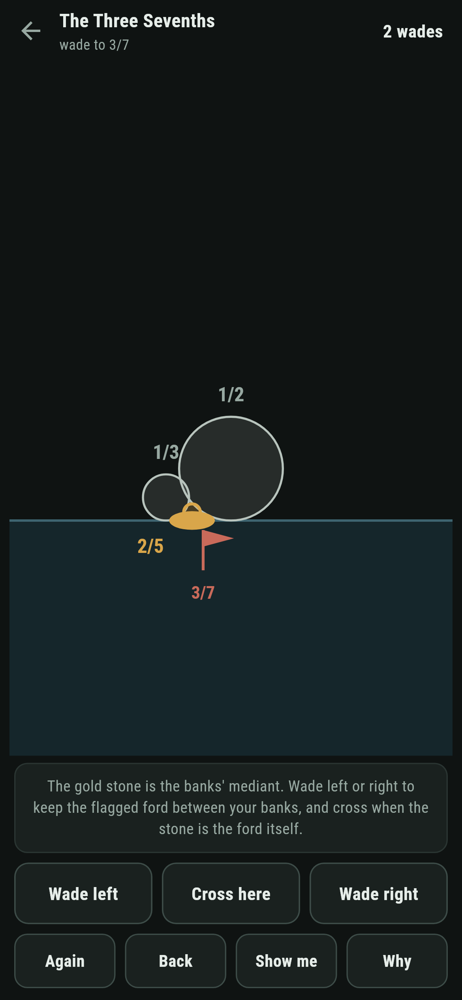
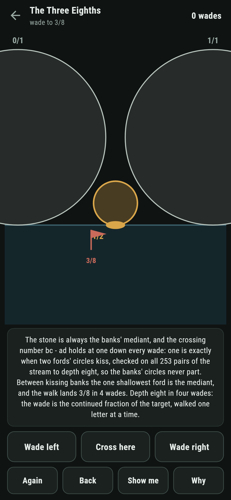
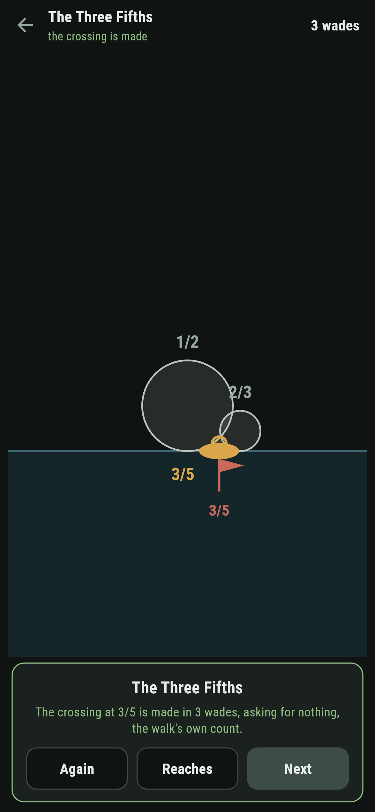
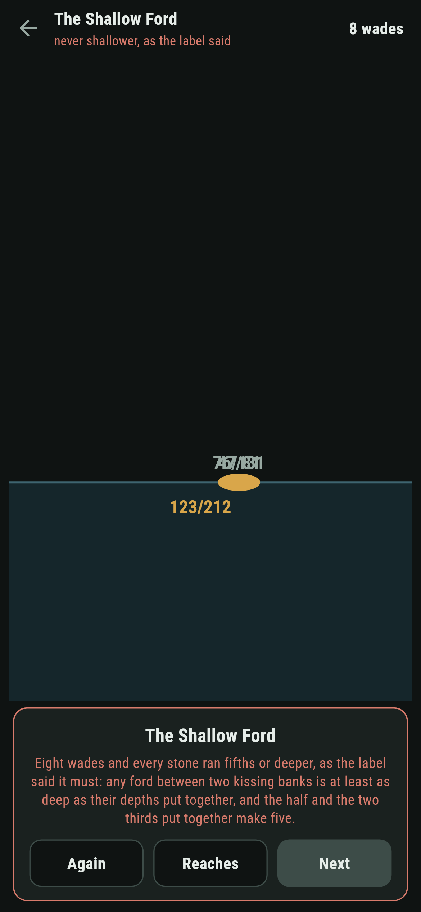
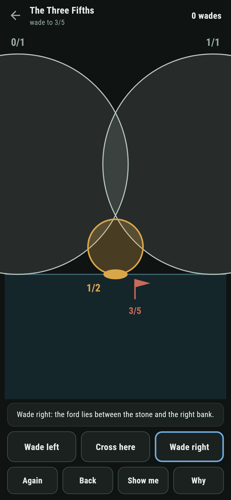

# Farthingford

A wading puzzle for phones, in Flutter, for Android and iOS.

A stream runs across the screen, and every ford over it is a
fraction in lowest terms: how far across it sits, and its depth is
its denominator. The gold stepping stone between your two banks is
always their mediant, numerators and denominators added. Wade left
or right to keep the flagged ford between the banks, and cross when
the stone is the ford itself. This is the Stern-Brocot walk taken
one stone at a time, with Ford circles resting on the water, and the
banks' circles kiss the whole way down.

| | | | |
|---|---|---|---|
|  |  |  |  |

## Two ways of knowing

The suite knows the stream two ways that share nothing. The crossing
number bc - ad of the two banks holds at exactly one down every
wade, an invariant three lines long, and one is also exactly when
two fords' circles kiss, worked longhand from distances and radii
and checked on all 253 pairs of the stream to depth eight. The sweep
reads every ford of every depth from the other side, and between
each of the 43 kissing pairs it finds exactly one shallowest ford:
the mediant, at exactly the banks' depths put together. Every
written count below is the walk's and the sweep's own.

```
$ make reaches
two fords' circles kiss exactly when their crossing number is one, checked on all 253 pairs to depth eight; and between each of the 43 kissing pairs the one shallowest ford is their mediant, at exactly the banks' depths put together

 1 The First Ford      wade to 1/2: 1 wade from the banks
 2 The Three Fifths    wade to 3/5: 3 wades from the banks
 3 The Three Sevenths  wade to 3/7: 4 wades from the banks
 4 The Three Eighths   wade to 3/8: 4 wades from the banks
 5 The Shallow Ford    between 1/2 and 2/3, cross shallower than fifths: no ford of any depth does
```

## The shallow ford

One reach ships labelled hopeless in the house tradition of maps
nobody can win: banks fixed at the half and the two thirds, and a
crossing asked shallower than fifths. Take any ford strictly between
two kissing banks and multiply the gaps out: its depth comes to at
least the banks' depths put together, and one half plus two thirds
put together make fifths. The game says so on the way in, lets you
wade while every stone runs fifths or deeper, and after eight wades
writes the futility down rather than let anyone grind at it.



## The circles that never part

Nothing about the stream is folklore here. The banks' circles kiss
in front of you and keep kissing down every wade, because the
crossing number never leaves one; a wade that loses the flagged ford
is called out by name the moment it lands, and a crossing claimed on
the wrong stone is refused with the stone named. **Show me** lights
the button the true walk would press, and **Why** speaks the
kissing, the invariant, and the depth lemma over the reach in front
of you.



## Building

```
make deps      # fetch packages
make check     # analyze + every test
make reaches   # read every ford and prove the kissing
make shots     # render the screenshots and redraw the icons
make apk       # Android release build
make ios       # iOS release build (unsigned)
```

The logo and every app icon are drawn by the game's own painter in
`test/mark_test.dart`. There is no image in this repository that was not
produced by code in it.

## How it is put together

```
lib/ford/rules.dart      the crossing number, the mediant, the
                         kissing worked longhand, the sweeps, the
                         walk
lib/ford/reach.dart      a reach: its banks and its asking
lib/ford/reaches.dart    the five reaches that ship
lib/ford/play.dart       a wade in progress: banks, the stone,
                         take-back
lib/ui/                  the painter, the screens, the mark
tool/check_reaches.dart  the proofs and the ledger above
```

The tests work crossing numbers and mediants by hand, hold the
kissing against the crossing number on every pair of the stream,
sweep every kissing pair for its one shallowest ford, walk every
winnable reach to its landing in exactly the written wades through
the real buttons, watch a wrong wade lose the ford by name and a
wrong crossing get refused, watch the shallow ford only deepen and
the reach admit it, and hold the pictures against the real widget
tree. If any of that drifts, `make check` goes red before anything
leaves the machine.
