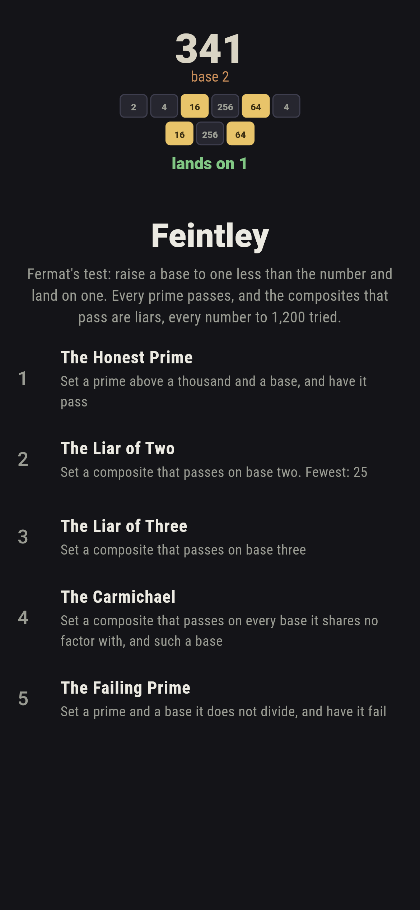
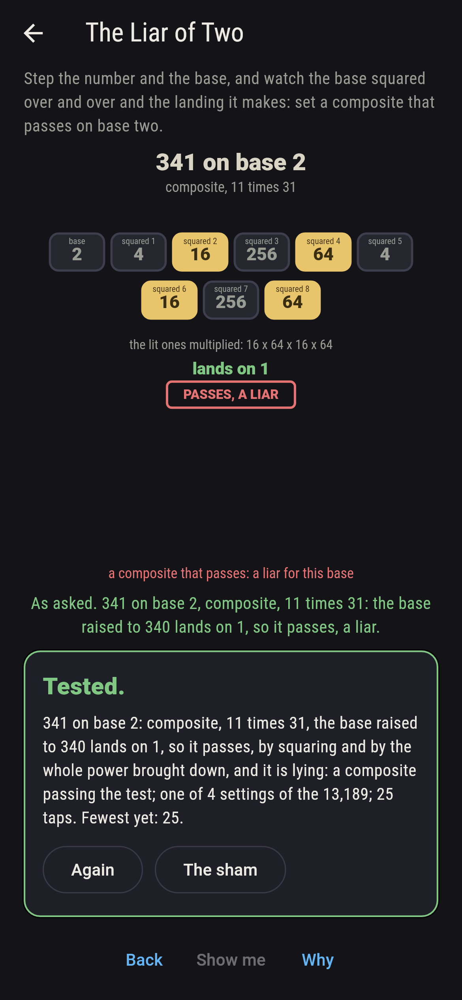
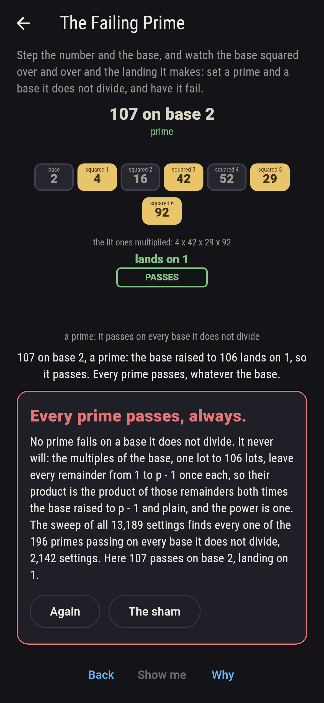
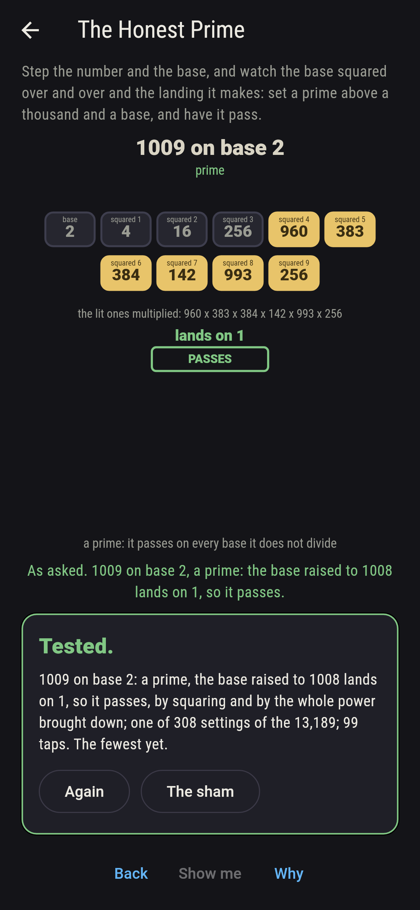
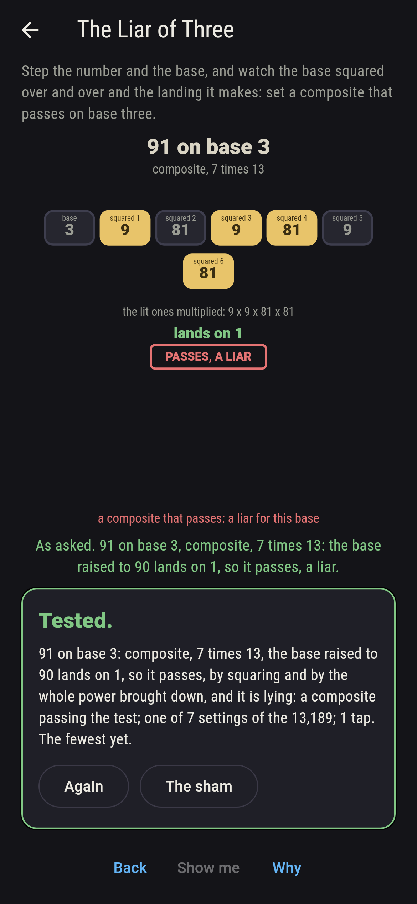
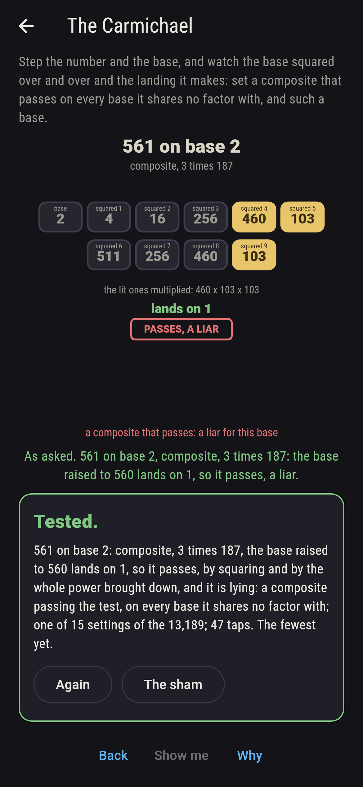
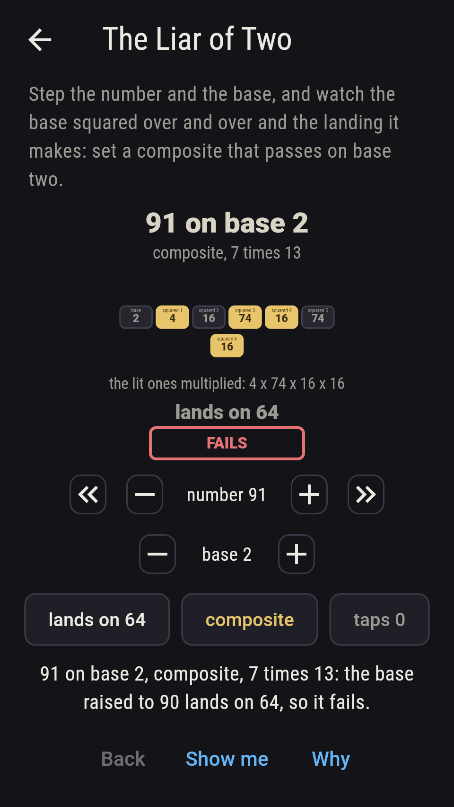
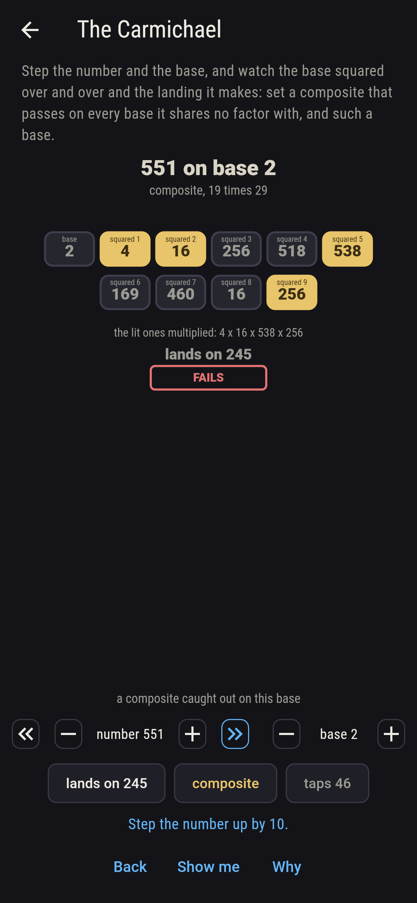
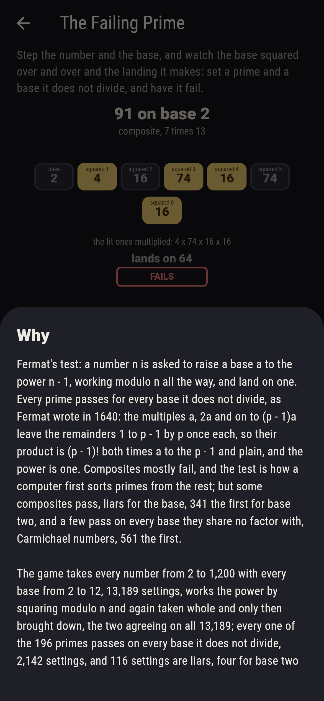

# Feintley


Fermat's test. A number n is asked to raise a base a to the power
n - 1, working modulo n all the way, and land on one. Every prime
passes for every base it does not divide, as Fermat wrote in 1640:
the multiples a, 2a and on to (p - 1)a leave the remainders 1 to
p - 1 by p once each, so their product is the product of those
remainders both times the base raised to p - 1 and plain, and the
power is one. Composites mostly fail, which is how a computer first
sorts primes from the rest. Some composites pass anyway. They are
liars for that base, 341 the first for base two, and a few pass on
every base they share no factor with. Carmichael named those in
1910. Step the number and the base on their dials and watch the base
squared over and over, the squares the power takes lit in gold. The
game takes every number from 2 to 1,200 with every base from 2 to
12, 13,189 settings, works the power by squaring and again taken
whole before being brought down, and the two agree on all of them:
every one of the 196 primes passes on every base it does not divide,
116 settings are liars, and 561 and 1,105 pass on every base they
share no factor with.

## The asks

1. **The Honest Prime** - set a prime above a thousand and a base, and have it pass
2. **The Liar of Two** - set a composite that passes on base two
3. **The Liar of Three** - set a composite that passes on base three
4. **The Carmichael** - set a composite that passes on every base it shares no factor with, and such a base
5. **The Failing Prime** - set a prime and a base it does not divide, and have it fail

There are 196 primes to 1,200 and 28 of them above a thousand; those
28 pass on all eleven bases, 308 settings. A prime fails only where
the base is a multiple of it, 2 on the six even bases, 3 on 3, 6, 9
and 12, 5 on 5 and 10, and 7 and 11 on themselves: 14 settings of
the 2,156 with a prime. Four composites pass on base two, 341, which
is 11 times 31, then 561, 645 and 1,105; the old guess that passing
on two makes a prime fails first at 341, as Sarrus found in 1819.
Seven pass on base three, 91 first, which is 7 times 13. The two
bases catch each other out, since 91 fails on two and 341 fails on
three, so a second base catches most liars but not all. Base two is
the honestest of the eleven with four liars and base eight the
loosest with 22. Two composites pass on every base they share no
factor with: 561, which is 3 times 11 times 17, and 1,105, which is
5 times 13 times 17. The Failing Prime is labeled hopeless on its
tile: Fermat said so first, and the sweep finds every prime passing;
the sham admits it after three primes have passed, or after twenty
taps.

## Two voices

The game never asserts what it has not computed, and it computes
everything at least twice:

* **The squaring** raises the base by repeated squares, taking the
  remainder by n at every step, and multiplies the squares the power
  n - 1 takes; those are the tiles lit on the board, and every
  landing on the sham is that ladder's. The primes are found by
  trial division.
* **The whole power** takes no remainder until the end: it raises
  the base to n - 1 as one big number, up to hundreds of digits, and
  brings it down modulo n only then. It agrees with the squaring on
  all 13,189 settings, and the sieve of Eratosthenes agrees with the
  trial division on every number to 1,200.

`tool/check_tests.dart` runs the lot and refuses the bake on any
disagreement.

## The checker's ledger

What `dart run tool/check_tests.dart` printed for the build this
README shipped with, word for word:

```
every number from 2 to 1,200 tried on every base from 2 to 12, 13,189 settings, and the power worked by squaring modulo the number and again taken whole before being brought down, the two agreeing on all 13,189, the primes found by trial division and again by the sieve, agreeing on all 1,199: every one of the 196 primes passes on every base it does not divide, 2,142 settings, and fails on the 14 settings where the base is a multiple of it; 116 settings are liars, composites that pass, four of them on base two, 341, 561, 645 and 1,105, and seven on base three, 91, 121, 286, 671, 703, 949 and 1,105, base two the honestest of the eleven and base eight the loosest with 22; 561, which is 3 times 11 times 17, and 1,105, which is 5 times 13 times 17, pass on every base they share no factor with, the two Carmichael numbers below 1,200; and 91 fails on base two while 341 fails on base three, so a second base catches most liars but not all

 1 The Honest Prime  set a prime above a thousand and a base, and have it pass: 308 of the 13,189 settings land it
 2 The Liar of Two   set a composite that passes on base two: 4 of the 13,189 settings land it
 3 The Liar of Three set a composite that passes on base three: 7 of the 13,189 settings land it
 4 The Carmichael    set a composite that passes on every base it shares no factor with, and such a base: 15 of the 13,189 settings land it
 5 The Failing Prime set a prime and a base it does not divide, and have it fail: none of the 13,189, and Fermat said so first
```

## Screenshots

| The sham | The liar of two | The failing prime admitted |
| --- | --- | --- |
|  |  |  |

| The honest prime | The liar of three | The Carmichael | Midway, on the small phone | Show me | The why |
| --- | --- | --- | --- | --- | --- |
|  |  |  |  |  |  |

Screenshots are drawn by `test/showcase_test.dart` at real phone
sizes with the app's own painter, then copied into `docs/` as they
came out; every setting in them was reached by the dials, so nothing
pictured is a setting the game could not reach. The logo and every
launcher icon come out of `test/mark_test.dart` the same way: the
mark is 341 on base two, the first liar of that base, its squares
lit and its landing one.

## Building

```
flutter test          # 44 tests, the sweep among them
dart run tool/check_tests.dart
flutter build apk     # or: flutter build ios
```
