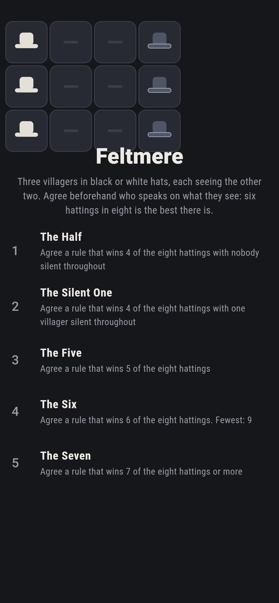
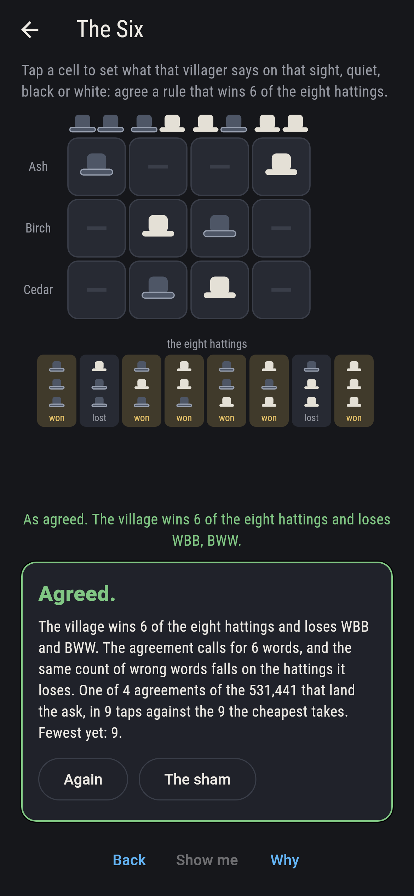
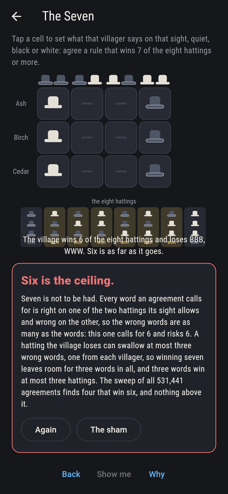
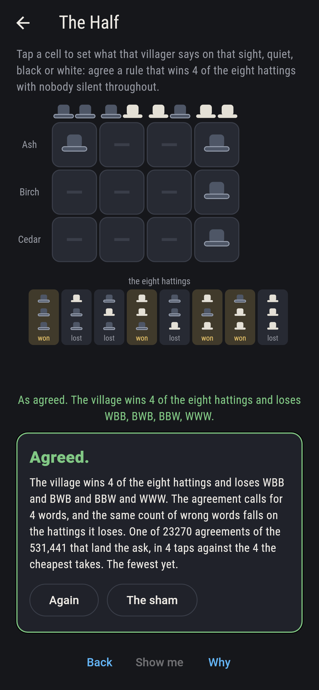
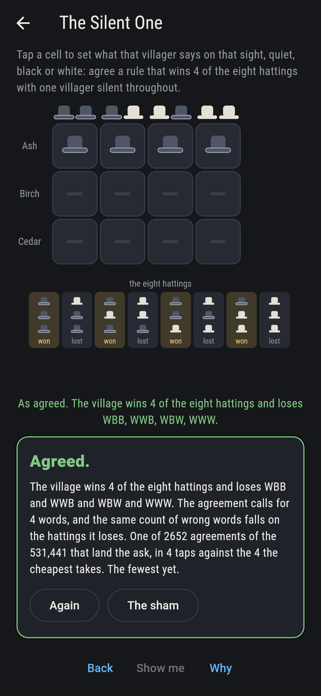
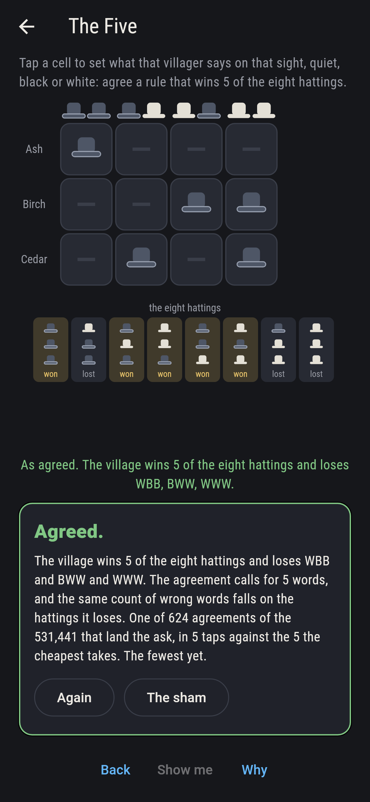
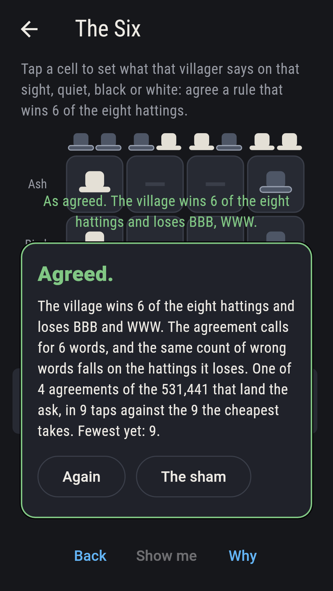
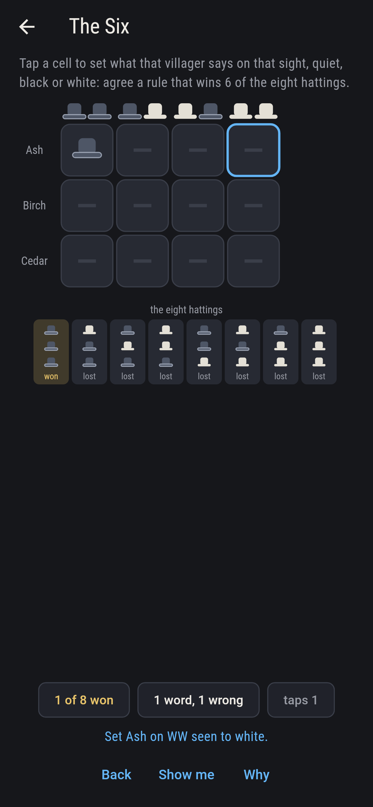
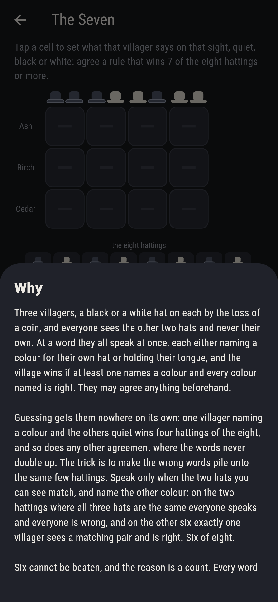

# Feltmere


Three villagers stand in a ring at the fair, each with a black or a
white hat put on by the toss of a coin. Everyone sees the other two
hats and never their own. At a word they all speak at once: each
either names a colour for their own hat or holds their tongue, and the
village wins if at least one names a colour and every colour named is
right. They may agree anything beforehand, and what they agree is a
rule for each villager saying what to do for each of the four things
that villager might see. Todd Ebert asked the question in 1998. Six
hattings in eight is the best any agreement can do, and the reason is
a count rather than a search: every word an agreement calls for is
right on one of the two hattings that sight allows and wrong on the
other, so a wrong word is paid for every word spoken. The game takes
every agreement the three can come to, all 531,441 of them, and tries
each against all eight hattings.

## The asks

1. **The Half** - agree a rule that wins 4 of the eight hattings with nobody silent throughout
2. **The Silent One** - agree a rule that wins 4 of the eight hattings with one villager silent throughout
3. **The Five** - agree a rule that wins 5 of the eight hattings
4. **The Six** - agree a rule that wins 6 of the eight hattings
5. **The Seven** - agree a rule that wins 7 of the eight hattings or more

Guessing on its own gets nowhere. One villager naming a colour while
the others keep quiet wins four hattings of the eight, and so does
every other agreement whose wrong words never double up: 23,270
agreements win four with everybody speaking somewhere, and 2,652 more
win four with a villager silent throughout, which is all two speakers
can manage. Five is reached by 624 agreements, and six by four. The
plainest of those four is the one to remember: speak only when the two
hats you can see are the same colour, and then name the other colour.
On the two hattings where all three hats match, everyone speaks and
everyone is wrong; on the other six, exactly one villager sees a
matching pair and names their own hat right. The Seven is hopeless,
and the count says why: a hatting the village loses can swallow at
most three wrong words, one from each villager, so winning seven
leaves one hatting to swallow every wrong word there is, which allows
three words in all, and three words win at most three hattings.

## Two voices

Every number the game says out loud was worked out here rather than
guessed, and the same agreements are counted two ways:

* **The hattings themselves.** Every agreement is played out against
  all eight hattings, villager by villager, and the wins are counted.
  That is what the board shows you as you set the cells, and it is
  where every count in the game comes from.
* **The count of wrong words.** For each agreement the checker also
  counts the words it calls for and the wrong words it risks, and
  those two numbers are equal on every one of the 531,441. That is
  the whole of the ceiling argument, held to the sweep rather than
  argued at it: the wrong words cannot be fewer than the words, and
  they have to fall somewhere.

`tool/check_rules.dart` runs the lot and refuses the bake on any
disagreement.

## The checker's ledger

What `dart run tool/check_rules.dart` printed for the build this README
shipped with, word for word:

```
every agreement the three villagers can come to taken, a say for each of the four sights each of them can have, 531,441 agreements, and each tried against all eight hattings: the wrong words an agreement calls for are as many as the words themselves on every one of them, since a word is right on one of the two hattings its sight allows and wrong on the other; the hattings won run 16,335 agreements winning 0, 120,736 agreements winning 1, 228,780 agreements winning 2, 139,040 agreements winning 3, 25,922 agreements winning 4, 624 agreements winning 5, 4 agreements winning 6, so 6 is the best there is, 4 agreements reach it, and none of the 531,441 wins seven or eight; with one villager silent throughout the best is 4, half the hattings, which is what one speaker gets on their own; the plainest of the four best agreements is to speak only when the two hats you see match and then name the other colour, which loses BBB and WWW and wins the other six

 1 The Half       agree a rule that wins 4 of the eight hattings with nobody silent throughout: 23,270 of the 531,441 agreements land it, the cheapest in 4 taps
 2 The Silent One agree a rule that wins 4 of the eight hattings with one villager silent throughout: 2,652 of the 531,441 agreements land it, the cheapest in 4 taps
 3 The Five       agree a rule that wins 5 of the eight hattings: 624 of the 531,441 agreements land it, the cheapest in 5 taps
 4 The Six        agree a rule that wins 6 of the eight hattings: 4 of the 531,441 agreements land it, the cheapest in 9 taps
 5 The Seven      agree a rule that wins 7 of the eight hattings or more: none of the 531,441, and the count of wrong words says why
```

## Screenshots

| The sham | The six | The seven, admitted |
| --- | --- | --- |
|  |  |  |

| The half | The silent one | The five | The matching rule, on the small phone | Show me | The why |
| --- | --- | --- | --- | --- | --- |
|  |  |  |  |  |  |

Screenshots are drawn by `test/showcase_test.dart` at real phone sizes
with the app's own painter, then copied into `docs/` as they came out.
On the board shots every cell was set by taps on that cell, so no
agreement pictured is one the game could not reach. The logo and every
launcher icon come out of `test/mark_test.dart`, drawn by the same
painter: the mark is the matching rule, one of the four agreements
that win six, and it stands there with no taps behind it.

## Building

```
flutter test          # 42 tests, the sweep among them
dart run tool/check_rules.dart
flutter build apk     # or: flutter build ios
```
