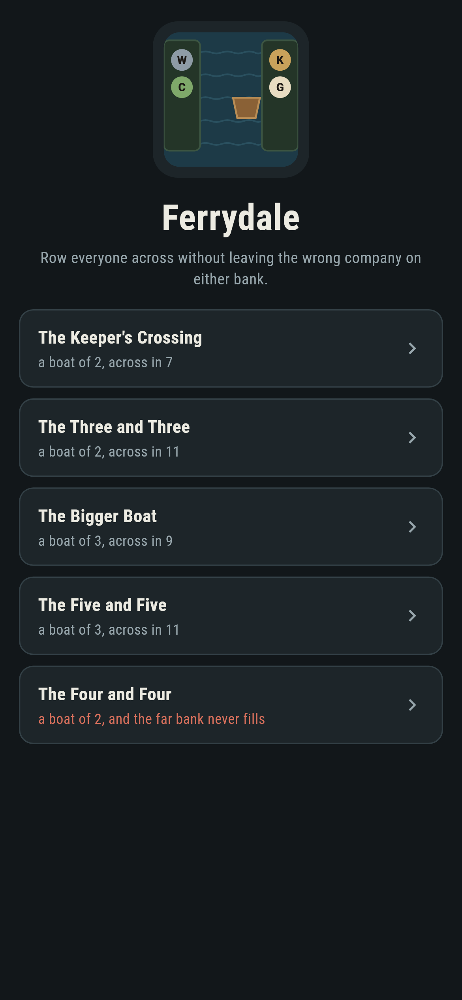
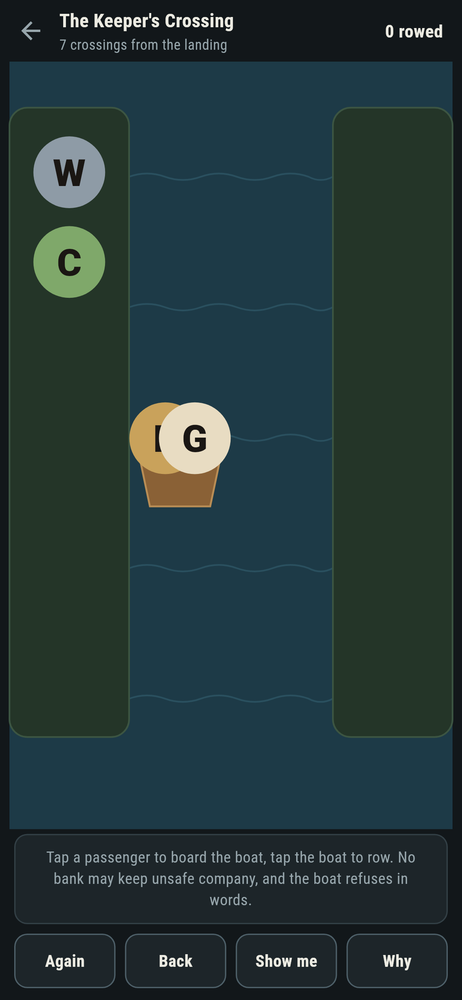
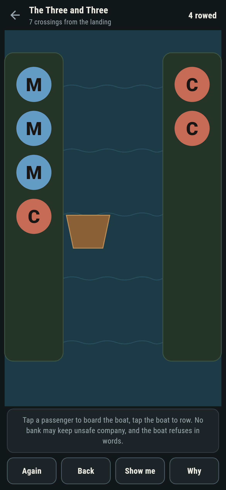
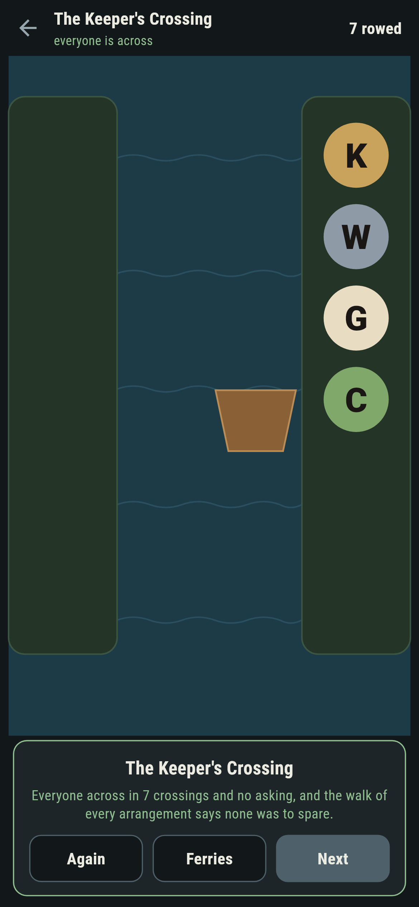
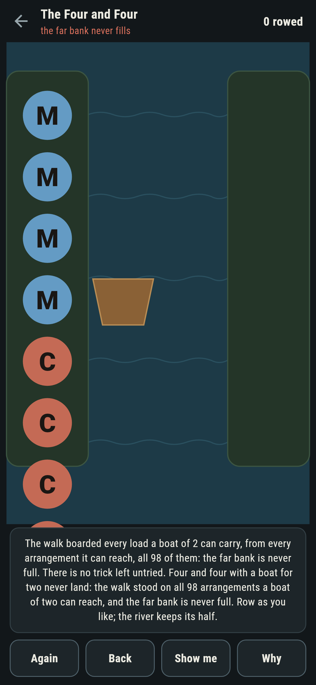
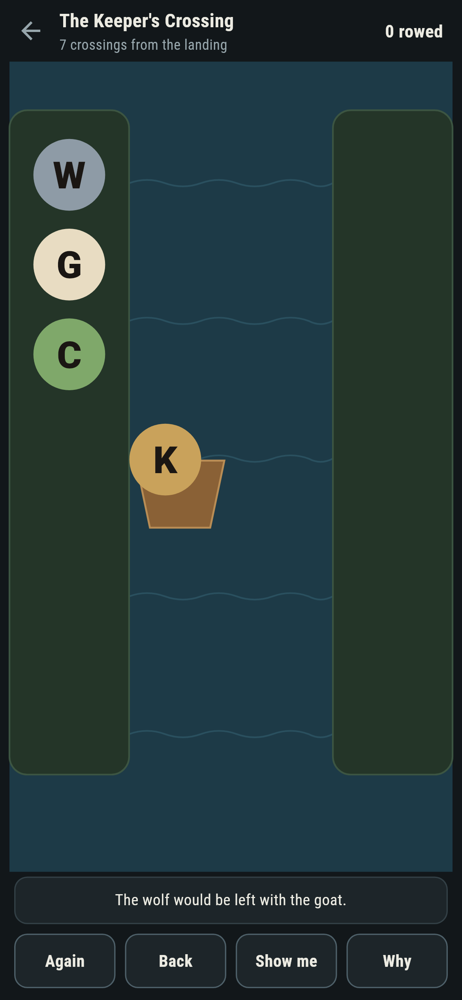

# Ferrydale

A river-crossing game for phones, in Flutter, for Android and iOS.

Passengers on a bank, a boat too small for all of them, and company
that cannot be trusted alone: row everyone across without ever
leaving the wrong pair on either shore. The keeper with his wolf,
goat and cabbage; missionaries and cannibals by the boatload. The
oldest puzzles on the shelf, and every number about them walked, not
told.

| | | | |
|---|---|---|---|
|  |  |  |  |

## The walk

The suite stands on every arrangement each river allows, boat and
banks together, and writes the crossings from each. The keeper's
crossing lands in seven, the three and three in eleven, four and
four in nine given a boat for three, five and five in eleven. The
game plays from the same walk, so the ledger's crossings-to-go is
exact and **Show me** names a load the walk has measured.

```
$ make ferries
 1 The Keeper's Crossing boat of 2  across in 7, 10 arrangements walked
 2 The Three and Three   boat of 2  across in 11, 64 arrangements walked
 3 The Bigger Boat       boat of 3  across in 9, 196 arrangements walked
 4 The Five and Five     boat of 3  across in 11, 624 arrangements walked
 5 The Four and Four     boat of 2  never across: all 98 arrangements walked, the far bank never full
```

## The four and four

Four missionaries and four cannibals with a boat for two never land:
the walk boards every load from every arrangement a boat of two can
reach, all 98 of them, and the far bank is never full. It ships
labelled, in the house tradition of maps nobody can win, with the
walk's count on the label and nothing left untried.



## The refusals

The boat never drowns anyone and never lets the banks go wrong: an
empty boat, a rowerless boat, and any crossing that would leave the
wolf with the goat, the goat with the cabbage, or missionaries
outnumbered, are all refused in words naming the trouble. A legal
crossing that steps away from the landing is called out with the
live count, **Back** waiting.



## Building

```
make deps     # fetch packages
make check    # analyze + every test
make ferries  # walk every arrangement, print the ledger
make shots    # render the screenshots and redraw the icons
make apk      # Android release build
make ios      # iOS release build (unsigned)
```

The logo and every app icon are drawn by the game's own painter in
`test/mark_test.dart`. There is no image in this repository that was not
produced by code in it.

## How it is put together

```
lib/ferry/rules.dart      states, crossings, the walk, the safety
lib/ferry/ferry.dart      a ferry: who crosses, the boat, its numbers
lib/ferry/ferries.dart    the five ferries that ship
lib/ferry/play.dart       a river being rowed: boarding, refusals,
                          take-back
lib/ui/                   the painter, the screens, the mark
tool/check_ferries.dart   the walks and the ledger above
```

The tests hold the walk to the famous numbers, watch every crossing
land safe by construction, hear each refusal by name, row every
winnable ferry at its fewest by following the game's own load, watch
the four and four offer nothing, and hold the pictures against the
real widget tree. If any of that drifts, `make check` goes red before
anything leaves the machine.
