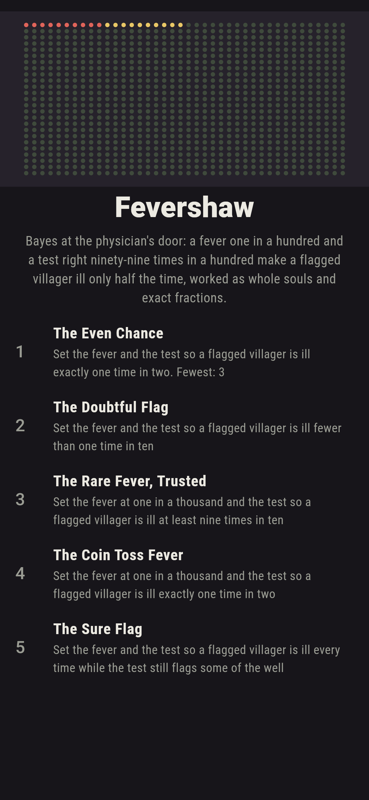
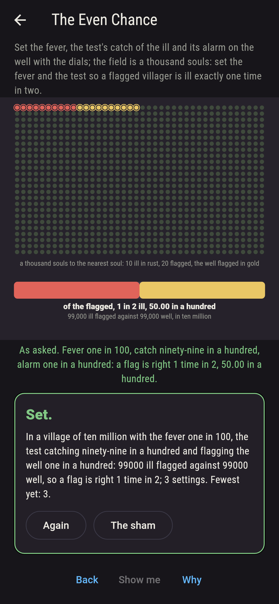
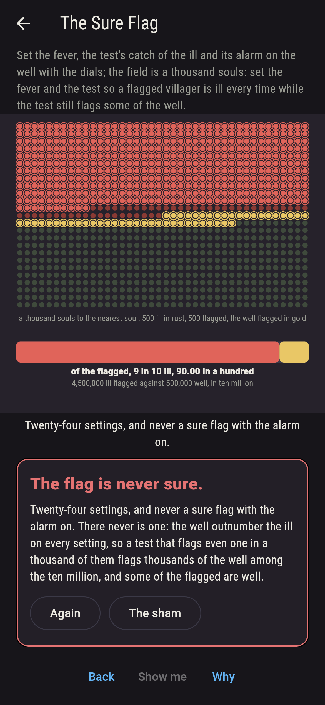
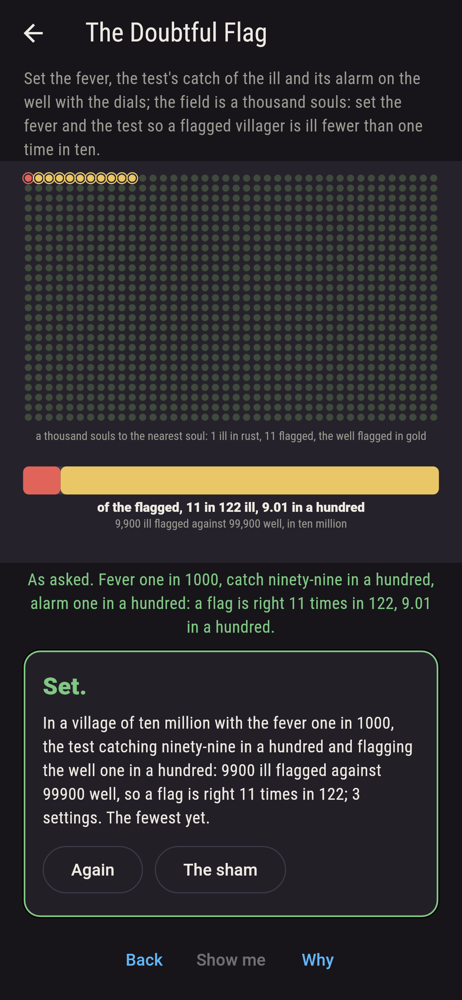
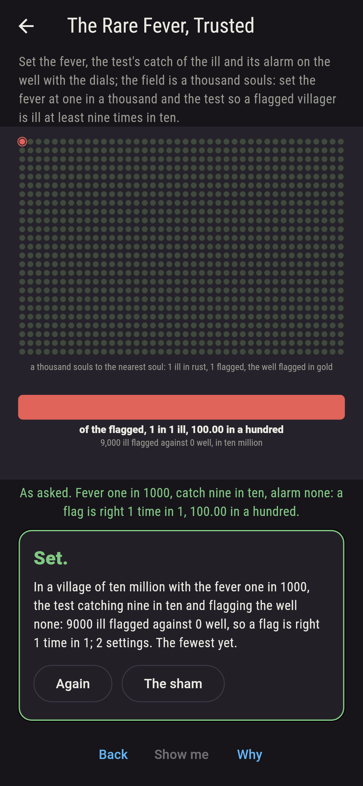
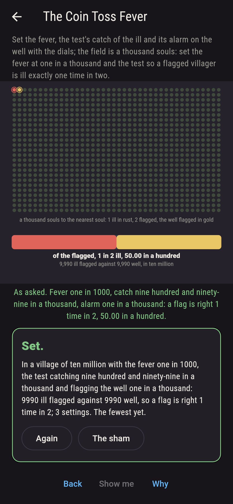
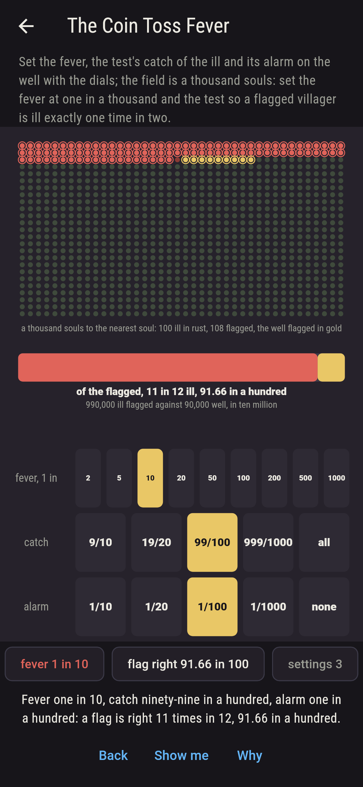
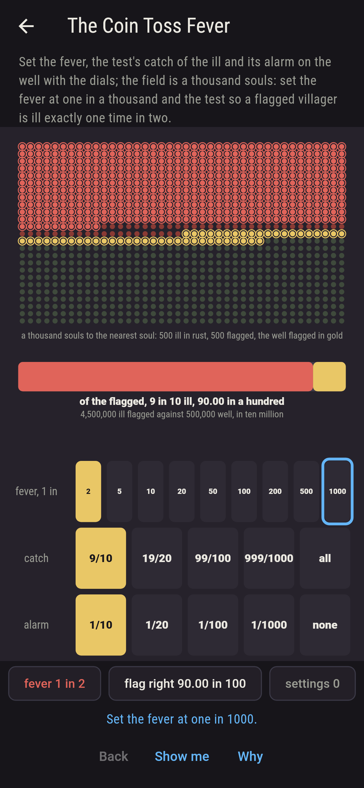
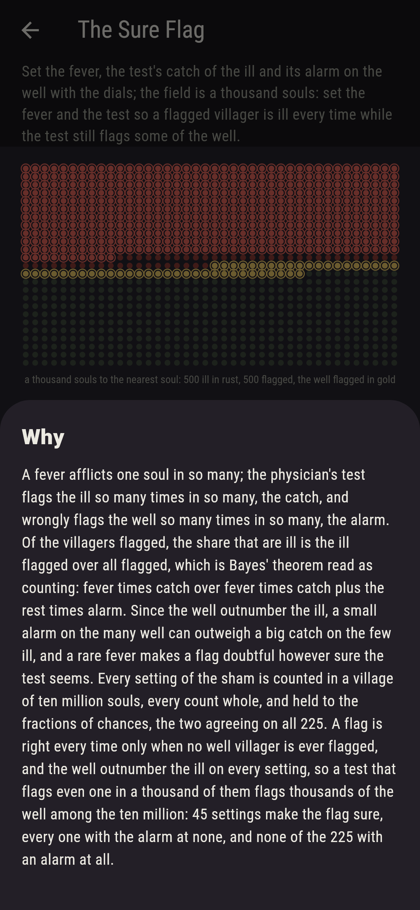

# Fevershaw


Bayes at the physician's door. A fever afflicts one soul in so many;
the test flags the ill so many times in so many, the catch, and
wrongly flags the well so many times in so many, the alarm. Set the
three with the dials, and the field shows a thousand souls, the ill
in rust, the flagged ringed, the well flagged in gold. Of the
villagers flagged, the share that are ill is the ill flagged over
all flagged, which is Bayes' theorem read as counting: fever times
catch over fever times catch plus the rest times alarm. Since the
well outnumber the ill, a small alarm on the many well can outweigh
a big catch on the few ill: with the fever one in a hundred and the
test right ninety-nine times in a hundred both ways, a flag is
right one time in two, 99,000 ill flagged against 99,000 well in a
village of ten million; with the fever one in a thousand, eleven
times in 122, nine in a hundred and a hair. Every setting is counted
in whole souls and held to the exact fractions of chances, and a
flag is sure only when no well villager is ever flagged.

## The villages

1. **The Even Chance** - set the fever and the test so a flagged villager is ill exactly one time in two
2. **The Doubtful Flag** - set the fever and the test so a flagged villager is ill fewer than one time in ten
3. **The Rare Fever, Trusted** - set the fever at one in a thousand and the test so a flagged villager is ill at least nine times in ten
4. **The Coin Toss Fever** - set the fever at one in a thousand and the test so a flagged villager is ill exactly one time in two
5. **The Sure Flag** - set the fever and the test so a flagged villager is ill every time while the test still flags some of the well

Four settings of the 225 make the flag right exactly one time in
two, each a test as sure as the fever is rare, one in ten with nine
in ten, one in twenty with nineteen in twenty, one in a hundred
with ninety-nine in a hundred, one in a thousand with nine hundred
and ninety-nine; forty leave it right fewer than one time in ten;
with the fever one in a thousand, nine times in ten takes a test
that never flags the well, five settings; and the coin toss fever
is one setting, the test nine hundred and ninety-nine in a thousand
and one in a thousand, 9,990 ill flagged against 9,990 well. The
Sure Flag is labeled hopeless on its tile, and the why is that the
well outnumber the ill on every setting.

## Two voices

The game never asserts what it has not computed, and it computes
everything at least twice:

* **The counting** takes a village of ten million souls, works out
  the ill, the well, the ill flagged and the well flagged as whole
  numbers on every setting, every count checked to come whole, and
  reads the share of the flagged that are ill; every number on the
  sham is that count's, and the field is the same village at a
  thousand souls to the nearest soul.
* **The chances** count nobody: fever times catch over fever times
  catch plus the rest times alarm, as exact fractions in lowest
  terms, and they agree with the counting on all 225 settings; they
  say the flag is sure on 45 settings, every one with the alarm at
  none, and on none with an alarm.

`tool/check_tests.dart` runs the lot and refuses the bake on any
disagreement.

## The checker's ledger

What `dart run tool/check_tests.dart` printed for the build this
README shipped with, word for word:

```
every setting of the sham, the fever one in two to one in a thousand, the test catching nine in ten to every one and flagging the well one in ten to none, 225 settings, counted in a village of ten million souls, every count whole, the ill flagged over all flagged, and held to Bayes' fractions of chances, the two agreeing on all 225: a flag is right exactly one time in two on four settings, each a test as sure as the fever is rare, one in ten with nine in ten, one in twenty with nineteen in twenty, one in a hundred with ninety-nine, one in a thousand with nine hundred and ninety-nine, 99,000 ill flagged against 99,000 well at one in a hundred; the fever one in a thousand and the test ninety-nine in a hundred both ways leaves a flag right 11 times in 122, 9.01 in a hundred, 9,900 ill flagged against 99,900 well; a hundred settings reach nine in ten; the flag is sure on 45 settings, every one with the alarm at none, and on none with an alarm, the well outnumbering the ill on every setting

 1 The Even Chance         set the fever and the test so a flagged villager is ill exactly one time in two: 4 of the 225 settings land it
 2 The Doubtful Flag       set the fever and the test so a flagged villager is ill fewer than one time in ten: 40 of the 225 settings land it
 3 The Rare Fever, Trusted set the fever at one in a thousand and the test so a flagged villager is ill at least nine times in ten: 5 of the 225 settings land it
 4 The Coin Toss Fever     set the fever at one in a thousand and the test so a flagged villager is ill exactly one time in two: 1 of the 225 settings lands it
 5 The Sure Flag           set the fever and the test so a flagged villager is ill every time while the test still flags some of the well: none of the 225, and the well said so first
```

## Screenshots

| The sham | The even chance | The sure flag admitted |
| --- | --- | --- |
|  |  |  |

| The doubtful flag | The rare fever, trusted | The coin toss fever | Mid-setting | Show me | The why |
| --- | --- | --- | --- | --- | --- |
|  |  |  |  |  |  |

Screenshots are drawn by `test/showcase_test.dart` at real phone
sizes with the app's own painter, then copied into `docs/` as they
came out; every dial in them was set by a tap, so nothing pictured
is a village the game could not reach. The logo and every launcher
icon come out of `test/mark_test.dart` the same way: the mark is
the village with the fever one in a hundred and the test
ninety-nine in a hundred both ways, the flagged half ill.

## Building

```
flutter test          # 46 tests, the counting among them
dart run tool/check_tests.dart
flutter build apk     # or: flutter build ios
```
