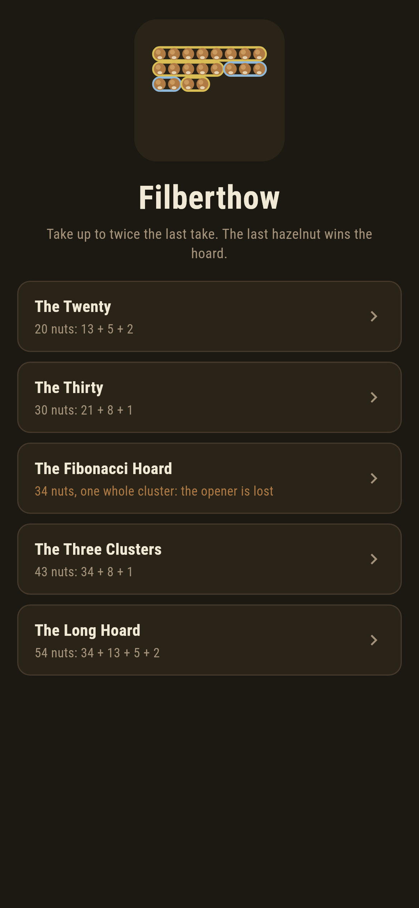
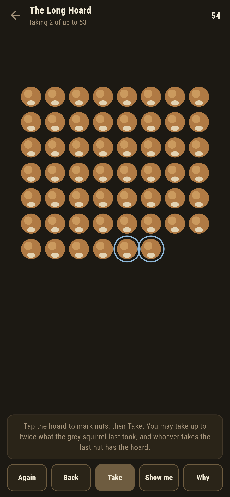
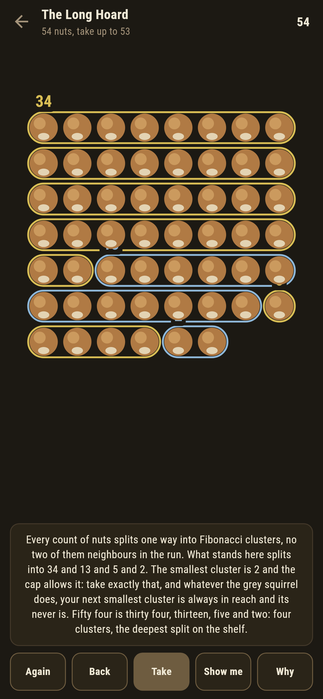
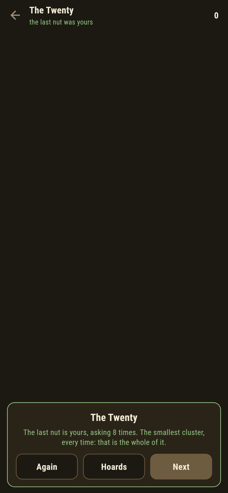
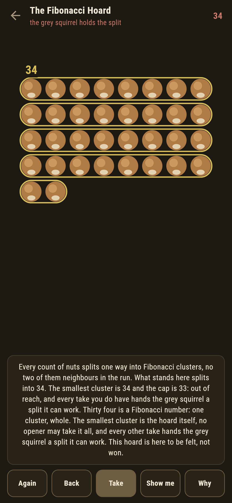
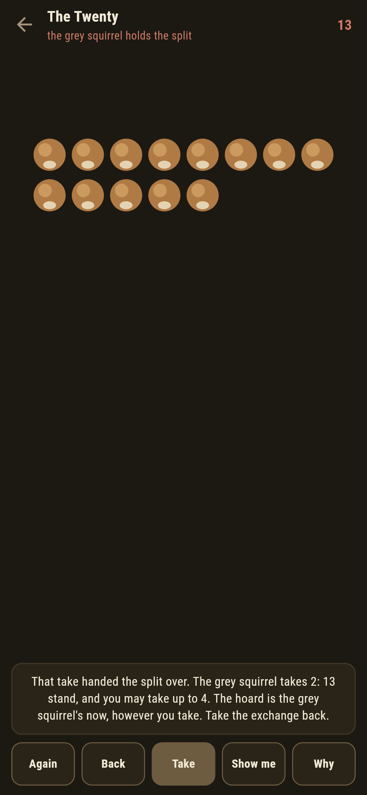

# Filberthow

A nut-taking duel for phones, in Flutter, for Android and iOS.

A hoard of hazelnuts between you and the grey squirrel. You open, taking
any number but not the whole hoard; after that, each may take from one
nut up to twice what the other just took. Whoever takes the last nut has
the hoard. This is Fibonacci nim, and the winning move is stranger than
the game.

| | | | |
|---|---|---|---|
|  |  |  |  |

## Take the smallest cluster

Every count of nuts splits one way into Fibonacci clusters, no two of
them neighbours in the run: fifty four is thirty four, thirteen, five
and two. The rule is one line: you are winning exactly when the smallest
cluster is within your cap, and taking exactly that cluster is the move.
**Why** rings the clusters over the hoard in front of you and says which
cluster is yours to take.

```
$ make hoards
the split rule and the search agree on all 1830 standings to sixty nuts

 1 The Twenty           20 nuts  split 13 + 5 + 2  the opener wins
 2 The Thirty           30 nuts  split 21 + 8 + 1  the opener wins
 3 The Fibonacci Hoard  34 nuts  split 34  the opener is lost
 4 The Three Clusters   43 nuts  split 34 + 8 + 1  the opener wins
 5 The Long Hoard       54 nuts  split 34 + 13 + 5 + 2  the opener wins
```

The search knows takes and caps and nothing else; the split knows a
greedy sum and nothing else; and they agree on all 1,830 standings to
sixty nuts, which the suite checks rather than admires. The winning take
is verified too: from every winnable standing, taking the smallest
cluster hands the grey squirrel a lost one.

## The Fibonacci hoard

Thirty four is a Fibonacci number: one cluster, whole. The smallest
cluster is the hoard itself, no opener may take it all, and every take
you do have hands the grey squirrel a split it can work. It ships
labelled, in the house tradition of maps nobody can win, and a test
plays twenty different openings against the machine to make sure the
label is honest.



## The grey squirrel does not forgive

Take wrong once and the split changes hands: the game says so the moment
the answer lands, names the standing, and offers the exchange back. The
Thirty teaches the coldest case: its split is twenty one, eight and one,
so the winning first take from thirty nuts is a single nut, and anything
bolder loses.



## Building

```
make deps    # fetch packages
make check   # analyze + every test
make hoards  # the split rule against the search, then the ledger
make shots   # render the screenshots and redraw the icons
make apk     # Android release build
make ios     # iOS release build (unsigned)
```

The logo and every app icon are drawn by the game's own painter in
`test/mark_test.dart`. There is no image in this repository that was not
produced by code in it.

## How it is put together

```
lib/hoard/rules.dart     the search, the split, and the winning take
lib/hoard/hoard.dart     a hoard: its nuts and its verdict
lib/hoard/hoards.dart    the five hoards that ship
lib/hoard/play.dart      a duel: takes, caps, the grey squirrel's answers
lib/ui/                  the painter, the screens, the mark
tool/check_hoards.dart   the ledger above
```

The tests hold the split rule against the search on every standing to
sixty, check the split is Fibonacci with no neighbouring clusters at
every count to one hundred and twenty, verify the winning take wins and
the Fibonacci hoards lose, and hold the pictures against the real widget
tree. If any of that drifts, `make check` goes red before anything
leaves the machine.
