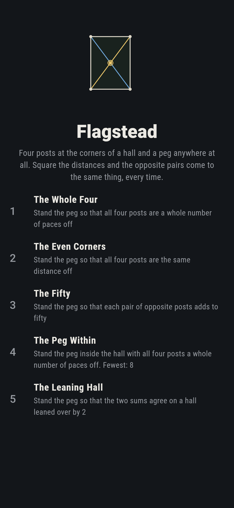
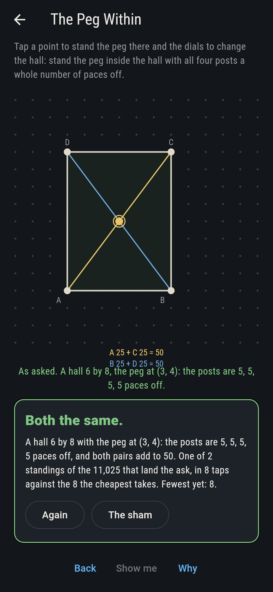
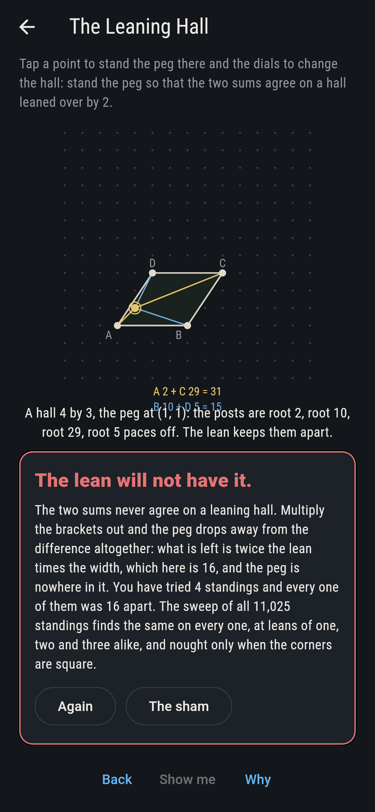
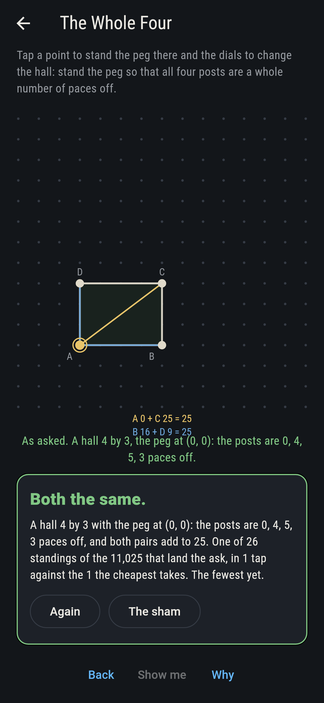
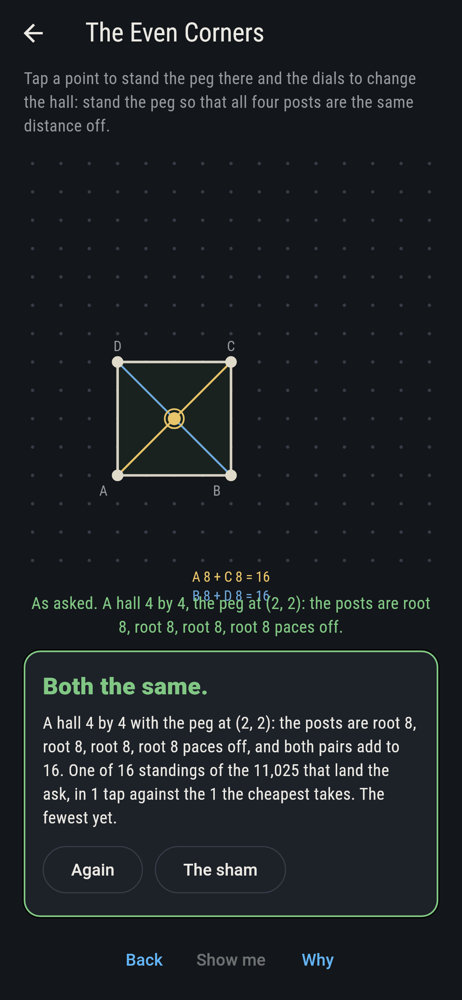
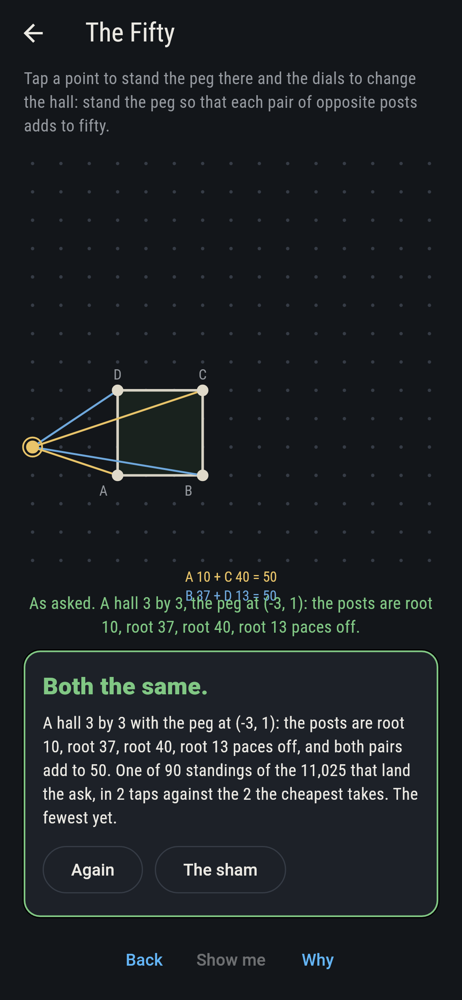
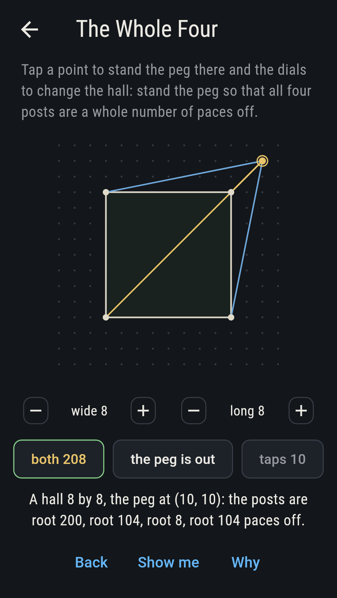
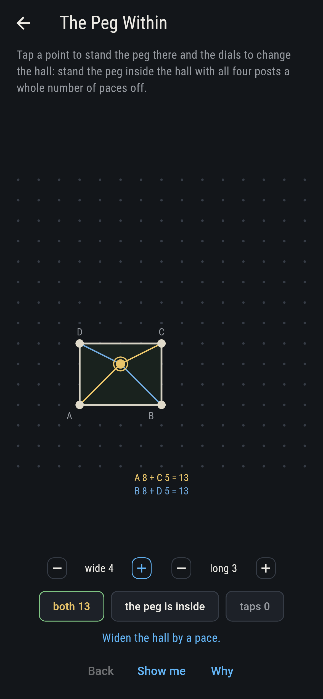
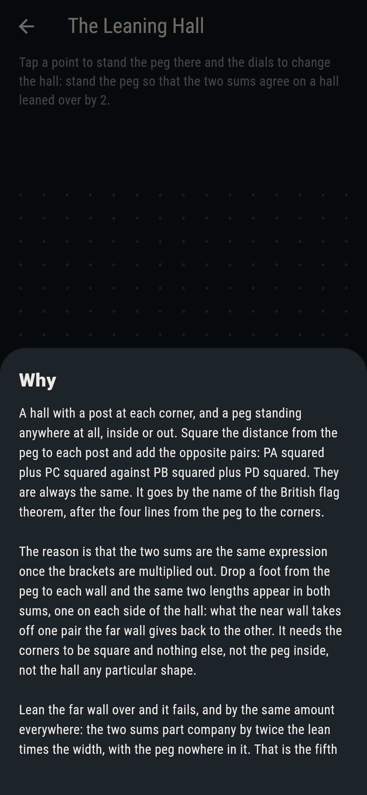

# Flagstead


A hall with a post at each corner and a peg standing anywhere at all,
inside the hall or well outside it. Square the distance from the peg to
each post and add the opposite pairs: A with C against B with D. They
come to the same thing every time, which is the British flag theorem,
named for the four lines from the peg to the corners. It wants square
corners and nothing else, not the peg inside, not the hall any
particular shape. The reason is that the two sums are the same
expression once the brackets are multiplied out: what the near wall
takes off one pair the far wall gives back to the other. Lean the far
wall over and it fails, and by the same amount everywhere, twice the
lean times the width, with the peg nowhere in it.

## The asks

1. **The Whole Four** - stand the peg so that all four posts are a whole number of paces off
2. **The Even Corners** - stand the peg so that all four posts are the same distance off
3. **The Fifty** - stand the peg so that each pair of opposite posts adds to fifty
4. **The Peg Within** - stand the peg inside the hall with all four posts a whole number of paces off
5. **The Leaning Hall** - stand the peg so that the two sums agree on a hall leaned over by 2

The sums agree wherever the peg stands, so the asks are about the four
distances themselves, which are usually roots. All four come out whole
on 26 of the 11,025 standings, and on just two of those the peg is
inside the hall: the six by eight and its turn about, with the peg
three paces along and four up, every post five paces off and both sums
fifty. All four distances come out alike on 16 standings, which are
the halls with both sides even and the peg at the middle. A pair
adding to fifty happens on 90, most of them with the peg outside,
since the sums grow with the distance and the halls are small. The
Leaning Hall is hopeless: with the far wall leaned two paces the two
sums differ by four times the width, whatever the hall and wherever
the peg goes, and no hall the dials allow has a width of nought. The
sham admits it once four standings have been tried, or after fourteen
taps.

## Two voices

Every number the game says out loud was worked out here rather than
guessed, and the two sums are worked out two ways:

* **By the distances.** The square of each distance is taken from the
  peg to each post and the opposite pairs are added. That is what the
  board shows as you move the peg, and what the chips count.
* **By the brackets.** The same two sums are written out with the
  brackets multiplied through, which never takes a distance at all and
  leaves the difference as twice the lean times the width. On a
  square-cornered hall the lean is nought and the difference goes with
  it.

The checker runs both over every hall from two by two to eight by
eight with the peg on every point of the field, 11,025 standings, and
they agree on all of them. It then leans the far wall over by one, two
and three and holds the difference to twice the lean times the width
on every standing again.

`tool/check_halls.dart` runs the lot and refuses the bake on any
disagreement.

## The checker's ledger

What `dart run tool/check_halls.dart` printed for the build this README
shipped with, word for word:

```
every hall from 2 by 2 to 8 by 8 taken with the peg on every point of the field, 11,025 standings, and the two sums worked out twice, once by squaring the four distances and adding the opposite pairs and once by multiplying the brackets out, which never takes a distance at all: the two agree on every standing, and so do the sums themselves, 11,025 times out of 11,025; the peg stands where all four distances are whole numbers of paces on 26 standings, and on 2 of those it is inside the hall, both of them the six by eight and its turn about with the peg three and four paces in, every distance five; all four distances come out alike on 16 standings, which are the halls of even sides with the peg at the middle; lean the far wall over and the two sums part company by twice the lean times the width, the same amount wherever the peg stands, which the sweep checks over all 11,025 standings at leans of one, two and three

 1 The Whole Four   stand the peg so that all four posts are a whole number of paces off: 26 of the 11,025 standings land it, the cheapest in 1 tap
 2 The Even Corners stand the peg so that all four posts are the same distance off: 16 of the 11,025 standings land it, the cheapest in 1 tap
 3 The Fifty        stand the peg so that each pair of opposite posts adds to fifty: 90 of the 11,025 standings land it, the cheapest in 2 taps
 4 The Peg Within   stand the peg inside the hall with all four posts a whole number of paces off: 2 of the 11,025 standings land it, the cheapest in 8 taps
 5 The Leaning Hall stand the peg so that the two sums agree on a hall leaned over by 2: none of the 11,025, and the lean says why
```

## Screenshots

| The sham | The peg within | The leaning hall |
| --- | --- | --- |
|  |  |  |

| The whole four | The even corners | The fifty | A big hall with the peg out, on the small phone | Show me | The why |
| --- | --- | --- | --- | --- | --- |
|  |  |  |  |  |  |

Screenshots are drawn by `test/showcase_test.dart` at real phone sizes
with the app's own painter, then copied into `docs/` as they came out.
On the board shots the hall was set on its dials and the peg stood by a
tap, so no standing pictured is one the game could not reach. The logo
and every launcher icon come out of `test/mark_test.dart`, drawn by the
same painter: the mark is the six by eight hall with the peg three
paces along and four up, and it stands there with no taps behind it.

## Building

```
flutter test          # 40 tests, the sweep among them
dart run tool/check_halls.dart
flutter build apk     # or: flutter build ios
```
