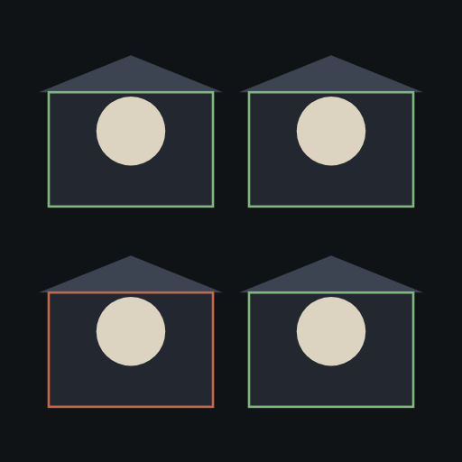
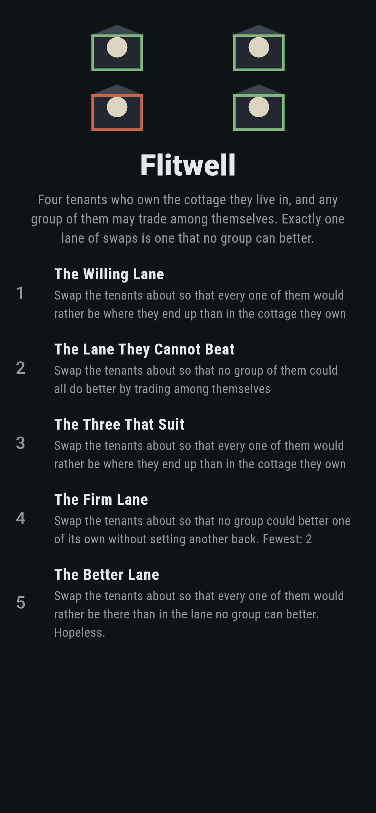
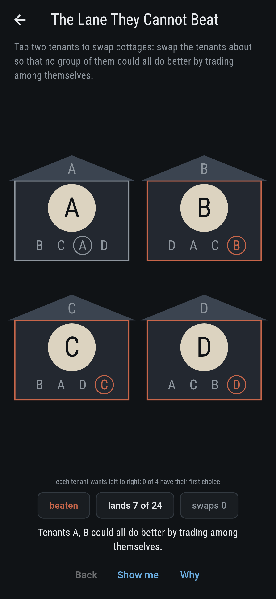
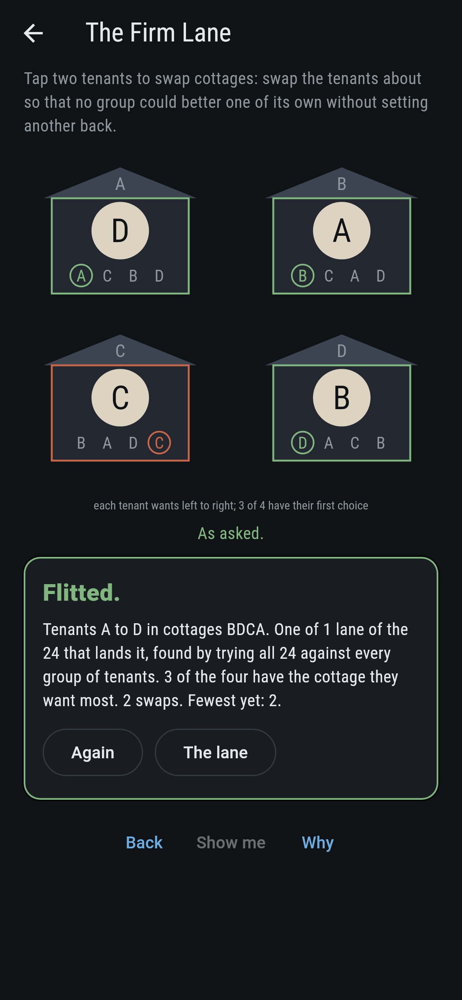
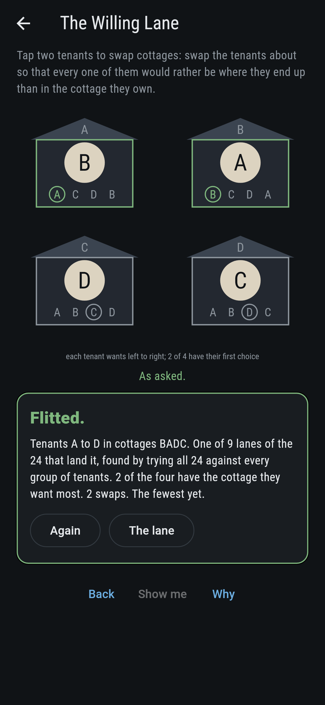
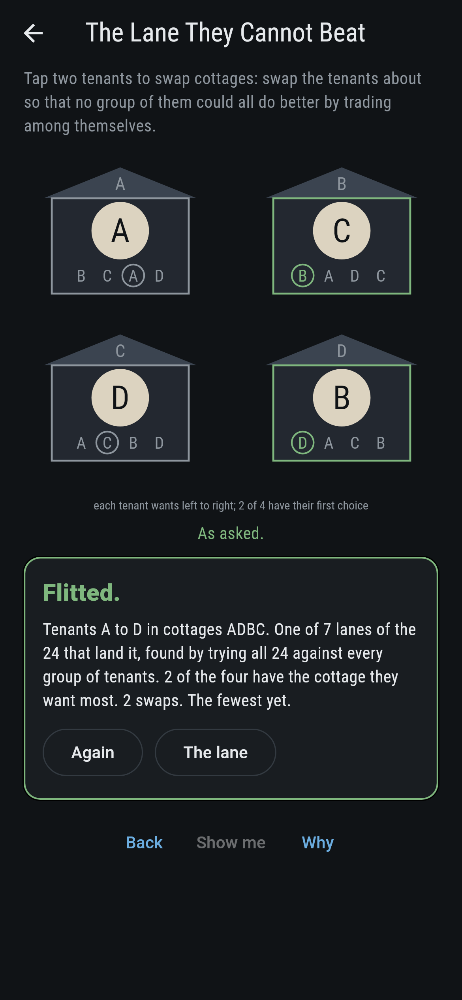
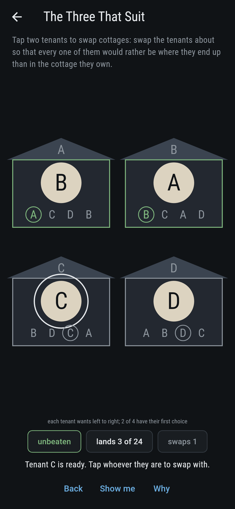
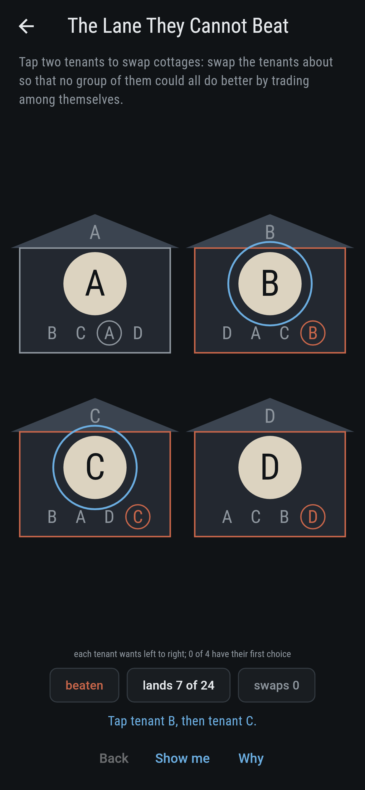
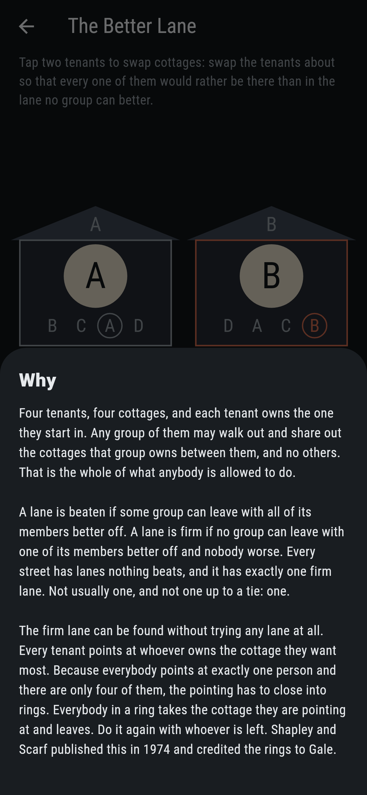
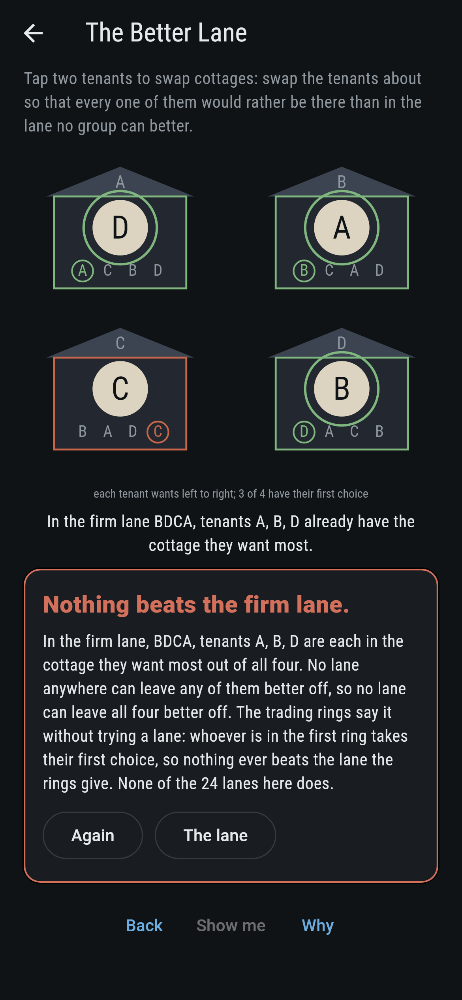

# Flitwell



Four tenants on a lane, a cottage each, and each of them owns the one
they start in. Everybody has an order they would rather live in. Tap
two tenants and they swap. Any group of them may walk out and share
out the cottages that group owns between them, and no others, which
is the whole of what anybody is allowed to do: nobody can be turned
out by people with nothing to offer. A lane is beaten if some group
can leave with every one of its members better off. A lane is firm if
no group can leave with one of its members better off and nobody
worse. Several lanes may go unbeaten, and on a lane of four as many
as seven do, but exactly one is ever firm. That one can be found
without trying a single lane: every tenant points at whoever owns the
cottage they want most, the pointing has to close into rings because
everybody points at exactly one person, and everybody in a ring takes
what they are pointing at and leaves. Do it again with whoever is
left. Shapley and Scarf published this in 1974 and credited the rings
to Gale. Every street four tenants can have is walked before the
bake, all 331,776 of them, with all 24 lanes of each tried against
every group, and the rings run alongside as a second voice that tries
no lane at all.

## The asks

1. **The Willing Lane** - swap the tenants about so that every one of them would rather be where they end up than in the cottage they own
2. **The Lane They Cannot Beat** - swap the tenants about so that no group of them could all do better by trading among themselves
3. **The Three That Suit** - swap the tenants about so that every one of them would rather be where they end up than in the cottage they own
4. **The Firm Lane** - swap the tenants about so that no group could better one of its own without setting another back
5. **The Better Lane** - swap the tenants about so that every one of them would rather be there than in the lane no group can better

The asks land 9, 7, 3, 1 and none of the 24 lanes, and the nearest is
2, 2, 3 and 2 swaps off. Three of them are set on one street, which
is the point of it: seven of its lanes cannot be beaten by any group
at once, exactly one of those seven cannot be bettered at all, and
nothing whatever beats that one. Seven is as many unbeaten lanes as a
street of four ever has, and 72 of the 331,776 reach it. The firm
lane there is BDCA, and it leaves tenant C in the cottage C wants
least while A, B and D each get the one they want most. That is not a
flaw in it. C owns its cottage and nobody can take it, and the other
three are already as well off as they can be, which is exactly why
nothing can be improved. The Better Lane is labeled hopeless on its
tile, and those three first choices are the why.

## Two voices

The game never asserts what it has not computed, and it computes
everything at least twice:

* **The trying** takes each of the 24 lanes in turn and holds it
  against every one of the 15 groups of tenants, and against every way
  that group could share out the cottages it owns. It knows nothing
  about rings. Every count on the tile and the card is its.
* **The rings** try no lane. Each tenant points at the owner of the
  cottage they want most, the pointing closes, and each ring takes
  what it points at and leaves. On all 331,776 streets the lane this
  gives is the firm lane, and there is never a second one.

The rings also settle the last ask without any sweep at all. Whoever
is in the first ring takes the cottage they wanted most out of all
four, so no lane anywhere can leave them better off, and a lane that
beats another has to better everybody in it. The checker holds that
to the sweep as well: on all 331,776 streets, no lane of the 24 ever
leaves every tenant better off than the rings' lane does.

`tool/check_flits.dart` runs the lot and refuses the bake on any
disagreement.

Reelbury in this collection is Gale and Shapley's stable marriage from
1962, so the two share an author and a taste for orders of preference,
and they are otherwise unrelated. That one pairs two sides and rules
out a single blocking couple; this one has one side, gives everybody
something they already own, and rules out every group of every size.

## The checker's ledger

What `dart run tool/check_flits.dart` printed for the build this
README shipped with, word for word:

```
every street four tenants can have walked, all 331,776 of them, and all 24 lanes of each tried against every group of tenants, which is 7,962,624 lanes tried; on every street exactly one lane is firm, meaning no group can better one of its own without setting another back, and on every street that lane is the one the trading rings give, which are run as a second voice and try no lane at all; a lane no group can better all at once is a weaker thing and a street can have several: 178,716 streets have one, then 83,208, 41,220, 20,100, 7,176, 1,284 and 72 have seven, which is the most any street of four reaches; on all 331,776 the tenants in the first ring take the cottage they want most out of all four, and on all 331,776 no lane whatever leaves every tenant better off than the rings' lane does

 1 The Willing Lane          swap the tenants about so that every one of them would rather be where they end up than in the cottage they own: 9 of the 24 lanes do it, the nearest 2 swaps away
 2 The Lane They Cannot Beat swap the tenants about so that no group of them could all do better by trading among themselves: 7 of the 24 lanes do it, the nearest 2 swaps away
 3 The Three That Suit       swap the tenants about so that every one of them would rather be where they end up than in the cottage they own: 3 of the 24 lanes do it, the nearest 3 swaps away
 4 The Firm Lane             swap the tenants about so that no group could better one of its own without setting another back: 1 of the 24 lanes do it, the nearest 2 swaps away
 5 The Better Lane           swap the tenants about so that every one of them would rather be there than in the lane no group can better: none of the 24, and the trading rings said so first
```

## Screenshots

| The lane | The shared street, as it opens | The firm lane |
| --- | --- | --- |
|  |  |  |

| The willing lane | The unbeaten lane | Mid-swap | Show me | The why | Nothing beats it |
| --- | --- | --- | --- | --- | --- |
|  |  |  |  |  |  |

Screenshots are drawn by `test/showcase_test.dart` at real phone
sizes with the app's own painter, then copied into `docs/` as they
came out; every tenant in them was moved by a tap on a tenant, so
nothing pictured is a lane the game could not reach. The logo and
every launcher icon come out of `test/mark_test.dart` the same way:
the mark is the firm lane, three tenants in the cottage they want
most and one in the cottage it wants least.

## Building

```
flutter test          # 59 tests, the trying and the rings among them
dart run tool/check_flits.dart
flutter build apk     # or: flutter build ios
```
