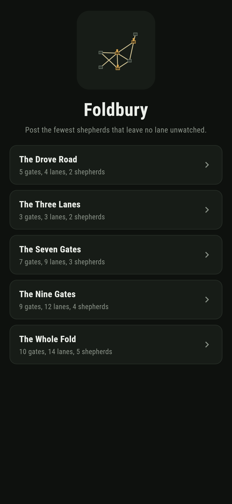
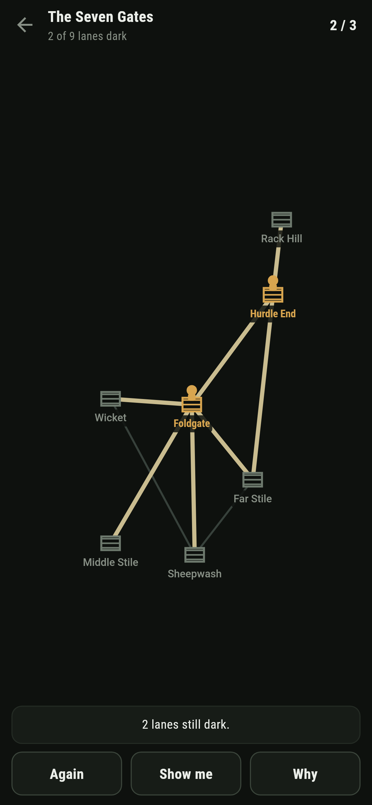
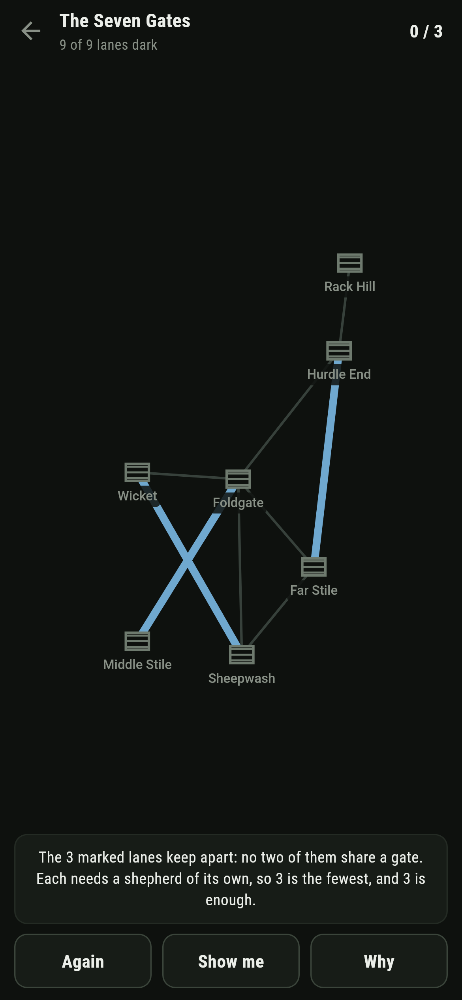
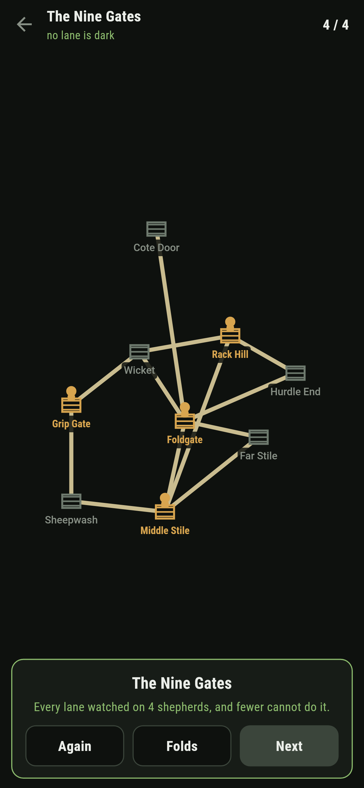
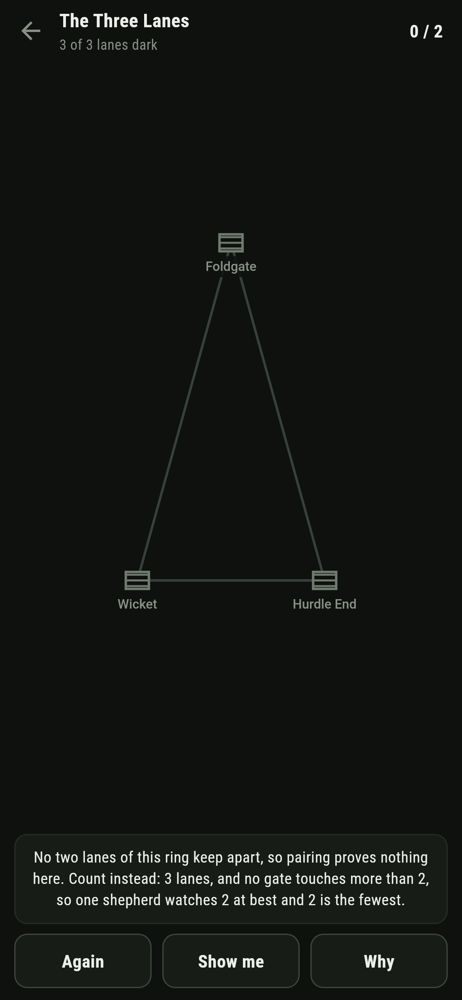
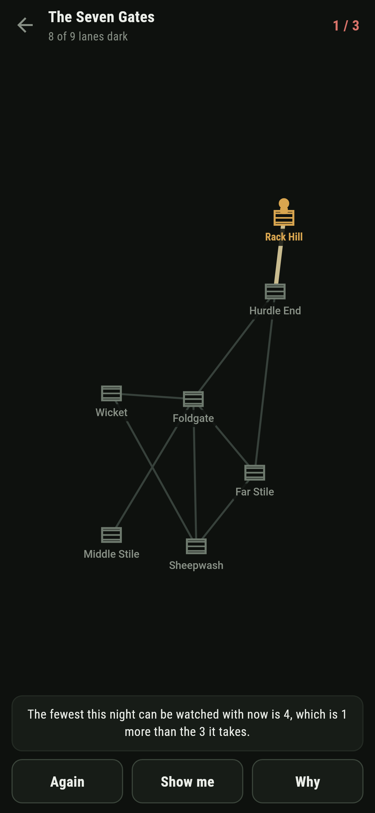

# Foldbury

A night watch puzzle for phones, in Flutter, for Android and iOS.

The sheep are folded for the night and the lanes between the gates need
watching. A shepherd posted at a gate watches every lane that touches it.
Post the fewest shepherds that leave no lane dark.

| | | | |
|---|---|---|---|
|  |  |  |  |

## Two floors, and one of them is the answer

Saying five shepherds are enough is easy: post them and look. Saying four
are too few is the real claim, and the game earns it two ways.

The first floor is a set of lanes that keep apart, no two of them sharing a
gate. One shepherd watches at most one lane of such a set, so a set of five
proves five shepherds are needed. **Why** draws that set in blue on the fold
in front of you, and it is checkable by eye: follow each blue lane and see
that it touches no other.

The second floor is plainer counting. A gate with four lanes on it lets one
shepherd watch four lanes at best, so fourteen lanes with no gate busier
than three need at least five shepherds. The ledger of every shipped fold,
from `make folds`:

```
$ make folds
 1 The Drove Road      5 gates   4 lanes  fewest 2  written down 2  matching 2  by lanes 2  greed 2
 2 The Three Lanes     3 gates   3 lanes  fewest 2  written down 2  matching 1  by lanes 2  greed 2
 3 The Seven Gates     7 gates   9 lanes  fewest 3  written down 3  matching 3  by lanes 2  greed 4
 4 The Nine Gates      9 gates  12 lanes  fewest 4  written down 4  matching 4  by lanes 3  greed 5
 5 The Whole Fold     10 gates  14 lanes  fewest 5  written down 5  matching 5  by lanes 4  greed 6
```

`fewest` is found by brute force over every set of gates, smallest first,
so it is the truth to beat. On every fold past the second the matching floor
equals it exactly, which is no accident: `make find` keeps a fold only when
it does, so every map ships carrying its own proof.

## The ring where pairing proves nothing

The Three Lanes is three gates in a triangle. Any two of its lanes share a
gate, so the biggest set of lanes that keep apart is one lane, and the
matching floor says one shepherd. The answer is two.

It ships anyway, because a floor you have watched fall short is a floor you
understand. **Why** on that fold does not draw a matching. It counts
instead: three lanes, no gate touching more than two, and half of three
rounds up to two. The other floor carries the triangle, and the game says
which argument it is using rather than pretending one argument always
works.

There is a theorem under this. For folds whose gates split into two banks
with every lane running between the banks, the matching floor is never
short: König proved in 1931 that the biggest set of lanes that keep apart
equals the fewest gates that watch everything. A test builds three hundred
random two-bank folds and holds the brute-force answer against the biggest
matching on each. Odd rings like the triangle are exactly what the theorem
excludes, and the game ships one so you can feel where the boundary is.



## The obvious way costs a shepherd

Post at the busiest gate, then the busiest gate still short of watched
lanes, and so on. On the drove road that works. On every bigger fold here
it ends one shepherd over, and the game does not wait for the end to say
so: it keeps a live answer to the fewest the night can still be watched
with, given who is already standing, and the moment a post pushes that
number past the fewest the ledger goes red and the words under the fold say
what the post cost.



Stand the shepherd down and the number comes back. Nothing is ever lost but
the walk.

## Show me shows, Why explains

**Show me** points at a gate that keeps the night at the fewest, found by
the same search that scores your own posts. **Why** gives the reason the
number is what it is, the matching where it carries, the lane count where
it does not, so finishing a fold means knowing the answer rather than
having bumped into it.

## Building

```
make deps    # fetch packages
make check   # analyze + every test
make folds   # walk the shipped folds: fewest, both floors, greed
make shots   # render the screenshots and redraw the icons
make apk     # Android release build
make ios     # iOS release build (unsigned)
```

The logo and every app icon are drawn by the game's own painter in
`test/mark_test.dart`. There is no image in this repository that was not
produced by code in it.

## How it is put together

```
lib/fold/fold.dart     the fold: gates, lanes, who watches what
lib/fold/fewest.dart   brute-force fewest, the matching floor, the lane floor
lib/fold/folds.dart    the five folds that ship, coordinates and all
lib/fold/play.dart     a night in progress: posts, dark lanes, live fewest
lib/ui/                the painter, the screens, the mark
tool/find_folds.dart   digs up folds whose matching floor is exactly tight
tool/check_folds.dart  the ledger above
```

The tests hold the written-down numbers against the brute force, the floors
against the answer on every shipped fold, König against three hundred
random two-bank folds, and the pictures against the real widget tree. If
any of that drifts, `make check` goes red before anything leaves the
machine.
