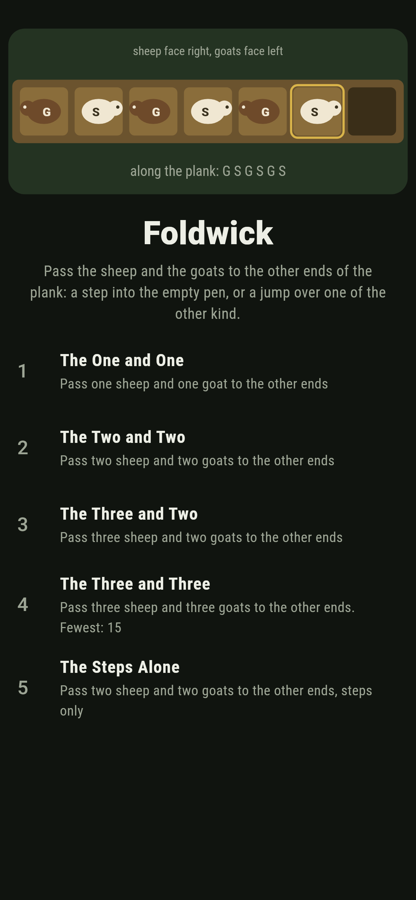
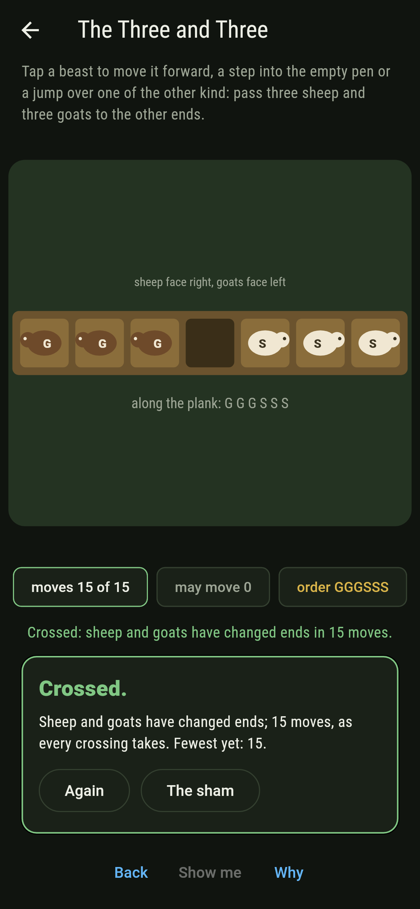
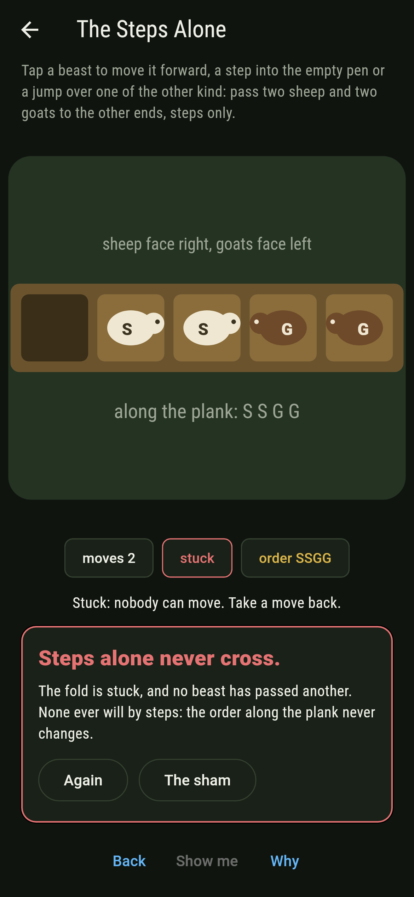
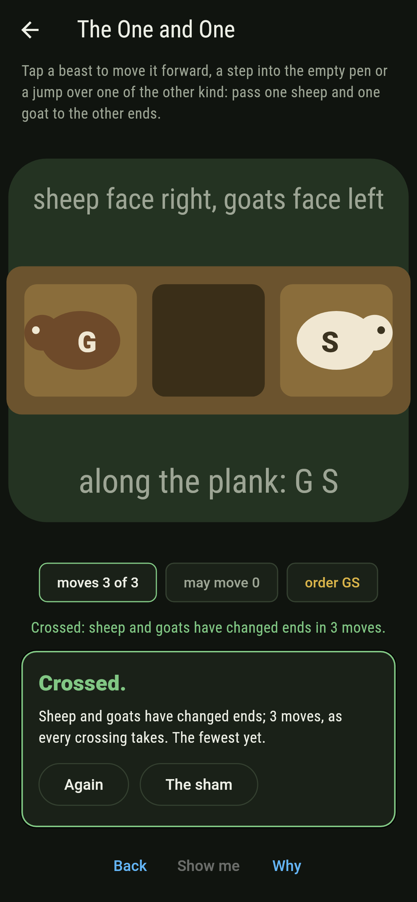
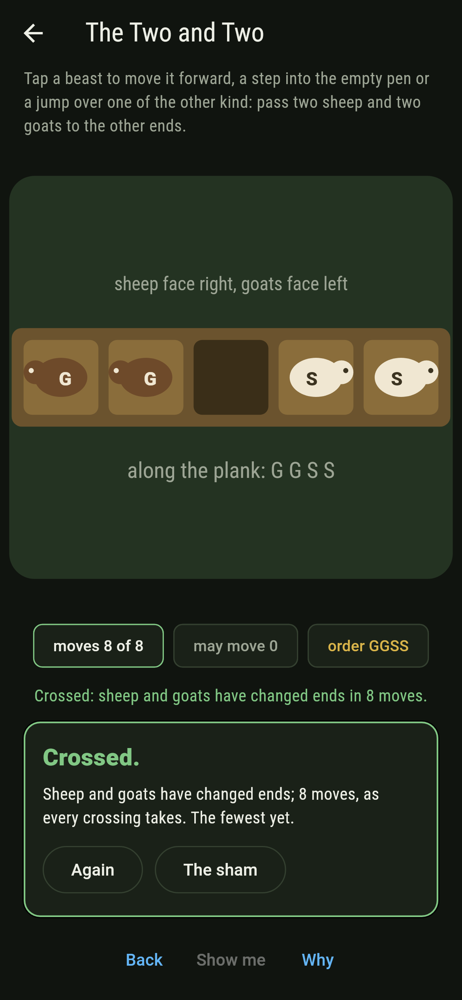
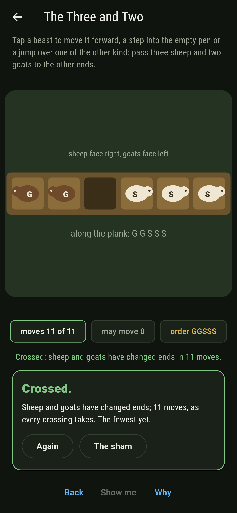
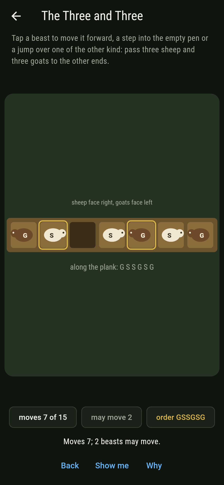
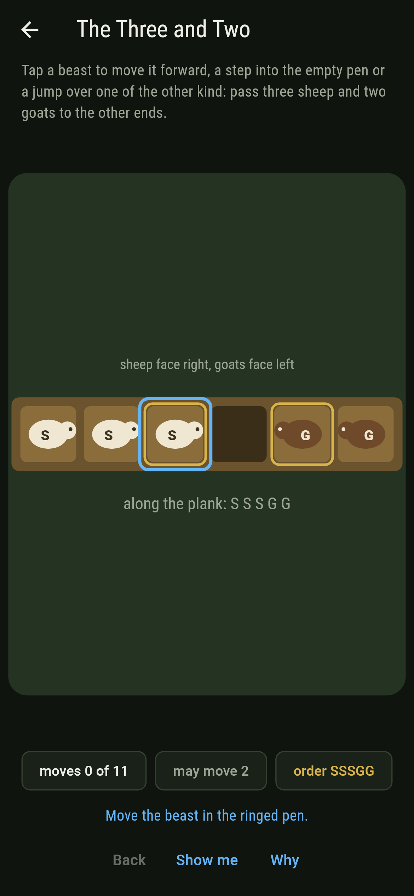
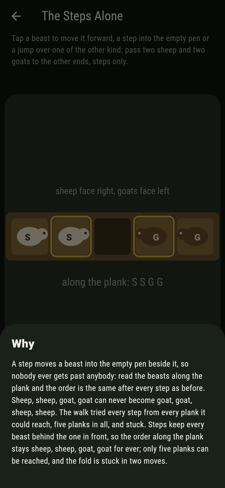

# Foldwick


A plank of pens in a row, sheep at the left end facing right,
goats at the right end facing left, and one pen empty between. A
beast may step forward into the empty pen, or jump forward over
one beast of the other kind into it, and never goes back. The old
puzzle asks them to change ends. Lucas counted the moves in 1883:
with m sheep and n goats the crossing takes m times n plus m plus
n moves, and it takes exactly that however it is done, since every
sheep passes every goat by one jump and the rest of the ground is
covered by steps. Steps alone never do it: without a jump the
order along the plank never changes.

## The crossings

1. **The One and One** - pass one sheep and one goat to the other ends
2. **The Two and Two** - pass two sheep and two goats to the other ends
3. **The Three and Two** - pass three sheep and two goats to the other ends
4. **The Three and Three** - pass three sheep and three goats to the other ends
5. **The Steps Alone** - pass two sheep and two goats to the other ends, steps only

Three moves, eight, eleven, fifteen, and never otherwise; two
crossings apiece, mirrors of one another. Twenty-three planks can
be reached with two and two, seventy-two with three and three, and
most of them are stuck. The Steps Alone is labeled hopeless on its
tile: five planks can be reached and the fold is stuck in two
moves, the order sheep, sheep, goat, goat unchanged.

## Two voices

The game never asserts what it has not computed, and it computes
everything at least twice:

* **The walk** tries every move from every plank, and since no
  beast ever goes back it is finite and every crossing is found,
  counted, and measured in jumps and steps.
* **Lucas's arithmetic** says every crossing takes sheep times
  goats jumps and sheep plus goats steps, and the walk finds
  exactly that on every crossing of every plank, the four shipped
  and four and four, four and three, two and one and one and three
  besides; with steps alone the order along the plank is read after
  every move and never changes.

`tool/check_planks.dart` runs the lot and refuses the bake on any
disagreement.

## The checker's ledger

What `dart run tool/check_planks.dart` printed for the build this
README shipped with, word for word:

```
every crossing of every plank walked, no beast ever going back: one and one cross in 3, two and two in 8, three and two in 11, three and three in 15, two crossings apiece and never otherwise, every crossing taking exactly the sheep times the goats jumps and the sheep plus the goats steps, as Lucas reckoned, and the same on four and four, four and three, two and one and one and three; with steps alone the order along the plank never changes, five planks are reached and the fold is stuck

 1 The One and One     pass one sheep and one goat to the other ends: 3 moves every time, 2 crossings
 2 The Two and Two     pass two sheep and two goats to the other ends: 8 moves every time, 2 crossings
 3 The Three and Two   pass three sheep and two goats to the other ends: 11 moves every time, 2 crossings
 4 The Three and Three pass three sheep and three goats to the other ends: 15 moves every time, 2 crossings
 5 The Steps Alone     pass two sheep and two goats to the other ends, steps only: never, and the order said so first
```

## Screenshots

| The sham | The three and three crossed | The steps alone admitted |
| --- | --- | --- |
|  |  |  |

| The one and one | The two and two | The three and two | Mid-crossing | Show me | The why |
| --- | --- | --- | --- | --- | --- |
|  |  |  |  |  |  |

Screenshots are drawn by `test/showcase_test.dart` at real phone
sizes with the app's own painter, then copied into `docs/` as they
came out; every move in them was tapped, so nothing pictured is a
plank the game could not reach. The logo and every launcher icon
come out of `test/mark_test.dart` the same way: the mark is three
and three on the way across, fully interleaved.

## Building

```
flutter test          # 43 tests, the walk among them
dart run tool/check_planks.dart
flutter build apk     # or: flutter build ios
```
