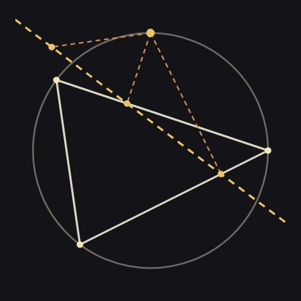
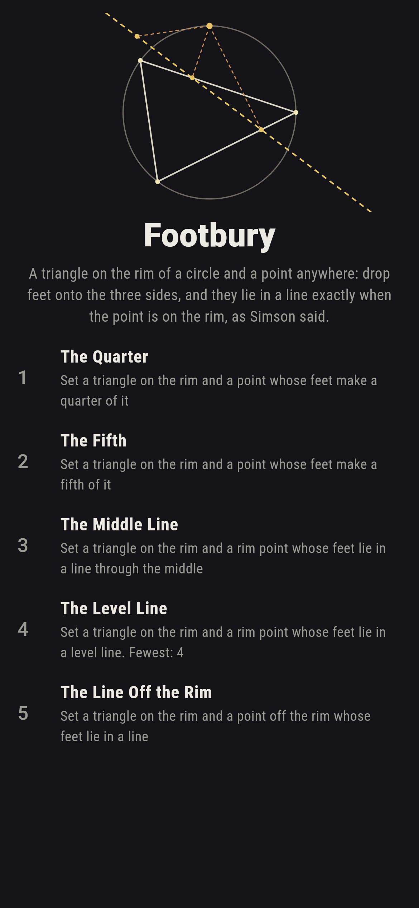
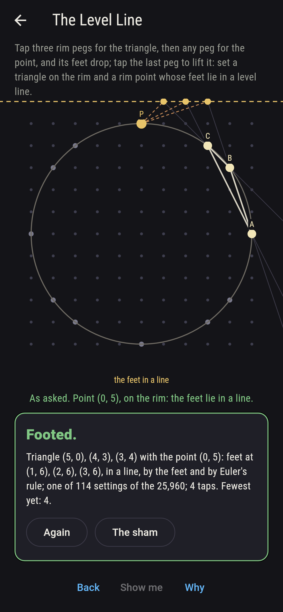
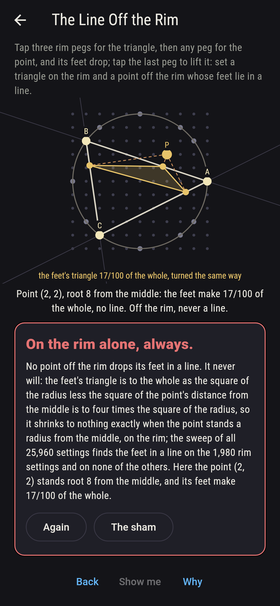
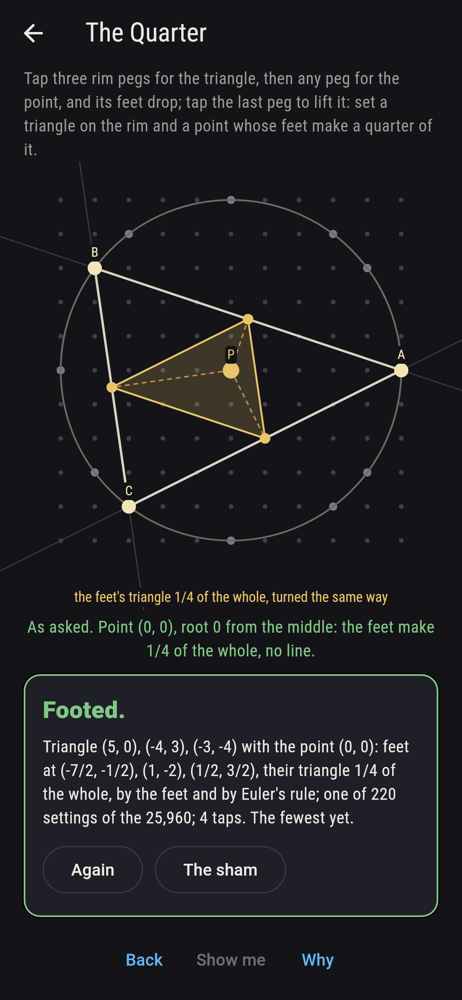
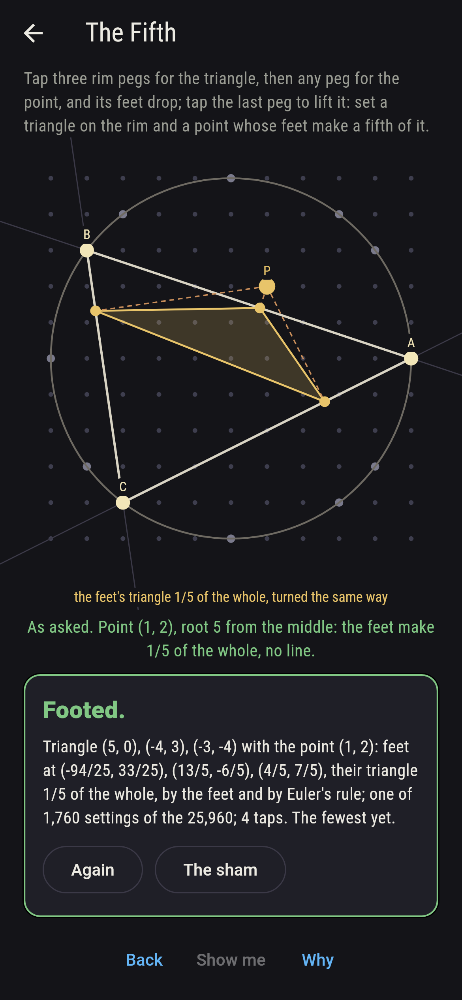
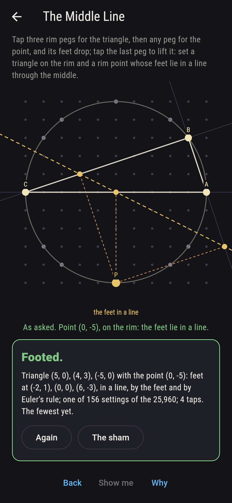
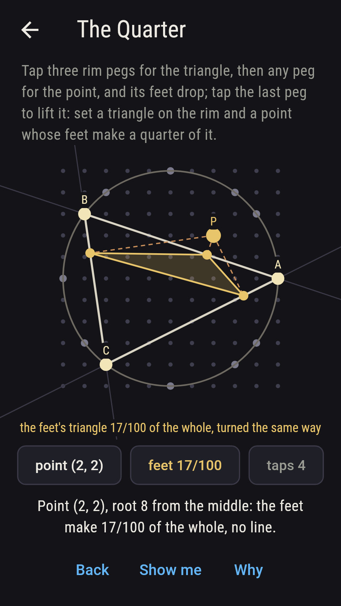
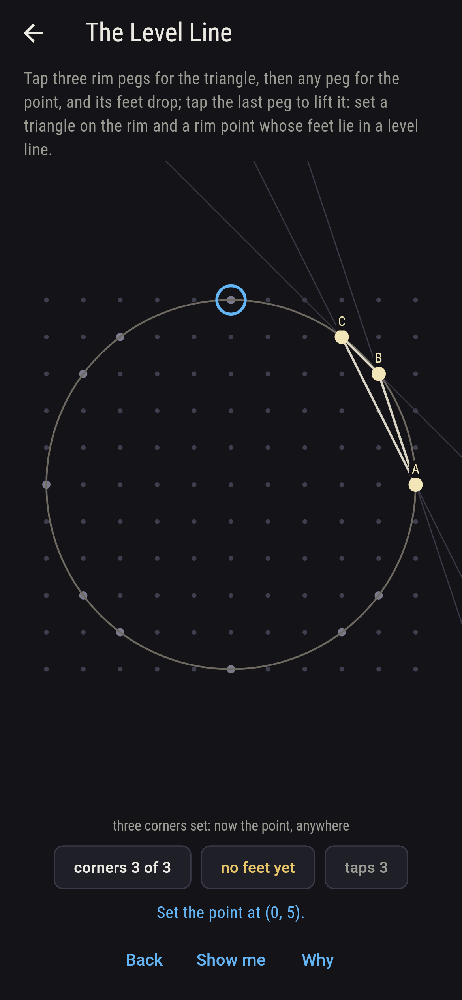
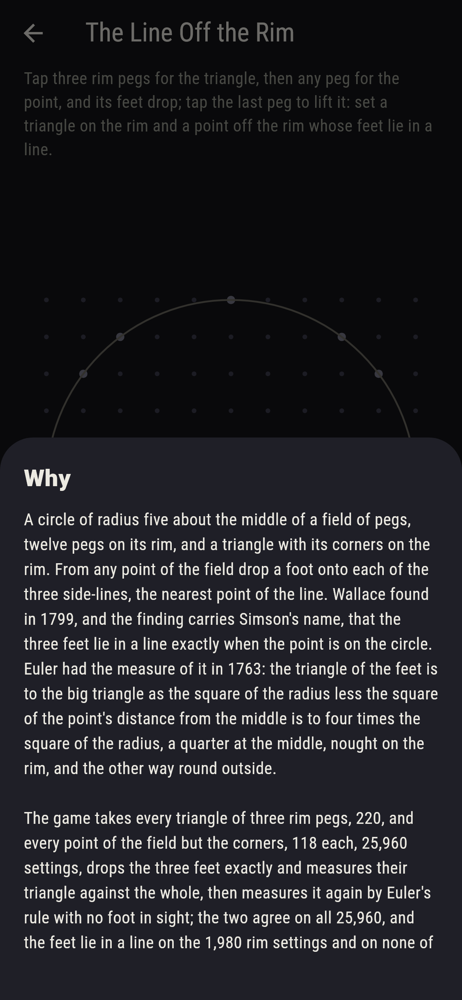

# Footbury



A circle of radius five about the middle of a field of pegs, twelve
pegs on its rim, and a triangle with its corners on the rim. From
any point of the field drop a foot onto each of the three side-lines,
the nearest point of the line. Wallace found in 1799, and the finding
carries Simson's name, that the three feet lie in a line exactly when
the point is on the circle. Euler had the measure of it in 1763: the
triangle of the feet is to the big triangle as the square of the
radius less the square of the point's distance from the middle is to
four times the square of the radius, a quarter at the middle, nought
on the rim, and the other way round outside. Tap three rim pegs for
the triangle, then any peg for the point, and its feet drop. The
game takes every triangle of three rim pegs, 220, and every point of
the field but the corners, 118 each, 25,960 settings, drops the
three feet exactly and measures their triangle against the whole,
then measures it again by Euler's rule with no foot in sight; the
two agree on all 25,960, and the feet lie in a line on the 1,980 rim
settings and on none of the others.

## The asks

1. **The Quarter** - set a triangle on the rim and a point whose feet make a quarter of it
2. **The Fifth** - set a triangle on the rim and a point whose feet make a fifth of it
3. **The Middle Line** - set a triangle on the rim and a rim point whose feet lie in a line through the middle
4. **The Level Line** - set a triangle on the rim and a rim point whose feet lie in a level line
5. **The Line Off the Rim** - set a triangle on the rim and a point off the rim whose feet lie in a line

The feet of the middle of the circle are the middles of the three
sides, and their triangle is a quarter of the whole for every one of
the 220 triangles on the rim. The feet's triangle is a fifth of the
whole when the point stands root five from the middle, at (1, 2),
(2, 1) or any of the eight such points, 1,760 settings; twenty
different shares come in all, from a quarter at the middle to minus
a quarter at the field's corners, where the feet turn the other way
round. With the point on the rim the feet lie in a line, Simson's,
and on 156 of the 1,980 rim settings the line runs through the
middle of the circle; it lies level on 114, and along one of the
triangle's own sides on 540. The Line Off the Rim is labeled
hopeless on its tile: Euler's rule said so first, and the sweep
finds the feet in a line on no setting with the point off the rim;
the sham admits it after three points off the rim have shown their
feet apart, or after sixteen taps.

## Two voices

The game never asserts what it has not computed, and it computes
everything at least twice:

* **The feet** are dropped exactly, each the nearest point of its
  side-line, and their triangle is measured against the whole by the
  shoelace on the six coordinates; every share and every line on the
  sham is that measure's, and every foot is checked to lie on its
  side-line with the drop square to it.
* **Euler's rule** drops no foot: it takes the square of the radius
  less the square of the point's distance from the middle, over four
  times the square of the radius, and it agrees with the feet on all
  25,960 settings; nought exactly on the rim, which is why the feet
  line up there and nowhere else.

`tool/check_feet.dart` runs the lot and refuses the bake on any
disagreement.

## The checker's ledger

What `dart run tool/check_feet.dart` printed for the build this
README shipped with, word for word:

```
every triangle of three rim pegs taken, 220, with every point of the field but its corners, 118 each, 25,960 settings, and the three feet dropped exactly, each on its side-line and square to it, their triangle measured against the whole by the feet themselves and again by Euler's rule, the square of the radius less the square of the point's distance from the middle over four times the square of the radius, the two agreeing on all 25,960: the feet lie in a line on the 1,980 settings with the point on the rim and on none of the 23,980 others; the feet's line runs through the middle on 156 rim settings, lies level on 114 and along a side of the triangle on 540; the feet make a quarter of the whole for the middle point on all 220 triangles and a fifth for the eight points root five out, 1,760 settings, and 20 shares come in all, from a quarter at the middle to minus a quarter at the field's corners

 1 The Quarter          set a triangle on the rim and a point whose feet make a quarter of it: 220 of the 25,960 settings land it
 2 The Fifth            set a triangle on the rim and a point whose feet make a fifth of it: 1,760 of the 25,960 settings land it
 3 The Middle Line      set a triangle on the rim and a rim point whose feet lie in a line through the middle: 156 of the 25,960 settings land it
 4 The Level Line       set a triangle on the rim and a rim point whose feet lie in a level line: 114 of the 25,960 settings land it
 5 The Line Off the Rim set a triangle on the rim and a point off the rim whose feet lie in a line: none of the 25,960, and Euler's rule said so first
```

## Screenshots

| The sham | The level line | The line off the rim admitted |
| --- | --- | --- |
|  |  |  |

| The quarter | The fifth | The middle line | Midway, on the small phone | Show me | The why |
| --- | --- | --- | --- | --- | --- |
|  |  |  |  |  |  |

Screenshots are drawn by `test/showcase_test.dart` at real phone
sizes with the app's own painter, then copied into `docs/` as they
came out; every peg in them was set by a tap, so nothing pictured is
a setting the game could not reach. The logo and every launcher icon
come out of `test/mark_test.dart` the same way: the mark is the
triangle (5, 0), (-4, 3), (-3, -4) on the rim, the point (0, 5)
above, and its three feet in a line.

## Building

```
flutter test          # 44 tests, the sweep among them
dart run tool/check_feet.dart
flutter build apk     # or: flutter build ios
```
