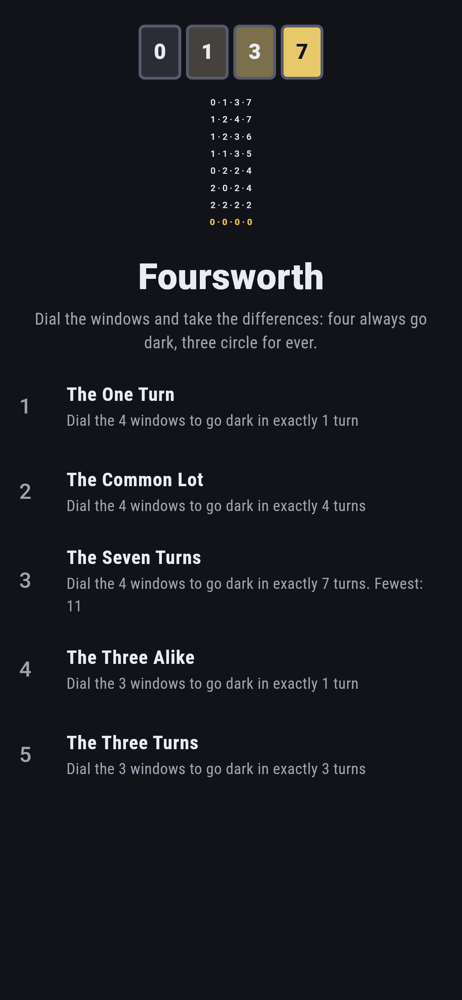
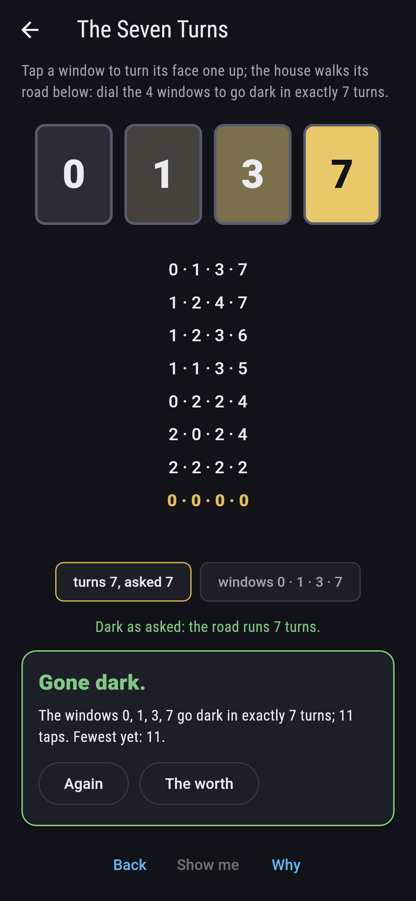
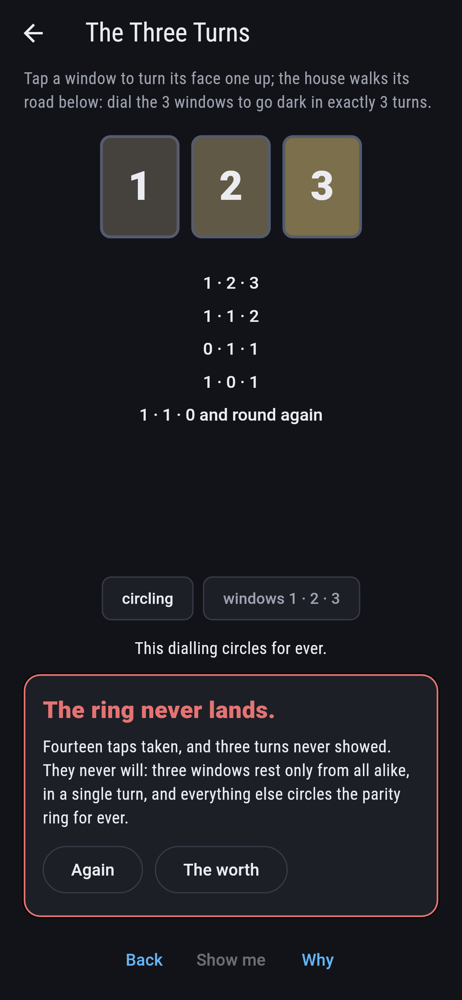
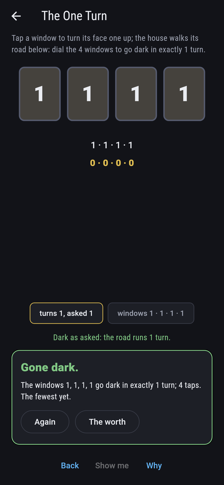
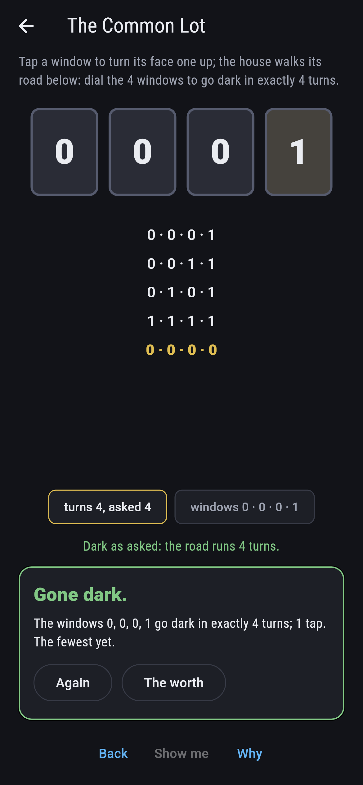
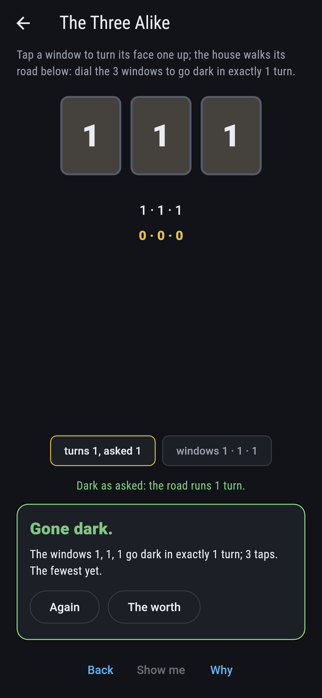
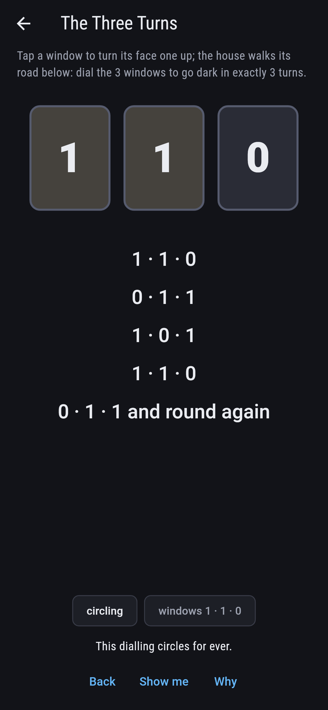
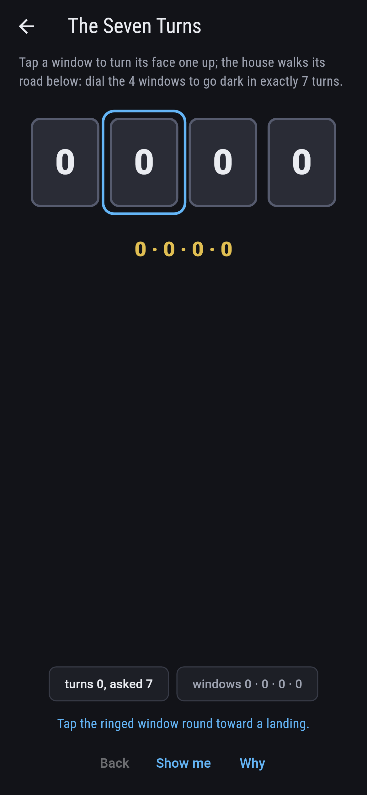
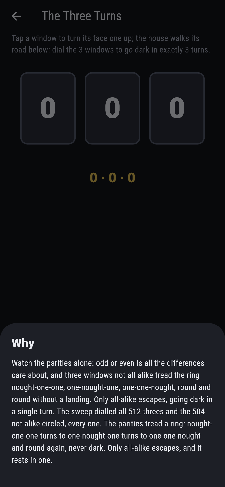

# Foursworth


Windows round a house, each showing nought to seven, and one
turn: every window takes the difference to its neighbour, all
at once, round the ring. Ducci's walk. Four windows always go
dark, by the seventh turn at the latest, because four turns
leave every face even and evens halve to a smaller game. Three
windows circle for ever unless they start all alike.

## The houses

1. **The One Turn** - dial the 4 windows to go dark in exactly 1 turn
2. **The Common Lot** - dial the 4 windows to go dark in exactly 4 turns
3. **The Seven Turns** - dial the 4 windows to go dark in exactly 7 turns
4. **The Three Alike** - dial the 3 windows to go dark in exactly 1 turn
5. **The Three Turns** - dial the 3 windows to go dark in exactly 3 turns

Seven diallings go dark at once, the four alike and lit. Four
turns is the commonest road, walked by more than half of all
4,096 diallings, and seven is the whole reach, 128 strong with
nought-one-three-seven among them. Three windows rest only from
all alike, in one turn, so The Three Turns is labeled hopeless
on its tile: everything else treads the parity ring for ever.

## Two voices

The game never asserts what it has not computed, and it computes
everything at least twice:

* **The walk** takes the differences turn upon turn and writes
  the whole road under the windows, darkness landing gold and
  the circling shown coming round again.
* **The halving law** holds on every four-window dialling:
  four turns leave every face even, checked across all 4,096,
  and the sweep pins the spread whole; the threes are swept
  besides, the eight all-alike resting and the 504 others
  circling, every one.

`tool/check_windows.dart` runs the lot and refuses the bake on
any disagreement.

## The checker's ledger

What `dart run tool/check_windows.dart` printed for the build
this README shipped with, word for word:

```
every dialling of every house walked, 4,096 of four windows and 512 of three: four windows always go dark by the seventh turn with every face even after the fourth, the spread pinned whole, while of the threes only the eight all-alike ever rest, the other 504 circling for ever on the parity ring

 1 The One Turn       dial the 4 windows to go dark in exactly 1 turn: 7 diallings of the sweep land it
 2 The Common Lot     dial the 4 windows to go dark in exactly 4 turns: 2384 diallings of the sweep land it
 3 The Seven Turns    dial the 4 windows to go dark in exactly 7 turns: 128 diallings of the sweep land it
 4 The Three Alike    dial the 3 windows to go dark in exactly 1 turn: 7 diallings of the sweep land it
 5 The Three Turns    dial the 3 windows to go dark in exactly 3 turns: none of the 512, and the parity ring said so first
```

## Screenshots

| The worth | The seven turns | The three turns admitted |
| --- | --- | --- |
|  |  |  |

| The one turn | The common lot | The three alike | Circling | Show me | The why |
| --- | --- | --- | --- | --- | --- |
|  |  |  |  |  |  |

Screenshots are drawn by `test/showcase_test.dart` at real phone
sizes with the app's own painter, then copied into `docs/` as
they came out; every tap in them was tapped, so nothing
pictured is a dialling the game could not reach. The logo and
every launcher icon come out of `test/mark_test.dart` the same
way: the mark is nought, one, three, seven walking its whole
road to the dark.

## Building

```
flutter test          # 43 tests, the sweep among them
dart run tool/check_windows.dart
flutter build apk     # or: flutter build ios
```
