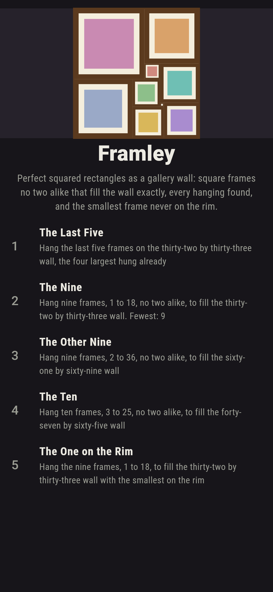
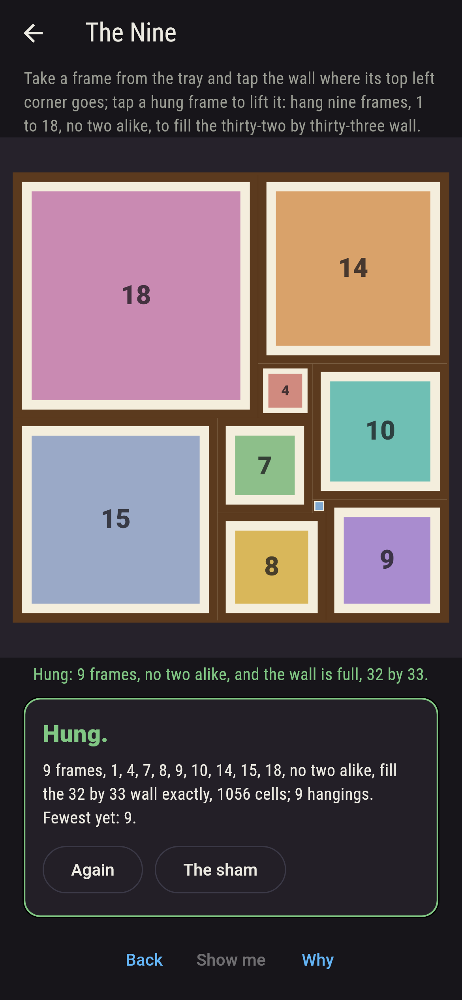
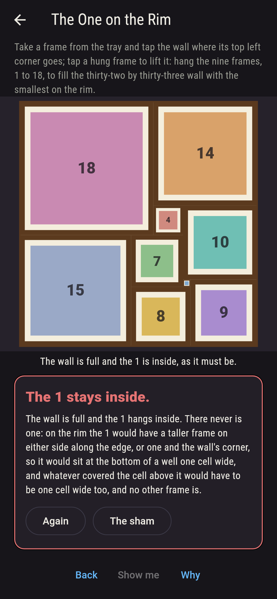
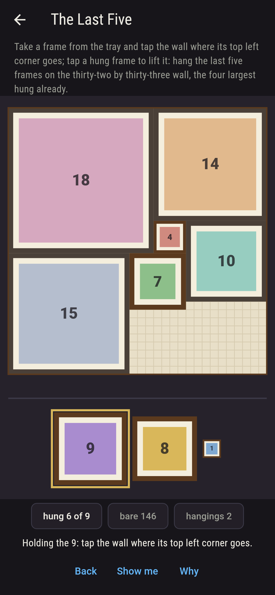
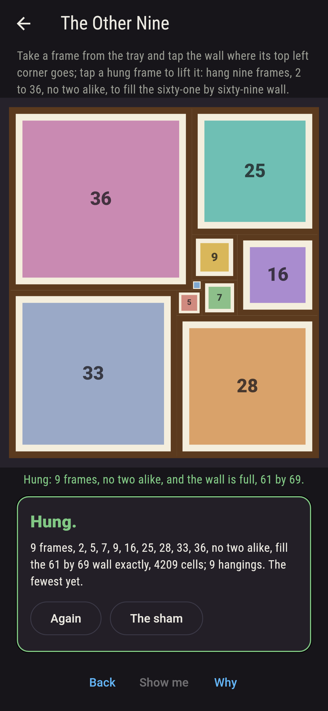
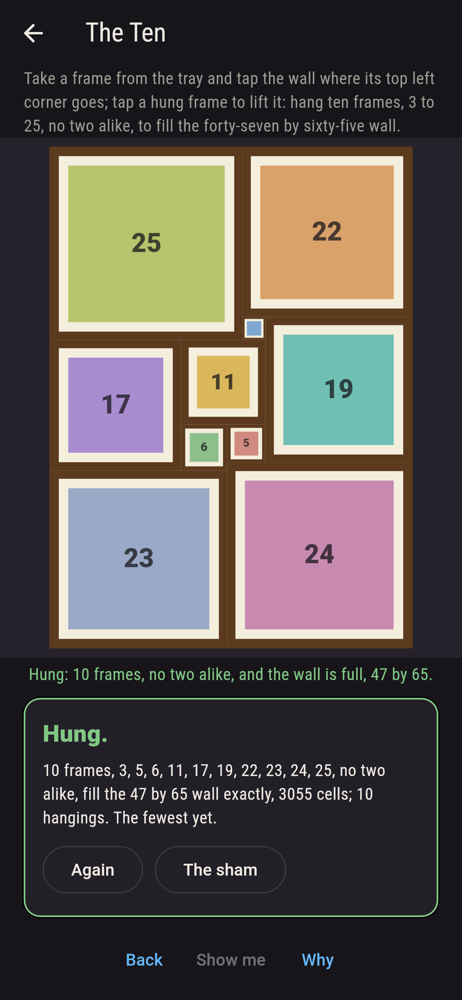
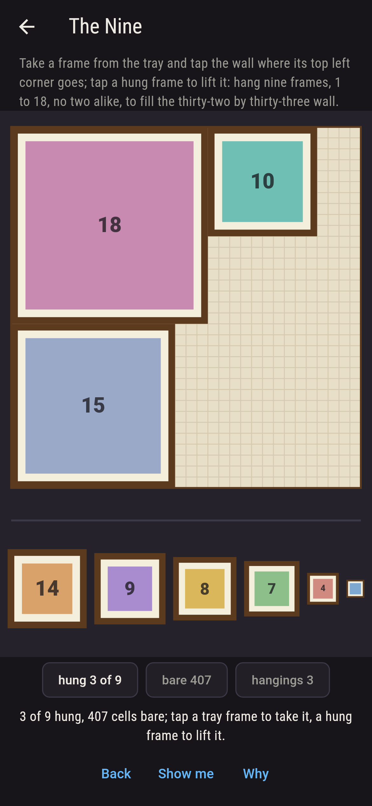
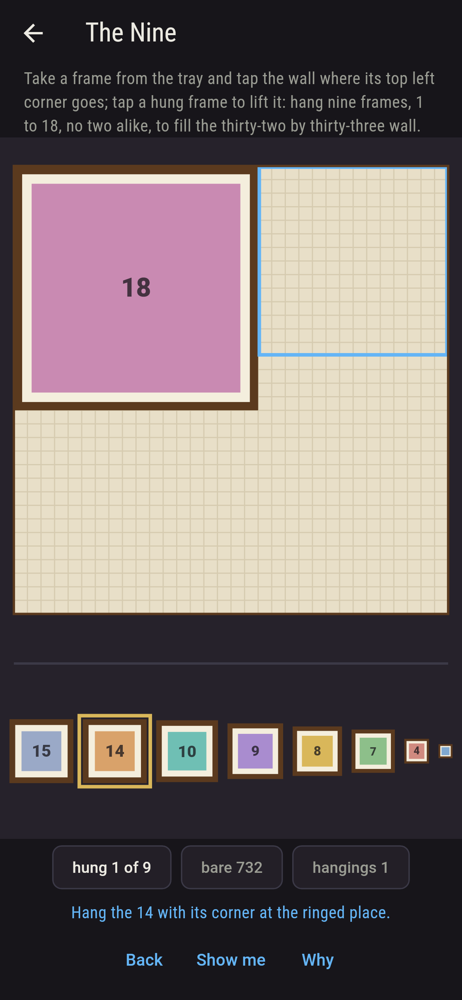
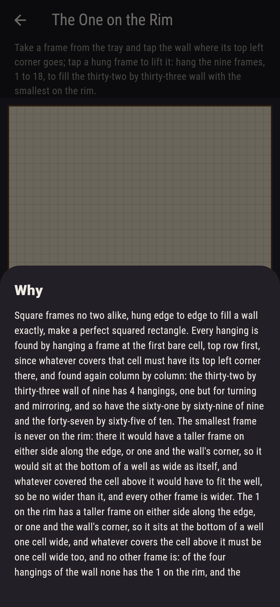

# Framley


A gallery wall hung with square picture frames, no two alike, edge
to edge, filling the wall exactly: a perfect squared rectangle.
Take a frame from the tray and tap the wall where its top left
corner goes; tap a hung frame to lift it. The walls are the real
ones: Moron's rectangle of 1925, thirty-two by thirty-three, hung
with the nine frames 1, 4, 7, 8, 9, 10, 14, 15 and 18; the other
wall of nine, sixty-one by sixty-nine; and a wall of ten,
forty-seven by sixty-five. Every hanging of each is found by
hanging a frame at the first bare cell, top row first, since
whatever covers that cell must have its top left corner there, and
found again column by column: four hangings a wall, one but for
turning and mirroring. The smallest frame is never on the rim: on
the rim it would sit at the bottom of a well as wide as itself,
between two taller frames or a taller frame and the wall's corner,
and whatever covered the cell above it would have to be no wider,
and every other frame is wider.

## The walls

1. **The Last Five** - hang the last five frames on the thirty-two by thirty-three wall, the four largest hung already
2. **The Nine** - hang nine frames, 1 to 18, no two alike, to fill the thirty-two by thirty-three wall
3. **The Other Nine** - hang nine frames, 2 to 36, no two alike, to fill the sixty-one by sixty-nine wall
4. **The Ten** - hang ten frames, 3 to 25, no two alike, to fill the forty-seven by sixty-five wall
5. **The One on the Rim** - hang the nine frames, 1 to 18, to fill the thirty-two by thirty-three wall with the smallest on the rim

With the 18, the 15, the 14 and the 10 hung, the last five go one
way. The Nine has four hangings, one turned and mirrored, its code
(18,14)(4,10)(15,7)(1,9)(8) read row by row, and the 1 hangs
walled in by the 7, the 8, the 9 and the 10; the Other Nine's code
is (36,25)(9,16)(2,7)(33,5)(28), the 2 walled in by the 5, the 7,
the 9 and the 36; the Ten's is (25,22)(3,19)(17,11)(6,5)(24)(23),
the 3 walled in by the 11, the 19, the 22 and the 25. The areas
add up, 1,056, 4,209 and 3,055. The One on the Rim is labeled
hopeless on its tile, and its wall, once full, is the why: the 1
is inside, and there is nowhere else for it.

## Two voices

The game never asserts what it has not computed, and it computes
everything at least twice:

* **The search** hangs frames at the first bare cell, top row
  first and left to right along it, and finds every hanging of
  every wall once; then it does it all again column by column, and
  the two agree, wall by wall and hanging by hanging. Every number
  on the sham is the search's, and every hanging it finds is
  checked to cover its wall once, no cell bare and none twice.
* **The turnings and the well** never search: the four hangings of
  each wall are one hanging turned and mirrored, the wall's four
  symmetries applied and matched; the areas of the frames add to
  the wall's; and the well says the smallest frame is off the rim,
  which every hanging found bears out, and which the search with
  the smallest held to the rim finds nothing against.

`tool/check_walls.dart` runs the lot and refuses the bake on any
disagreement.

## The checker's ledger

What `dart run tool/check_walls.dart` printed for the build this
README shipped with, word for word:

```
every hanging of the nine frames 1, 4, 7, 8, 9, 10, 14, 15 and 18 on the thirty-two by thirty-three wall found by hanging at the first bare cell, top row first, and found again column by column: 4 hangings, one but for turning and mirroring, its code (18,14)(4,10)(15,7)(1,9)(8) read row by row; the nine 2, 5, 7, 9, 16, 25, 28, 33 and 36 on sixty-one by sixty-nine the same, 4 hangings, code (36,25)(9,16)(2,7)(33,5)(28); the ten 3, 5, 6, 11, 17, 19, 22, 23, 24 and 25 on forty-seven by sixty-five the same, 4 hangings, code (25,22)(3,19)(17,11)(6,5)(24)(23); the areas add up, 1,056, 4,209 and 3,055, and every hanging covers its wall once; in every hanging the smallest frame is off the rim, walled in by 7, 8, 9 and 10, by 5, 7, 9 and 36, and by 11, 19, 22 and 25, and with the smallest held to the rim there is no hanging at all, as the well says: on the rim it would sit at the bottom of a well as wide as itself, and every other frame is wider

 1 The Last Five      hang the last five frames on the thirty-two by thirty-three wall, the four largest hung already: 1 hanging fills it
 2 The Nine           hang nine frames, 1 to 18, no two alike, to fill the thirty-two by thirty-three wall: 4 hangings fill it, one but for turning and mirroring
 3 The Other Nine     hang nine frames, 2 to 36, no two alike, to fill the sixty-one by sixty-nine wall: 4 hangings fill it, one but for turning and mirroring
 4 The Ten            hang ten frames, 3 to 25, no two alike, to fill the forty-seven by sixty-five wall: 4 hangings fill it, one but for turning and mirroring
 5 The One on the Rim hang the nine frames, 1 to 18, to fill the thirty-two by thirty-three wall with the smallest on the rim: none of the 4, and the well said so first
```

## Screenshots

| The sham | The nine | The one on the rim admitted |
| --- | --- | --- |
|  |  |  |

| The last five | The other nine | The ten | A wrong hanging | Show me | The why |
| --- | --- | --- | --- | --- | --- |
|  |  |  |  |  |  |

Screenshots are drawn by `test/showcase_test.dart` at real phone
sizes with the app's own painter, then copied into `docs/` as they
came out; every frame in them was hung by a tap, so nothing
pictured is a wall the game could not reach. The logo and every
launcher icon come out of `test/mark_test.dart` the same way: the
mark is Moron's wall of nine, hung.

## Building

```
flutter test          # 50 tests, the search among them
dart run tool/check_walls.dart
flutter build apk     # or: flutter build ios
```
