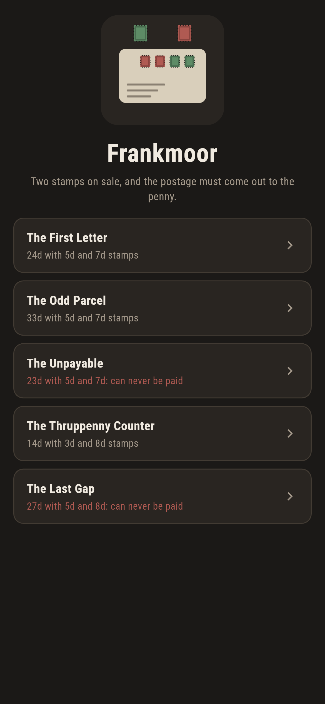
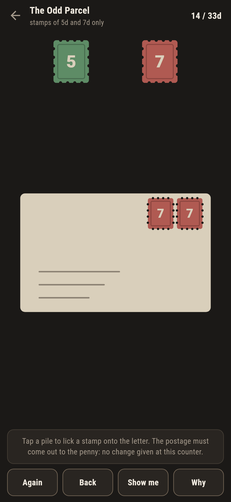
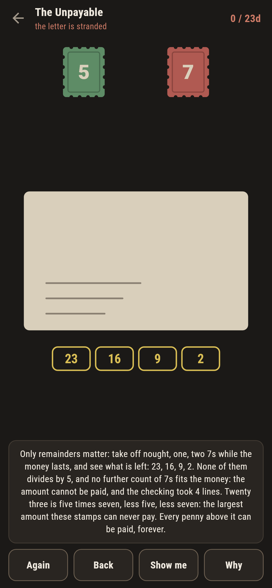
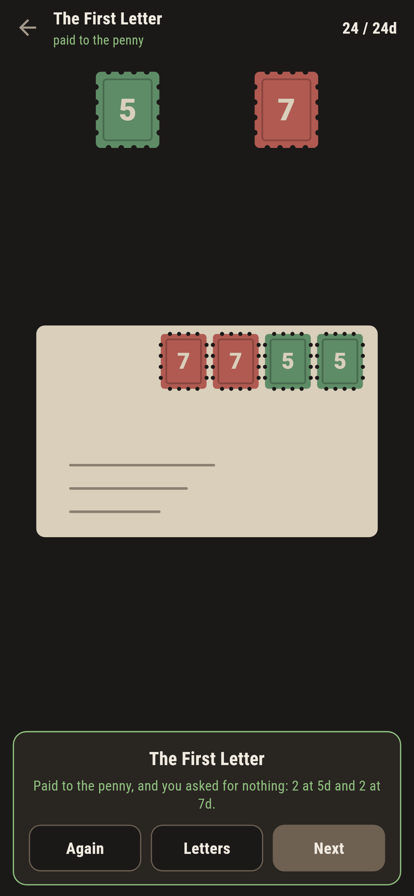
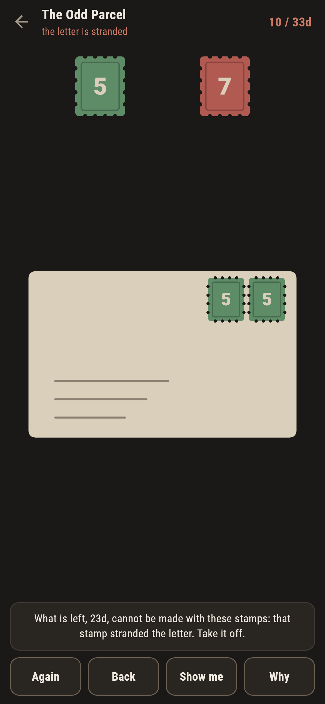

# Frankmoor

A post-office puzzle for phones, in Flutter, for Android and iOS.

Two stamps on sale, coprime in value, and the postage must come out to
the penny: no change given at this counter. Most amounts are easy. Some
cannot be paid at all, there is a largest such amount, and above it every
penny is payable forever. That is the Frobenius problem, worked at a
village counter.

| | | | |
|---|---|---|---|
|  |  |  |  |

## The proof fits on the counter

Only remainders matter. To pay an amount with fives and sevens, take off
nought, one, two, three, four sevens while the money lasts, and look at
what is left: for twenty three that is 23, 16, 9, 2, and none of them
ends in five or nought. Four lines, done: twenty three can never be
paid. **Why** lays that walk out in chips under the envelope, for
whatever is owed at that moment, and lights the chip that divides when
one exists.

```
$ make letters
stamps 5 and 7: last gap 23, 12 gaps in all, both swept true
stamps 3 and 8: last gap 13, 7 gaps in all, both swept true
stamps 5 and 8: last gap 27, 14 gaps in all, both swept true

 1 The First Letter       24d with 5s and 7s  2 and 2
 2 The Odd Parcel         33d with 5s and 7s  1 and 4
 3 The Unpayable          23d with 5s and 7s  cannot be paid
 4 The Thruppenny Counter 14d with 3s and 8s  2 and 1
 5 The Last Gap           27d with 5s and 8s  cannot be paid
```

## The old rules, swept true

With stamps a and b the largest unpayable amount is ab less a less b,
and exactly half of (a-1)(b-1) amounts are unpayable in all: twenty
three and twelve for fives and sevens. The suite sweeps both rules on
every stamp pair the game uses, checks everything above the bound stays
payable well past it, and holds the remainder walk against plain brute
force on every amount to a hundred.

Both unpayable letters ship as their stamps' own largest gap, labelled
in the house tradition, one pair each: the rule is the same rule every
pair of stamps obeys.


## Stranding is called as it lands

The Odd Parcel wants four sevens and a single five, and no other way:
reach for fives first and the game says so the moment the second one
sticks, because what is left can no longer be made. Overshooting is as
wrong as undershooting, and the ledger says both sides of the sum.



## Building

```
make deps     # fetch packages
make check    # analyze + every test
make letters  # the old rules swept, then the ledger
make shots    # render the screenshots and redraw the icons
make apk      # Android release build
make ios      # iOS release build (unsigned)
```

The logo and every app icon are drawn by the game's own painter in
`test/mark_test.dart`. There is no image in this repository that was not
produced by code in it.

## How it is put together

```
lib/post/rules.dart      the remainder walk, the sweeps, the old rules
lib/post/letter.dart     a letter: stamps on sale, postage owed
lib/post/letters.dart    the five letters that ship
lib/post/play.dart       a letter at the counter: stamps on, the live
                         answer
lib/ui/                  the painter, the screens, the mark
tool/check_letters.dart  the ledger above
```

The tests hold the walk against brute force on every amount to a
hundred, sweep the Frobenius bound and the gap count on every pair in
use, pin the twenty-three walk line by line, pay every payable letter by
following the game's own pointer, and hold the pictures against the real
widget tree. If any of that drifts, `make check` goes red before
anything leaves the machine.
