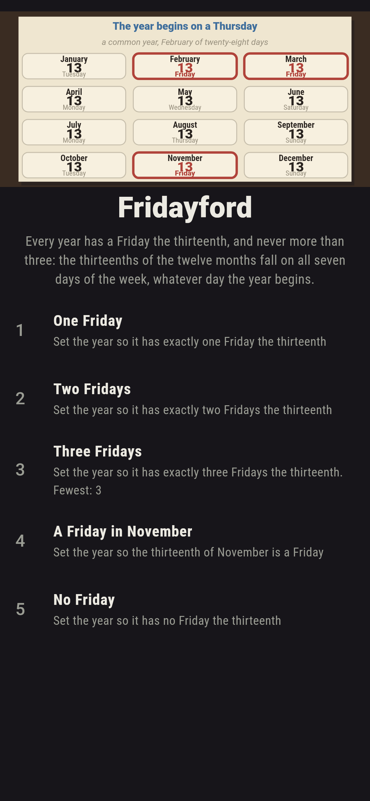
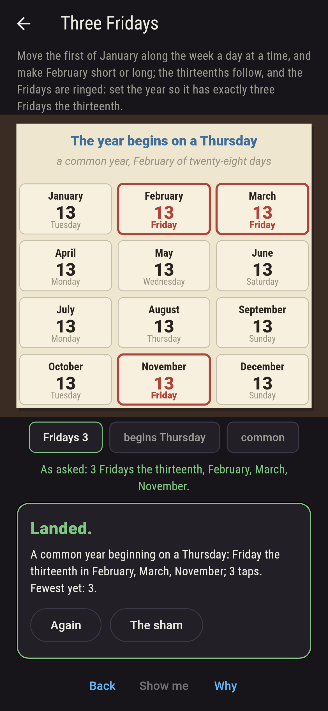
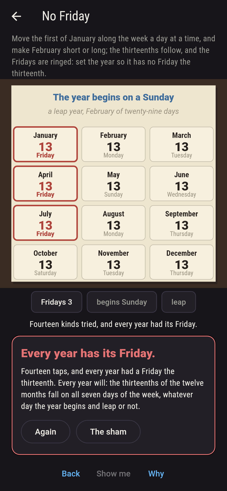
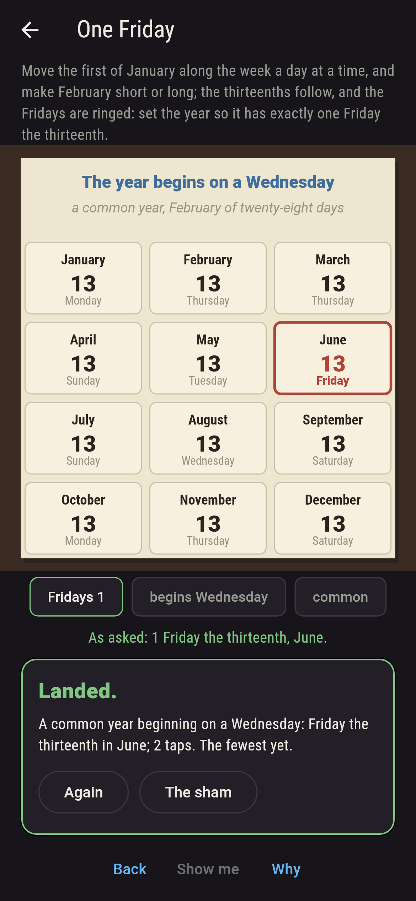
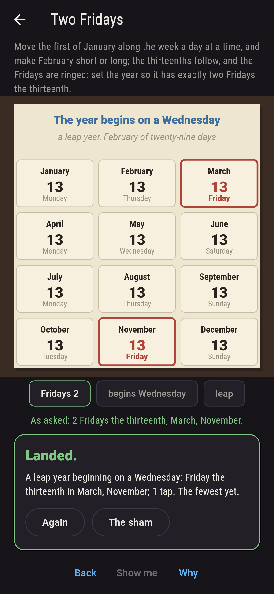
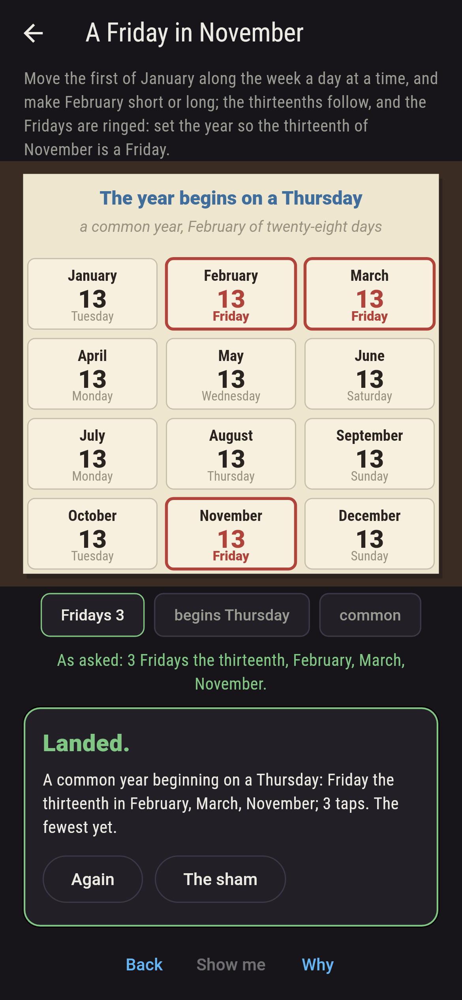
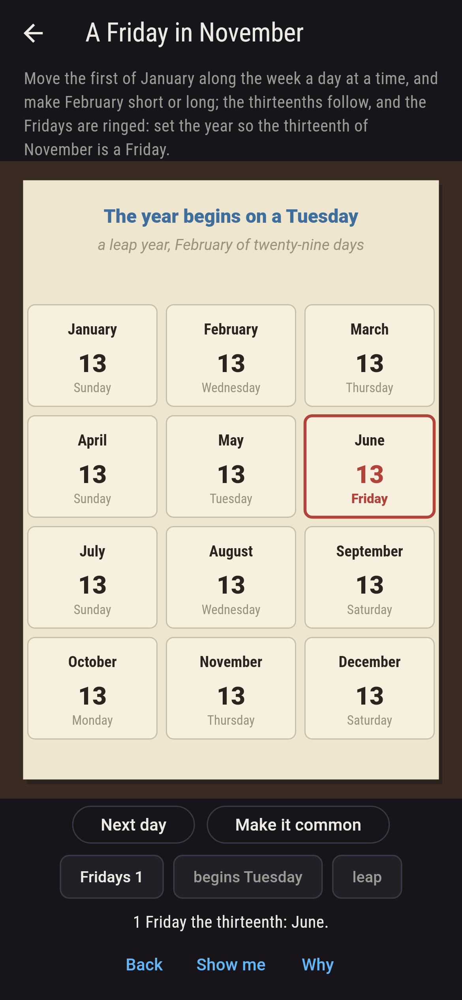
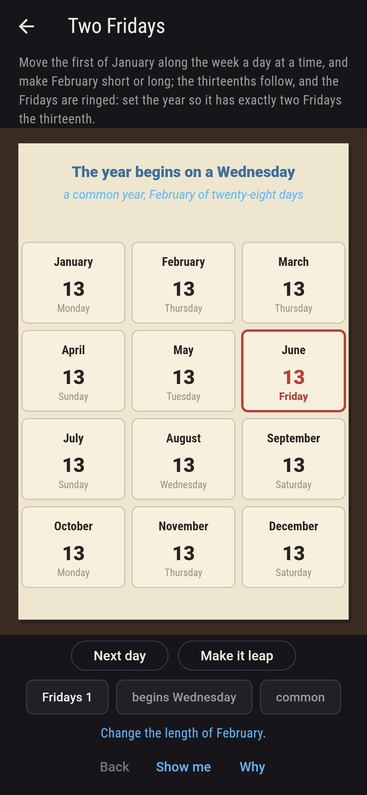
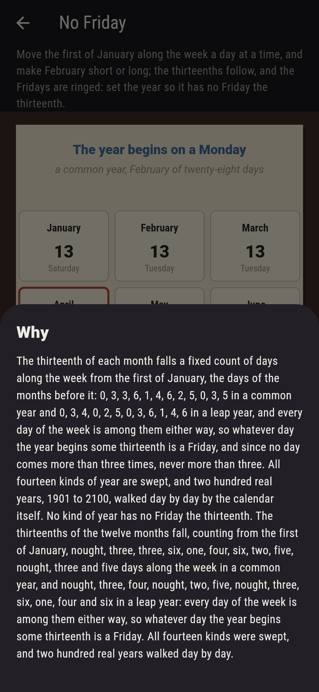

# Fridayford


An almanac page. Move the first of January along the week a day at
a time, and make February short or long, and the thirteenths of the
twelve months follow, the Fridays ringed in red. Every year has a
Friday the thirteenth, and never more than three: the thirteenth of
each month falls a fixed count of days along the week from the first
of January, the days of the months before it, and those counts,
nought, three, three, six, one, four, six, two, five, nought, three
and five in a common year, nought, three, four, nought, two, five,
nought, three, six, one, four and six in a leap year, take in every
day of the week either way, so whatever day the year begins some
thirteenth is a Friday, and since no count comes more than three
times, at most three are. The game sweeps all fourteen kinds of year
and walks two hundred real years, 1901 to 2100, day by day by the
phone's own calendar.

## The asks

1. **One Friday** - set the year so it has exactly one Friday the thirteenth
2. **Two Fridays** - set the year so it has exactly two Fridays the thirteenth
3. **Three Fridays** - set the year so it has exactly three Fridays the thirteenth
4. **A Friday in November** - set the year so the thirteenth of November is a Friday
5. **No Friday** - set the year so it has no Friday the thirteenth

Six kinds of year have one Friday the thirteenth, six have two and
two have three, a common year beginning on a Thursday and a leap
year beginning on a Sunday; the thirteenth of November is a Friday
in two kinds. No Friday is labeled hopeless on its tile, and the
why counts the days along the week.

## Two voices

The game never asserts what it has not computed, and it computes
everything at least twice:

* **The sweep** takes all fourteen kinds of year, seven days for the
  first of January and February short or long, and reads the day of
  the week of every thirteenth from the lengths of the months
  before it; every count on the sham is that sweep's, and the kinds
  are found to have one, two or three Fridays and never none.
* **The calendar itself** is the phone's: two hundred real years,
  1901 to 2100, are walked day by day with the platform's own
  reckoning of dates, each found to be one of the fourteen kinds
  and to have exactly the Fridays the thirteenth its kind says, and
  the offsets of the thirteenths are held to cover the whole week
  in a common year and in a leap year alike.

`tool/check_years.dart` runs the lot and refuses the bake on any
disagreement.

## The checker's ledger

What `dart run tool/check_years.dart` printed for the build this
README shipped with, word for word:

```
all fourteen kinds of year swept, seven days for the first of January and February short or long, and the thirteenths of the months fall nought, three, three, six, one, four, six, two, five, nought, three and five days along the week from the first in a common year and nought, three, four, nought, two, five, nought, three, six, one, four and six in a leap year, every day of the week among them either way, so every kind has a Friday the thirteenth, one to three of them and never more; 200 real years walked day by day from 1901 to 2100 by the calendar itself, each of the kind its first day and its February say and each with the Fridays its kind says, 86 with one, 29 with three, the first of them 1903, 1914, 1925, 1928, 1931, 1942; one Friday comes 6 kinds of 14, two 6, three 2, November's 2, and none never

 1 One Friday           set the year so it has exactly one Friday the thirteenth: 6 of the 14 kinds of year land it
 2 Two Fridays          set the year so it has exactly two Fridays the thirteenth: 6 of the 14 kinds of year land it
 3 Three Fridays        set the year so it has exactly three Fridays the thirteenth: 2 of the 14 kinds of year land it
 4 A Friday in November set the year so the thirteenth of November is a Friday: 2 of the 14 kinds of year land it
 5 No Friday            set the year so it has no Fridays the thirteenth: none of the 14, and the offsets said so first
```

## Screenshots

| The sham | Three Fridays | No Friday admitted |
| --- | --- | --- |
|  |  |  |

| One Friday | Two Fridays | A Friday in November | Mid-setting | Show me | The why |
| --- | --- | --- | --- | --- | --- |
|  |  |  |  |  |  |

Screenshots are drawn by `test/showcase_test.dart` at real phone
sizes with the app's own painter, then copied into `docs/` as they
came out; every year in them was set by taps, so nothing pictured is
an almanac the game could not reach. The logo and every launcher
icon come out of `test/mark_test.dart` the same way: the mark is a
common year beginning on a Thursday, its three Fridays ringed.

## Building

```
flutter test          # 43 tests, the sweep among them
dart run tool/check_years.dart
flutter build apk     # or: flutter build ios
```
