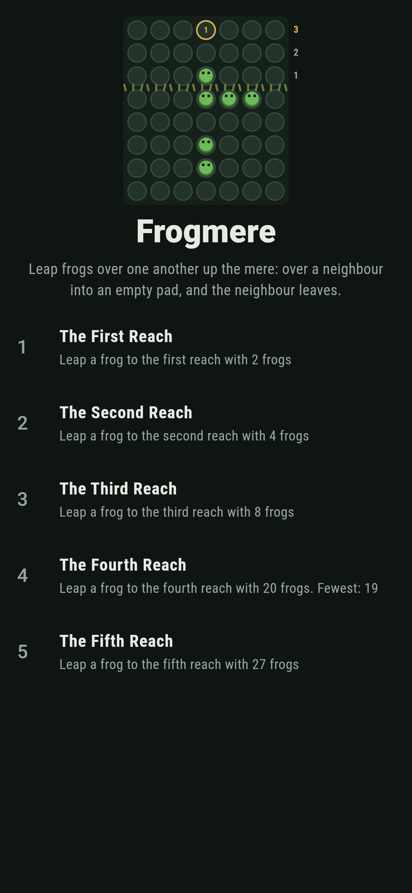
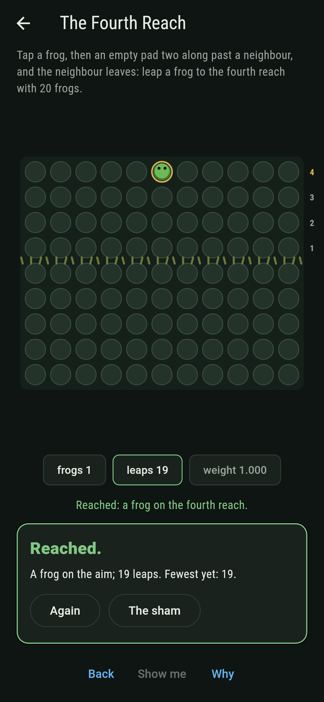
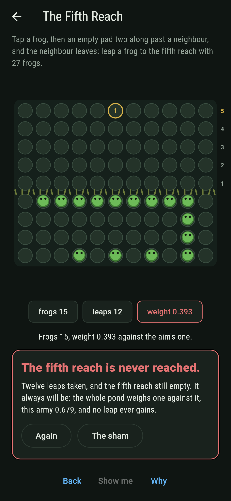
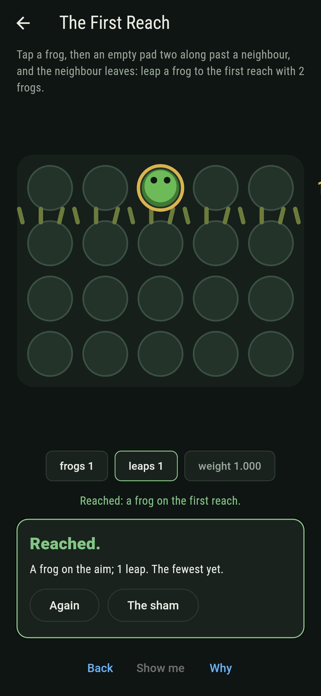
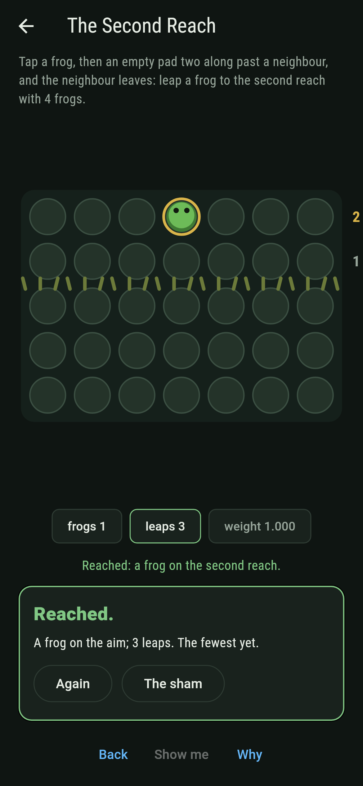
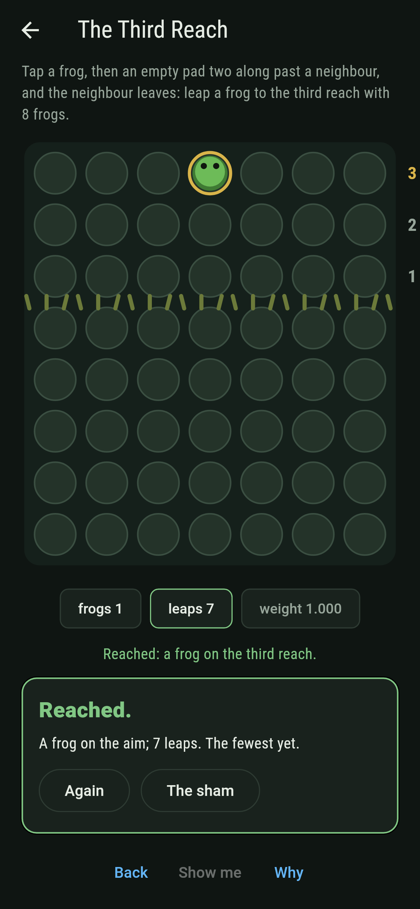
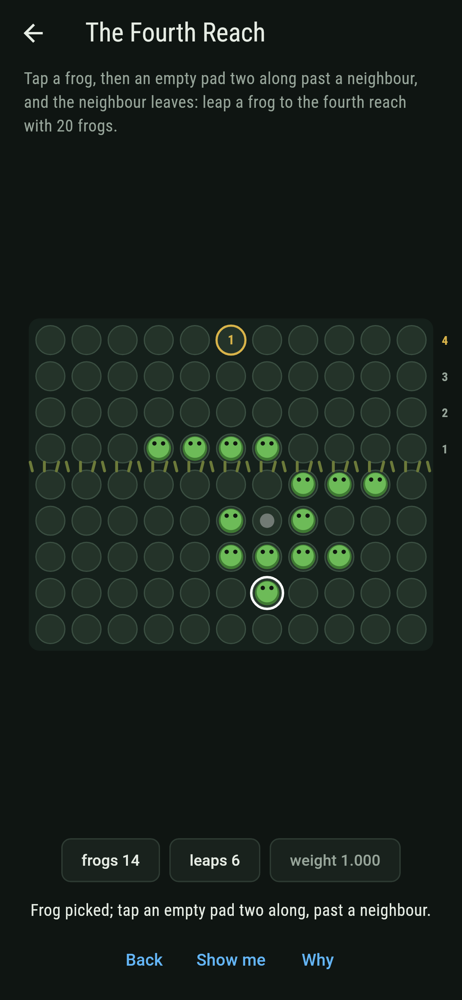
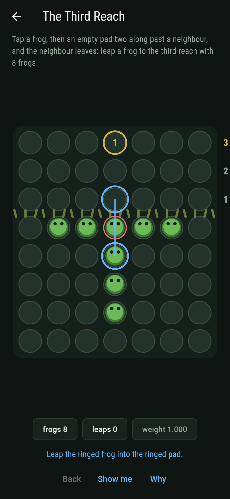
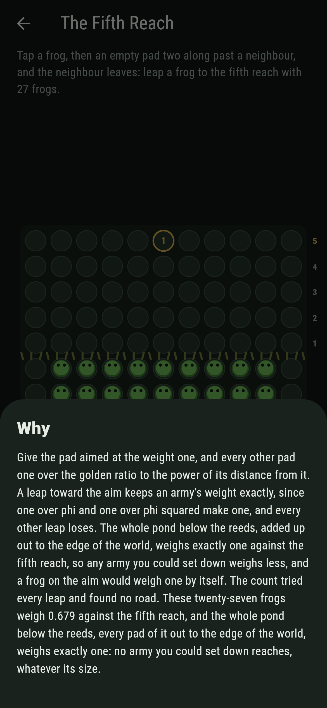

# Frogmere


Frogs on the pads of a mere, all of them below the reeds to
start, leaping as in solitaire: over a neighbour into an empty
pad beyond, and the neighbour leaves. How high above the reeds
can a frog be got? Two frogs reach the first row, four the
second, eight the third and twenty the fourth. Nobody reaches the
fifth, and Conway's reckoning says why: weigh every pad by the
golden ratio and the whole pond adds up to exactly one against
it, while a frog on the aim would weigh one by itself.

## The reaches

1. **The First Reach** - leap a frog to the first reach with 2 frogs
2. **The Second Reach** - leap a frog to the second reach with 4 frogs
3. **The Third Reach** - leap a frog to the third reach with 8 frogs
4. **The Fourth Reach** - leap a frog to the fourth reach with 20 frogs
5. **The Fifth Reach** - leap a frog to the fifth reach with 27 frogs

Every army that lands weighs exactly one against its aim, so every
road spends every frog: one leap, three, seven, nineteen. Three
frogs cannot reach the second row, seven cannot reach the third,
and nineteen cannot reach the fourth, the count says, army by
army. From the twenty the nineteen leaps can be ordered
369,106,018 ways. The Fifth Reach is labeled hopeless on its
tile, and the why weighs the pond.

## Two voices

The game never asserts what it has not computed, and it computes
everything at least twice:

* **The count** walks every order of leaps that keeps an army's
  weight at one or above, since no other standing can get back to
  the aim, and counts the roads that land: 1, 1, 8 and
  369,106,018, and none to the fifth reach.
* **The reckoning** is done in the golden ratio's own arithmetic,
  numbers of the form a + b phi kept exact: one over phi and one
  over phi squared make one, so a leap toward the aim keeps the
  weight to the last digit, and every other leap loses, checked
  over every pad and direction. The four armies weigh exactly one,
  the nineteen heaviest pads against the fourth reach weigh exactly
  one, and the whole pond against the fifth weighs exactly one by
  the series, which the numbers creep up to as the pond is added
  out to sixty pads each way.

`tool/check_reaches.dart` runs the lot and refuses the bake on any
disagreement.

## The checker's ledger

What `dart run tool/check_reaches.dart` printed for the build this
README shipped with, word for word:

```
every road of every reach counted, 1, 1, 8 and 369,106,018 of them and none to the fifth: a leap toward the aim keeps the weight exactly and every other leap loses, the four armies that land weigh exactly one so every road spends every frog, three frogs weigh 0.854 at most against the second reach and seven 0.944 against the third, all 84 nineteen-frog armies weighing one against the fourth find no road, and the whole pond below the reeds weighs exactly one against the fifth by the series and 0.679 for the twenty-seven set down

 1 The First Reach   leap a frog to the first reach with 2 frogs: 1 road of the count lands it in 1 leap
 2 The Second Reach  leap a frog to the second reach with 4 frogs: 1 road of the count lands it in 3 leaps
 3 The Third Reach   leap a frog to the third reach with 8 frogs: 8 roads of the count land it in 7 leaps
 4 The Fourth Reach  leap a frog to the fourth reach with 20 frogs: 369,106,018 roads of the count land it in 19 leaps
 5 The Fifth Reach   leap a frog to the fifth reach with 27 frogs: none, and the whole pond weighs one, so no army ever will
```

## Screenshots

| The sham | The fourth reach reached | The fifth reach admitted |
| --- | --- | --- |
|  |  |  |

| The first reach | The second reach | The third reach | Mid-leap | Show me | The why |
| --- | --- | --- | --- | --- | --- |
|  |  |  |  |  |  |

Screenshots are drawn by `test/showcase_test.dart` at real phone
sizes with the app's own painter, then copied into `docs/` as they
came out; every leap in them was tapped, so nothing pictured is a
standing the game could not reach. The logo and every launcher
icon come out of `test/mark_test.dart` the same way: the mark is
the eight-frog cross of the third reach, two leaps in.

## Building

```
flutter test          # 50 tests, the count among them
dart run tool/check_reaches.dart
flutter build apk     # or: flutter build ios
```
