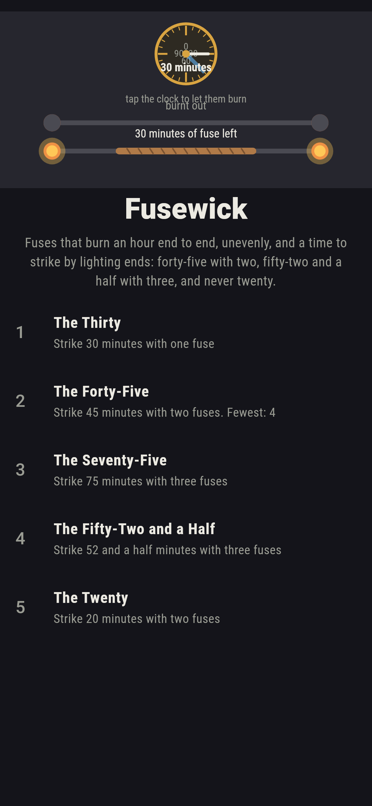
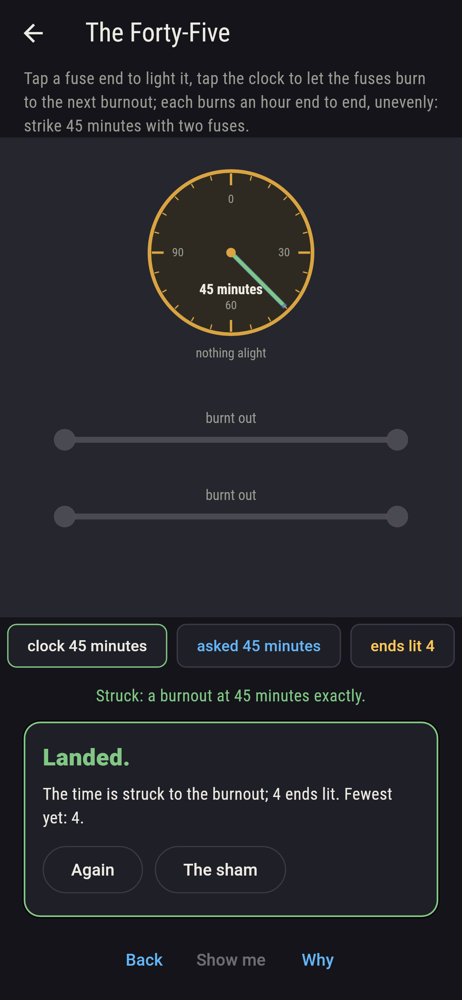
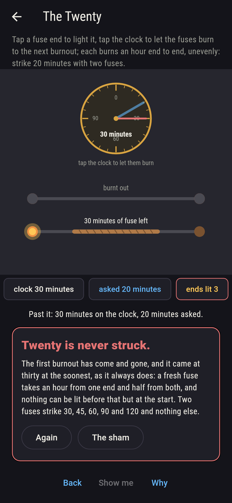
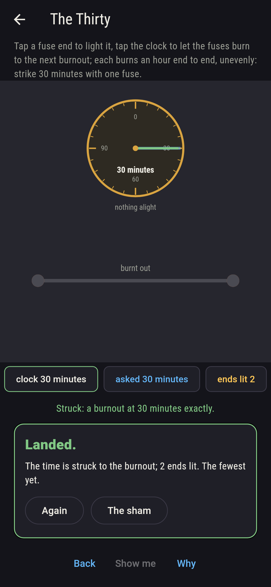
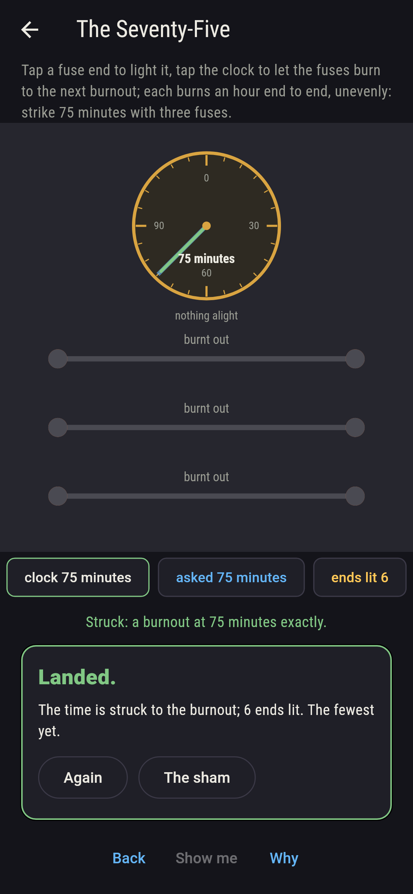
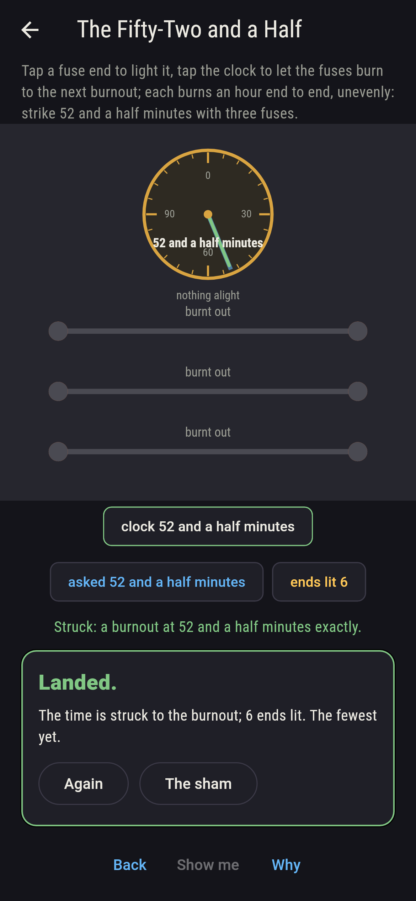
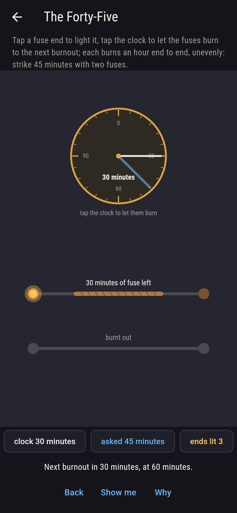
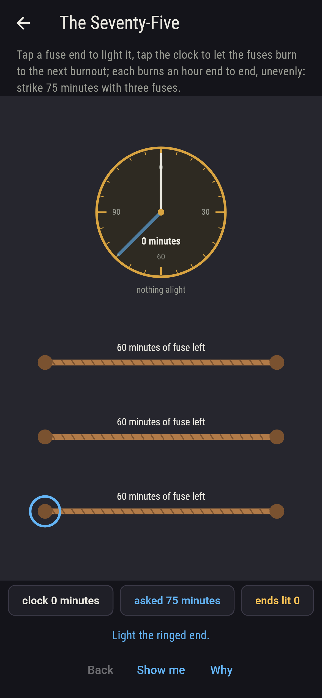
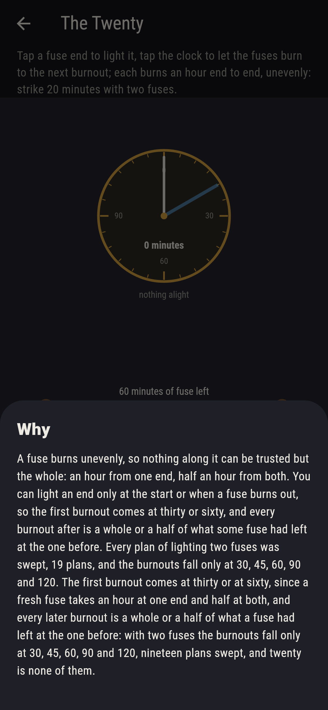

# Fusewick


Fuses that burn an hour from end to end, but unevenly, so nothing
along a fuse can be trusted but the whole: an hour lit at one end,
half an hour lit at both. You may light an end at the start, or at
the moment a fuse burns out, and nothing in between; the game
asks for a burnout at a given minute. Two fuses strike forty-five,
three strike fifty-two and a half, and no lighting of two fuses
ever strikes twenty: the first burnout comes at thirty or sixty,
and every one after is a whole or a half of what some fuse had
left, so two fuses only ever strike 30, 45, 60, 90 and 120. Every
plan of lighting one, two and three fuses is swept, and the times
they strike are read off every plan.

## The times

1. **The Thirty** - strike 30 minutes with one fuse
2. **The Forty-Five** - strike 45 minutes with two fuses
3. **The Seventy-Five** - strike 75 minutes with three fuses
4. **The Fifty-Two and a Half** - strike 52 and a half minutes with three fuses
5. **The Twenty** - strike 20 minutes with two fuses

One fuse strikes thirty and sixty and nothing else; two strike
30, 45, 60, 90 and 120, nineteen plans in all; three strike those
and 52 and a half, 67 and a half, 75, 105, 150 and 180 besides,
231 plans. The Twenty is labeled hopeless on its tile, and the
why says why in a sentence: nothing burns out before thirty.

## Two voices

The game never asserts what it has not computed, and it computes
everything at least twice:

* **The sweep** lights every plan: at the start and at every
  burnout, each fuse with fuse left may have any of its unlit
  ends lit, and the fuses burn on to the next burnout, an hour
  from one end or half from both of whatever is left, kept in
  quarter-minutes; the times struck are read off every plan, and
  every burnout is checked to fall on a whole half minute.
* **The show-me's plan** is found by a separate walk and played
  through the game itself for every time that ships, striking it
  to the minute; and the times two and three fuses strike are
  held to their multiples, fifteen and seven and a half.

`tool/check_burns.dart` runs the lot and refuses the bake on any
disagreement.

## The checker's ledger

What `dart run tool/check_burns.dart` printed for the build this
README shipped with, word for word:

```
every plan of lighting swept for one, two and three fuses, 3 and 19 and 231 plans, each fuse an hour end to end and lit at either end at the start or at a burnout: one fuse strikes 30, 60, two strike 30, 45, 60, 90, 120, all multiples of fifteen, and three strike 30, 45, 52 and a half, 60, 67 and a half, 75, 90, 105, 120, 150, 180, all multiples of seven and a half; every burnout falls on a whole half minute, and twenty is struck by no plan of two

 1 The Thirty               strike 30 minutes with one fuse: 1 of the 3 plans strikes it
 2 The Forty-Five           strike 45 minutes with two fuses: 2 of the 19 plans strike it
 3 The Seventy-Five         strike 75 minutes with three fuses: 18 of the 231 plans strike it
 4 The Fifty-Two and a Half strike 52 and a half minutes with three fuses: 6 of the 231 plans strike it
 5 The Twenty               strike 20 minutes with two fuses: none of the 19, and the first burnout said so first
```

## Screenshots

| The sham | The forty-five struck | The twenty admitted |
| --- | --- | --- |
|  |  |  |

| The thirty | The seventy-five | The fifty-two and a half | Mid-burn | Show me | The why |
| --- | --- | --- | --- | --- | --- |
|  |  |  |  |  |  |

Screenshots are drawn by `test/showcase_test.dart` at real phone
sizes with the app's own painter, then copied into `docs/` as they
came out; every end in them was lit by a tap and every minute
burnt by one, so nothing pictured is a moment the game could not
reach. The logo and every launcher icon come out of
`test/mark_test.dart` the same way: the mark is the forty-five at
its half hour, one fuse burnt out and the other lit at both ends
with half an hour of fuse left.

## Building

```
flutter test          # 43 tests, the sweep among them
dart run tool/check_burns.dart
flutter build apk     # or: flutter build ios
```
