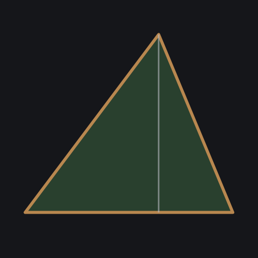
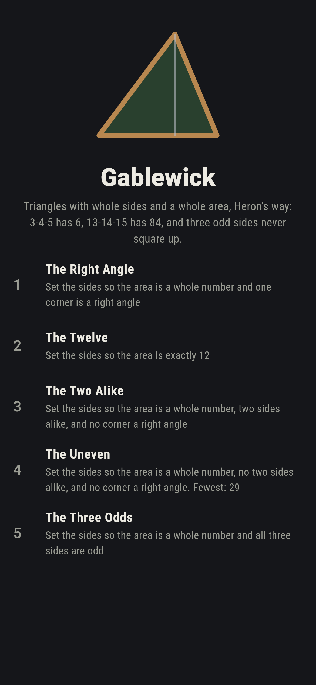
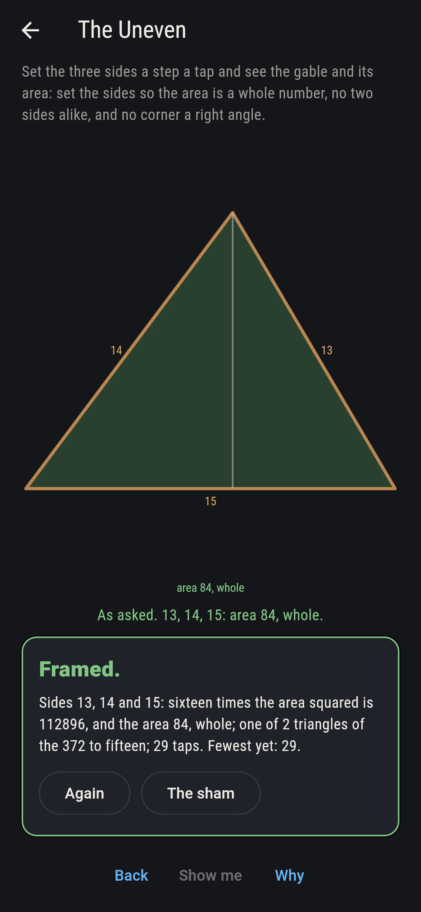
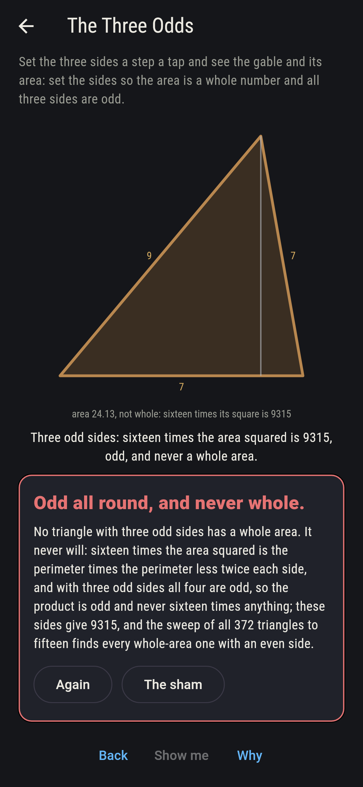
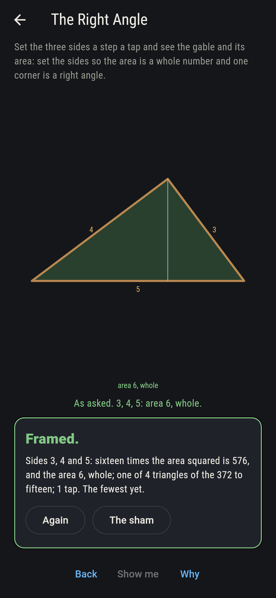
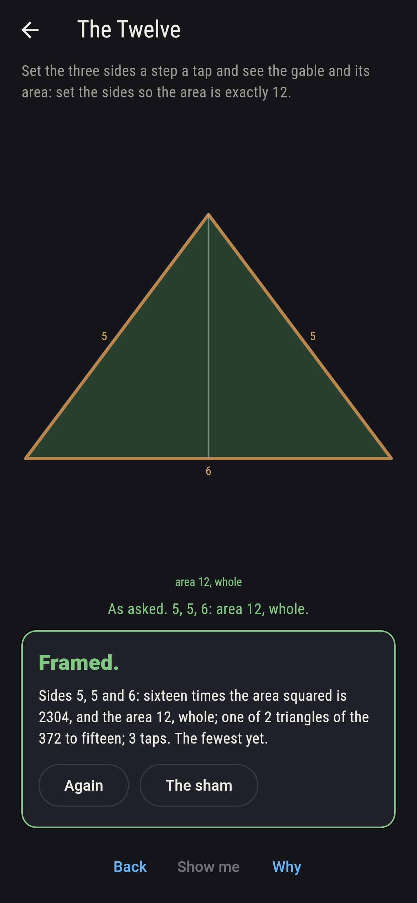
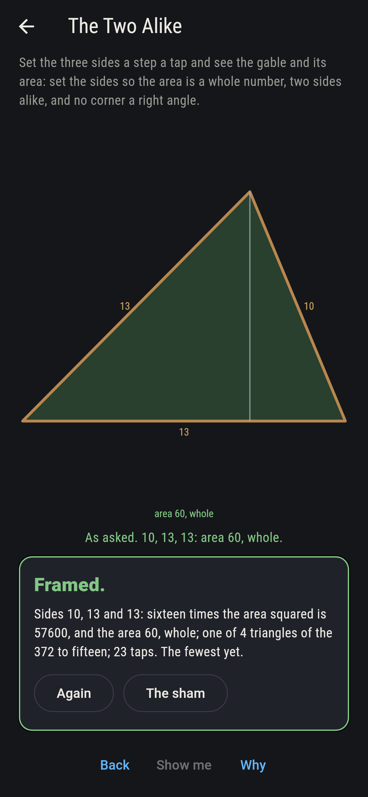
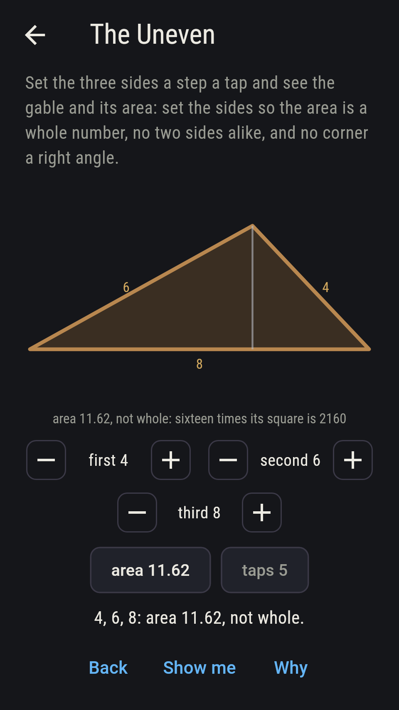
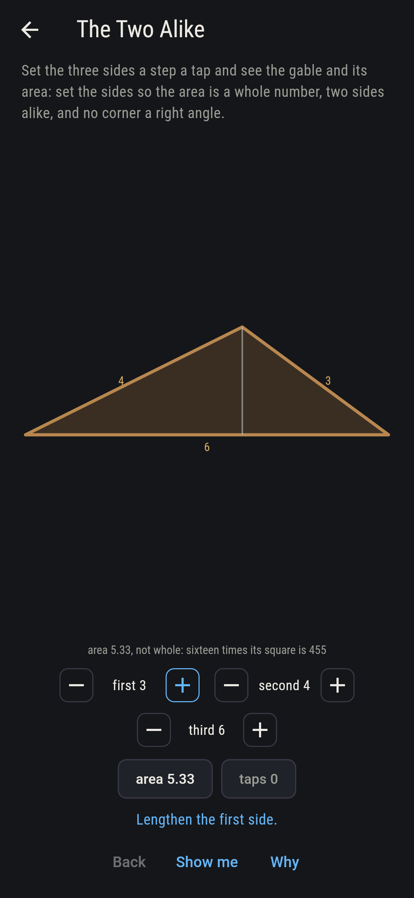
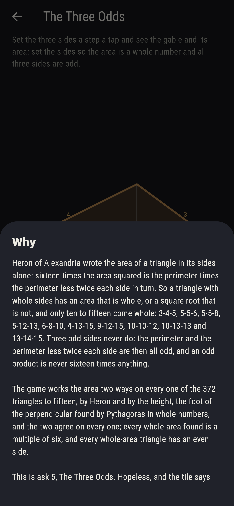

# Gablewick



Triangles with whole sides and a whole area. Heron of Alexandria
wrote the area of a triangle in its sides alone: sixteen times the
area squared is the perimeter times the perimeter less twice each
side in turn. So a triangle with whole sides has an area that is
whole, or a square root that is not, and only ten to fifteen come
whole: 3-4-5, 5-5-6, 5-5-8, 5-12-13, 6-8-10, 4-13-15, 9-12-15,
10-10-12, 10-13-13 and 13-14-15. Three odd sides never do: the
perimeter and the perimeter less twice each side are then all odd,
and an odd product is never sixteen times anything. Set the three
sides a step a tap and see the gable drawn to scale, its height in
chalk and its area under. Every one of the 372 triangles to fifteen
has its area worked two ways, by Heron and by the height, and the
two agree on every one; every whole area is a multiple of six, and
every whole-area triangle has an even side.

## The asks

1. **The Right Angle** - set the sides so the area is a whole number and one corner is a right angle
2. **The Twelve** - set the sides so the area is exactly 12
3. **The Two Alike** - set the sides so the area is a whole number, two sides alike, and no corner a right angle
4. **The Uneven** - set the sides so the area is a whole number, no two sides alike, and no corner a right angle
5. **The Three Odds** - set the sides so the area is a whole number and all three sides are odd

Four right-angled triangles to fifteen have a whole area, 3-4-5 with
6, 6-8-10 with 24, 5-12-13 with 30 and 9-12-15 with 54; two have an
area of exactly 12, 5-5-6 and 5-5-8, each two 3-4-5s back to back;
four with two sides alike and no right angle, 5-5-6, 5-5-8, 10-10-12
and 10-13-13; and two with no two sides alike and no right angle,
13-14-15 with 84, the biggest whole area to fifteen, and 4-13-15 with
24, a 9-12-15 with a 5-12-13 cut away. The Three Odds is labeled
hopeless on its tile: the odd product is never sixteen times
anything, and the sham admits it the moment three odd sides close.

## Two voices

The game never asserts what it has not computed, and it computes
everything at least twice:

* **Heron** gives sixteen times the area squared as the perimeter
  times the perimeter less twice each side, in whole numbers, and the
  sweep reads it on every one of the 372 triangles with whole sides to
  fifteen, keeping the ten whose root is a multiple of four; every
  count on the sham is that sweep's, and every odd triple to fifteen
  that closes is checked to give an odd product.
* **The height** works the same sixteenfold square another way: with
  the third side as base, the foot of the perpendicular from the far
  corner lies (b^2 + c^2 - a^2)/(2c) along it, and four times the base
  squared times the height squared comes out in whole numbers by
  Pythagoras; it agrees with Heron on all 372, and the ten whole areas
  are each a multiple of six with an even side among them.

`tool/check_gables.dart` runs the lot and refuses the bake on any
disagreement.

## The checker's ledger

What `dart run tool/check_gables.dart` printed for the build this
README shipped with, word for word:

```
every triangle with whole sides to fifteen, 372 of them, its area worked twice, by Heron and by the height with the foot of the perpendicular found in whole numbers, and the two agree on every one: ten have a whole area, 3-4-5 with 6, 5-5-6 and 5-5-8 with 12, 4-13-15 and 6-8-10 with 24, 5-12-13 with 30, 10-10-12 with 48, 9-12-15 with 54, 10-13-13 with 60 and 13-14-15 with 84, every area a multiple of six and every one with an even side; four are right-angled, four have two sides alike and no right angle, two have no two sides alike and no right angle; and three odd sides never square up, the perimeter and the perimeter less twice each side being all odd on every odd triple to fifteen, so their product is odd and never sixteen times anything

 1 The Right Angle set the sides so the area is a whole number and one corner is a right angle: 4 of the 372 triangles land it
 2 The Twelve      set the sides so the area is exactly 12: 2 of the 372 triangles land it
 3 The Two Alike   set the sides so the area is a whole number, two sides alike, and no corner a right angle: 4 of the 372 triangles land it
 4 The Uneven      set the sides so the area is a whole number, no two sides alike, and no corner a right angle: 2 of the 372 triangles land it
 5 The Three Odds  set the sides so the area is a whole number and all three sides are odd: none of the 372, and the odd product said so first
```

## Screenshots

| The sham | The uneven | The three odds admitted |
| --- | --- | --- |
|  |  |  |

| The right angle | The twelve | The two alike | Midway, on the small phone | Show me | The why |
| --- | --- | --- | --- | --- | --- |
|  |  |  |  |  |  |

Screenshots are drawn by `test/showcase_test.dart` at real phone
sizes with the app's own painter, then copied into `docs/` as they
came out; every side in them was set by taps, so nothing pictured is
a gable the game could not reach. The logo and every launcher icon
come out of `test/mark_test.dart` the same way: the mark is the
13-14-15 gable, area 84.

## Building

```
flutter test          # 43 tests, the sweep among them
dart run tool/check_gables.dart
flutter build apk     # or: flutter build ios
```
