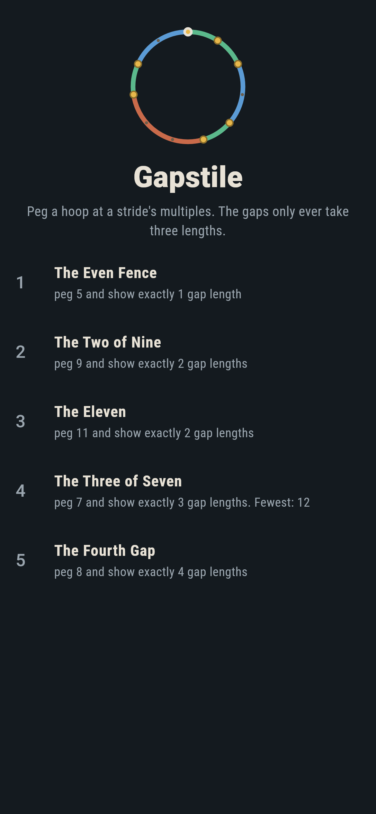
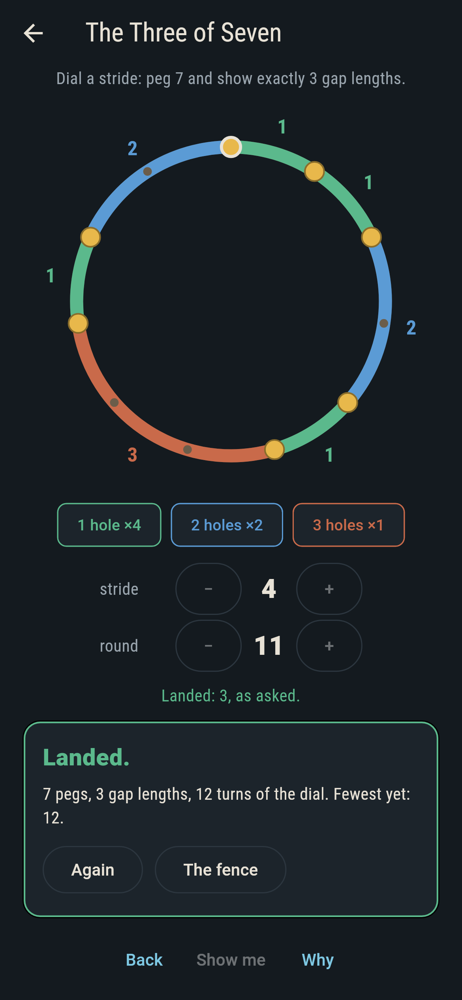
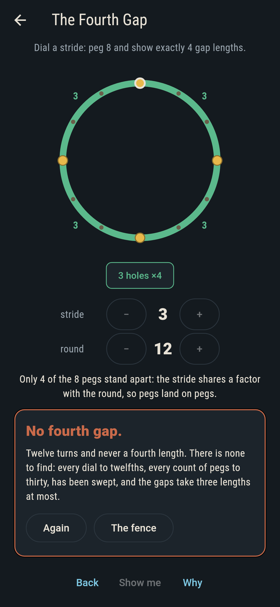
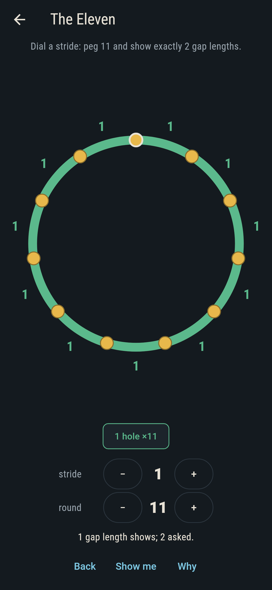
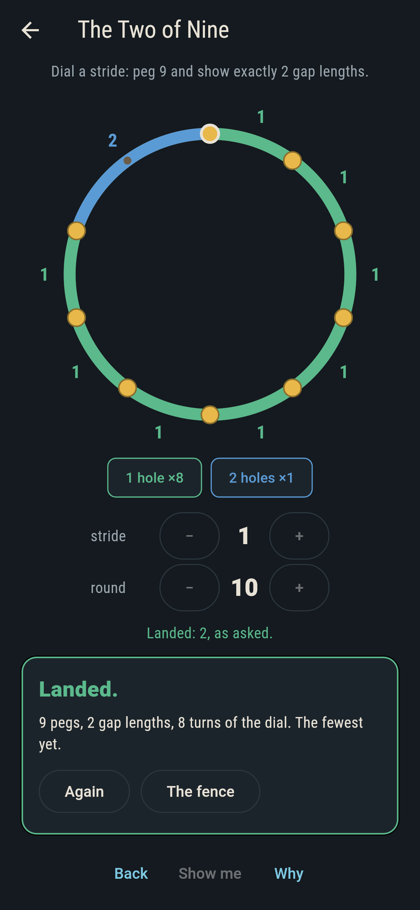
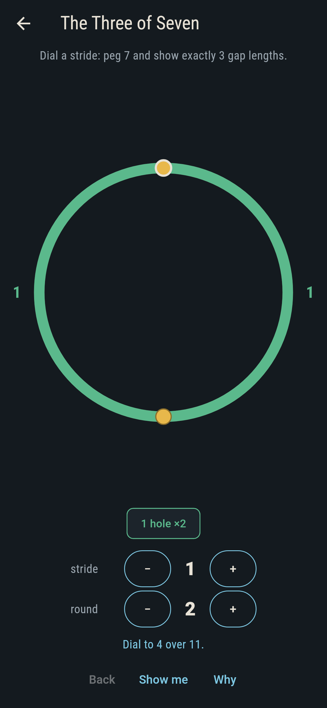
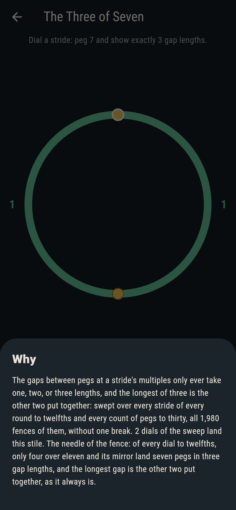

# Gapstile


Dial a stride and peg a hoop at its multiples. The gaps between
neighbouring pegs only ever take one, two, or three lengths, and when
there are three, the longest is the other two put together. That is
the three-gap law, and the game is finding the dials that show
exactly what each stile asks.

## The stiles

1. **The Even Fence** - peg 5 and show exactly 1 gap length
2. **The Two of Nine** - peg 9 and show exactly 2 gap lengths
3. **The Eleven** - peg 11 and show exactly 2 gap lengths
4. **The Three of Seven** - peg 7 and show exactly 3 gap lengths
5. **The Fourth Gap** - peg 8 and show exactly 4 gap lengths

The fourth stile is the needle: of every dial to twelfths, only four
over eleven and its mirror land seven distinct pegs in three gap
lengths. The fifth asks for a fourth length, and there is none: the
game says so to your face after twelve turns of the dial, and the
sweep below is why.

## Two voices

The game never asserts what it has not computed, and it computes
everything twice:

* **The sweep** dials every stride of every round to twelfths and
  hammers every count of pegs to thirty, all 1,980 fences, counting
  distinct gap lengths on each and checking the sum law whenever
  three show.
* **The labels** on the stiles carry their own counts of working
  dials, written down separately, and `tool/check_stiles.dart`
  recomputes every one from the rules alone and refuses the bake on
  any disagreement. It also pins the needle to its two dials, every
  Eleven dial to a round of twelve, and every Two of Nine dial to a
  round of ten or more.

## The checker's ledger

What `dart run tool/check_stiles.dart` printed for the build this
README shipped with, word for word:

```
every stride of every round to twelfths, every count of pegs to thirty, all 1,980 fences: the gaps take one, two, or three lengths and never a fourth, and whenever three show, the longest is the other two put together

 1 The Even Fence     peg 5 and show exactly 1 gap length: 8 dials of the sweep land it
 2 The Two of Nine    peg 9 and show exactly 2 gap lengths: 18 dials of the sweep land it
 3 The Eleven         peg 11 and show exactly 2 gap lengths: 4 dials of the sweep land it
 4 The Three of Seven peg 7 and show exactly 3 gap lengths: 2 dials of the sweep land it
 5 The Fourth Gap     peg 8 and show exactly 4 gap lengths: no dial of any round, no count of pegs, has ever shown a fourth
```

## Screenshots

| The fence | The needle landed | The fourth gap admitted |
| --- | --- | --- |
|  |  |  |

| Midway | Pegs on pegs | Show me | The why |
| --- | --- | --- | --- |
|  |  |  |  |

Screenshots are drawn by `test/showcase_test.dart` at real phone
sizes with the app's own painter, then copied into `docs/` as they
came out; every dial in them was turned, so nothing pictured is a
hoop the game could not reach. The logo and every launcher icon come
out of `test/mark_test.dart` the same way: the mark is the landed
needle itself.

## Building

```
flutter test          # 46 tests, the sweep among them
dart run tool/check_stiles.dart
flutter build apk     # or: flutter build ios
```
