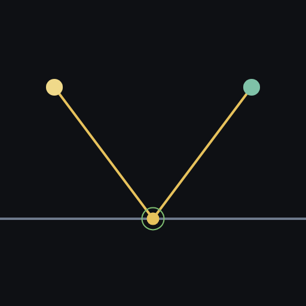
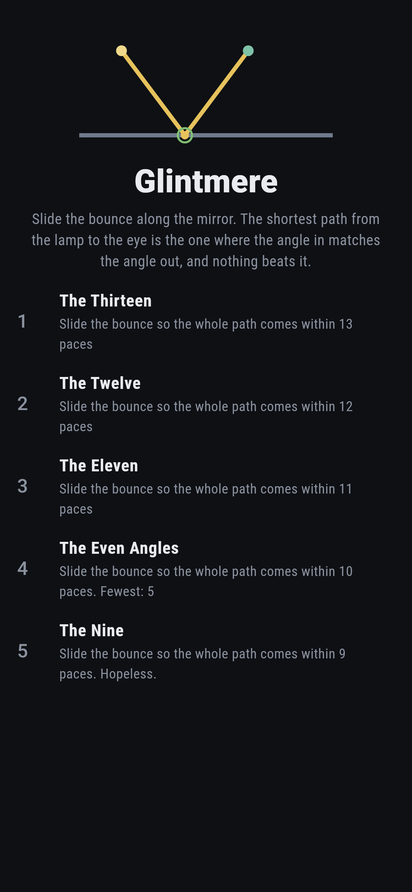
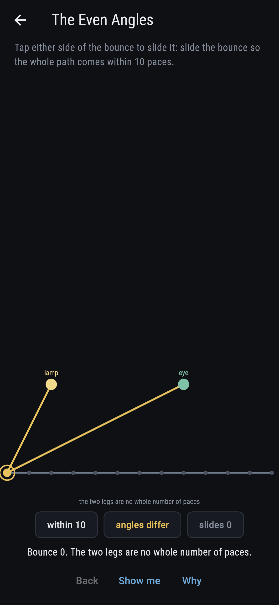
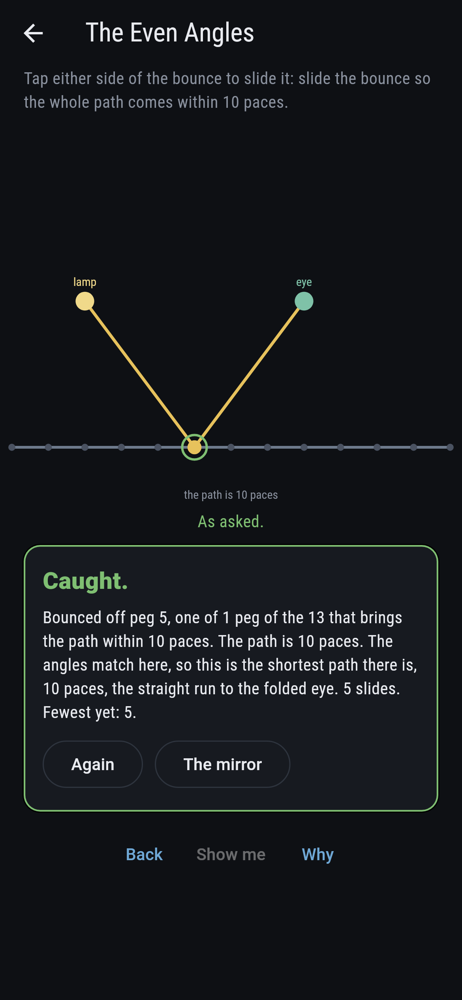
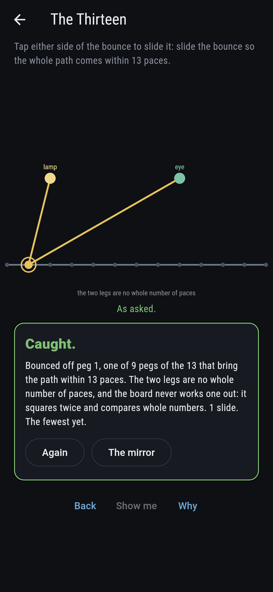
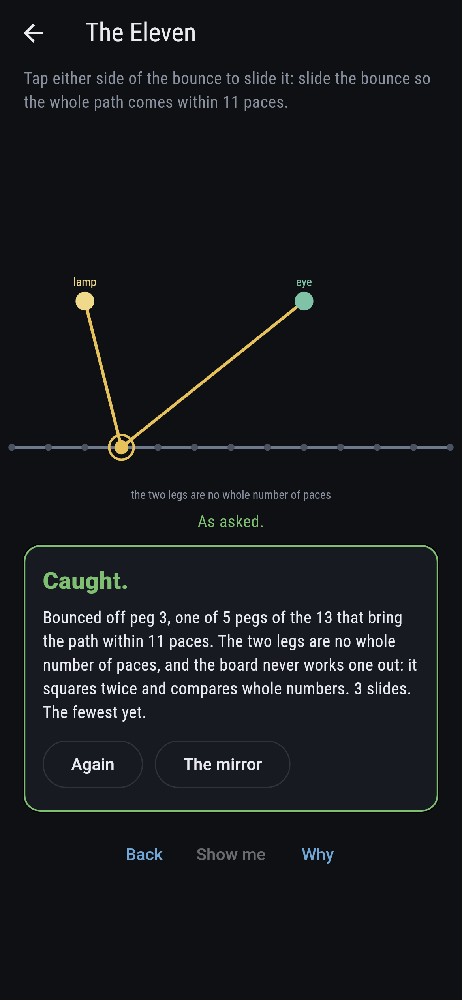
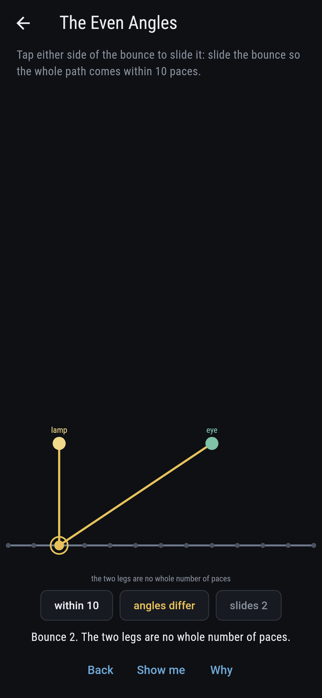
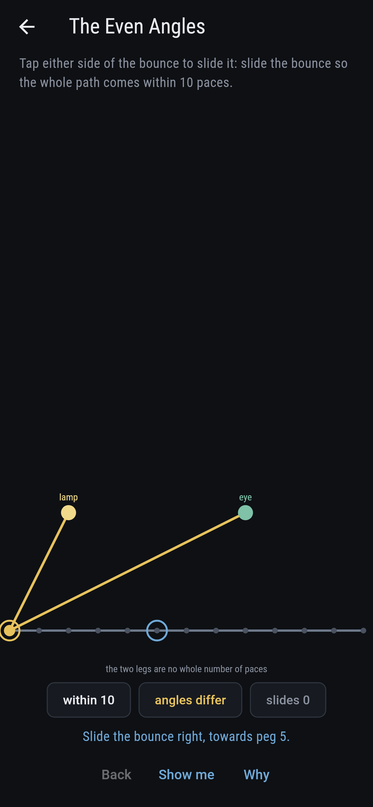
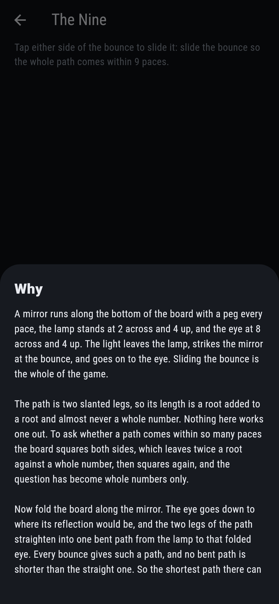
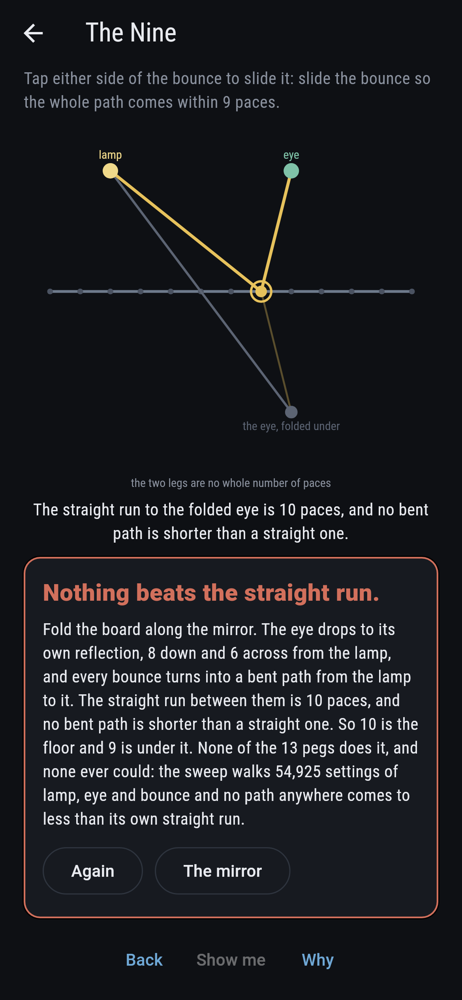

# Glintmere



A mirror with a peg every pace, a lamp standing 2 across and 4 up,
and an eye at 8 across and 4 up. The light leaves the lamp, strikes
the glass at the bounce, and goes on to the eye. Sliding the bounce
is the whole of the game. Now fold the board along the mirror: the
eye drops to its own reflection, 8 down and 6 across from the lamp,
and every bounce turns into a bent path from the lamp to that folded
eye. No bent path is shorter than a straight one, so the shortest
path there can be is the straight run, which here is 10 paces
exactly, and it is reached at one bounce and no other. At that
bounce the angle the light comes in at matches the angle it leaves
at. Hero of Alexandria set this down in his Catoptrics: light takes
the shortest way, and the shortest way off a mirror is the one with
matching angles. Every setting of lamp, eye and bounce is walked
before the bake, 54,925 of them, and no path anywhere comes to less
than its own straight run.

## The asks

1. **The Thirteen** - slide the bounce so the whole path comes within 13 paces
2. **The Twelve** - slide the bounce so the whole path comes within 12 paces
3. **The Eleven** - slide the bounce so the whole path comes within 11 paces
4. **The Even Angles** - slide the bounce so the whole path comes within 10 paces
5. **The Nine** - slide the bounce so the whole path comes within 9 paces

All five stand on one board. The lamp and the eye never move and only
the asking tightens, a pace at a time, so the ladder is the theorem
rather than a run of difficulties. 9 pegs of the 13 bring the path
within 13 paces, then 7 within 12, then 5 within 11, and the pegs
fall away from both ends together, because the path grows as the
bounce moves away from the middle and grows the same either way. At
10 paces one peg is left, peg 5, and its two legs are 5 paces and 5
paces, each a three by four corner. That is the bounce where the
angles match. The Nine is labeled hopeless on its tile, and the fold
is the why: 10 is the floor and 9 is under it.

## Two voices

The game never asserts what it has not computed, and it computes
everything at least twice:

* **The pacing** takes the two squared legs and holds their roots
  added against whatever the ask allows. A root added to a root is
  almost never a whole number and the board never works one out:
  squaring once leaves twice a root against a whole number, squaring
  again finishes it, and the question has become whole numbers only.
* **The folding** measures nothing at all. It crosses each run with
  the other rise and asks whether the two angles match, which is the
  same question asked from the other end. On every one of the 54,925
  settings the two name the same bounces, 1,125 of them.

`tool/check_glints.dart` runs the lot and refuses the bake on any
disagreement.

Rickmere in this collection is Napoleon's theorem on a peg green, so
it is the nearest board by furniture: pegs, exact arithmetic and a
picture that has to come out right. It stands three posts and raises
a rick on each side. This slides one peg along a line and asks how
long a bent path is, which is a different question and a different
hand.

## The checker's ledger

What `dart run tool/check_glints.dart` printed for the build this
README shipped with, word for word:

```
every setting of lamp, eye and bounce walked, 54,925 of them, the lamp and the eye anywhere over a mirror of 13 pegs at any height to 5, and the bounce on any peg of it; each was asked twice. The pacing takes the two squared legs, holds their roots added against the straight run to the eye folded across the mirror, and settles it by squaring twice, so the whole question is whole numbers. The folding never measures a length: it crosses each run with the other rise and asks whether the two angles match; the two agreed on all 54,925 settings, naming the same 1,125 bounces; and on not one of the 54,925 did a path come to less than its own straight run, which is Hero of Alexandria in his Catoptrics: the light takes the shortest way, and the shortest way is the one with matching angles; the board the asks stand on puts the lamp at 2 across and 4 up and the eye at 8 and 4, so the folded eye lies 8 down and 6 across from the lamp and the straight run is 10 paces exactly, reached at the one bounce on peg 5, whose legs are 5 paces and 5 paces; the asking then tightens a pace at a time and the pegs that answer it fall away from both ends together, 9, 7, 5, 1, 0

 1 The Thirteen    slide the bounce so the whole path comes within 13 paces: 9 of the 13 pegs do it, the nearest 1 slide away
 2 The Twelve      slide the bounce so the whole path comes within 12 paces: 7 of the 13 pegs do it, the nearest 2 slides away
 3 The Eleven      slide the bounce so the whole path comes within 11 paces: 5 of the 13 pegs do it, the nearest 3 slides away
 4 The Even Angles slide the bounce so the whole path comes within 10 paces: 1 of the 13 pegs do it, the nearest 5 slides away
 5 The Nine        slide the bounce so the whole path comes within 9 paces: none of the 13, and the folding said so first
```

## Screenshots

| The mirror | An ask as it opens | The even angles |
| --- | --- | --- |
|  |  |  |

| The thirteen | The eleven | Mid-slide | Show me | The why | Folded open |
| --- | --- | --- | --- | --- | --- |
|  |  |  |  |  |  |

The last picture is the proof rather than an illustration of it. Once
the hopeless ask is admitted the board folds itself open, the eye
drops to its reflection, and the straight run is drawn in grey
against the bent path the bounce actually takes.

Screenshots are drawn by `test/showcase_test.dart` at real phone
sizes with the app's own painter, then copied into `docs/` as they
came out; every bounce in them was slid there a peg at a time, so
nothing pictured is a setting the game could not reach. The logo and
every launcher icon come out of `test/mark_test.dart` the same way:
the mark is the bounce where the angles match, two legs of five
paces.

## Building

```
flutter test          # 55 tests, the two voices among them
dart run tool/check_glints.dart
flutter build apk     # or: flutter build ios
```
