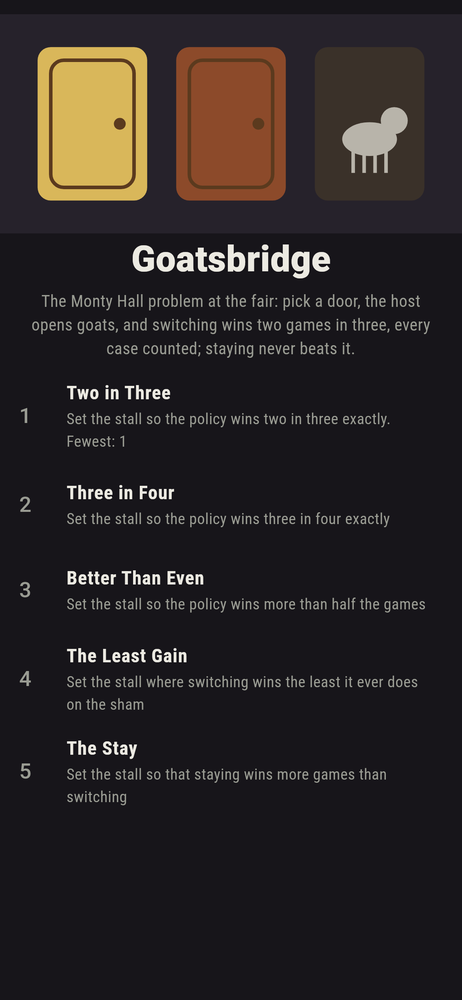
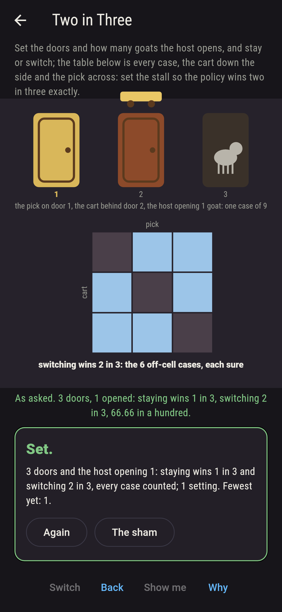
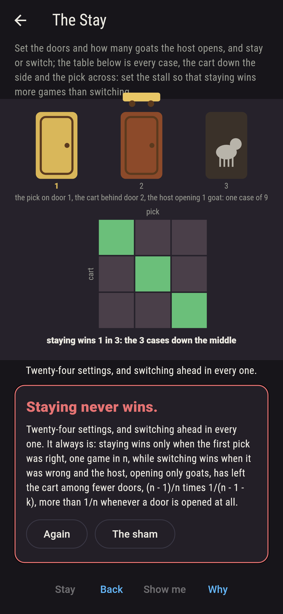
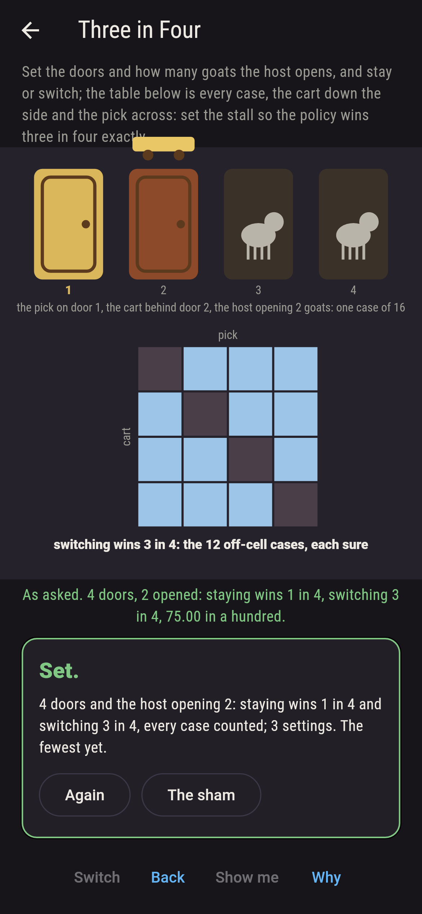
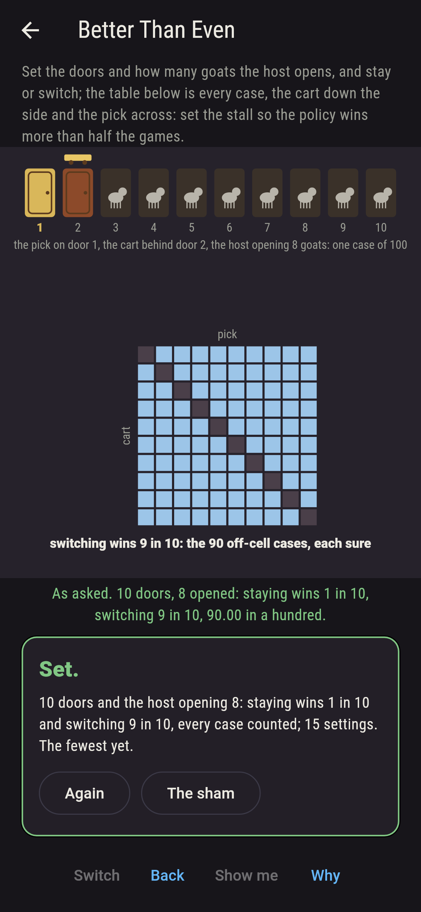
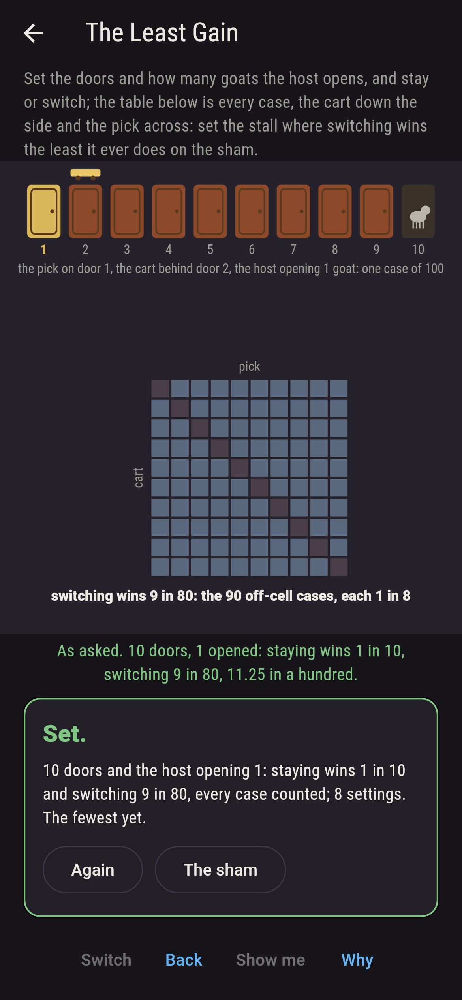
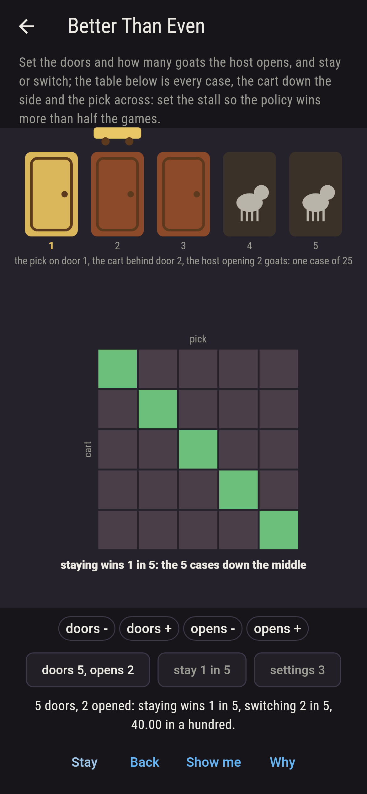
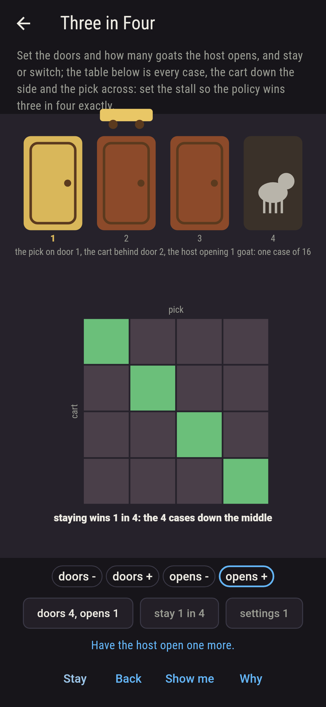
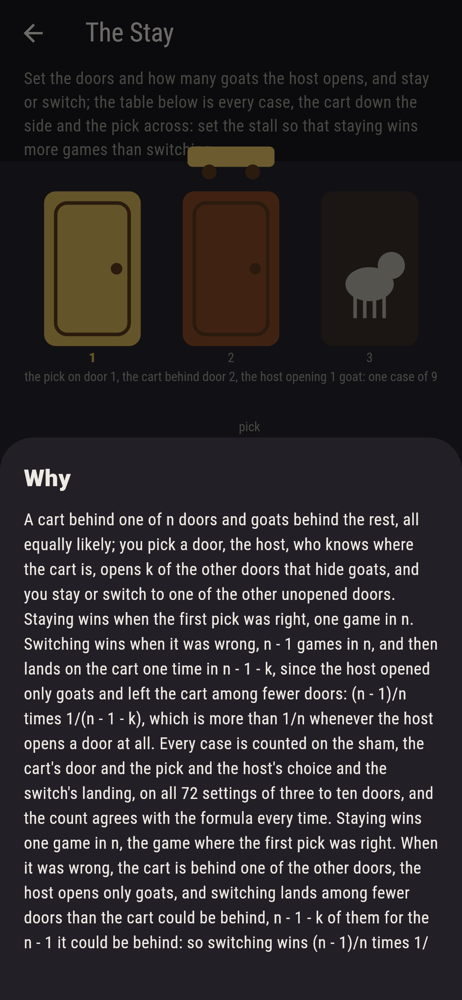

# Goatsbridge


The Monty Hall problem at the fair. A cart behind one of n doors
and goats behind the rest, all equally likely; you pick a door,
the host, who knows where the cart is, opens k of the other doors
that hide goats, and you stay or switch to one of the other
unopened doors. Set the doors, three to ten, and how many the host
opens, and stay or switch; the table is every case, the cart's
door down the side and the pick across, shaded by the policy's
chance in each. Staying wins when the first pick was right, one
game in n. Switching wins when it was wrong, n - 1 games in n, and
then lands on the cart one time in n - 1 - k, since the host opened
only goats and left the cart among fewer doors: three doors and
one opened, two games in three; ten doors and eight opened, nine
in ten; ten doors and one opened, nine in eighty, the least
switching ever gains here and still more than staying's one in
ten. Every case is counted on all 72 settings, and the count
agrees with the formula every time; staying never wins as many.

## The stalls

1. **Two in Three** - set the stall so the policy wins two in three exactly
2. **Three in Four** - set the stall so the policy wins three in four exactly
3. **Better Than Even** - set the stall so the policy wins more than half the games
4. **The Least Gain** - set the stall where switching wins the least it ever does on the sham
5. **The Stay** - set the stall so that staying wins more games than switching

Three doors and one opened is the only setting that wins two in
three, four doors and two opened the only three in four; eight
settings win more than half, every one switching with the host
opening all the doors but one; ten doors and one opened is the
least gain, 9 in 80, 11.25 in a hundred. The Stay is labeled
hopeless on its tile, and the why is a line: the host opens only
goats, so a wrong first pick leaves the cart among fewer doors
than it could have been behind.

## Two voices

The game never asserts what it has not computed, and it computes
everything at least twice:

* **The count** takes every case of every setting, the cart's door
  and the pick each of n, the host's choice of goat doors among
  those he may open each equally, and the switch's landing among
  the other unopened doors each equally, weighs them as exact
  fractions and sums; every number on the sham is that count's.
* **The formula** counts nothing: staying 1/n, switching (n - 1)/n
  times 1/(n - 1 - k), and it agrees with the count on all 72
  settings; it says staying never wins as many, since 1/(n - 1 - k)
  is more than 1/(n - 1) whenever k is one or more.

`tool/check_doors.dart` runs the lot and refuses the bake on any
disagreement.

## The checker's ledger

What `dart run tool/check_doors.dart` printed for the build this
README shipped with, word for word:

```
every stall of three to ten doors with the host opening one to all but one, staying or switching, 72 settings, every case counted, the cart's door and the pick each of n, the host's choice of goat doors and the switch's landing each equally, and held to the formula, staying 1/n and switching (n - 1)/n times 1/(n - 1 - k), the two agreeing on all 72: three doors and one opened, staying wins 1 in 3 and switching 2 in 3; four doors, switching wins 3 in 8 with one opened and 3 in 4 with two; ten doors and eight opened, 9 in 10; ten doors and one opened, 9 in 80, 11.25 in a hundred, the least switching ever wins on the sham and still more than staying's 1 in 10; eight settings win more than half, every one of them switching with all the doors but one opened; and staying never wins more than switching, nor as many, on any of the 72

 1 Two in Three     set the stall so the policy wins two in three exactly: 1 of the 72 settings lands it
 2 Three in Four    set the stall so the policy wins three in four exactly: 1 of the 72 settings lands it
 3 Better Than Even set the stall so the policy wins more than half the games: 8 of the 72 settings land it
 4 The Least Gain   set the stall where switching wins the least it ever does on the sham: 1 of the 72 settings lands it
 5 The Stay         set the stall so that staying wins more games than switching: none of the 72, and the count said so first
```

## Screenshots

| The sham | Two in three | The stay admitted |
| --- | --- | --- |
|  |  |  |

| Three in four | Better than even | The least gain | Mid-setting | Show me | The why |
| --- | --- | --- | --- | --- | --- |
|  |  |  |  |  |  |

Screenshots are drawn by `test/showcase_test.dart` at real phone
sizes with the app's own painter, then copied into `docs/` as they
came out; every dial in them was set by a press, so nothing pictured
is a stall the game could not reach. The logo and every launcher
icon come out of `test/mark_test.dart` the same way: the mark is
the three doors, the pick on the first and the host's goat behind
the third.

## Building

```
flutter test          # 47 tests, the count among them
dart run tool/check_doors.dart
flutter build apk     # or: flutter build ios
```
