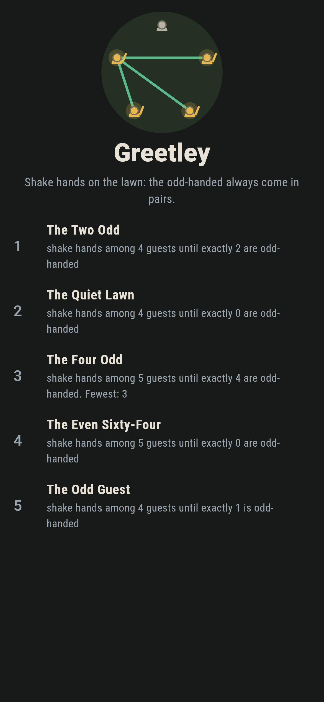
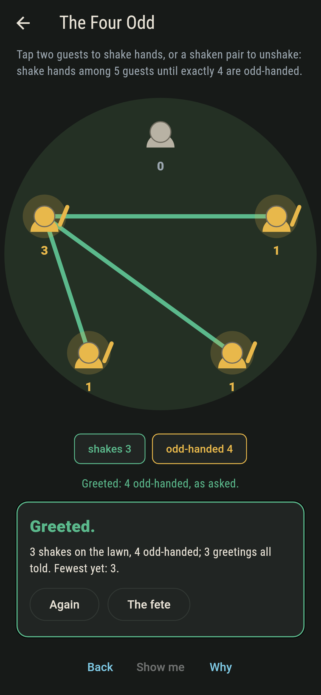
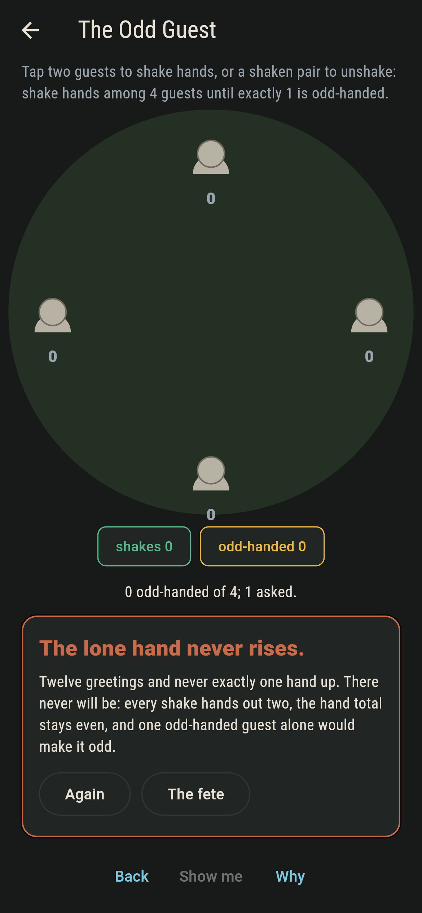
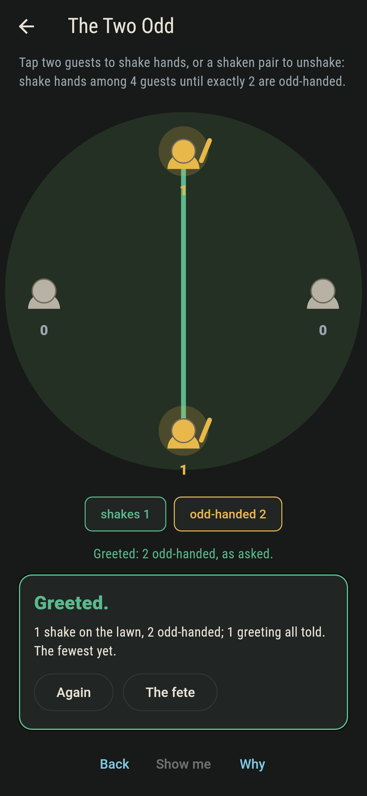
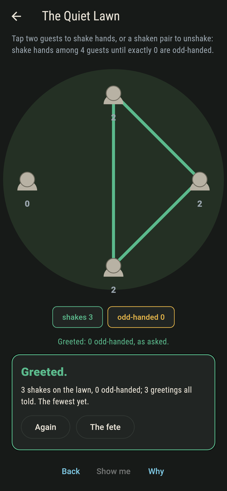
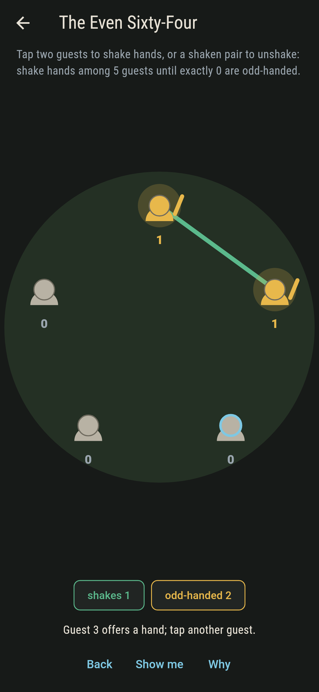
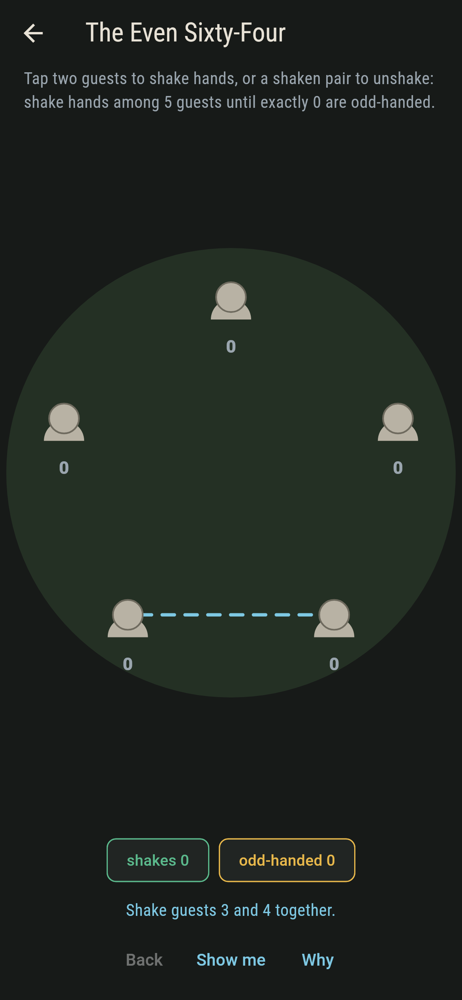
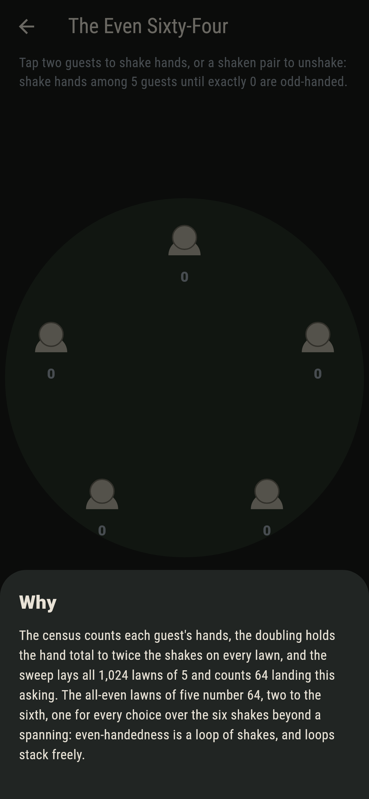

# Greetley


Guests on a lawn, shaking hands. A guest who has shaken an odd
number of hands is odd-handed, hand up and lit gold, and the
asking is always a count of them. The law underneath is the
handshake lemma: every shake hands out exactly two, so the
odd-handed always come in pairs, and one lawn here asks for what
that arithmetic forbids.

## The lawns

1. **The Two Odd** - shake hands among 4 guests until exactly 2 are odd-handed
2. **The Quiet Lawn** - shake hands among 4 guests until exactly 0 are odd-handed
3. **The Four Odd** - shake hands among 5 guests until exactly 4 are odd-handed
4. **The Even Sixty-Four** - shake hands among 5 guests until exactly 0 are odd-handed
5. **The Odd Guest** - shake hands among 4 guests until exactly 1 is odd-handed

The spread of four runs 8, none, 48, none, 8: odd counts of
odd-handed guests simply do not occur. The all-even lawns come to
a power of two, 8 and 64, one for every choice over the shakes
beyond a spanning of the guests, because even-handedness is a
loop of shakes and loops stack freely.

## Two voices and a doubling

The game never asserts what it has not computed, and it computes
everything at least twice:

* **The census** counts each guest's hands and lights the odd.
* **The doubling** holds the hand total to twice the shakes on
  every lawn the sweep lays: that one line is the whole theorem.
* **The sweep** lays all 64 and 1,024 lawns of four and five,
  counts the lawns landing each asking, and checks the
  power-of-two count of the all-even lawns.

`tool/check_lawns.dart` runs the lot and refuses the bake on any
disagreement.

## The checker's ledger

What `dart run tool/check_lawns.dart` printed for the build this
README shipped with, word for word:

```
every lawn of four and five guests swept, 64 and 1,024 of them: the hand total doubles the shakes on every one, the odd-handed never number odd, the all-even lawns come to two to the spare shakes, 8 and 64, and the spread of four runs 8, none, 48, none, 8

 1 The Two Odd          shake hands among 4 guests until exactly 2 are odd-handed: 48 lawns of the sweep land it
 2 The Quiet Lawn       shake hands among 4 guests until exactly 0 are odd-handed: 8 lawns of the sweep land it
 3 The Four Odd         shake hands among 5 guests until exactly 4 are odd-handed: 320 lawns of the sweep land it
 4 The Even Sixty-Four  shake hands among 5 guests until exactly 0 are odd-handed: 64 lawns of the sweep land it
 5 The Odd Guest        shake hands among 4 guests until exactly 1 is odd-handed: none of the 64, since every shake hands out two
```

## Screenshots

| The fete | The four odd greeted | The odd guest admitted |
| --- | --- | --- |
|  |  |  |

| The two odd | The quiet lawn | A hand offered | Show me | The why |
| --- | --- | --- | --- | --- |
|  |  |  |  |  |

Screenshots are drawn by `test/showcase_test.dart` at real phone
sizes with the app's own painter, then copied into `docs/` as
they came out; every shake in them was tapped, so nothing
pictured is a lawn the game could not reach. The logo and every
launcher icon come out of `test/mark_test.dart` the same way: the
mark is a four-odd lawn.

## Building

```
flutter test          # 46 tests, the sweep among them
dart run tool/check_lawns.dart
flutter build apk     # or: flutter build ios
```
