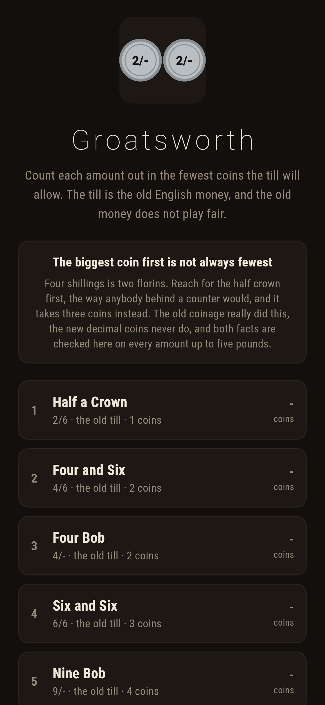
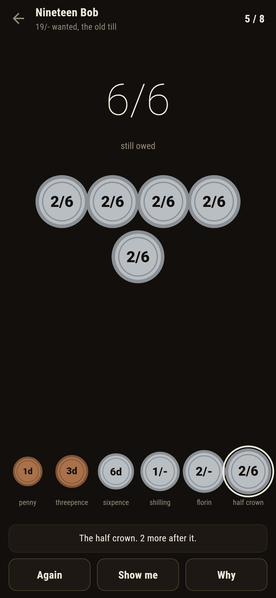
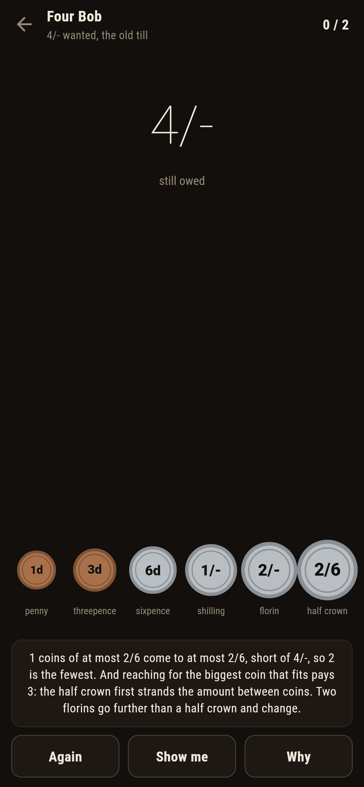
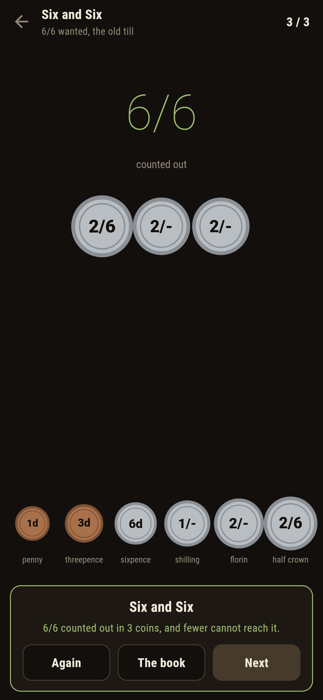
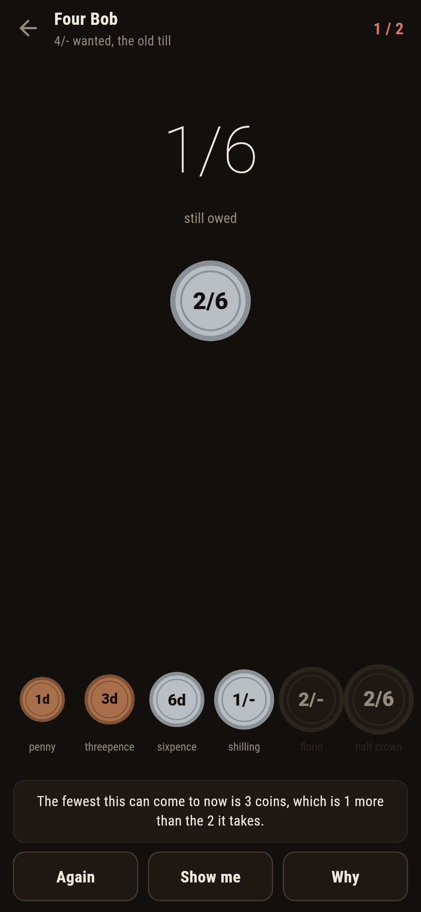

# Groatsworth

A counting out puzzle for phones, in Flutter, for Android and iOS.

Customers want paying out in the fewest coins the till will allow, and the till
is the old English money: pennies, threepence, sixpence, shillings, florins,
half crowns. The old money does not play fair, which is the whole of the game.

| | | | |
|---|---|---|---|
|  |  |  |  |

## The biggest coin first is not always fewest

Four shillings is two florins. Reach for the half crown first, the way anybody
behind a counter would, and the amount strands between coins: half crown,
shilling, sixpence, three coins for something two can do. The real coinage
really did this. With a florin at 24 pence sitting under a half crown at 30,
the greedy count goes wrong first at 4/-, then at 6/6, 9/-, 11/6, and on up
the half crowns for ever.

The new decimal till never does it. Every amount up to five pounds is counted
both ways in a test, biggest coin first against the honest table, and the two
never part. Both facts ship in the same game, which is the point: the quick way
being right is a property of the coins, not of the method.

```
$ make rounds
 1 Half a Crown   The Old Till    2/6 ( 30d)  fewest 1  written down 1  by trying 1  biggest-first 1  floor 1
 2 Four and Six   The Old Till    4/6 ( 54d)  fewest 2  written down 2  by trying 2  biggest-first 2  floor 2
 3 Four Bob       The Old Till    4/- ( 48d)  fewest 2  written down 2  by trying 2  biggest-first 3  floor 2
 4 Six and Six    The Old Till    6/6 ( 78d)  fewest 3  written down 3  by trying 3  biggest-first 4  floor 3
 5 Nine Bob       The Old Till    9/- (108d)  fewest 4  written down 4  by trying 4  biggest-first 5  floor 4
 6 Nineteen Bob   The Old Till   19/- (228d)  fewest 8  written down 8  by trying 8  biggest-first 9  floor 8
 7 The New Till   The New Till    88p ( 88d)  fewest 6  written down 6  by trying 6  biggest-first 6  floor 2

the new till, every amount to 500: biggest-first fails on none, which is the point of it
```

## The floor a player can check

Every old till amount that ships has its fewest exactly on the plain floor:
fewer coins than the answer, each at most a half crown, cannot come to the
amount, and one multiplication shows it. **Why** says it in words, and on the
trap rounds it adds what reaching for the half crown would have cost:


The honest table behind all of it is filled a penny at a time, the fewest for
an amount being one more than the fewest for whatever one coin leaves. A test
holds it against trying every mix of coins outright, on every amount to a
pound, on both tills.

## What the game says



Put the wrong coin down and the game says so at once, because the table
answers what is still owed as readily as it answered the whole amount. Coins
come back off the tray with a tap. **Show me** names the next coin of a
fewest way of finishing from what is owed now, so it stays right after a poor
start.

Amounts are written the old way, four shillings as 4/-, six and six as 6/6,
and in plain pence on the decimal till, because the notation is half the
period charm.

## Running it

```
make deps    # flutter pub get
make test    # everything
make analyze
make shots   # render the screens into build/showcase, redraw the logo and icons
make rounds  # every shipped round, counted four ways
make find    # every amount where biggest-first pays extra, on either till
make apk     # release APK
make ios     # release iOS build, unsigned
```

## Tests

`flutter test` runs the till (old money spoken the old way, coins smallest
first from a penny), the table against trying every mix of coins on every
amount to a pound on both tills, the way it hands back really coming to the
amount, biggest-first failing exactly where the old coinage fails and nowhere
on the decimal till to five pounds, the floor never sitting above the answer,
every round that ships, and a round at the counter.

Then the game through the screen: putting a coin down, taking it back, a coin
refused for going over, the wrong coin called out at once, **Again**, **Show
me**, **Why** on both tills, a round paid the long way, and every customer
served in the fewest coins there are.

Screenshots come from `test/showcase_test.dart`, and every coin on a tray in
them was put down by tapping the till. `test/mark_test.dart` draws the logo,
the launcher icons at every density Android asks for and every size the iOS
icon set asks for; there is no image in this repository that was not produced
by it.
