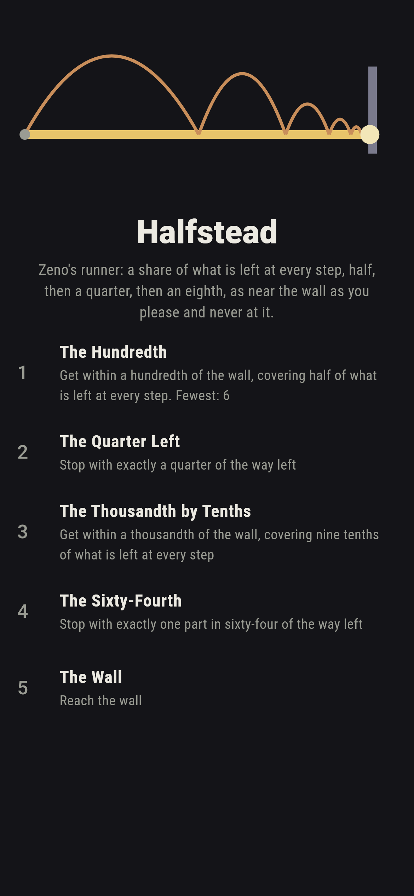
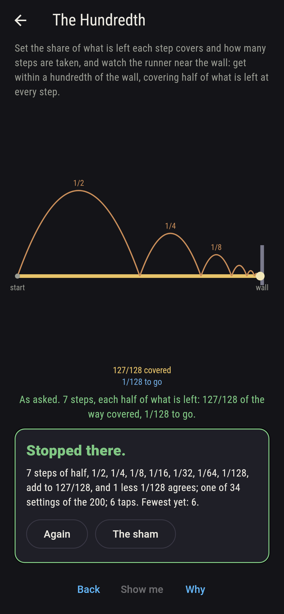
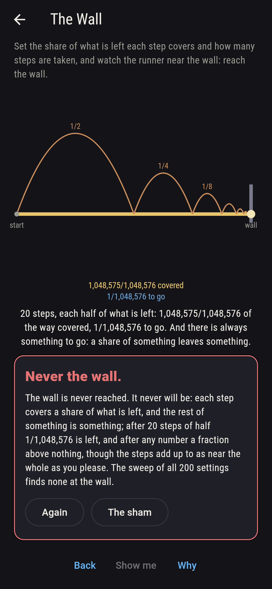
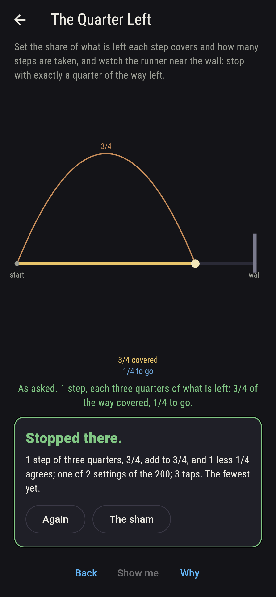
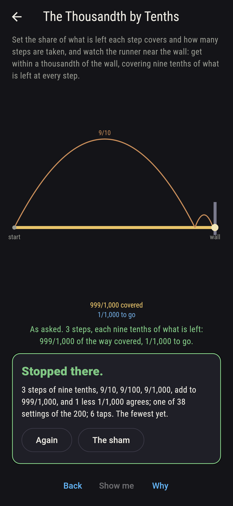
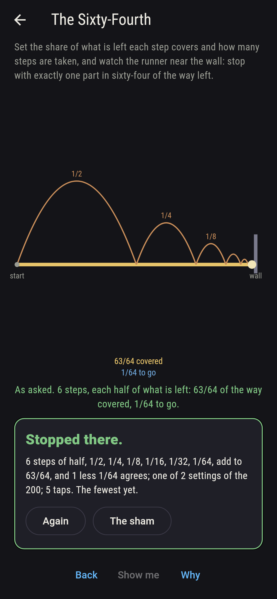
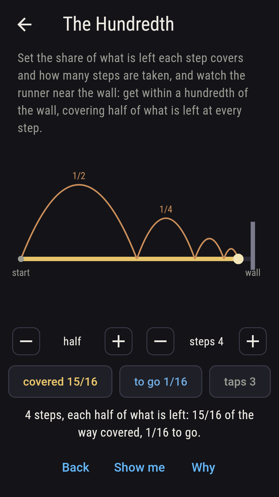
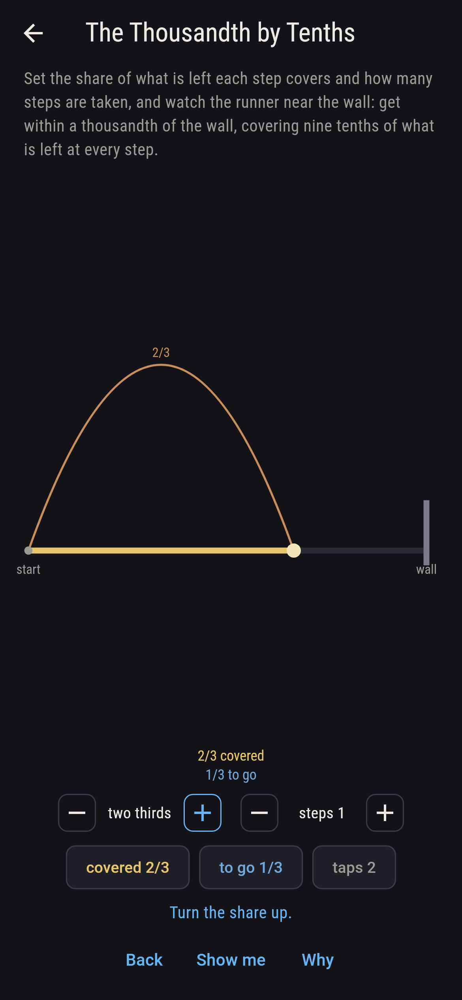
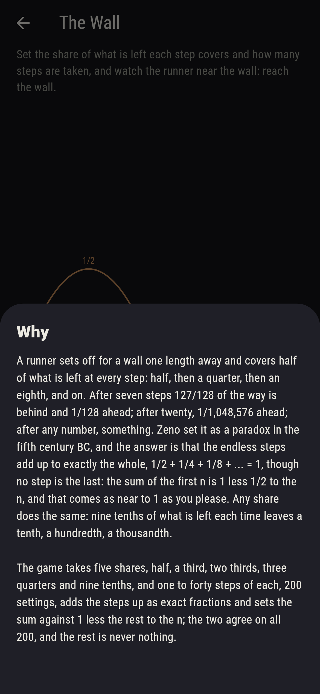

# Halfstead


A runner sets off for a wall one length away and covers half of what
is left at every step: half, then a quarter, then an eighth, and on.
After seven steps 127/128 of the way is behind and 1/128 ahead;
after twenty, 1/1,048,576 ahead; after any number, something. Zeno
set it as a paradox in the fifth century BC, and the answer is that
the endless steps add up to exactly the whole, 1/2 + 1/4 + 1/8 + ...
= 1, though no step is the last: the sum of the first n is 1 less
1/2 to the n, and that comes as near to 1 as you please. Any share
does the same: nine tenths of what is left each time leaves a tenth,
a hundredth, a thousandth. Set the share and the steps and watch the
runner near the wall. The game takes five shares, half, a third, two
thirds, three quarters and nine tenths, and one to forty steps of
each, 200 settings, adds the steps up as exact fractions and sets
the sum against 1 less the rest to the n; the two agree on all 200,
and the rest is never nothing.

## The asks

1. **The Hundredth** - get within a hundredth of the wall, covering half of what is left at every step
2. **The Quarter Left** - stop with exactly a quarter of the way left
3. **The Thousandth by Tenths** - get within a thousandth of the wall, covering nine tenths of what is left at every step
4. **The Sixty-Fourth** - stop with exactly one part in sixty-four of the way left
5. **The Wall** - reach the wall

Seven halvings come within a hundredth, 127/128 covered, and any more
do too, thirty-four settings; a quarter is left after two halvings
or one step of three quarters, and one part in sixty-four after six
halvings or three steps of three quarters; three steps of nine
tenths leave a thousandth, and any more less, thirty-eight settings.
A third takes 12, 18 and 35 steps to come within a hundredth, a
thousandth and a millionth, two thirds 5, 7 and 13, three quarters 4,
5 and 10, half 7, 10 and 20, and nine tenths 2, 3 and 6. The Wall is
labeled hopeless on its tile: the rest of something is something,
and the sham admits it at the twentieth step, or after twenty taps.

## Two voices

The game never asserts what it has not computed, and it computes
everything at least twice:

* **The steps** are added one by one as exact fractions, each the
  share of what the last left, 1/2, 1/4, 1/8 and on for halving; every
  distance on the sham is that sum's, and every step is checked to be
  the last times the rest of the share.
* **The form** adds nothing: 1 less the rest of the share to the n,
  and it agrees with the sum on all 200 settings; from it what is left
  is checked to be always something and always less than before, the
  fewest steps to come within a hundredth, a thousandth and a
  millionth are read off for every share, and the settings that leave
  exactly a quarter or a sixty-fourth are found, two of each.

`tool/check_steps.dart` runs the lot and refuses the bake on any
disagreement.

## The checker's ledger

What `dart run tool/check_steps.dart` printed for the build this
README shipped with, word for word:

```
every run of steps on the dials added up as exact fractions, five shares of what is left, half, a third, two thirds, three quarters and nine tenths, and one to forty steps of each, 200 settings, the sum agreeing with 1 less the rest to the n on all 200, every step the share of what the last left, and what is left always something and always less than before; seven halvings come within a hundredth, 127/128 covered, ten within a thousandth and twenty within a millionth, 1/1,048,576 left, forty leaving 1/1,099,511,627,776; a third takes 12, 18 and 35 steps to the same marks, two thirds 5, 7 and 13, three quarters 4, 5 and 10, and nine tenths 2, 3 and 6, forty of them leaving one part in 10 to the fortieth; a quarter is left by two halvings or one step of three quarters and a sixty-fourth by six halvings or three steps of three quarters, and the wall is reached by none

 1 The Hundredth            get within a hundredth of the wall, covering half of what is left at every step: 34 of the 200 settings land it
 2 The Quarter Left         stop with exactly a quarter of the way left: 2 of the 200 settings land it
 3 The Thousandth by Tenths get within a thousandth of the wall, covering nine tenths of what is left at every step: 38 of the 200 settings land it
 4 The Sixty-Fourth         stop with exactly one part in sixty-four of the way left: 2 of the 200 settings land it
 5 The Wall                 reach the wall: none of the 200, and the rest of something said so first
```

## Screenshots

| The sham | The hundredth | The wall admitted |
| --- | --- | --- |
|  |  |  |

| The quarter left | The thousandth by tenths | The sixty-fourth | Midway, on the small phone | Show me | The why |
| --- | --- | --- | --- | --- | --- |
|  |  |  |  |  |  |

Screenshots are drawn by `test/showcase_test.dart` at real phone
sizes with the app's own painter, then copied into `docs/` as they
came out; every run in them was dialled by taps, so nothing pictured
is a run the game could not reach. The logo and every launcher icon
come out of `test/mark_test.dart` the same way: the mark is seven
halvings down the corridor, 127/128 covered, the wall still ahead.

## Building

```
flutter test          # 43 tests, the sweep among them
dart run tool/check_steps.dart
flutter build apk     # or: flutter build ios
```
