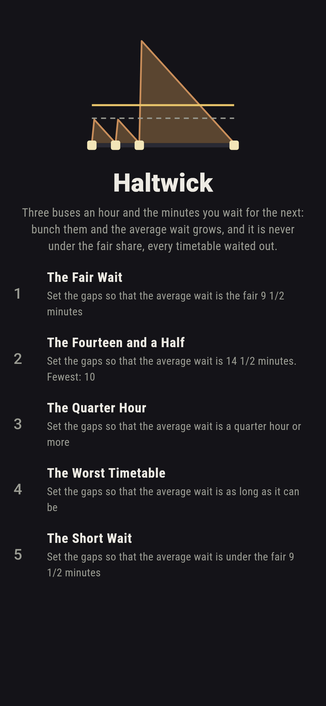
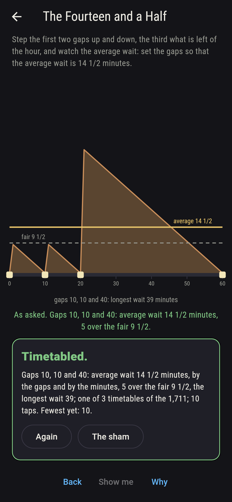
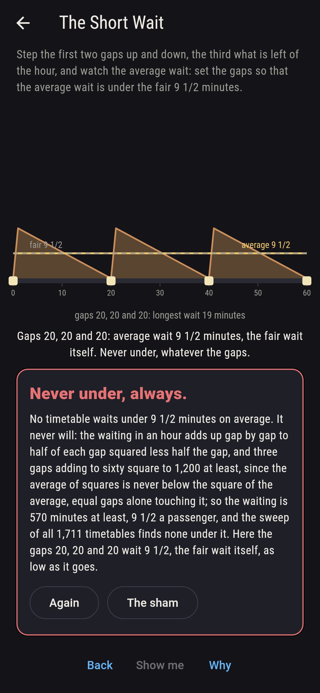
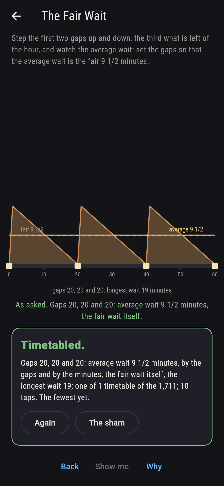
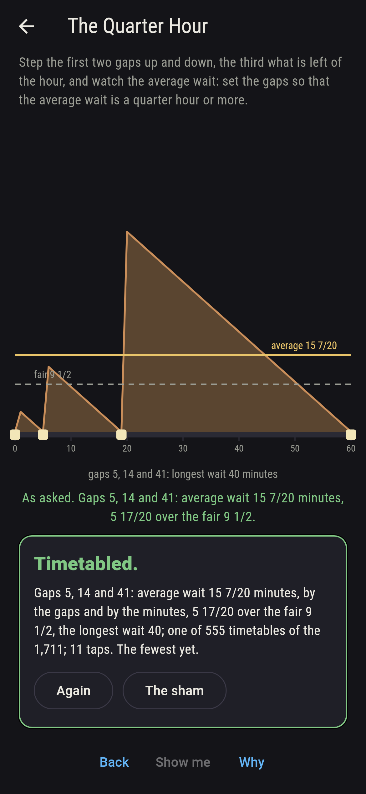
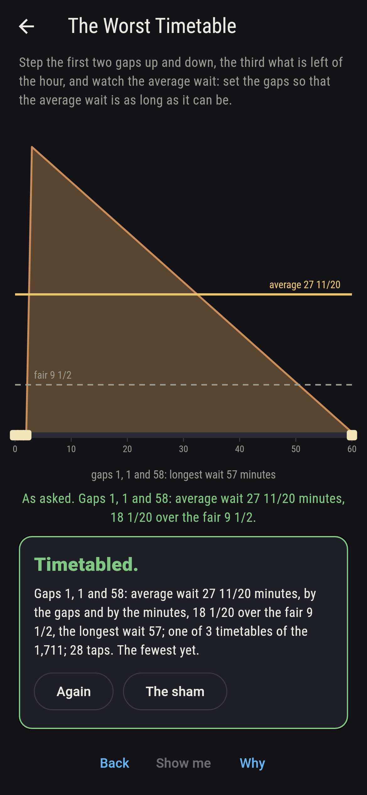
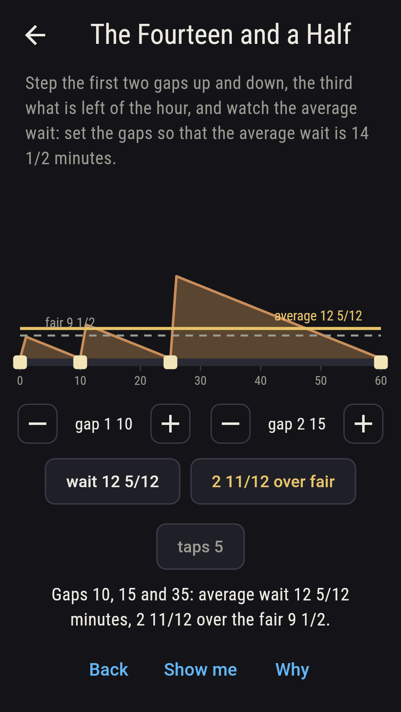
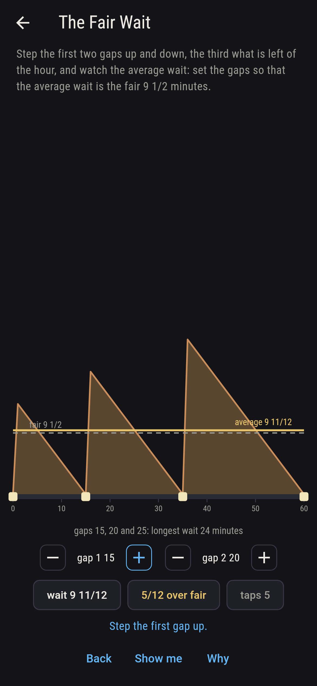
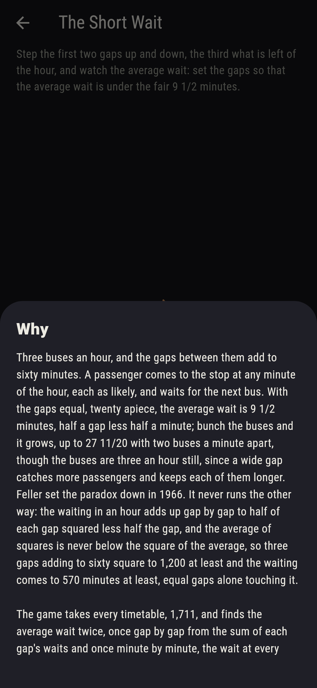

# Haltwick


Three buses an hour, and the gaps between them add to sixty minutes.
A passenger comes to the stop at any minute of the hour, each as
likely, and waits for the next bus. With the gaps equal, twenty
apiece, the average wait is 9 1/2 minutes, half a gap less half a
minute; bunch the buses and it grows, up to 27 11/20 with two buses
a minute apart, though the buses are three an hour still, since a
wide gap catches more passengers and keeps each of them longer.
Feller set the paradox down in 1966. It never runs the other way:
the waiting in an hour adds up gap by gap to half of each gap
squared less half the gap, and the average of squares is never below
the square of the average, so three gaps adding to sixty square to
1,200 at least and the waiting comes to 570 minutes at least, equal
gaps alone touching it. Step the first two gaps up and down, the
third what is left of the hour, and watch the average wait. The game
takes every timetable, 1,711, and finds the average wait twice, once
gap by gap from the sum of each gap's waits and once minute by
minute, the wait at every minute of the hour averaged; the two agree
on all 1,711, and none is under 9 1/2.

## The asks

1. **The Fair Wait** - set the gaps so that the average wait is the fair 9 1/2 minutes
2. **The Fourteen and a Half** - set the gaps so that the average wait is 14 1/2 minutes
3. **The Quarter Hour** - set the gaps so that the average wait is a quarter hour or more
4. **The Worst Timetable** - set the gaps so that the average wait is as long as it can be
5. **The Short Wait** - set the gaps so that the average wait is under the fair 9 1/2 minutes

Of the 1,711 timetables one alone gives the fair wait, the gaps 20,
20 and 20: within a gap of twenty the waits run 19 down to 0, adding
to 190, and the sixty minutes share three such, 570 minutes of
waiting in an hour. The gaps 10, 10 and 40, in any order, give 14
1/2 minutes, five over the fair though the buses are as many; only
these three timetables and the fair one give a wait that ends in a
half, and no timetable gives a whole number of minutes. A third of
the timetables, 555, make the average passenger wait a quarter hour
or more, 165 of them twenty minutes or more, and 171 have two buses
a minute apart. The longest average wait is 27 11/20 minutes, from
the gaps 1, 1 and 58 in any order, fifty-eight of the sixty minutes
falling in the wide gap. The Short Wait is labeled hopeless on its
tile: the squares said so first, and the sweep finds no timetable
under 9 1/2; the sham admits it when the gaps reach 20, 20 and 20,
as low as the wait goes, or after twenty-four taps.

## Two voices

The game never asserts what it has not computed, and it computes
everything at least twice:

* **The gaps** give the average wait by a sum: within a gap of g
  minutes the waits run g - 1 down to 0, adding to half of g times
  g - 1, and the sixty minutes share the three gaps' lot; every wait
  on the sham is that sum's, and the least of them over all 1,711
  timetables is the fair 9 1/2, from equal gaps alone.
* **The minutes** sum nothing by gaps: they take every minute of the
  hour, find how long a passenger arriving then waits for the next
  bus, and average the sixty; the two agree on all 1,711 timetables,
  and the sweep finds the three gaps squaring to 1,200 at least, the
  waiting to 570 minutes at least, and every wait over the fair but
  the equal gaps' own.

`tool/check_waits.dart` runs the lot and refuses the bake on any
disagreement.

## The checker's ledger

What `dart run tool/check_waits.dart` printed for the build this
README shipped with, word for word:

```
every timetable of three buses an hour taken, 1,711, the gaps a minute or more and adding to sixty, and the average wait found on each two ways, gap by gap from the sum of each gap's waits and minute by minute from the wait at every minute of the hour, the two agreeing on all 1,711: the least is 9 1/2 minutes, from the gaps 20, 20 and 20 alone, and none is under it, the three gaps squaring to 1,200 at least and the waiting in an hour coming to 570 minutes at least; the most is 27 11/20, from 1, 1 and 58 in its three orders; 555 timetables wait a quarter hour or more, 165 twenty minutes or more, and 171 have two buses a minute apart; four waits end in a half, 9 1/2 and the 14 1/2 of 10, 10 and 40 in its three orders, and no wait is a whole number of minutes; 10, 20 and 30 wait 11 1/6

 1 The Fair Wait           set the gaps so that the average wait is the fair 9 1/2 minutes: 1 of the 1,711 timetables lands it
 2 The Fourteen and a Half set the gaps so that the average wait is 14 1/2 minutes: 3 of the 1,711 timetables land it
 3 The Quarter Hour        set the gaps so that the average wait is a quarter hour or more: 555 of the 1,711 timetables land it
 4 The Worst Timetable     set the gaps so that the average wait is as long as it can be: 3 of the 1,711 timetables land it
 5 The Short Wait          set the gaps so that the average wait is under the fair 9 1/2 minutes: none of the 1,711, and the squares said so first
```

## Screenshots

| The sham | The fourteen and a half | The short wait admitted |
| --- | --- | --- |
|  |  |  |

| The fair wait | The quarter hour | The worst timetable | Midway, on the small phone | Show me | The why |
| --- | --- | --- | --- | --- | --- |
|  |  |  |  |  |  |

Screenshots are drawn by `test/showcase_test.dart` at real phone
sizes with the app's own painter, then copied into `docs/` as they
came out; every timetable in them was reached by the dials, so
nothing pictured is a timetable the game could not reach. The logo
and every launcher icon come out of `test/mark_test.dart` the same
way: the mark is the waits of the gaps 10, 10 and 40 as a sawtooth,
the average in gold across it and the fair line dashed beneath.

## Building

```
flutter test          # 44 tests, the sweep among them
dart run tool/check_waits.dart
flutter build apk     # or: flutter build ios
```
