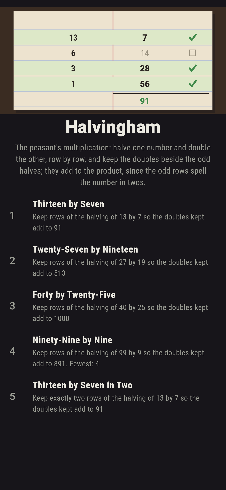
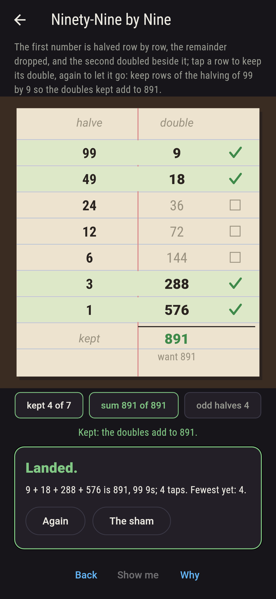
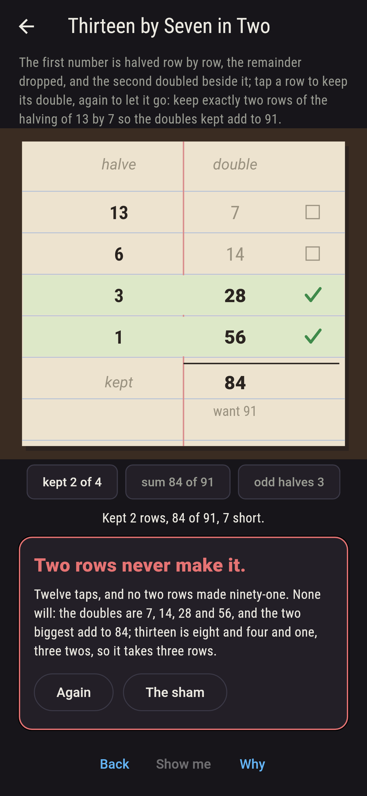
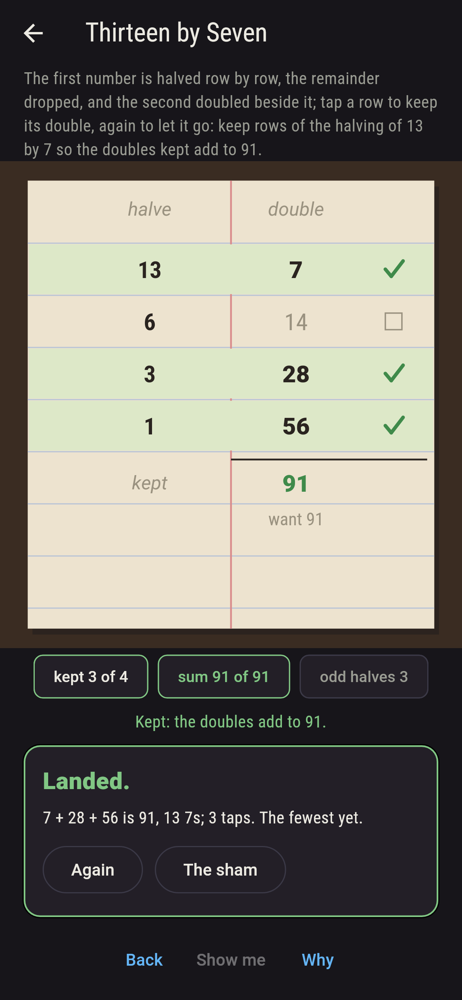
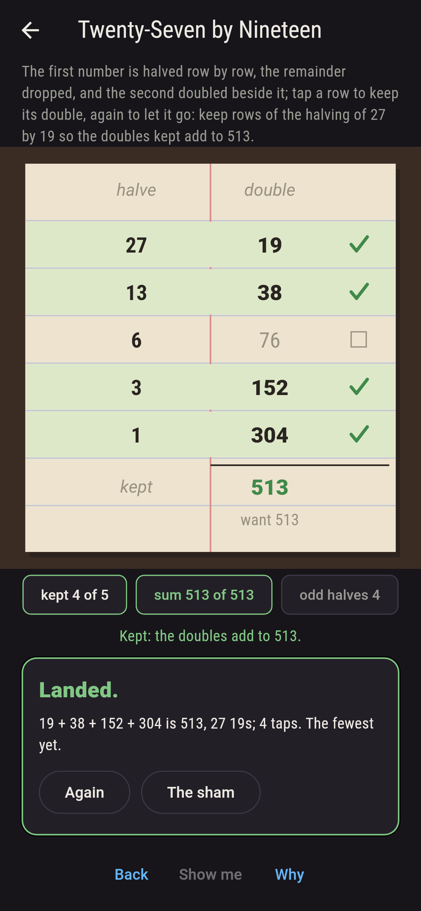
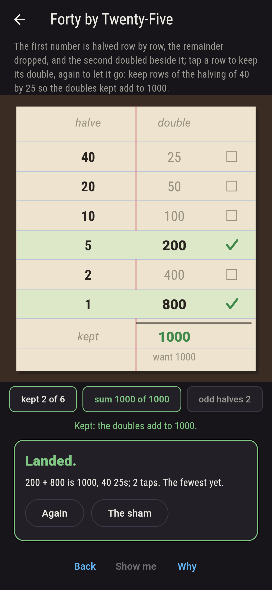
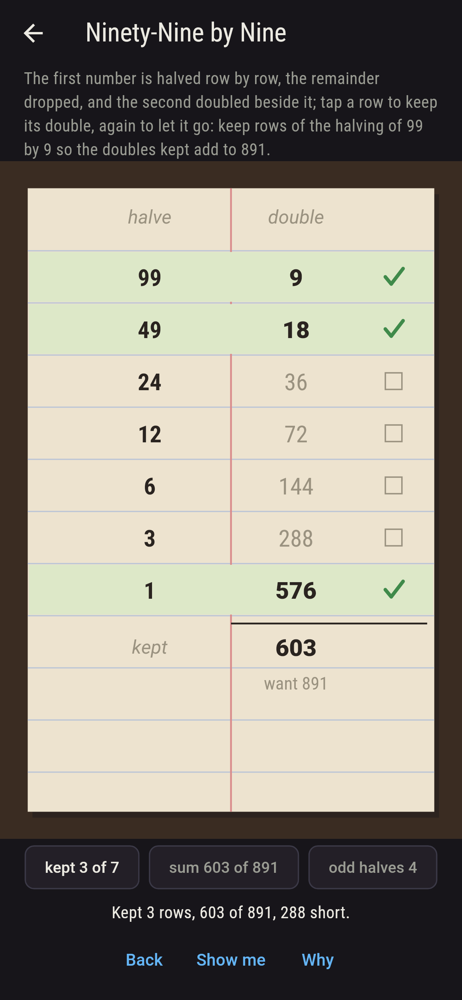
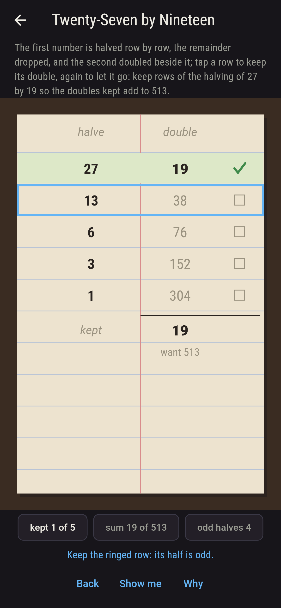
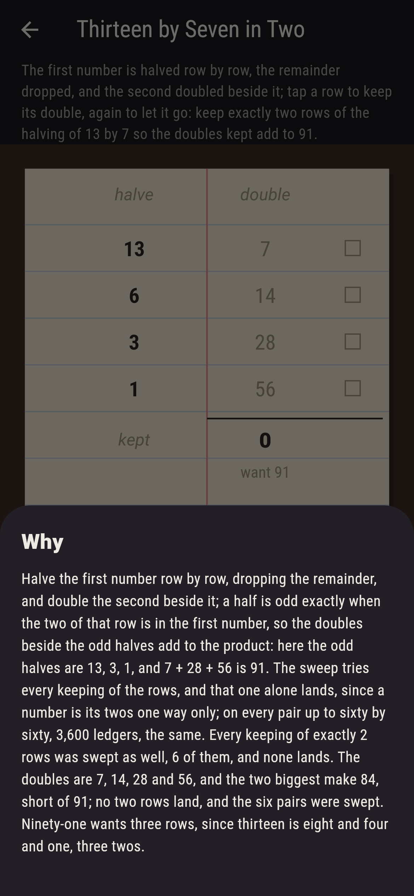

# Halvingham


The peasant's multiplication, as old as the Rhind papyrus. Two
numbers to multiply: halve the first row by row, dropping the
remainder, until it comes to one, and double the second beside it;
then keep the doubles beside the odd halves and let the rest go, and
what you kept adds to the product. Tap a row to keep its double,
again to let it go. The reason is the twos: a half is odd exactly
when the two of that row is in the first number, so the doubles kept
are the second number times the twos that make the first, and since
a number is its twos one way only, no other keeping of the rows ever
adds to the product. The game sweeps every keeping of the rows for
every pair up to sixty by sixty and finds it so every time.

## The ledgers

1. **Thirteen by Seven** - keep rows of the halving of 13 by 7 so the doubles kept add to 91
2. **Twenty-Seven by Nineteen** - keep rows of the halving of 27 by 19 so the doubles kept add to 513
3. **Forty by Twenty-Five** - keep rows of the halving of 40 by 25 so the doubles kept add to 1000
4. **Ninety-Nine by Nine** - keep rows of the halving of 99 by 9 so the doubles kept add to 891
5. **Thirteen by Seven in Two** - keep exactly two rows of the halving of 13 by 7 so the doubles kept add to 91

Thirteen halves to six, three and one, and the odd rows' doubles,
seven, twenty-eight and fifty-six, add to ninety-one, one keeping
of sixteen; twenty-seven by nineteen keeps four rows of five, one of
thirty-two; forty by twenty-five keeps two of six, one of sixty-four,
forty being thirty-two and eight; ninety-nine by nine keeps four of
seven, one of a hundred and twenty-eight. Thirteen by Seven in Two
is labeled hopeless on its tile, and the why spells the twos.

## Two voices

The game never asserts what it has not computed, and it computes
everything at least twice:

* **The sweep** keeps the rows every way, two to the rows keepings,
  and counts those whose doubles add to the product, for every pair
  from one by one to sixty by sixty; every count on the sham is
  that sweep's, and for the hopeless ledger every keeping of exactly
  two rows is swept as well.
* **The twos** need no sweep: on every pair the doubles beside the
  odd halves are checked to add to the product, the rows are checked
  to number the twos it takes to write the first number, and each
  row's half is checked to be odd exactly when that two is in the
  first number; and the sweep finds the odd rows' keeping to be the
  only one that lands, on all 3,600 pairs.

`tool/check_keepings.dart` runs the lot and refuses the bake on any
disagreement.

## The checker's ledger

What `dart run tool/check_keepings.dart` printed for the build this
README shipped with, word for word:

```
every pair from one by one to sixty by sixty halved and doubled, 3,600 ledgers and 18,180 rows, and every keeping of the rows swept: the doubles beside the odd halves add to the product every time, and no other keeping does, since a row is odd exactly when its two is in the first number and a number is its twos one way only; thirteen by seven keeps 1 way of 16, twenty-seven by nineteen 1 of 32, forty by twenty-five 1 of 64, ninety-nine by nine 1 of 128, and thirteen by seven in two rows never

 1 Thirteen by Seven        keep rows of the halving of 13 by 7 so the doubles kept add to 91: 1 of the 16 keepings lands it
 2 Twenty-Seven by Nineteen keep rows of the halving of 27 by 19 so the doubles kept add to 513: 1 of the 32 keepings lands it
 3 Forty by Twenty-Five     keep rows of the halving of 40 by 25 so the doubles kept add to 1000: 1 of the 64 keepings lands it
 4 Ninety-Nine by Nine      keep rows of the halving of 99 by 9 so the doubles kept add to 891: 1 of the 128 keepings lands it
 5 Thirteen by Seven in Two keep exactly two rows of the halving of 13 by 7 so the doubles kept add to 91: none of the 6, and the twos said so first
```

## Screenshots

| The sham | Ninety-nine by nine kept | Two rows admitted |
| --- | --- | --- |
|  |  |  |

| Thirteen by seven | Twenty-seven by nineteen | Forty by twenty-five | Mid-keeping | Show me | The why |
| --- | --- | --- | --- | --- | --- |
|  |  |  |  |  |  |

Screenshots are drawn by `test/showcase_test.dart` at real phone
sizes with the app's own painter, then copied into `docs/` as they
came out; every row in them was kept by a tap, so nothing pictured
is a ledger the game could not reach. The logo and every launcher
icon come out of `test/mark_test.dart` the same way: the mark is
thirteen by seven kept, the odd rows ticked and ninety-one at the
foot.

## Building

```
flutter test          # 44 tests, the sweep among them
dart run tool/check_keepings.dart
flutter build apk     # or: flutter build ios
```
