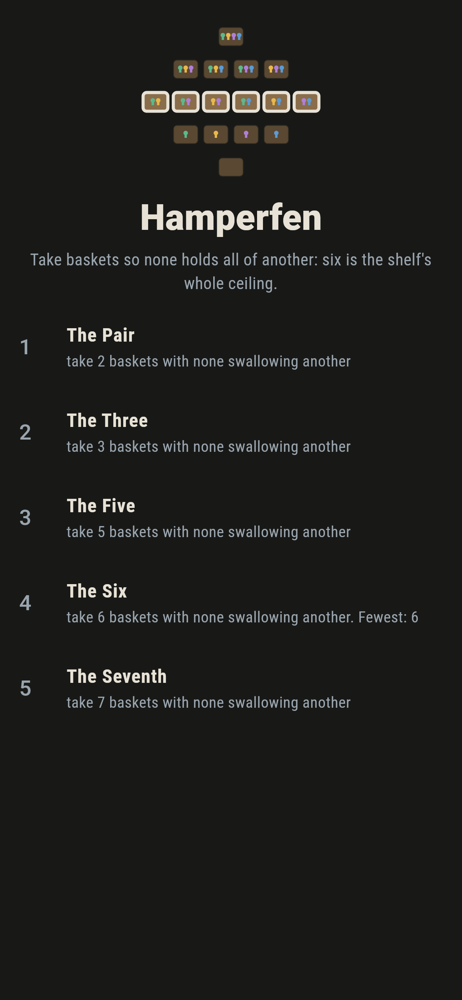
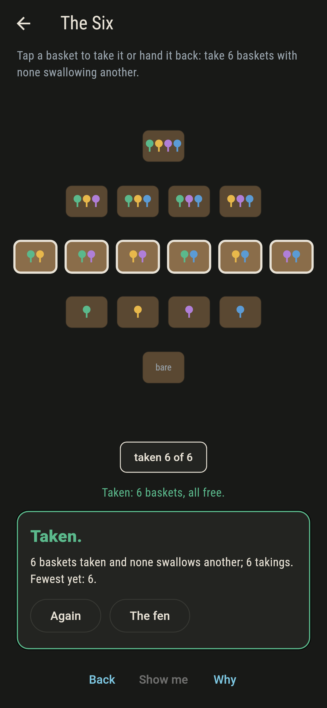
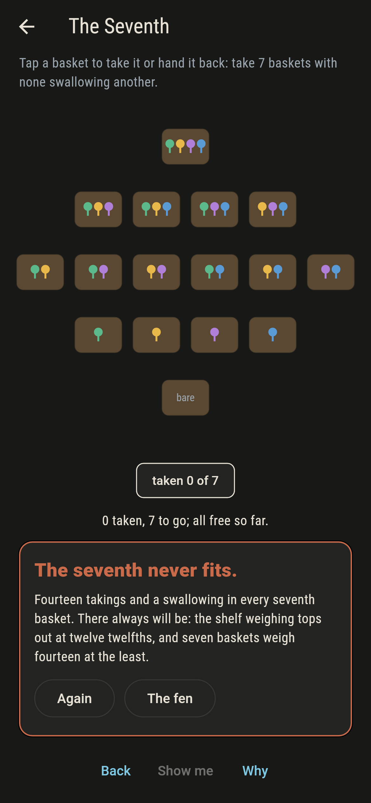
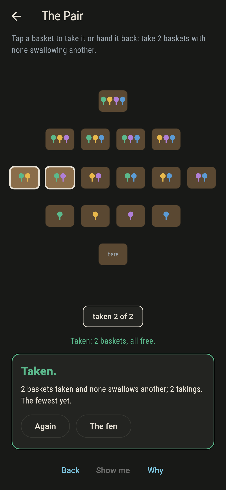
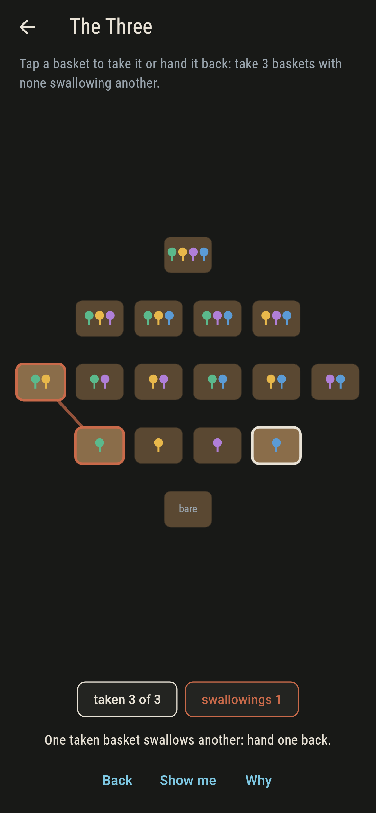
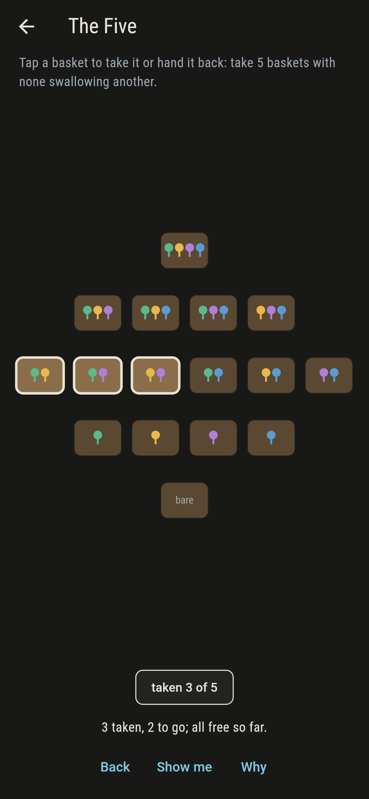
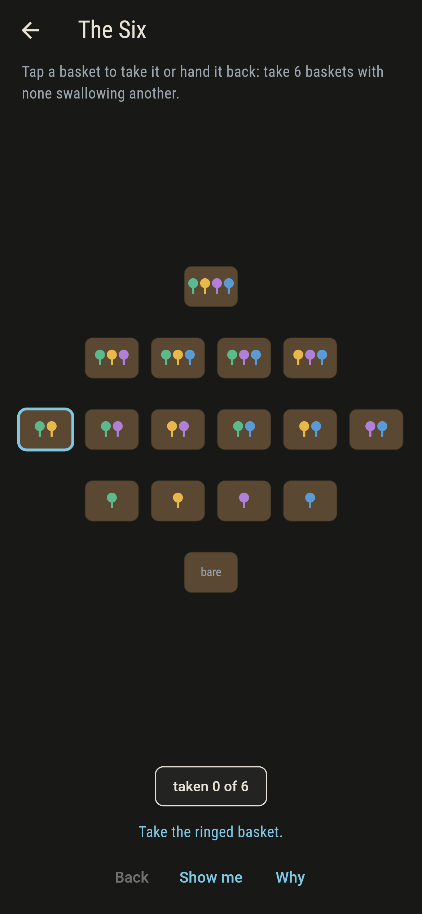
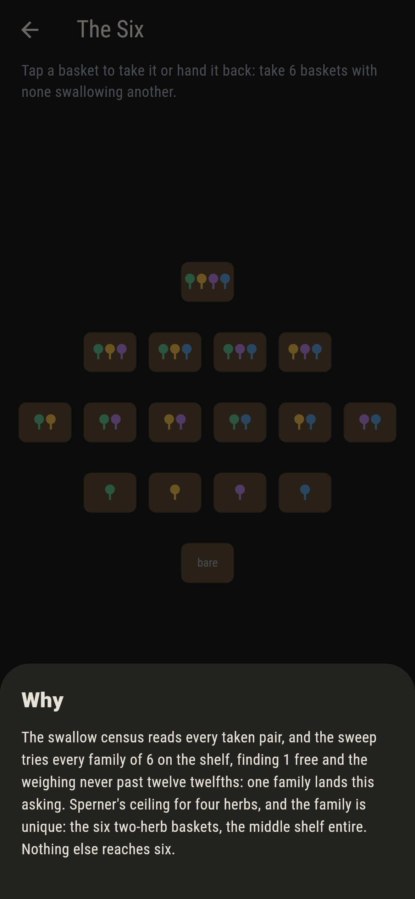

# Hamperfen


Sixteen baskets on five shelves, one for every mixture of four
herbs, the bare basket and the full one included. A basket
swallows another when it holds every herb the other does, and a
picking is free when nothing taken swallows anything taken.
Sperner's theorem sets the ceiling at six, the family is unique,
and the seventh basket is beyond any picking.

## The fens

1. **The Pair** - take 2 baskets with none swallowing another
2. **The Three** - take 3 baskets with none swallowing another
3. **The Five** - take 5 baskets with none swallowing another
4. **The Six** - take 6 baskets with none swallowing another
5. **The Seventh** - take 7 baskets with none swallowing another

The free counts run 55, 64, 25, 6, 1, none: roomy at three,
narrowing fast. Every free five is the middle shelf less a
basket, and the one free six is the middle shelf entire, the six
two-herb baskets. The Seventh asks for what the weighing forbids:
weigh each basket at twelve over its shelf's width and a free
picking never passes twelve, with twelve only ever a whole shelf.

## Two voices

The game never asserts what it has not computed, and it computes
everything at least twice:

* **The swallow census** reads every taken pair and joins any
  swallowing in rust.
* **The sweep** tries every family on the shelf, pairs to
  sevens, and counts the free.
* **The weighing** prices each basket at twelve over its shelf's
  width and holds every free family to twelve twelfths, tight
  only at whole shelves.

`tool/check_fens.dart` runs the lot and refuses the bake on any
disagreement.

## The checker's ledger

What `dart run tool/check_fens.dart` printed for the build this
README shipped with, word for word:

```
every family on the shelf swept, pairs to sevens: the free counts run 55, 64, 25, 6, 1 and none, the one family of six is the middle shelf entire, every free five is that shelf less a basket, and the weighing holds at twelve twelfths with twelve only ever a whole shelf

 1 The Pair       take 2 baskets with none swallowing another: 55 families of the sweep land it
 2 The Three      take 3 baskets with none swallowing another: 64 families of the sweep land it
 3 The Five       take 5 baskets with none swallowing another: 6 families of the sweep land it
 4 The Six        take 6 baskets with none swallowing another: 1 family of the sweep lands it
 5 The Seventh    take 7 baskets with none swallowing another: none of the 11,440, and the weighing said so first
```

## Screenshots

| The fenland | The six taken | The seventh admitted |
| --- | --- | --- |
|  |  |  |

| A free pair | A swallowing | Mid-picking | Show me | The why |
| --- | --- | --- | --- | --- |
|  |  |  |  |  |

Screenshots are drawn by `test/showcase_test.dart` at real phone
sizes with the app's own painter, then copied into `docs/` as
they came out; every basket in them was taken by taps, so nothing
pictured is a fen the game could not reach. The logo and every
launcher icon come out of `test/mark_test.dart` the same way: the
mark is the one six.

## Building

```
flutter test          # 45 tests, the sweep among them
dart run tool/check_fens.dart
flutter build apk     # or: flutter build ios
```
