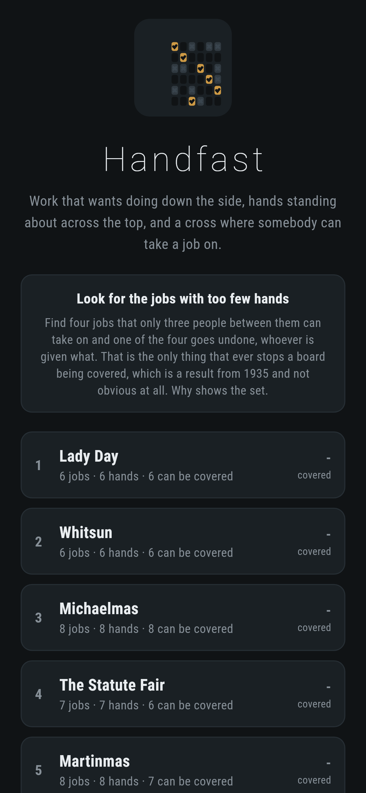
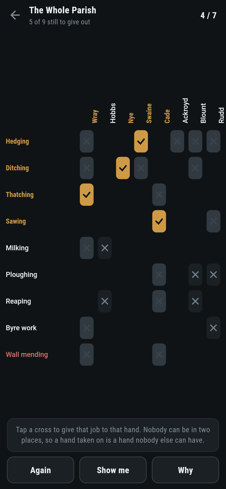
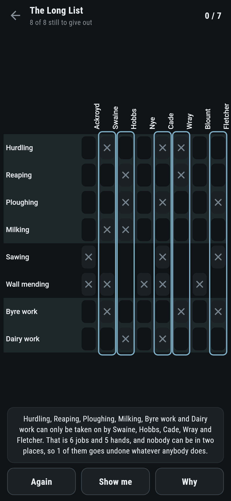
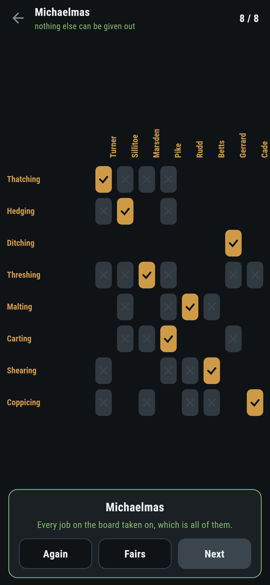
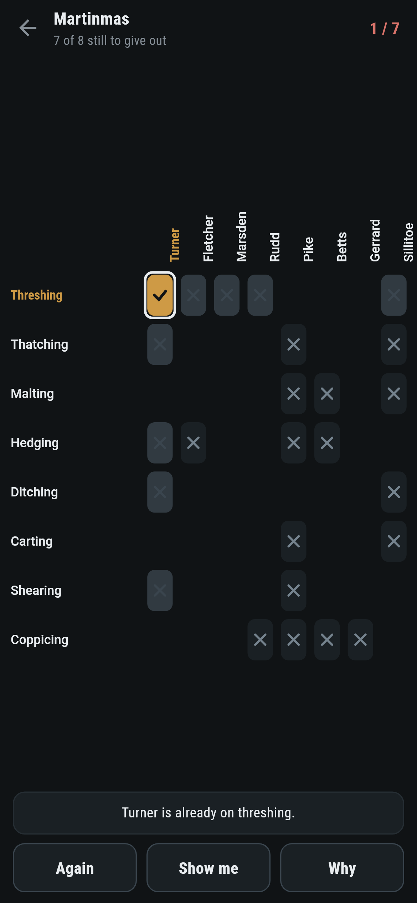

# Handfast

A hiring puzzle for phones, in Flutter, for Android and iOS.

Work that wants doing down the side of the board, hands standing about across
the top, and a cross where somebody can take a job on. Nobody can be in two
places, so every hand taken on is a hand nobody else can have. Cover as much of
the work as the fair will cover.

| | | | |
|---|---|---|---|
|  |  |  |  |

## Why a board cannot be covered

Find four jobs that only three people between them can take on, and one of the
four goes undone whoever is given what. That is the only thing that ever stops
a board from being covered, which is a result of Philip Hall's from 1935 and is
not obvious at all: the obstruction is always that plain, and if no such set
exists then the whole board can be covered.

**Why** finds the set and marks it. Every cross in the shaded rows falls inside
a ringed column, and there are more shaded rows than ringed columns:


## The reason falls out of the answer

The game gives out the work by taking the jobs one at a time and, for each,
looking for a hand. If somebody who can do it is free, that is that. If not,
each hand who could do it is asked whether the job they are already on could be
passed to somebody else, and so on down the line. When that walk reaches
anybody free, every job on the chain shuffles along by one and one more job
gets covered.

When it does not, the jobs it walked through are exactly the set to show. Every
hand who can take on any of them is already on one of them, or the walk would
have found them free. So those jobs have as many hands between them as there
are jobs in the list, less the ones nobody is on. The certificate is what is
left over from the failed search, and costs nothing.

```
$ make fairs
 1 Lady Day           6 jobs  6 hands  10 crosses  most 6  written down 6  by trying every way 6  working down 4  undone 0  shortfall by trying 0  0 jobs with 0 hands
 2 Whitsun            6 jobs  6 hands  16 crosses  most 6  written down 6  by trying every way 6  working down 5  undone 0  shortfall by trying 0  0 jobs with 0 hands
 3 Michaelmas         8 jobs  8 hands  31 crosses  most 8  written down 8  by trying every way 8  working down 7  undone 0  shortfall by trying 0  0 jobs with 0 hands
 4 The Statute Fair   7 jobs  7 hands  14 crosses  most 6  written down 6  by trying every way 6  working down 4  undone 1  shortfall by trying 1  2 jobs with 1 hands
 5 Martinmas          8 jobs  8 hands  25 crosses  most 7  written down 7  by trying every way 7  working down 6  undone 1  shortfall by trying 1  4 jobs with 3 hands
 6 The Long List      8 jobs  8 hands  23 crosses  most 7  written down 7  by trying every way 7  working down 6  undone 1  shortfall by trying 1  6 jobs with 5 hands
 7 The Whole Parish   9 jobs  8 hands  25 crosses  most 7  written down 7  by trying every way 7  working down 6  undone 2  shortfall by trying 2  7 jobs with 5 hands
```

Four hundred fairs made up at random are settled by that walk and again by a
search over every way of handing the work out, and the two always agree. On
another four hundred, the set of jobs it hands back is checked to have exactly
the shortfall it claims, and on two hundred and fifty more, every set of jobs
on the board is counted against the hands it can reach to make sure none of
them is shorter still.

## What the game says



After every job given out it runs the same walk again over the work nobody is
on and the hands nobody has taken, which is a different question from the one
it answered when the day opened and just as cheap. That is what lets it say the
moment a day has stopped being as good as it could be, rather than letting
somebody find out at the end.

**Show me** points at a job and a hand that keeps the day whole. A test gives
out all seven boards by doing nothing else, and every one comes out on the most
that can be covered.

## Running it

```
make deps      # flutter pub get
make test      # everything
make analyze
make shots     # render the screens into build/showcase, redraw the logo and icons
make fairs     # the most each board covers, two ways, and the set that proves it
make find      # make fairs up and keep the ones worth playing
make apk       # release APK
make ios       # release iOS build, unsigned
```

## Tests

`flutter test` runs the fair (who can do what, and how many hands a set of jobs
has between it), the walk (that it covers everything when everything can be
covered, hands nobody two jobs, and never gives a job to somebody who cannot do
it), the walk against a search over every way of handing the work out on four
hundred random fairs, the set of jobs it names being short by exactly the
number that go undone, no set anywhere being shorter than that one, every day
that ships, and a day at the fair.

Then the game through the screen: tapping a cross, tapping it again, tapping
the job down the side, a hand who cannot do the job, a hand already taken on,
being told the day can no longer be as good, **Again**, **Show me**, **Why**,
a day given out badly on purpose, and all seven boards covered up to the most.

Screenshots come from `test/showcase_test.dart`, and every job given out in
them was given out by tapping a cross. `test/mark_test.dart` draws the logo,
the launcher icons at every density Android asks for and every size the iOS
icon set asks for; there is no image in this repository that was not produced
by it.
