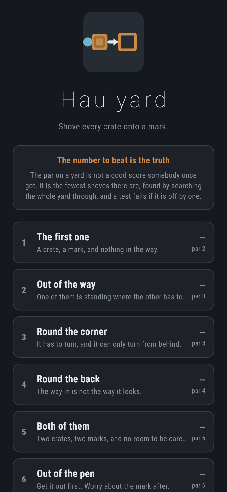
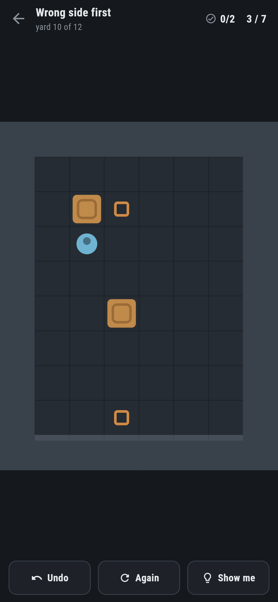
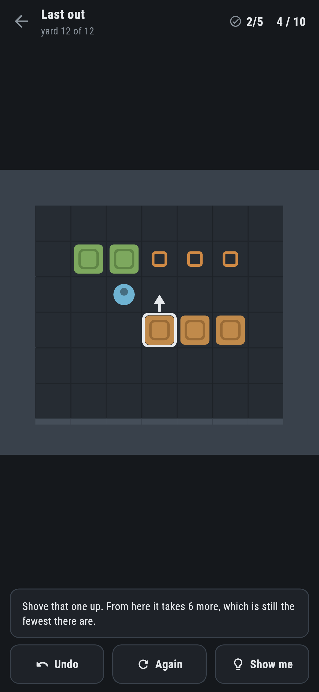
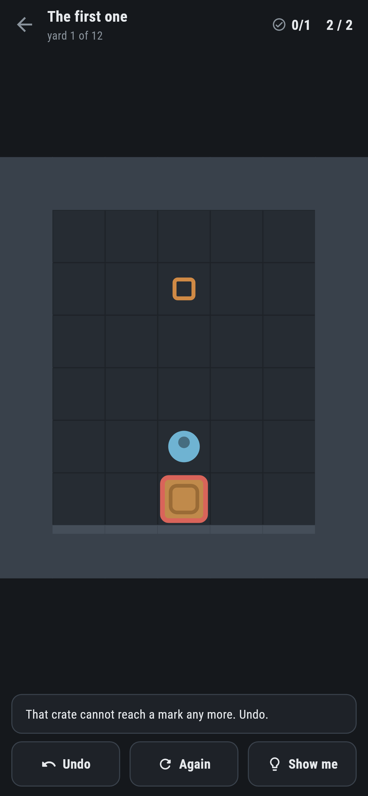

# Haulyard

A crate-shoving puzzle for phones, in Flutter, for Android and iOS.

Shove every crate onto a mark. You can only push, never pull, and a crate in
the wrong corner stays there for ever. Twelve yards, and a number on each one
that is not a suggestion.

| | | | |
|---|---|---|---|
|  |  |  |  |

## The par is the truth

Most puzzle games print a target that somebody once managed. The par on a yard
here is the **fewest shoves there are**, found by searching the whole yard, and
`test/yard_test.dart` fails if the number on the level is off by one:

```dart
final haul = Hauler(level.ground).from(level.start);
expect(haul.pushes, level.par,
    reason: '${level.name} says ${level.par} and takes ${haul.pushes}');
```

There is a second test that does not trust the first. A number out of a search
is one thing; a list of shoves a hauler could really make is another. So the
way through is replayed shove by shove, checking at every step that the hauler
could actually walk to where they would have to stand, and that the yard ends
finished in exactly par.

```
$ make pars
 1 The first one      1 crates  par   2       4 positions   0.4ms
 2 Out of the way     2 crates  par   3      28 positions   0.4ms
 ...
11 The yard           4 crates  par   8    9521 positions 118.8ms
12 Last out           5 crates  par  10   13234 positions 142.3ms
```

## Walking is free

The search is over **shoves**, not steps. Walking about cannot make a yard
worse, so it is not counted, not searched over, and not worth thinking about —
tap anywhere you can reach and you are there.

That is also what keeps the search small. Two positions count as the same when
the crates match and the hauler is shut into the same pocket by them, because
with the same crates and the hauler anywhere in one pocket, exactly the same
shoves are possible. Telling those apart would multiply the search by the size
of the yard for nothing.

Two more things keep it honest and quick:

- **Dead squares.** Worked out once per yard, backwards from the marks: a
  square is worth being on only if a crate there could still be shoved to a
  mark. Any crate anywhere else has already lost the yard.
- **Frozen blocks.** Four squares that are all crate or wall can never move
  again. Only the crate that just moved is checked, because every other one
  stood where it stands now a moment ago, when the yard was still winnable.

## It tells you the moment you have ruined it



The worst thing about this kind of puzzle is playing on for five minutes after
the position became impossible. Here the two checks above run after every
shove — they are instant, no search involved — and the yard says so:

> That crate cannot reach a mark any more. Undo.

Ask **Show me** and it searches from where the yard actually stands, which is
the only honest answer: a hint read off the shortest way through from the
start is advice about a yard nobody is playing. It points at a crate, draws an
arrow off it, and tells you how many shoves are left from here — and whether
that is still par.

If nothing can finish the yard, it says that instead.

## Yards are written by hand

A yard is one idea — a corner you can only come at from behind, a crate that
has to be moved before another one can be — and nothing that generates yards
generates ideas. They are pictures in `lib/yard/levels.dart`:

```dart
Level(
  name: 'Wrong side first',
  about: 'Neither will move until the other has.',
  par: 7,
  rows: [
    '########',
    '#      #',
    '#  .   #',
    '#      #',
    '#  \$   #',
    '#  \$   #',
    '#  @   #',
    '#      #',
    '#  .   #',
    '########',
  ],
),
```

Written by hand and checked by machine. Four of the first twelve were
impossible when they were first drawn — a crate could reach the room but the
hauler could not get round behind it — and the search said so before anybody
played them.

## Running it

```
make deps    # flutter pub get
make test    # everything
make analyze
make shots   # render the screens into build/showcase, redraw the logo
make pars    # search every yard and print the shortest way through it
make apk     # release APK
make ios     # release iOS build, unsigned
```

## Tests

`flutter test` runs the ground (where a step goes, and where it does not),
stepping and shoving (into walls, into crates, and shoves nobody can walk to),
the pictures (crates against marks, a hauler in each one, rows written short),
every yard against its par twice over, the deadlock checks either side of the
line, and the pocket rule that makes two positions one.

Then the game through the screen: swiping, tapping to walk, tapping to shove,
undo, starting again, the warning when a yard is ruined, and — the one that
matters — **every yard worked through to the end by pressing Show me and doing
what it says**, finishing each one in exactly par.

Screenshots come from `test/showcase_test.dart`, which shoves the crates in
them by tapping the squares they are in. `test/mark_test.dart` draws the logo
and the app icon; there is no image in this repository that was not produced
by it.

`integration_test/screenshot_test.dart` does it again on a real emulator and a
real simulator, running the search on the device and tapping with device
pointer events. There is no CI here, so it is driven by hand
on a machine with a phone or a simulator attached — `.github/scripts/` holds
the two scripts that do it.
