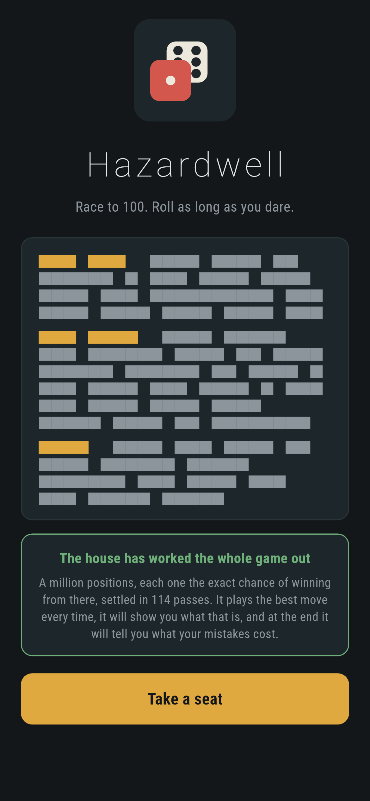
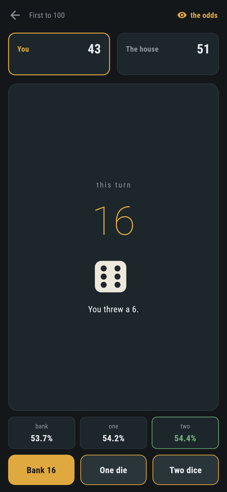
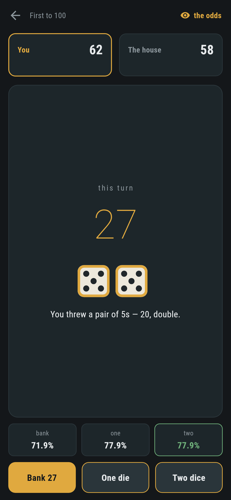
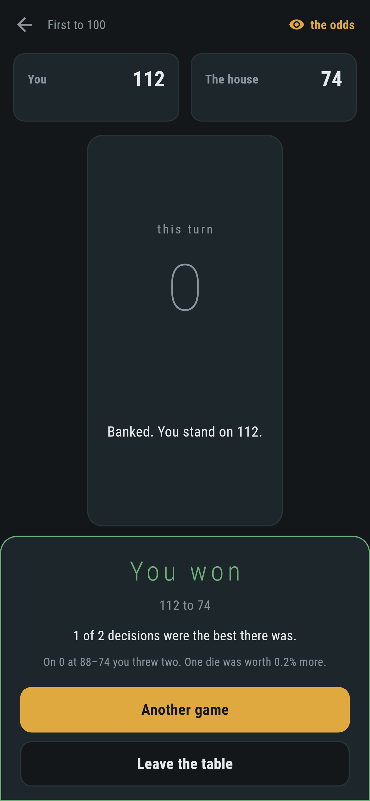
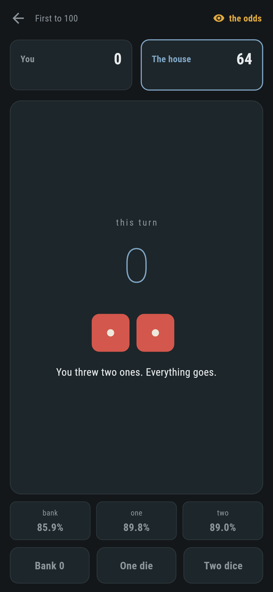

# Hazardwell

A dice game for phones, in Flutter, for Android and iOS.

Race to a hundred. Roll as long as you dare, then bank what the turn has made.
A one takes the lot, and two ones take your score with it. You are playing
the house, and the house has worked the whole game out.

| | | | |
|---|---|---|---|
|  |  |  |  |

## The house is not an opponent, it is the answer

There is no difficulty slider and nothing to tune. When the app starts it
works out the exact chance of winning from **every position in the game**, a
million of them, and the house plays the best move every time.

That table cannot be filled in one square at a time, because the value of a
position depends on positions that depend back on it: you bank, they play,
they hand back. So there is no order to fill it in. What there is instead is a
guess and a rule that improves it, applied until it stops moving:

```
$ make odds
114 sweeps, 993ms, settled to 9.4e-12
the player to move at nothing all: 0.5282
```

**And the answer proves itself.** `test/game_test.dart` takes twenty thousand
positions out of the settled table and checks each one is exactly what its
three moves are worth according to the rest of the table:

```dart
final moved = (odds.winning(mine, theirs, turn) -
        odds.chanceAt(mine, theirs, turn).bestChance).abs();
expect(worst, lessThan(1e-9));
```

If that holds everywhere then the table is the answer, and the sweeps were
only a way of finding it. There is no other proof available and none needed.

## It will show you the odds, and tell you what you cost yourself


Turn the odds on and every move carries the number the house is using. Not a
hint, not a nudge, not a difficulty setting: the same table, put where you
can see it. The whole difference between the two of you is meant to be that
the house always takes the best one.

At the end it adds up the difference:

> 14 of 17 decisions were the best there was. On 24 at 88 to 74 you threw two.
> Banking was worth 6.1% more.

That is what makes this game learnable rather than only lucky. Winning is
mostly the dice. Playing well is not, and it can be measured exactly.

## Two dice are not one die twice

That heading is why the rules are the way they are rather than a slogan. Two
dice where either one ends the turn is *precisely* one die rolled twice with
no choice in between, with the same outcomes, the same odds and the same
payouts. It could
never beat rolling one and then deciding, so it would never be worth picking,
and the first version of this game had a third button that no correct player
would ever press. The solver said so: the two moves came out equal to fifteen
decimal places, at every position where rolling was right at all.

So a pair pays **double**. Now it is a gamble the other move cannot make, and
all three moves are right somewhere:

```
turn  0  bank 0.4718  one 0.5263  two 0.5282  -> two dice
turn 20  bank 0.5818  one 0.5847  two 0.5891  -> two dice
turn 28  bank 0.6304  one 0.6248  two 0.6242  -> bank
```

`test/game_test.dart` checks all three are clearly best in hundreds of
positions, by a margin rather than by a rounding error.

## What the table knows that folk wisdom does not

The old advice for a game like this is "bank on twenty". Here it is
twenty-five at the start, and it moves:

```
at  0 all, bank on 25      at 50 all, bank on 19
at 20 all, bank on 23      at 60 all, bank on 40
at 40 all, bank on 25      at 90 all, bank on 10
```

Forty at sixty-all, because banking to a hundred is the only thing that ends
the game and getting there in one turn beats getting there in two. Ten at
ninety-all, because ten is all you need. A fixed rule cannot know that and a
table does.

## Worked out here, not shipped in a tin

The table is a second of arithmetic and eight megabytes, so it is worked out
on an isolate of its own while the way in is on screen, rather than shipped in
a file you would have to take on trust. By the time anybody has read the rules it is
done, and the button says so.

`integration_test/screenshot_test.dart` does it on a real device and prints
how long it took there.

## Running it

```
make deps    # flutter pub get
make test    # everything
make analyze
make shots   # render the screens into build/showcase, redraw the logo
make odds    # work out the table and print what it found
make apk     # release APK
make ios     # release iOS build, unsigned
```

## Tests

`flutter test` runs the rules (what a throw pays, and that the nine payouts
the solver's inner loop is written round are the ones the rules give), a game
(the turn going, the score going, winning and stopping), and the table: that
it settles, that it is a fixed point of its own rule, that it gives the first
player about fifty three games in a hundred, that it rises with your score and
falls with theirs, that banking nothing is never the best move anywhere in the
game, and that all three moves are clearly right somewhere.

Then the game through the screen: throwing, banking, the house taking its
turn, the odds strip, the review, and a whole game played out by the table's
own advice, which must end with the review finding no mistake in it.

Screenshots come from `test/showcase_test.dart` with dice that have been told
what to throw. `test/mark_test.dart` draws the logo and the app icon; there is
no image in this repository that was not produced by it.

| | |
|---|---|
|  |  |
