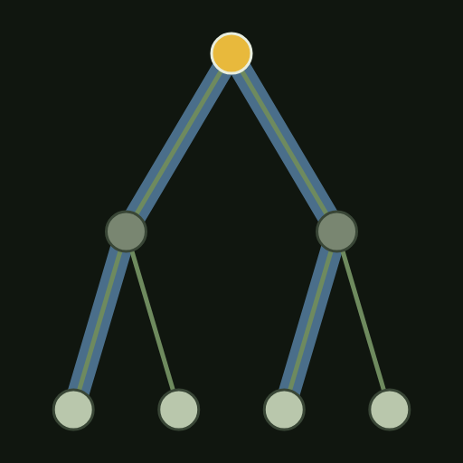
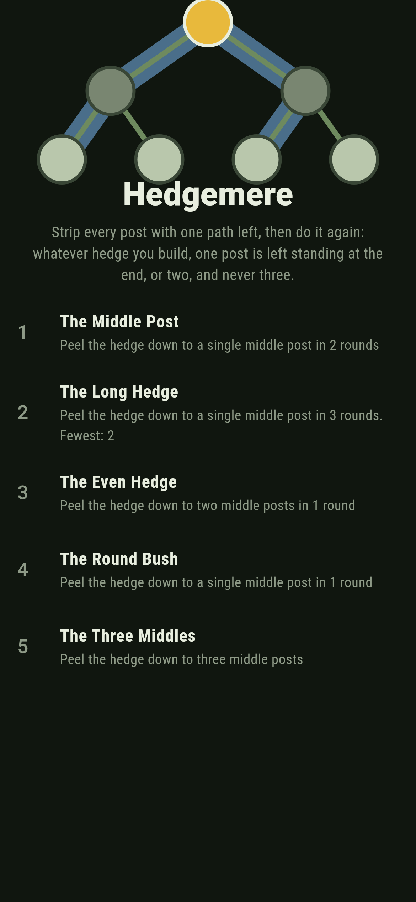
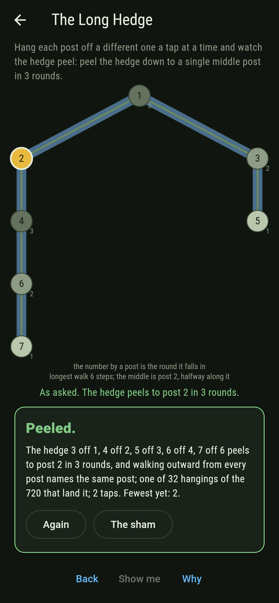
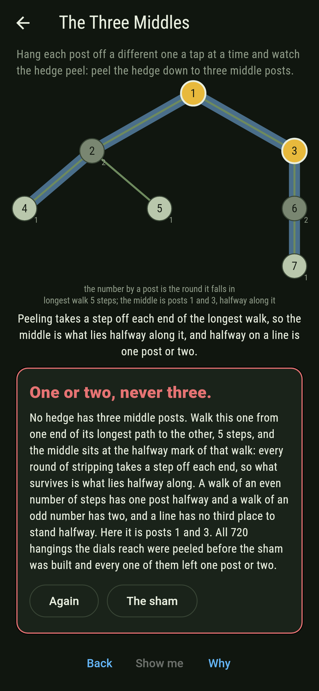
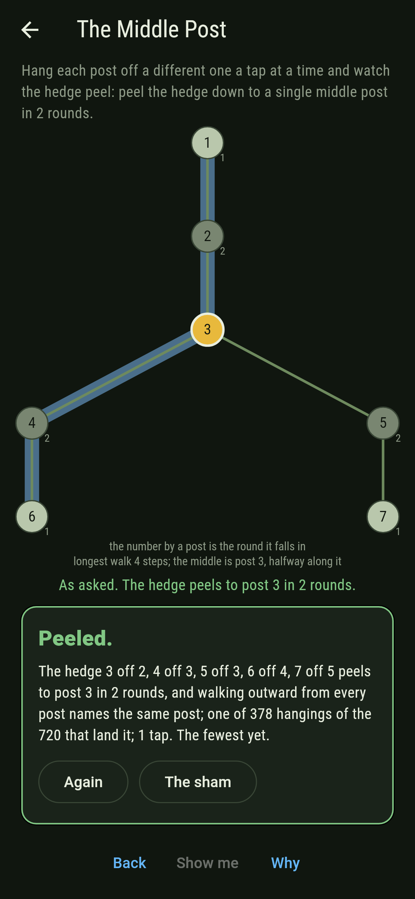
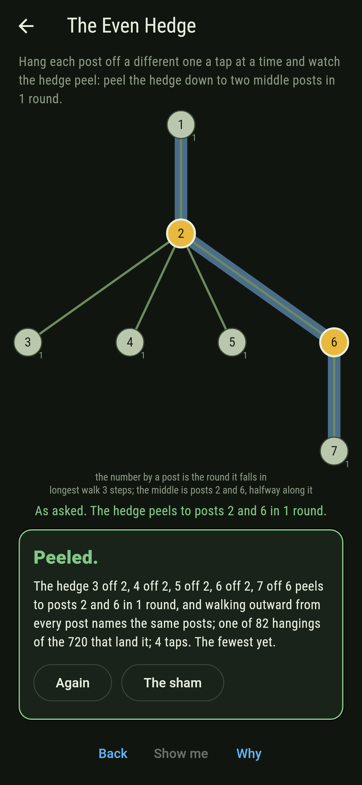
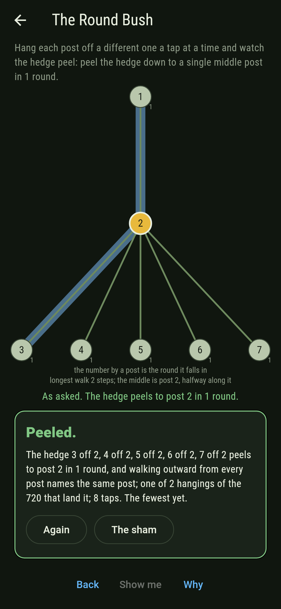
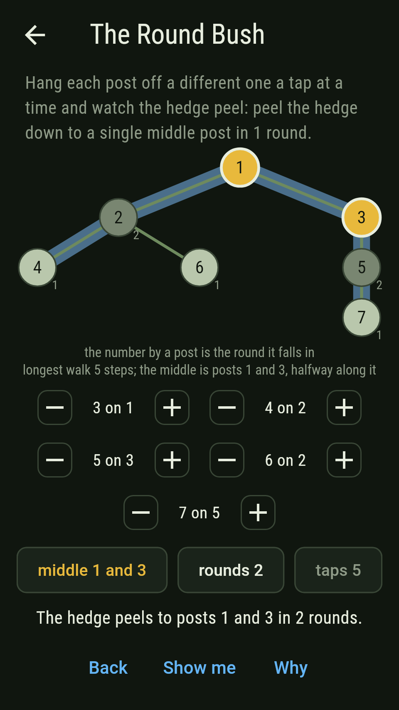
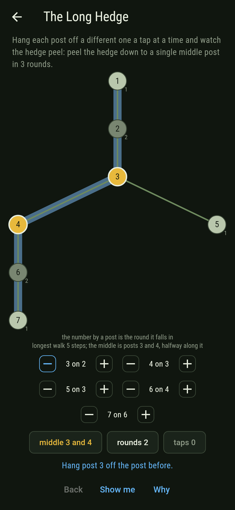
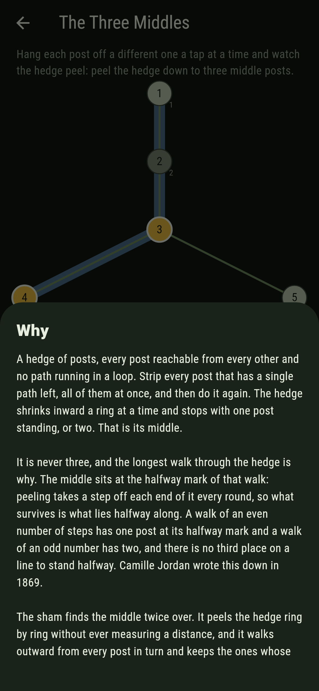

# Hedgemere



Seven posts joined by paths, no path running in a loop and no post cut
off. Strip every post that has a single path left, all of them at once,
and the hedge shrinks inward a ring. Strip it again. Keep going and the
hedge comes down to one post standing, or to two. It is never three.
Five dials hang each post off an earlier one, a post a tap, and the
board draws the hedge with the middle lit, the round each post falls in
written beside it, and one longest walk laid behind the whole thing so
you can see the middle sitting at its halfway mark.

## The asks

1. **The Middle Post** - peel the hedge down to a single middle post in 2 rounds
2. **The Long Hedge** - peel the hedge down to a single middle post in 3 rounds
3. **The Even Hedge** - peel the hedge down to two middle posts in 1 round
4. **The Round Bush** - peel the hedge down to a single middle post in 1 round
5. **The Three Middles** - peel the hedge down to three middle posts

378 of the 720 hedges the dials reach come down to one post in two
rounds, which is the commonest thing a hedge of seven posts does. 32
land the long hedge, and every one of them is the same shape: all seven
posts in a line, six steps end to end, with the fourth post along
standing at the halfway mark. 82 come down to two posts in a single
round. Only two are round bushes, six posts hanging off one, and the
board opens eight taps away from either. The Three Middles is labeled
hopeless on its tile, and the card at the end of the ask says why on a
finger.

## Why it is never three

Walk the hedge from one end of its longest path to the other. Every
round of stripping takes a post off each end of that walk, so what
survives the peeling is what lies halfway along it. A walk of an even
number of steps has one post at its halfway mark. A walk of an odd
number has two. A line has no third place to stand halfway, so no
hedge has three middle posts.

Camille Jordan published this in 1869, in "Sur les assemblages de
lignes". The same argument gives the rest of what the board shows: the
rounds come to half the longest walk rounded down, the shortest worst
walk from any post comes to half of it rounded up, and one middle post
turns up exactly when the longest walk is an even number of steps.

## Two voices

The game never asserts what it has not computed, and it computes
everything at least twice:

* **The peeling** strips every post with one path left, round after
  round, and sees what is still standing. It never measures a distance.
* **The walking** goes outward from every post in turn, keeps the worst
  walk from each, and takes the posts whose worst walk is shortest. It
  never strips anything.

The two are set against each other on all 720 hedges the dials reach
and again on every labelled hedge from two posts up to eight, one for
each Prufer word, 280,392 of them. They name the same posts every time.

`tool/check_hedges.dart` runs the lot and refuses the bake on any
disagreement.

## The checker's ledger

What `dart run tool/check_hedges.dart` printed for the build this
README shipped with, word for word:

```
every hedge the dials reach taken, 720 of them over 7 posts, and each one found twice, once by stripping every post with a single path left round after round and once by walking outward from every post and keeping the ones whose worst walk is shortest: the two name the same posts on every hedge; 412 of the 720 come down to one post and 308 to two, none to three, and on every one of them the rounds come to half the longest walk rounded down, one middle post turns up exactly when that walk is an even number of steps, and the middle is the halfway mark of every longest walk there is; the longest walks run 2 at 2 steps, 82 at 3 steps, 378 at 4 steps, 226 at 5 steps, 32 at 6 steps, and the peeling takes 84 at 1 round, 604 at 2 rounds, 32 at 3 rounds; then every labelled hedge from two posts up to eight, one for each Prufer word, 280,392 hedges in all, peeled and measured the same two ways: 137,103 come down to one post and 143,289 to two, not one of them to three, and the same four laws hold on every one, 2 posts 1 hedge, 0 to one and 1 to two; 3 posts 3 hedges, 3 to one and 0 to two; 4 posts 16 hedges, 4 to one and 12 to two; 5 posts 125 hedges, 65 to one and 60 to two; 6 posts 1,296 hedges, 726 to one and 570 to two; 7 posts 16,807 hedges, 8,617 to one and 8,190 to two; 8 posts 262,144 hedges, 127,688 to one and 134,456 to two; three posts is the only size where every hedge comes down to one, and two posts the only size where every hedge comes down to two

 1 The Middle Post   peel the hedge down to a single middle post in 2 rounds: 378 of the 720 hangings land it, the cheapest in 1 tap
 2 The Long Hedge    peel the hedge down to a single middle post in 3 rounds: 32 of the 720 hangings land it, the cheapest in 2 taps
 3 The Even Hedge    peel the hedge down to two middle posts in 1 round: 82 of the 720 hangings land it, the cheapest in 4 taps
 4 The Round Bush    peel the hedge down to a single middle post in 1 round: 2 of the 720 hangings land it, the cheapest in 8 taps
 5 The Three Middles peel the hedge down to three middle posts: none of the 720, and the halfway mark says why
```

## Screenshots

| The sham | The long hedge | The three middles |
| --- | --- | --- |
|  |  |  |

| The middle post | The even hedge | The round bush | Midway, on the small phone | Show me | The why |
| --- | --- | --- | --- | --- | --- |
|  |  |  |  |  |  |

Screenshots are drawn by `test/showcase_test.dart` at real phone sizes
with the app's own painter, then copied into `docs/` as they came out;
every hedge in them was built by taps, so nothing pictured is a hanging
the game could not reach. The logo and every launcher icon come out of
`test/mark_test.dart` the same way: the mark is post 1 holding two
posts and each of those holding two more, four steps end to end, with
the middle lit at the halfway mark of the walk drawn behind it.

## Building

```
flutter test          # 57 tests, the sweep among them
dart run tool/check_hedges.dart
flutter build apk     # or: flutter build ios
```
