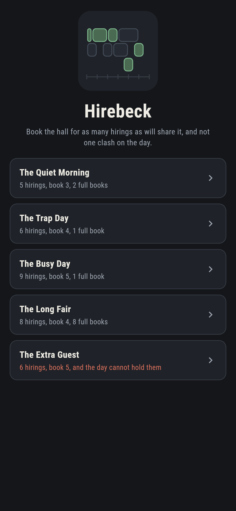
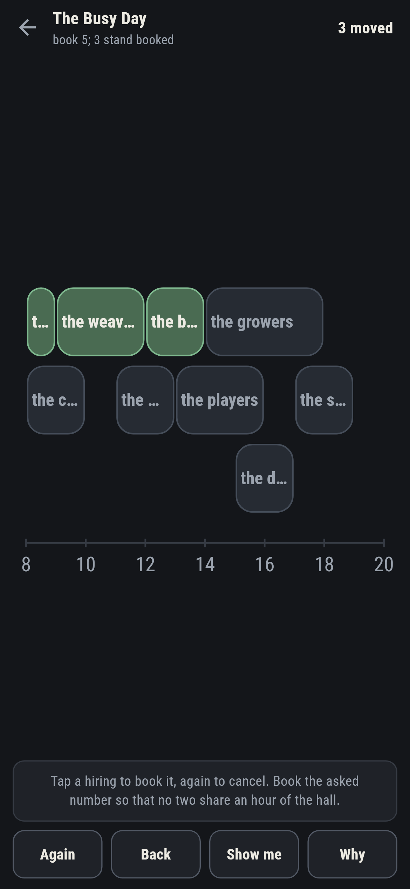
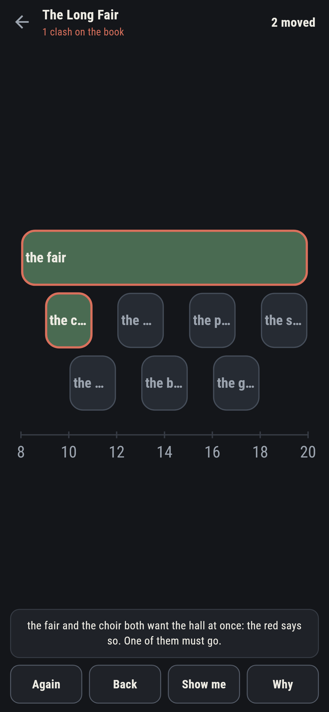
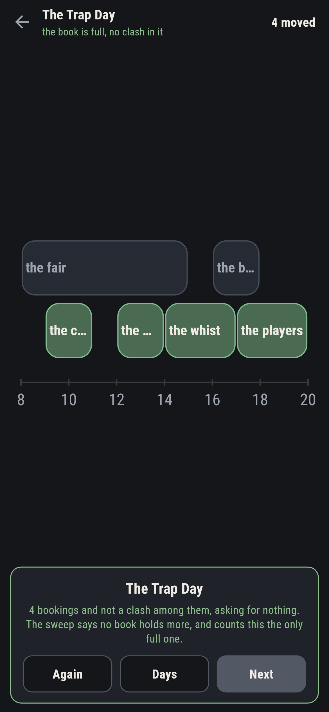
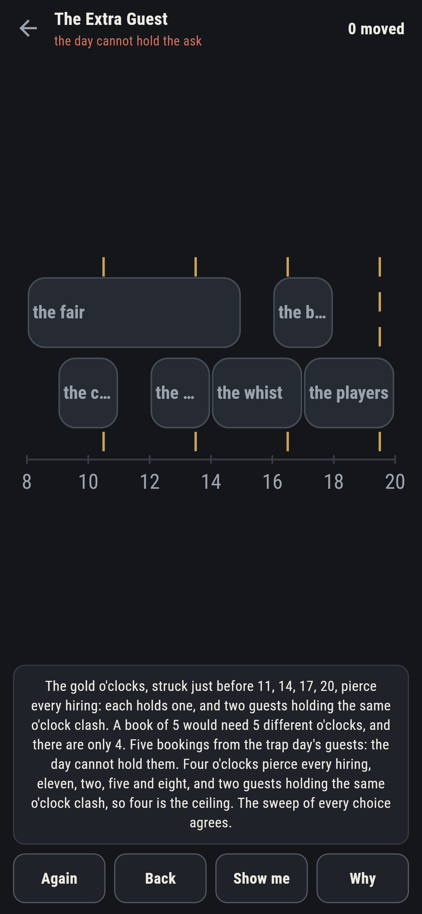
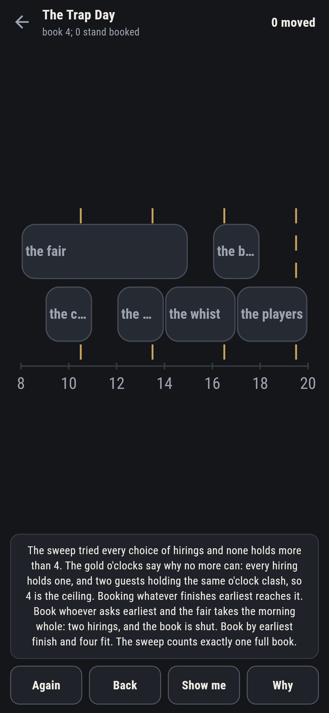

# Hirebeck

A hall-booking puzzle for phones, in Flutter, for Android and iOS.

A day of hirings, each wanting the hall from an o'clock to an
o'clock. Book as many as will share it, none clashing: ends may meet
starts, but no two guests hold the hall at once. This is interval
scheduling made a hand game, and the ceiling on every day is proved,
not fitted.

| | | | |
|---|---|---|---|
|  |  |  |  |

## Three ways of knowing

The sweep tries every choice of hirings a day offers and finds the
fullest book. The early-finish rule, booking whatever ends soonest
among what still fits, reaches the same count on every day that
ships, and the piercing o'clocks say why no book can beat it: a
handful of moments, one inside every hiring, and two guests holding
the same moment clash, so the book can never hold more guests than
there are moments. The checker refuses the bake if the three ever
part.

```
$ make days
 1 The Quiet Morning 5 hirings, fullest 3  ask 3 met 2 ways
 2 The Trap Day      6 hirings, fullest 4  ask 4 met 1 way
 3 The Busy Day      9 hirings, fullest 5  ask 5 met 1 way
 4 The Long Fair     8 hirings, fullest 4  ask 4 met 8 ways
 5 The Extra Guest   6 hirings, fullest 4  ask 5 unmeetable: 4 o'clocks pierce every hiring
```

## The traps

Booking whoever asks earliest is the natural blunder, and two days
ship to spring it. On The Trap Day the fair takes the whole morning
and shuts the book at two; on The Long Fair the all-day fair books
one hiring, full stop. The early-finish rule walks past both, and the
notes say so in words.

## The extra guest

The Extra Guest asks five bookings of a day whose ceiling is four,
and ships labelled in the house tradition of maps nobody can win.
**Why** strikes the four piercing o'clocks in gold down the day:
every hiring holds one, five guests would need five, and there are
four. The sweep of every choice stands behind the label.



## The live book

Clashes rim red the moment both guests stand booked, named in the
words under the day. **Show me** mends toward the early-finish book,
cancelling stray bookings before adding, and **Why** strikes the
o'clocks on any day.



## Building

```
make deps    # fetch packages
make check   # analyze + every test
make days    # sweep every choice, strike the o'clocks, print the ledger
make shots   # render the screenshots and redraw the icons
make apk     # Android release build
make ios     # iOS release build (unsigned)
```

The logo and every app icon are drawn by the game's own painter in
`test/mark_test.dart`. There is no image in this repository that was not
produced by code in it.

## How it is put together

```
lib/book/rules.dart     clashes, the sweep, both greedy rules, the
                        piercing o'clocks
lib/book/day.dart       a day: guests, hours, its numbers
lib/book/days.dart      the five days that ship
lib/book/play.dart      a book being kept: bookings, take-back, the
                        mend
lib/ui/                 the painter, the screens, the mark
tool/check_days.dart    the sweeps, the strikes, the ledger above
```

The tests clash hours by hand at the meeting points, meet the sweep,
the early-finish rule and the strikes on every day, watch the
early-start rule fall into both traps, verify every strike's holders
clash pairwise, fill every winnable day by following the game's own
mend, and hold the pictures against the real widget tree. If any of
that drifts, `make check` goes red before anything leaves the
machine.
